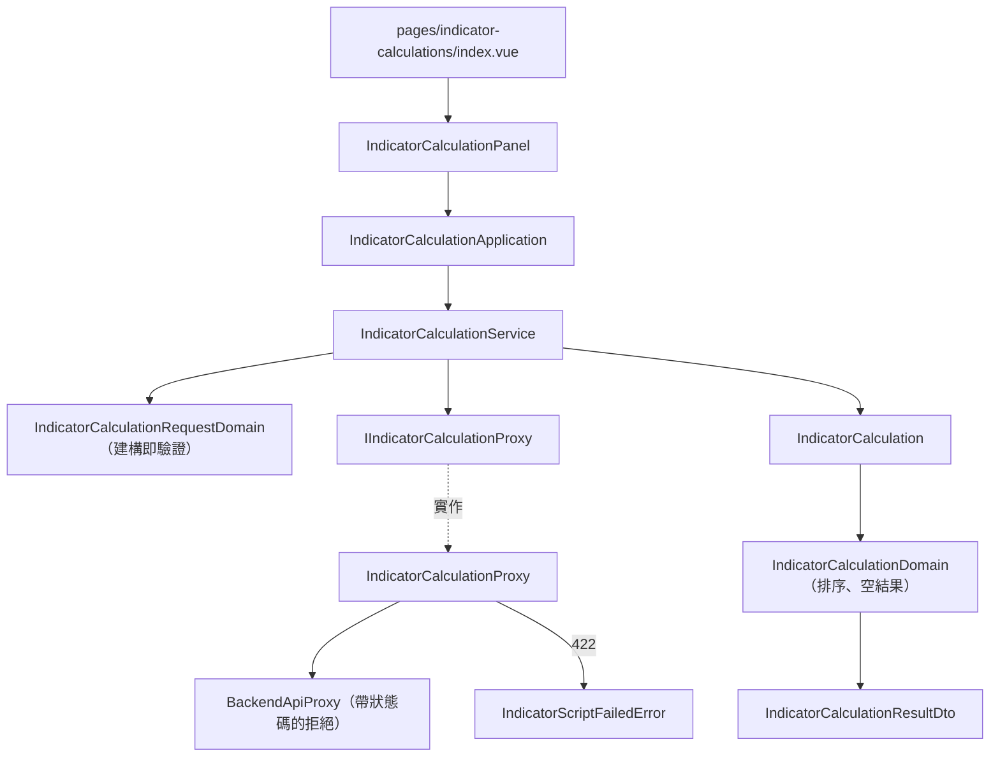

# 指標計算 — Architecture Design

**Status:** Confirmed
**Source PRD:** `.sdd/2026-08-30-indicator-calculation/PRD.md`
**Tech context:** Nuxt 3 + TypeScript · Clean / Onion Architecture（前端版）· 原子化設計元件

---

## 1. Design Goal & Guiding Principle

- **In one sentence:** 讓畫面把「標的、根數、算式」交給一個用例方法，
  拿回一份**已排序、知道自己空不空**的指標結果，或一個能分辨
  「欄位填錯／請求的問題／算式的問題／連不上」四種情況的具名錯誤。
- **Guiding principle:** 把「這次失敗是誰的錯」這件事**在錯誤型別上就分乾淨**。
  後端用兩種狀態碼區分「請求的問題」與「算式的問題」，若讓畫面自己去比對訊息內容來猜，
  後端改一句話畫面就壞。因此翻譯只做一次、做在 proxy，畫面只認型別。

---

## 2. Change Scope

| Area | Action | What / Why |
| :--- | :--- | :--- |
| `IndicatorCalculationRequestDto` / `RequestDomain` | **Add** | 輸入形狀與所有輸入規則（標的、根數、算式） |
| `IndicatorCalculation` entity / `Domain` / `ResultDto` | **Add** | 一次計算的結果：實際採用根數 + 依名稱排序的指標 |
| `IndicatorValueVo` | **Add** | 一個指標的名稱與數值（不可變） |
| `IIndicatorCalculationProxy` / `IndicatorCalculationProxy` | **Add** | **另一個外部資源＝另一個 Proxy**，不塞進 K 線 proxy |
| `IndicatorScriptFailedError` | **Add** | 「算式的問題」這種失敗；與 `BackendRequestRejectedError` 分開 |
| `BackendRequestRejectedError` | **Modify** | 帶上後端回應的狀態碼，讓各 proxy 能據以翻譯成更精確的領域錯誤 |
| `BackendApiProxy` | **Modify** | 建立拒絕錯誤時附上狀態碼（行為不變，只是多帶資訊） |
| `IndicatorCalculationService` / `Application` | **Add** | 用例編排 |
| `AppTextarea`（atom） | **Add** | 多行輸入；目前沒有這個原子 |
| `IndicatorCalculationPanel`（organism） | **Add** | 整塊互動：輸入、執行、四種失敗的分流、結果呈現 |
| `pages/indicator-calculations/index.vue` | **Add** | 只做接線 |
| `ConsoleLayout` | **Modify** | 導覽多一個入口 |
| K 線的任何東西 | **Not touched** | 兩個切片之間唯一的共用是 `BackendApiProxy` 與既有原子 |

---

## 3. New Classes / Modules

| Name | Kind | Responsibility (purpose) | Collaborators | Satisfies (PRD scenario) |
| :--- | :--- | :--- | :--- | :--- |
| `IndicatorCalculationRequestDto` | DTO | 使用者打的原始輸入（根數為字串，理由同 K 線維護切片） | — | 全部 |
| `IndicatorCalculationRequestDomain` | Domain Model | 建構即驗證：標的非空、根數為大於零的整數、算式非空 | `IndicatorCalculationFieldError` | 七條輸入規則 |
| `IndicatorCalculationFieldError` | Sentinel Error | 可修正的輸入錯誤，帶欄位（`symbol`／`candleCount`／`script`） | — | 七條輸入規則 |
| `IndicatorCalculation` | Entity | 一次計算的結果本體：標的、實際採用根數、指標名稱與數值 | `IndicatorCalculationDomain` | 結果呈現 |
| `IndicatorCalculationDomain` | Domain Model | 解讀結果：把指標**依名稱排序**、判斷是否空無一物，轉成 DTO | `IndicatorValueVo` | 排序、空結果 |
| `IndicatorValueVo` | VO | 一個指標的名稱與數值 | — | 結果呈現 |
| `IndicatorCalculationResultDto` | DTO | 交給畫面的唯一形狀：實際採用根數、已排序的指標、是否為空 | `IndicatorValueVo` | 結果呈現 |
| `IIndicatorCalculationProxy` | Interface | 「執行一次指標計算」這個能力 | — | 全部 |
| `IndicatorCalculationProxy` | Proxy | 打指標計算端點；**把狀態碼翻譯成「算式的問題」或「請求的問題」** | `BackendApiProxy` | 兩類失敗 |
| `IndicatorScriptFailedError` | Sentinel Error | 算式本身的問題（無法解讀、缺進入點、執行失敗、取用禁止的東西、算太久） | — | 算式類失敗 |
| `IndicatorCalculationService` | Domain Service | 驗證輸入 → 執行 → 轉 DTO | `IIndicatorCalculationProxy` | 全部 |
| `IndicatorCalculationApplication` | Application | 用例編排；另提供範例算式 | `IndicatorCalculationService` | 範例算式 |
| `AppTextarea` | Atom | 多行輸入，不認識任何領域概念 | — | 算式輸入 |
| `IndicatorCalculationPanel` | Organism | 輸入、執行、四種失敗分流、結果與空結果呈現 | `IndicatorCalculationApplication`、`FormField`、`AppTextarea` | 全部 |

### 為什麼「算式的問題」值得一個自己的錯誤型別

後端把這兩件事分成不同的狀態碼，正是因為使用者的下一步不同：改根數，還是改算式。
若前端只留一種「被拒絕」，畫面就得回頭比對訊息字串才能決定要說哪一句話——
後端改一句話、或多一種算式失敗的說法，畫面就默默壞掉。
翻譯做在 proxy（唯一知道狀態碼的地方）一次，畫面只認型別。

---

## 4. Modified Components

| Component | Current role | Change needed |
| :--- | :--- | :--- |
| `BackendRequestRejectedError` | 帶後端說明的拒絕 | 多帶一個**狀態碼**（可省略），讓 proxy 能據以翻譯 |
| `BackendApiProxy` | 請求執行與錯誤翻譯 | 建立拒絕錯誤時附上狀態碼；既有行為與訊息不變 |
| `ConsoleLayout` | 兩個導覽入口 | 多一個「指標計算」 |

---

## 5. Component Relationships

---

## 6. Extensibility & Handoff Notes

- **Most likely next requirement:** 把算式存起來重複使用，或把指標結果畫成圖。
- **Where it lands:** 存算式會需要新的外部資源（後端目前沒有這個能力），
  屆時是另一個 Proxy 與另一個切片，不會動到本切片的任何類別；
  畫圖則是在 `IndicatorCalculationResultDto` 之上多一個呈現元件，domain 不必改。
- **How to add it:** 新的輸入規則＝`IndicatorCalculationRequestDomain` 建構子多一個檢查；
  新的失敗種類＝proxy 多翻譯一個狀態碼成新的具名錯誤，畫面多一個分支。
- **Patterns applied & why:**
  - **建構即驗證**：與前兩個切片一致。
  - **狀態碼只在 proxy 出現**：領域與畫面都不認識 HTTP。
  - **排序在 domain**：讓「同一次結果每次看起來一樣」成為業務保證，而不是畫面的巧合。
- **Do not hardcode:** 單次根數上限（由後端設定決定）、算式的時間上限（後端決定）、
  算式沙箱允許的運算（後端決定）。前端一律如實轉達。
- **Known debt / deferred:** 算式輸入沒有語法高亮，只是等寬的多行輸入；
  當使用者開始寫超過三十行的算式再考慮。

---

## 7. Traceability

| PRD Scenario | Fulfilled by |
| :--- | :--- |
| 算出單一個／多個指標 | `IndicatorCalculationDomain` → `IndicatorCalculationResultDto` → `IndicatorCalculationPanel` |
| 算式沒有算出任何指標 | `IndicatorCalculationResultDto.isEmpty` → 面板的說明文字 |
| 指標一律依名稱排序呈現 | `IndicatorCalculationDomain`（排序） |
| 畫面說明計算會排除最新一根 | `IndicatorCalculationPanel` 的說明文字 |
| 未指定交易標的／根數為零／為負／非整數／留空／為一／算式留空 | `IndicatorCalculationRequestDomain` → `IndicatorCalculationFieldError` |
| 可用 K 線不足／根數超過上限 | `BackendApiProxy` → `BackendRequestRejectedError` → 面板的「請求的問題」 |
| 算式無法解讀／取用禁止的東西／算太久 | `IndicatorCalculationProxy`（422）→ `IndicatorScriptFailedError` → 面板的「算式的問題」 |
| 後端沒有啟動 | `BackendUnreachableError` → 面板的連線失敗與重試 |
| 帶入範例算式 | `IndicatorCalculationApplication.buildExampleScript` |
| 計算進行中 | 面板的執行狀態 → 按鈕停用 |
| 失敗後再次計算成功 | 面板在每次送出前清空錯誤與結果 |

---

## 8. Risks & Open Decisions

- **Risks / trade-offs:** 以狀態碼區分兩類失敗，代價是前端與後端的狀態碼對應多了一條約定；
  換來的是畫面不必比對訊息字串。若後端未來改用別的方式表達，只需要改 proxy 一處。
- **Open decisions (for implementation):** 無。
