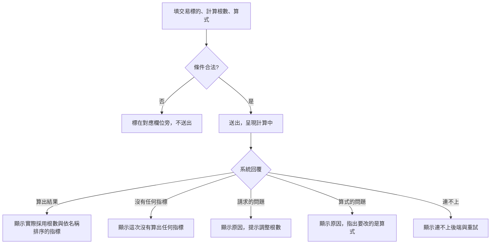

# Product Requirements Document (PRD) — 指標計算

**Status:** Finalized
**Version:** v1.0
**Owner:** James Hsueh
**Stakeholders:** 專案作者本人（同時是使用者、開發者與審查者）

---

## 1. Background & Goal (Why & Goal)

- **Problem Statement:** 要試一條指標算式，目前必須把整段程式壓成一行帶跳脫字元的字串塞進請求裡；
  改一個符號就得重壓一次。失敗時也分不出是「算式寫壞了」還是「K 線不夠」，
  因為兩者都只是一段文字。
- **Expected Outcome:** 在畫面上多行編輯算式、指定標的與根數即可執行，
  結果直接列出每個指標名稱與數值；失敗時明確分成「算式的問題」與「請求的問題」，
  使用者一眼知道該改算式還是改根數。
- **Out of Scope:** 儲存／管理算式、語法高亮與自動完成、在前端執行算式、結果圖表、一次算多個標的。

---

## 2. User Personas

- **Primary Role(s):** 策略研究者（專案作者本人）。
- **Usage Context:** 桌機瀏覽器、本機執行。通常會連續試很多次：改算式 → 執行 → 看數字 → 再改。

---

## 3. User Stories & Acceptance Criteria

### US-01 — 自己寫算式算出指標 [priority: P0]

**As a** 策略研究者, **I want** 用自己的算式與指定根數的 K 線算出指標,
**so that** 我要新的指標時只要改算式，不必動到系統本身。

```gherkin
Scenario: 算出單一個指標
  Given 算式算出「均價」為 110，且這次採用了 3 根 K 線
  When 使用者執行計算
  Then 畫面顯示「實際採用 3 根」
  And 畫面列出「均價」為 110

Scenario: 算出多個指標
  Given 算式算出「最高」為 120、「最低」為 90
  When 使用者執行計算
  Then 畫面同時列出「最高」為 120 與「最低」為 90

Scenario: 算式沒有算出任何指標
  Given 算式沒有把任何指標放進結果
  When 使用者執行計算
  Then 畫面顯示「這次沒有算出任何指標」
  And 畫面不顯示任何錯誤

Scenario: 指標一律依名稱排序呈現
  Given 算式算出「均價」、「最低」、「最高」三個指標
  When 使用者執行計算
  Then 畫面依「均價」、「最低」、「最高」的名稱順序列出，每次執行看到的順序都一樣

Scenario: 畫面說明計算會排除最新一根
  When 使用者進入指標計算畫面
  Then 畫面說明計算一律排除最新一根 K 線，因為它涵蓋的五分鐘尚未走完
```

### US-02 — 填錯的條件在送出前被擋下 [priority: P0]

**As a** 策略研究者, **I want** 條件不合法時畫面直接指出是哪一欄,
**so that** 我不必送出一次注定失敗的計算再回頭猜。

```gherkin
Scenario: 未指定交易標的
  Given 使用者沒有填交易標的
  When 使用者執行計算
  Then 不進行計算
  And 交易標的欄位提示「請指定交易標的」

Scenario: 計算根數為零
  Given 使用者把計算根數填成 0
  When 使用者執行計算
  Then 不進行計算
  And 計算根數欄位提示「計算根數必須大於零」

Scenario: 計算根數為負
  Given 使用者把計算根數填成 -3
  When 使用者執行計算
  Then 不進行計算
  And 計算根數欄位提示「計算根數必須大於零」

Scenario: 計算根數不是整數
  Given 使用者把計算根數填成 2.5
  When 使用者執行計算
  Then 不進行計算
  And 計算根數欄位提示「計算根數必須是整數」

Scenario: 計算根數留空
  Given 使用者把計算根數留空
  When 使用者執行計算
  Then 不進行計算
  And 計算根數欄位提示「請填寫計算根數」

Scenario: 計算根數為一
  Given 使用者把計算根數填成 1
  When 使用者執行計算
  Then 視為合法並進行計算

Scenario: 算式留空
  Given 使用者把算式留空
  When 使用者執行計算
  Then 不進行計算
  And 算式欄位提示「請填寫指標算式」
```

### US-03 — 分清楚「算式的問題」與「請求的問題」 [priority: P0]

**As a** 策略研究者, **I want** 失敗時知道該改算式還是改根數,
**so that** 我不會對著一段看不懂的訊息瞎猜。

```gherkin
Scenario: 可用的 K 線不足
  Given 系統以「K 線不足，排除最新一根後目前可用 9 根，但要求 30 根」拒絕
  When 使用者執行計算
  Then 畫面以「請求的問題」呈現該原因
  And 畫面不顯示任何指標結果

Scenario: 計算根數超過單次上限
  Given 系統以說明單次上限的原因拒絕
  When 使用者執行計算
  Then 畫面以「請求的問題」呈現該原因

Scenario: 算式無法解讀
  Given 系統回覆算式無法解讀
  When 使用者執行計算
  Then 畫面以「算式的問題」呈現該原因，明確指出要改的是算式
  And 畫面不顯示任何指標結果

Scenario: 算式試圖取用不該取用的東西
  Given 系統以「算式只能做純運算」拒絕
  When 使用者執行計算
  Then 畫面以「算式的問題」呈現該原因

Scenario: 算式算太久被中止
  Given 系統回覆算式未能在允許時間內算完
  When 使用者執行計算
  Then 畫面以「算式的問題」呈現該原因

Scenario: 後端自己出錯
  Given 系統因為自身的問題無法完成計算（例如讀不到資料）
  When 使用者執行計算
  Then 畫面說明是後端出錯、不是使用者的請求有問題，並提供重試
  And 畫面不顯示任何指標結果

Scenario: 後端沒有啟動
  Given 後端服務沒有啟動
  When 使用者執行計算
  Then 畫面顯示連不上後端並提供重試方式
```

### US-04 — 順手就能開始 [priority: P1]

**As a** 策略研究者, **I want** 有個能直接跑的範例算式與明確的執行回饋,
**so that** 我第一次用不必從空白開始，也不會因為沒有回饋而重複送出。

```gherkin
Scenario: 帶入範例算式
  Given 算式欄位是空的
  When 使用者按下「帶入範例算式」
  Then 算式欄位填入一段可直接執行的範例算式

Scenario: 計算進行中
  Given 使用者已執行計算且尚未取得結果
  When 使用者觀察畫面
  Then 畫面呈現計算中
  And 執行按鈕不可再次觸發

Scenario: 失敗後再次計算成功
  Given 前一次計算因算式寫壞而失敗
  When 使用者修好算式後再次執行並取得結果
  Then 畫面顯示這次的指標結果
  And 先前的錯誤訊息不再出現
```

---

## 4. Business Flow & Logic



- **Core Business Rules:**
  - **排除最新一根**：計算一律不採用最新那根 K 線（它涵蓋的五分鐘尚未走完）；畫面必須說明這件事。
  - **輸入合法性**：交易標的去空白後不得為空；計算根數必須是大於零的整數；算式去空白後不得為空。
  - **上限不寫在前端**：單次可用的最大根數由後端設定決定，前端無從得知，一律如實轉達後端的拒絕。
  - **結果排序**：指標一律依名稱排序呈現，讓同一次結果每次看到的順序一致。
  - **空結果是合法結果**：沒有任何指標時說明清楚，不當成錯誤；
    系統把「沒有任何指標」表達成一段空的、或整段缺席，兩者都是同一件事。
  - **失敗分四類**：「請求的問題」（根數、可用 K 線）、「算式的問題」（無法解讀、缺進入點、
    執行失敗、取用禁止的東西、算太久）、「後端出錯」（系統自身的問題，使用者改什麼都沒用）
    與「連不上後端」，呈現方式分開——因為使用者的下一步完全不同。
  - **不留存**：結果與算式都不保存，重新整理即回到空白狀態。
- **Edge Cases:**
  - 計算進行中重複送出：執行按鈕在進行中不可觸發。
  - 一次成功的計算會清掉先前的錯誤與結果，畫面永遠只反映最後一次計算。

---

## 5. UI/UX Design & Interaction

- **位置**：新的「指標計算」畫面，從共用導覽進入。
- **表單**：交易標的（附常用選項）、計算根數、算式（多行輸入，等寬字體）。
  算式欄位旁有「帶入範例算式」。
- **說明**：表單上方說明「計算一律排除最新一根 K 線」與「算式只能做純運算」。
- **結果**：「實際採用 N 根」＋兩欄表格（指標名稱、數值）；沒有指標時顯示說明文字。
- **錯誤**：欄位錯誤標在欄位旁；「請求的問題」與「算式的問題」用兩塊語氣不同的訊息區分，
  後者明確寫著「要改的是算式」；連不上後端沿用既有呈現並提供重試。
- **範例算式**：求指定根數的平均收盤價，一段可直接執行的完整算式。

---

## 6. Non-Functional Requirements

- **Performance:** 單次計算最長可能花到後端允許的時間上限（數十秒），因此進行中的回饋是必要的。
- **Security:** 前端**不執行**任何使用者提供的程式碼；算式一律送到後端沙箱執行。
- **Compatibility:** 桌機瀏覽器最新版。
- **Analytics / Tracking:** 無。

---

## 7. Dependencies & Risks

- **External Dependencies:** 後端 `go-trading` 的指標計算能力（含沙箱與時間上限）。
- **Known Risks:**
  - 算式的錯誤訊息來自後端的直譯器，可能相當技術性；前端如實轉達，只負責標明「這是算式的問題」。
  - 計算可能長達數十秒，使用者可能以為當掉；進行中的狀態必須明顯。

---

## 8. Appendix

- 需求共識：[BRIEF.md](BRIEF.md)
- 通用語言：[../UL-MAP.md](../UL-MAP.md)
- **Open Decisions 的裁決**：
  1. 範例算式用**平均收盤價**——最短、最好懂，且結果一眼可驗證。
  2. 計算根數的上限**不寫在畫面上**：它由後端設定決定，寫死在前端只會在設定改變時說謊。
