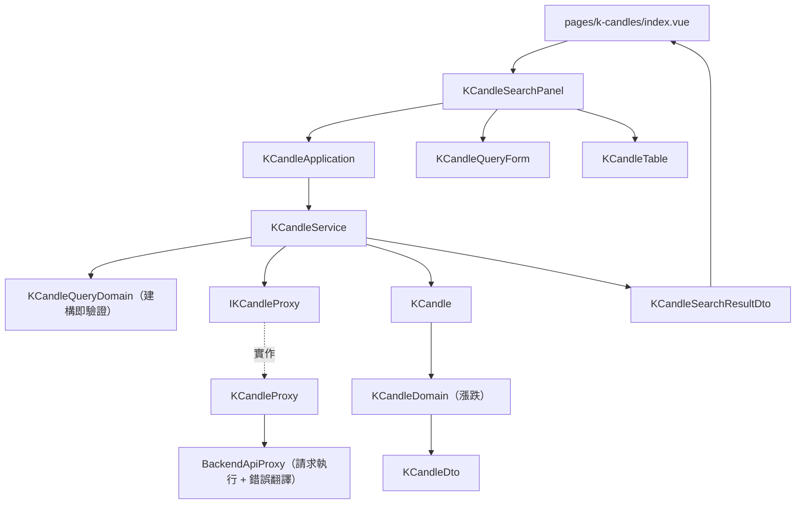

# K 線瀏覽 — Architecture Design

**Status:** Confirmed
**Source PRD:** `.sdd/2026-08-30-k-candle-browsing/PRD.md`
**Tech context:** Nuxt 3 + TypeScript · Clean / Onion Architecture（前端版）· 原子化設計元件

---

## 1. Design Goal & Guiding Principle

- **In one sentence:** 讓畫面把「交易標的 + 起訖時間」交給一個用例方法，就拿回一份**已驗證、已排序、已算好漲跌、已知筆數**的結果形狀，或一個能分辨「條件不合法／被後端拒絕／連不上後端」的具名錯誤。
- **Guiding principle:** 把 K 線的三種易變性各自關在一個地方——
  **查詢條件的規則**關在 `KCandleQueryDomain`（建構即驗證，不合法就沒有物件）、
  **單根 K 線的解讀**（漲跌）關在 `KCandleDomain`、
  **後端錯誤的翻譯**關在 `BackendApiProxy`。
  畫面因此只做三件事：收輸入、丟給 Application、把回來的 DTO 綁上去；
  未來要加欄位、加規則、加畫面，都不必動另外兩處。

---

## 2. Change Scope

| Area | Action | What / Why |
| :--- | :--- | :--- |
| `app/domain/models/`（entities / domains / dto） | **Add** | K 線本身、查詢條件、結果形狀。業務規則（排序、漲跌、條件驗證）的家 |
| `app/domain/service/k-candle-service.ts` | **Add** | 跨多根 K 線的編排：驗證 → 取資料 → 排序 → 轉 DTO |
| `app/domain/interface/i-k-candle-proxy.ts` | **Add** | 以「能力」命名的對外介面，讓 service 不認識 HTTP |
| `app/domain/errors/` | **Add** | `KCandleQueryValidationError`（使用者可自行修正）與 `BackendRequestRejectedError`（後端以業務規則拒絕）；與既有的 `BackendUnreachableError` 形成三分法 |
| `app/infrastructure/proxy/backend-api-proxy.ts` | **Add** | 所有打 go-trading 的 proxy 共用的請求執行與錯誤翻譯（見 §6 的決策說明） |
| `app/infrastructure/proxy/backend-health-proxy.ts` | **Modify** | 改為沿用共用的請求執行，錯誤翻譯行為維持不變 |
| `app/components/atoms/`、`molecules/`、`organisms/`、`templates/` | **Add** | 本切片同時建立往後共用的畫面骨架（版面、輸入欄位、提示區塊、標籤） |
| `app/pages/k-candles/index.vue` | **Add** | K 線瀏覽頁 |
| `app/plugins/dependencies.ts` | **Modify** | 組裝並 provide `$kCandleApplication` |
| K 線的新增／修改／刪除 | **Not touched** | 屬於「K 線維護」切片；本切片只讀不寫 |
| 指標計算 | **Not touched** | 另一個切片 |
| 圖表繪製、分頁、排序切換 | **Not touched** | PRD 明列不在範圍內；表格一次呈現至多 1000 列 |

---

## 3. New Classes / Modules

| Name | Kind | Responsibility (purpose) | Collaborators | Satisfies (PRD scenario) |
| :--- | :--- | :--- | :--- | :--- |
| `KCandle` | Entity | 一根 K 線在 domain 內的本體形狀（只有欄位）；`toDomain()` 轉成行為的家 | `KCandleDomain` | 全部 |
| `KCandleDomain` | Domain Model | 解讀一根 K 線：算出漲跌與其語氣，並轉成 DTO | `KCandleDto` | 收盤高於／低於／等於開盤 |
| `KCandleQueryDomain` | Domain Model | 守住查詢條件的不變條件：標的去空白後不得為空、結束不得早於開始（相等為合法）。建構即驗證，違反就沒有物件 | `KCandleQueryValidationError` | 未指定標的、只有空白、結束早於開始、起訖相同 |
| `KCandleQueryDto` | DTO | 畫面交給 Application 的查詢輸入形狀 | — | 全部查詢情境 |
| `KCandleDto` | DTO | 一根 K 線交給畫面的唯一形狀，含**已算好的漲跌語氣** | — | 漲跌三情境 |
| `KCandleSearchResultDto` | DTO | 一次查詢的結果形狀：已排序的清單 + 筆數 + 是否為空 | `KCandleDto` | 多根／單根／空結果 |
| `KCandleService` | Domain Service | 跨多根 K 線的編排：驗證條件 → 取回 → **由早到晚排序** → 轉 DTO；另提供預設查詢區間（最近二十四小時） | `IKCandleProxy` | 排序、筆數、預設區間 |
| `IKCandleProxy` | Interface | 「取得一段區間的 K 線」這個能力；參數是**已驗證**的查詢條件，因此實作拿到的必定合法 | — | 全部查詢情境 |
| `KCandleProxy` | Proxy | 打後端 K 線端點，把 wire 形狀正規化成 entity（時間→時間值、數字字串→精確小數） | `BackendApiProxy` | 全部查詢情境 |
| `BackendApiProxy` | Proxy（抽象基底） | 一次請求的執行與錯誤翻譯：後端以業務規則拒絕 → `BackendRequestRejectedError`（帶後端說明）；連不上 → `BackendUnreachableError` | — | 區間過大被拒、後端沒啟動 |
| `KCandleQueryValidationError` | Sentinel Error | 使用者可自行修正的條件錯誤，帶**出問題的欄位**與說明 | — | 條件不合法三情境 |
| `BackendRequestRejectedError` | Sentinel Error | 後端以業務規則拒絕，帶後端給的原因 | — | 區間過大被拒 |
| `KCandleApplication` | Application | 用例編排：查詢 K 線、取得預設查詢區間。全程只碰 DTO | `KCandleService` | 全部 |
| `ConsoleLayout` | Template | 全站版面骨架：標題列 + 導覽 + 內容插槽 | — | — |
| `AppInput` / `AppAlert` / `AppBadge` | Atoms | 通用輸入框／提示區塊／狀態標籤，不認識任何領域概念 | — | 載入、錯誤、漲跌的呈現 |
| `FormField` | Molecule | 標籤 + 控制項 + 說明／錯誤訊息的組合 | `AppInput` | 條件不合法時標在欄位旁 |
| `KCandleQueryForm` | Molecule | 查詢條件的輸入與送出，欄位錯誤由外部傳入呈現 | `FormField`、`AppButton` | 條件輸入、載入中不可重複送出 |
| `KCandleTable` | Organism | 把結果 DTO 攤成表格：筆數、逐根數字、漲跌標籤、空狀態 | `AppBadge` | 多根／單根／空結果、漲跌 |
| `KCandleSearchPanel` | Organism | 查詢這一整塊的互動：預設區間 → 送出 → 依錯誤型別決定標在欄位旁或整塊呈現。Application 由頁面注入 | `KCandleApplication`、`KCandleQueryForm`、`KCandleTable` | 全部 |
| `pages/k-candles/index.vue` | Page (Controller) | 只做接線：從組裝根取得 Application 往下傳 | `KCandleSearchPanel` | — |

> 介面深度檢查：`KCandleApplication.searchKCandles(queryDto)` 一次呼叫完成一個完整業務動作——
> 呼叫端不需要自己驗證、自己排序、自己算漲跌、自己數筆數。沒有任何「先呼叫 A 再呼叫 B」的序列。

---

## 4. Modified Components

| Component | Current role | Change needed |
| :--- | :--- | :--- |
| `BackendHealthProxy` | 自行 `$fetch` 並把所有錯誤包成連線失敗 | 改為繼承 `BackendApiProxy` 沿用共用的請求執行；對外行為不變 |
| `app/plugins/dependencies.ts` | 組裝 backend health 一條鏈 | 增加 K 線那條鏈，並 provide `$kCandleApplication` |
| `app/pages/index.vue` | 唯一的頁面，直接放連線狀態卡片 | 改用 `ConsoleLayout`，成為「首頁／連線狀態」，並提供前往 K 線瀏覽的導覽 |

---

## 5. Component Relationships

---

## 6. Extensibility & Handoff Notes

- **Most likely next requirement:** K 線的新增／修改／刪除（下一個切片），以及在同一頁把某根 K 線帶去編輯。
- **Where it lands:** `IKCandleProxy` 再加一個能力方法、`KCandleService` 再加一個公開用例方法
  （公開方法之間**互不呼叫**，需要串接由 Application 負責）。畫面端沿用同一組 atoms 與 `FormField`。
- **How to add it:** 新增 `KCandleWriteDomain`（建構即驗證五分鐘刻度、最高不低於最低、非負）→
  在 `IKCandleProxy` 加 `save`／`remove` → 在 `KCandleService` 加對應用例 → Application 加方法 → 新頁面。
  **不需要**改動本切片的任何一個類別。
- **Patterns applied & why:**
  - **建構即驗證（Always-Valid Domain Model）**：`KCandleQueryDomain` 不存在「半合法」狀態，
    因此 proxy 拿到的條件必定合法，實作端不必再防禦。
  - **共用基底 `BackendApiProxy`**：三個 proxy 對「後端拒絕 vs 連不上」的翻譯規則必須一致，
    若各自 try/catch 會出現三份會漂移的複本。此處刻意用繼承而非工具函式——
    規範禁止 `utils.ts` 式的雜物模組，而這段行為天生屬於「對後端發一次請求」這件事。
  - **語氣（tone）由 domain 算好放進 DTO**：畫面不得出現 `close > open ? '紅' : '綠'` 這種業務判斷。
- **Do not hardcode:**
  - 後端位址（來自 runtime config）。
  - 單次查詢上限 **1000 不寫進前端**：前端無法事先知道區間會回幾根，一律如實轉達後端拒絕的原因。
  - 預設區間長度（二十四小時）寫在 `KCandleService` 一處，未來要改只有一個地方。
- **Known debt / deferred:** 表格一次渲染至多 1000 列、不做虛擬捲動；
  當使用者反映捲動卡頓，或上限被調高時，再考慮虛擬列表。

---

## 7. Traceability

| PRD Scenario | Fulfilled by |
| :--- | :--- |
| 區間內有多根 K 線時由早到晚列出 | `KCandleService`（排序）+ `KCandleSearchResultDto`（筆數）+ `KCandleTable` |
| 區間內只有一根 K 線 | 同上 |
| 區間內沒有 K 線 | `KCandleSearchResultDto.isEmpty` + `KCandleTable` 空狀態 |
| 收盤價高於開盤價為上漲 | `KCandleDomain.trend()` → `KCandleDto.trend` → `AppBadge` |
| 收盤價低於開盤價為下跌 | 同上 |
| 收盤價等於開盤價為持平 | 同上 |
| 未指定交易標的 | `KCandleQueryDomain` 建構驗證 → `KCandleQueryValidationError('symbol')` |
| 交易標的只填了空白字元 | 同上（去空白後判斷） |
| 結束時間早於開始時間 | `KCandleQueryDomain` → `KCandleQueryValidationError('endTime')` |
| 開始時間與結束時間相同 | `KCandleQueryDomain`（相等為合法） |
| 查詢區間過大被系統拒絕 | `BackendApiProxy` → `BackendRequestRejectedError`（帶後端說明）→ `KCandleSearchPanel` 整塊呈現 |
| 後端沒有啟動 | `BackendApiProxy` → `BackendUnreachableError` → `KCandleSearchPanel` 整塊呈現 + 重試 |
| 失敗後再次查詢成功 | `KCandleSearchPanel` 在每次送出前清空錯誤與結果 |
| 查詢進行中 / 查詢結束 | `KCandleSearchPanel` 的載入狀態 → `KCandleQueryForm` 的送出按鈕停用 |
| 進入畫面時的預設區間 | `KCandleService.buildDefaultQuery()`（以目前時間往前二十四小時） |
| 使用者改過的區間不被預設值覆蓋 | `KCandleSearchPanel` 只在進入畫面時取一次預設值 |

---

## 8. Risks & Open Decisions

- **Risks / trade-offs:**
  - 以繼承共用請求執行，代價是 proxy 多一層基底類別；換來的是錯誤翻譯規則只有一份。
    若未來 proxy 之間的請求需求分歧（例如需要串流），此處要重新評估。
  - 時間輸入以「可精確到分鐘」的原生輸入呈現，其值視為世界標準時間；
    瀏覽器不會提示這件事，因此畫面必須自己標示，否則使用者會誤讀。
- **Open decisions (for implementation):**
  - 表格欄位很多（九欄），窄螢幕如何處理——先以整塊水平捲動處理，不做欄位隱藏。

### 實作階段對本設計的一項調整

原設計把查詢的互動狀態放在頁面（`pages/k-candles/index.vue`）。實作時發現
**Nuxt 的測試執行環境在本專案的版本組合下起不來**（`@nuxt/test-utils` 的 runtime 於初始化時
`nuxtApp.deferHydration is not a function`），意即任何需要 `useNuxtApp` 的頁面都無法被測試覆蓋。

因此互動狀態下放到 organism `KCandleSearchPanel`，由頁面把 Application 以 prop 注入；
頁面因此退化成純接線、沒有任何值得測試的邏輯（覆蓋率設定已將 `app/pages/**` 排除並註明原因）。
換來的是本切片每一條驗收情境都能在不啟動 Nuxt 的情況下被元件測試涵蓋。
往後的切片沿用同一個做法：**頁面只接線，互動住在 organism**。
