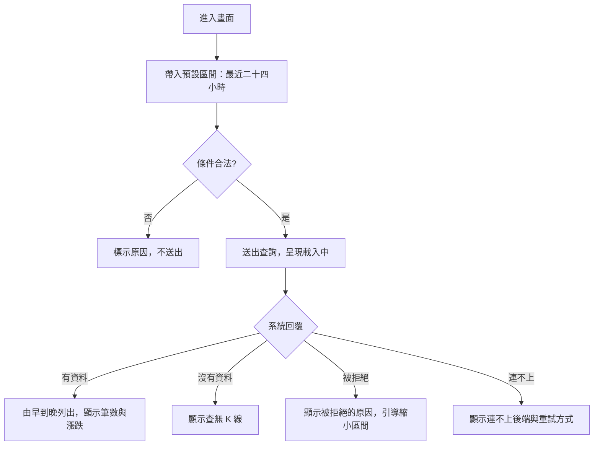

# Product Requirements Document (PRD) — K 線瀏覽

**Status:** Finalized
**Version:** v1.0
**Owner:** James Hsueh
**Stakeholders:** 專案作者本人（同時是使用者、開發者與審查者）

---

## 1. Background & Goal (Why & Goal)

- **Problem Statement:** 要看一段時間的行情，目前必須自己拼出查詢條件、送出，再從原始回應裡辨認數字。
  一次看十幾根 K 線就得在原始資料裡數欄位，看不出哪根漲哪根跌，也看不出這次到底查到幾根。
- **Expected Outcome:** 指定交易標的與一段區間即可在畫面上看到排好的 K 線清單，
  每根的漲跌一眼可辨、筆數直接顯示；填錯的條件在送出前就被擋下，被系統拒絕或連不上後端時
  畫面明確說出原因。交付後「看行情」不再需要離開畫面。
- **Out of Scope:** K 線圖表繪製、新增／修改／刪除 K 線、指標計算、分頁與排序切換、
  查詢條件記憶、在地時區換算。

---

## 2. User Personas

- **Primary Role(s):** 策略研究者（專案作者本人）——單人使用，同時也是資料的維護者。
- **Usage Context:** 桌機瀏覽器、本機執行，後端可能沒開著。多半在盤後或研究時操作，
  一次會連續查好幾組區間與標的。

---

## 3. User Stories & Acceptance Criteria

### US-01 — 查詢一段區間的 K 線 [priority: P0]

**As a** 策略研究者, **I want** 指定交易標的與查詢區間看到該區間的 K 線,
**so that** 我能直接在畫面上讀行情，不必自己拼查詢條件再讀原始回應。

```gherkin
Scenario: 區間內有多根 K 線時由早到晚列出
  Given 交易標的 BTCUSDT 在查詢區間內有三根 K 線，起始時間分別為 10:10、10:00、10:05
  When 使用者送出查詢
  Then 畫面依序列出起始時間 10:00、10:05、10:10 的三根 K 線
  And 畫面顯示「共 3 根」

Scenario: 區間內只有一根 K 線
  Given 交易標的在查詢區間內只有一根 K 線
  When 使用者送出查詢
  Then 畫面列出該根 K 線
  And 畫面顯示「共 1 根」

Scenario: 區間內沒有 K 線
  Given 交易標的在查詢區間內沒有任何 K 線
  When 使用者送出查詢
  Then 畫面顯示「查無 K 線」
  And 畫面不顯示任何錯誤訊息
```

### US-02 — 一眼看出每根是漲是跌 [priority: P0]

**As a** 策略研究者, **I want** 每根 K 線都標示漲跌,
**so that** 我掃過清單就知道這段區間的走勢，不必自己比對開盤價與收盤價。

```gherkin
Scenario: 收盤價高於開盤價為上漲
  Given 一根 K 線的開盤價為 100、收盤價為 110
  When 畫面呈現該根 K 線
  Then 該根標示為上漲

Scenario: 收盤價低於開盤價為下跌
  Given 一根 K 線的開盤價為 100、收盤價為 90
  When 畫面呈現該根 K 線
  Then 該根標示為下跌

Scenario: 收盤價等於開盤價為持平
  Given 一根 K 線的開盤價為 100、收盤價為 100
  When 畫面呈現該根 K 線
  Then 該根標示為持平
```

### US-03 — 填錯的查詢條件在送出前被擋下 [priority: P0]

**As a** 策略研究者, **I want** 條件不合法時畫面直接告訴我,
**so that** 我不必送出一次注定被拒絕的查詢再回頭猜哪裡錯了。

```gherkin
Scenario: 未指定交易標的
  Given 使用者沒有填寫交易標的
  When 使用者送出查詢
  Then 不進行查詢
  And 畫面提示「請指定交易標的」

Scenario: 交易標的只填了空白字元
  Given 使用者在交易標的欄只填了空白字元
  When 使用者送出查詢
  Then 不進行查詢
  And 畫面提示「請指定交易標的」

Scenario: 開始時間被清空
  Given 使用者把開始時間清空
  When 使用者送出查詢
  Then 不進行查詢
  And 畫面提示「請填寫開始時間」

Scenario: 結束時間被清空
  Given 使用者把結束時間清空
  When 使用者送出查詢
  Then 不進行查詢
  And 畫面提示「請填寫結束時間」

Scenario: 結束時間早於開始時間
  Given 使用者填的開始時間為 10:00、結束時間為 09:00
  When 使用者送出查詢
  Then 不進行查詢
  And 畫面提示「結束時間不得早於開始時間」

Scenario: 開始時間與結束時間相同
  Given 使用者填的開始時間與結束時間都是 10:00
  When 使用者送出查詢
  Then 視為合法條件並進行查詢
```

### US-04 — 分清楚「被拒絕」與「連不上」 [priority: P0]

**As a** 策略研究者, **I want** 查詢失敗時知道是我的條件有問題還是後端沒開,
**so that** 我知道該改條件還是該去把後端啟動起來。

```gherkin
Scenario: 查詢區間過大被系統拒絕
  Given 查詢區間內的 K 線超過單次查詢上限
  And 系統以「時間區間過大，請縮小區間（單次最多 1000 根）」拒絕這次查詢
  When 使用者送出查詢
  Then 畫面顯示「時間區間過大，請縮小區間（單次最多 1000 根）」
  And 畫面不顯示任何 K 線

Scenario: 後端沒有啟動
  Given 後端服務沒有啟動
  When 使用者送出查詢
  Then 畫面顯示連不上後端並提供重試方式
  And 畫面不顯示任何 K 線

Scenario: 其他未預期的失敗
  Given 查詢因為前述三種以外的原因失敗
  When 使用者送出查詢
  Then 畫面顯示「查詢時發生未預期的錯誤。」
  And 畫面不顯示任何 K 線

Scenario: 失敗後再次查詢成功
  Given 前一次查詢因後端沒有啟動而失敗
  When 使用者在後端啟動後再次送出查詢並取得三根 K 線
  Then 畫面顯示這次查到的三根 K 線
  And 先前的錯誤訊息不再出現
```

### US-05 — 查詢進行中的回饋與預設區間 [priority: P1]

**As a** 策略研究者, **I want** 一進畫面就有合理的預設區間、查詢時看得到進度,
**so that** 我不必每次從頭填兩個時間，也不會因為沒有回饋而重複送出。

```gherkin
Scenario: 查詢進行中
  Given 使用者已送出查詢且尚未取得結果
  When 使用者觀察畫面
  Then 畫面呈現載入中
  And 送出按鈕不可再次觸發

Scenario: 查詢結束
  Given 查詢已經回覆
  When 使用者觀察畫面
  Then 載入狀態結束
  And 送出按鈕恢復可用

Scenario: 進入畫面時的預設區間
  Given 目前時間為世界標準時間 2026-08-30 12:00
  When 使用者進入畫面
  Then 開始時間預設為 2026-08-29 12:00
  And 結束時間預設為 2026-08-30 12:00

Scenario: 使用者改過的區間不被預設值覆蓋
  Given 使用者已自行調整過起訖時間
  When 使用者再次送出查詢
  Then 以使用者輸入的區間進行查詢
```

---

## 4. Business Flow & Logic

**Flow（happy path）**



- **Core Business Rules:**
  - **排序**：結果一律依起始時間由早到晚呈現。
  - **漲跌**：收盤價減開盤價，大於零為上漲、小於零為下跌、等於零為持平。
  - **條件合法性**：交易標的去掉前後空白後不得為空；起訖時間都必須是**完整填寫**的時間；
    結束時間不得早於開始時間；相等為合法。
  - **時間基準**：輸入與呈現一律世界標準時間，畫面明確標示，不做在地時區轉換。
  - **交易標的正規化**：前後空白會被去掉後才拿去查詢（`  BTCUSDT  ` 與 `BTCUSDT` 是同一個標的）。
  - **拒絕原因的退路**：系統拒絕時若沒有附上原因，畫面退而顯示該次失敗本身的說明，不留白。
  - **查詢區間顆粒度**：起訖可精確到分鐘，不必對齊五分鐘刻度。
  - **預設區間**：進入畫面時為「目前時間往前二十四小時」到「目前時間」，使用者調整後即以其輸入為準。
- **Edge Cases:**
  - 查詢途中使用者再次送出：送出按鈕在載入中不可觸發，不會有第二次併發查詢。
  - 系統以業務規則拒絕（例如區間過大）：如實轉達原因，畫面不顯示任何 K 線。
  - 後端無法連線：與「被拒絕」分開呈現，明確告知後端未啟動並提供重試。
  - 一次成功的查詢會清掉先前的錯誤訊息與先前的結果，畫面永遠只反映最後一次查詢。

---

## 5. UI/UX Design & Interaction

- **Prototype Link:** 無（單人專案，直接以既有的畫面樣式規範實作）。
- **版面**：頁面上方是導覽，下方分兩塊——上方「查詢條件」，下方「查詢結果」。
- **Key Interactions:**
  - 交易標的為文字輸入，並提供 BTCUSDT、ETHUSDT 兩個常用選項供快速選取（沿用後端觀察清單的預設值）；
    使用者仍可自行輸入其他標的。
  - 起訖時間為可精確到分鐘的時間輸入，欄位旁標示「世界標準時間」。
  - **載入狀態**：送出按鈕顯示進行中且不可觸發，結果區塊呈現載入訊息。
  - **空狀態**：「查無 K 線」，並附一句提示可能是區間內尚無資料或標的名稱不同。
  - **錯誤狀態**：條件不合法時標在對應欄位旁；被系統拒絕或連不上後端時，整塊顯示於結果區塊上方。
  - **結果**：表格逐根列出起始時間（標示世界標準時間）、開高低收、成交量、成交額、
    主動買入量、主動買入額，並以顏色語氣標示漲跌；表頭上方顯示「共 N 根」。

---

## 6. Non-Functional Requirements

- **Performance:** 單次查詢最多 1000 根，一次渲染一千列表格必須維持可捲動與可讀，不做分頁。
- **Security:** 無登入機制；不在畫面上保存任何資料，重新整理即回到預設狀態。
- **Compatibility:** 桌機瀏覽器最新版；不特別支援行動裝置版面。
- **Analytics / Tracking:** 無。

---

## 7. Dependencies & Risks

- **External Dependencies:** 後端 `go-trading` 的 K 線查詢能力；後端未啟動時本畫面沒有資料可呈現。
- **Known Risks:**
  - 單次上限 1000 根由後端判定，前端無法事先得知區間會回幾根，
    因此「區間過大」只能在被拒絕後如實轉達，屬預期行為而非缺陷。
  - 時間一律以世界標準時間呈現，與使用者在地時間不同，需在畫面上明確標示避免誤讀。

---

## 8. Appendix

- 需求共識：[BRIEF.md](BRIEF.md)
- 通用語言：[../UL-MAP.md](../UL-MAP.md)
- 專案總覽：[../PROJECT.md](../PROJECT.md)
- **Open Decisions 的裁決**（BRIEF 留給 PRD 決定的兩項）：
  1. 交易標的提供 BTCUSDT、ETHUSDT 常用選項，但不限制只能選這兩個。
  2. 「查無 K 線」附一句可能原因的提示，不列出診斷清單。
