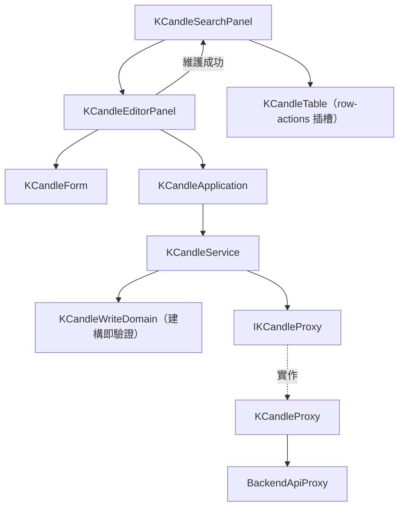

# K 線維護 — Architecture Design

**Status:** Confirmed
**Source PRD:** `.sdd/2026-08-30-k-candle-management/PRD.md`
**Tech context:** Nuxt 3 + TypeScript · Clean / Onion Architecture（前端版）· 原子化設計元件

---

## 1. Design Goal & Guiding Principle

- **In one sentence:** 讓畫面把「使用者在表單裡打的那些字」交給一個用例方法，就完成一次合法的維護，
  或拿回一個**指名是哪一欄出錯**的具名錯誤。
- **Guiding principle:** 把「一根 K 線的所有寫入規則」集中在 `KCandleWriteDomain` 一個建構子裡。
  規則有九條、分屬四類（身分、時間刻度、時間方向、數字），若散在表單、application 與後端之間，
  下次加一條就要改三個地方。集中之後，加規則＝在建構子裡多一個檢查，加欄位＝多一個欄位常數。

---

## 2. Change Scope

| Area | Action | What / Why |
| :--- | :--- | :--- |
| `KCandleWriteDto` / `KCandleWriteDomain` / `KCandleFieldError` | **Add** | 寫入用的輸入形狀與**所有**寫入規則 |
| `KCandleIdentityVo` | **Add** | 「交易標的 + 起始時間」這個身分本身，供修改與刪除指名 |
| `IKCandleProxy` | **Modify** | 同一個外部資源一個 Proxy——加 `saveKCandle` / `updateKCandle` / `deleteKCandle` 三個能力，不另立介面 |
| `KCandleProxy` | **Modify** | 三個新端點的請求與 wire 轉換 |
| `KCandleService` | **Modify** | 加三個公開用例方法（彼此不互相呼叫） |
| `KCandleApplication` | **Modify** | 加三個用例方法 |
| `KCandleTable` | **Modify** | 加一個具名插槽讓使用端塞每一列的操作按鈕；表格本身仍不認識「編輯」這件事 |
| `KCandleForm`（molecule） | **Add** | 一根 K 線的輸入表單；欄位錯誤由外部傳入 |
| `KCandleEditorPanel`（organism） | **Add** | 新增／修改／刪除的互動與回饋 |
| `KCandleSearchPanel` | **Modify** | 多一個「新增 K 線」入口、掛上編輯面板、成功後重查 |
| `KCandleDomain` / `KCandleQueryDomain` / `BackendApiProxy` | **Not touched** | 讀取路徑與錯誤翻譯完全沿用 |
| 以標的與時間直接載入單一一根 | **Not touched** | PRD 明列不在範圍內——要改哪一根一律先查出來 |

---

## 3. New Classes / Modules

| Name | Kind | Responsibility (purpose) | Collaborators | Satisfies (PRD scenario) |
| :--- | :--- | :--- | :--- | :--- |
| `KCandleWriteDto` | DTO | 使用者在表單裡打的原始輸入（**價量為字串**，因為使用者可能打了空白或非數字，解讀是 domain 的事） | — | 全部寫入情境 |
| `KCandleWriteDomain` | Domain Model | 建構即驗證**所有**寫入規則：標的非空、起始時間必填／落在五分鐘刻度／不得指向未來、八個數字必填且為數字、不得為負、最高不低於最低。合法後才有這個物件 | `KCandleFieldError`、`KCandleIdentityVo` | 十二條輸入規則情境 |
| `KCandleIdentityVo` | VO | 一根 K 線的身分（交易標的 + 起始時間），不可變 | — | 修改／刪除的指名 |
| `KCandleFieldError` | Sentinel Error | 使用者可自行修正的輸入錯誤，帶**欄位名**與訊息 | — | 全部「標在欄位旁」的情境 |
| `KCandleForm` | Molecule | 十個欄位的輸入與送出；`identityReadonly` 決定身分欄位是否唯讀；錯誤由外部傳入 | `FormField`、`AppInput`、`AppButton` | 表單相關情境 |
| `KCandleEditorPanel` | Organism | 一次維護的互動：新增／修改、刪除的二次確認、成功回饋、錯誤分流 | `KCandleApplication`、`KCandleForm`、`AppAlert` | 全部 |

### 為什麼價量在輸入 DTO 裡是字串

金額一律用精確小數型別，這條規則管的是**領域內的值**。但使用者打進來的東西在被驗證之前
還不是「值」——它可能是空白、可能是「一百」。若在元件裡就轉成精確小數，轉換失敗會在
元件裡爆掉，而元件正是最不該處理業務規則的地方。因此輸入 DTO 帶原始字串，
由 `KCandleWriteDomain` 負責解讀與拒絕；一旦建構成功，裡面的每個數字都已經是精確小數。

---

## 4. Modified Components

| Component | Current role | Change needed |
| :--- | :--- | :--- |
| `IKCandleProxy` | 只有查詢區間 | 加三個寫入能力；參數一律收**已驗證**的 domain model 或身分 VO |
| `KCandleProxy` | 查詢並正規化 | 加三個端點；送出時把精確小數轉成字串、時間轉成世界標準時間字串 |
| `KCandleService` | 一個查詢用例 | 加三個寫入用例。公開方法互不呼叫——「成功後重查」由畫面層自己再呼叫一次查詢 |
| `KCandleTable` | 純呈現結果 | 加一個 scoped slot（把該列的 DTO 傳出去），表格仍不認識任何操作語意 |
| `KCandleSearchPanel` | 查詢的互動 | 多一個「新增 K 線」按鈕、掛上 `KCandleEditorPanel`、維護成功後重查 |

---

## 5. Component Relationships

---

## 6. Extensibility & Handoff Notes

- **Most likely next requirement:** 指標計算（下一個切片），以及未來可能的「批次匯入」。
- **Where it lands:** 批次匯入落在 `KCandleService` 再加一個公開用例，
  逐筆重用 `KCandleWriteDomain`——規則不必重寫一份。
- **How to add it:** 新增規則＝在 `KCandleWriteDomain` 建構子多一個檢查並補一個欄位常數；
  新增欄位＝`KCandleWriteDto` 加欄位、建構子加解讀、`KCandleForm` 加一個 `FormField`。
- **Patterns applied & why:**
  - **建構即驗證**：沿用查詢切片的做法，讓「不合法的 K 線」在系統裡根本不存在。
  - **錯誤帶欄位名**：畫面因此不需要靠字串比對來決定訊息要標在哪，加欄位不必改分流邏輯。
  - **scoped slot 而非在表格內建操作**：表格在瀏覽切片的職責是「呈現結果」，
    直接塞編輯按鈕會讓它同時認識維護，違反單一職責也讓它無法在唯讀場景重用。
- **Do not hardcode:** 五分鐘刻度只寫在 `KCandleWriteDomain` 一處（未來後端支援其他長度時只改這裡）；
  「目前時間」不注入時鐘物件，直接取用系統時間，測試以假時鐘控制。
- **Known debt / deferred:** 沒有「以標的與時間直接載入一根」的入口；
  當使用者開始抱怨「我知道是哪一根卻得先查一次」時再加。

---

## 7. Traceability

| PRD Scenario | Fulfilled by |
| :--- | :--- |
| 新增一根尚不存在的 K 線 | `KCandleService.saveKCandle` → `IKCandleProxy.saveKCandle` → `KCandleEditorPanel` 回饋 |
| 同一個標的與起始時間再送一次會覆蓋 | 後端的覆蓋語意 + `KCandleForm` 的覆蓋說明文字 |
| 起始時間不在五分鐘刻度上 | `KCandleWriteDomain`（刻度檢查）→ `KCandleFieldError('openTime')` |
| 起始時間指向未來 / 就是目前這一刻 | `KCandleWriteDomain`（與系統時間比較，等於視為合法） |
| 最高價低於最低價 / 相同 | `KCandleWriteDomain`（`high < low` 才拒絕） |
| 價量為負 / 為零 | `KCandleWriteDomain`（`isNegative` 才拒絕） |
| 價量留空 / 不是數字 | `KCandleWriteDomain`（解讀失敗即帶欄位拒絕） |
| 未指定交易標的 | `KCandleWriteDomain`（去空白後為空即拒絕） |
| 修改一根存在的 K 線 | `KCandleService.updateKCandle` → `KCandleEditorPanel` |
| 修改時不得更換身分 | `KCandleForm` 的 `identityReadonly` |
| 要修改／刪除的那根已經不存在 | `BackendApiProxy` → `BackendRequestRejectedError` → 面板整塊呈現 |
| 刪除一根存在的 K 線 / 刪除前反悔 | `KCandleEditorPanel` 的確認列 + `KCandleService.deleteKCandle` |
| 從查詢結果挑一根來修改 | `KCandleTable` 的 row-actions 插槽 → `KCandleSearchPanel` → `KCandleEditorPanel` |
| 開始新增一根 / 中途放棄 | `KCandleSearchPanel` 的維護狀態切換 |
| 成功後自動重查 | `KCandleSearchPanel` 收到維護成功事件後重跑目前的查詢 |

---

## 8. Risks & Open Decisions

- **Risks / trade-offs:**
  - 輸入 DTO 帶字串，代價是多一層解讀；換來的是元件完全不必碰型別轉換與錯誤處理。
  - 「不得指向未來」以瀏覽器時間判斷，與後端可能差幾秒；邊界上以後端的拒絕為準。
- **Open decisions (for implementation):** 無。
