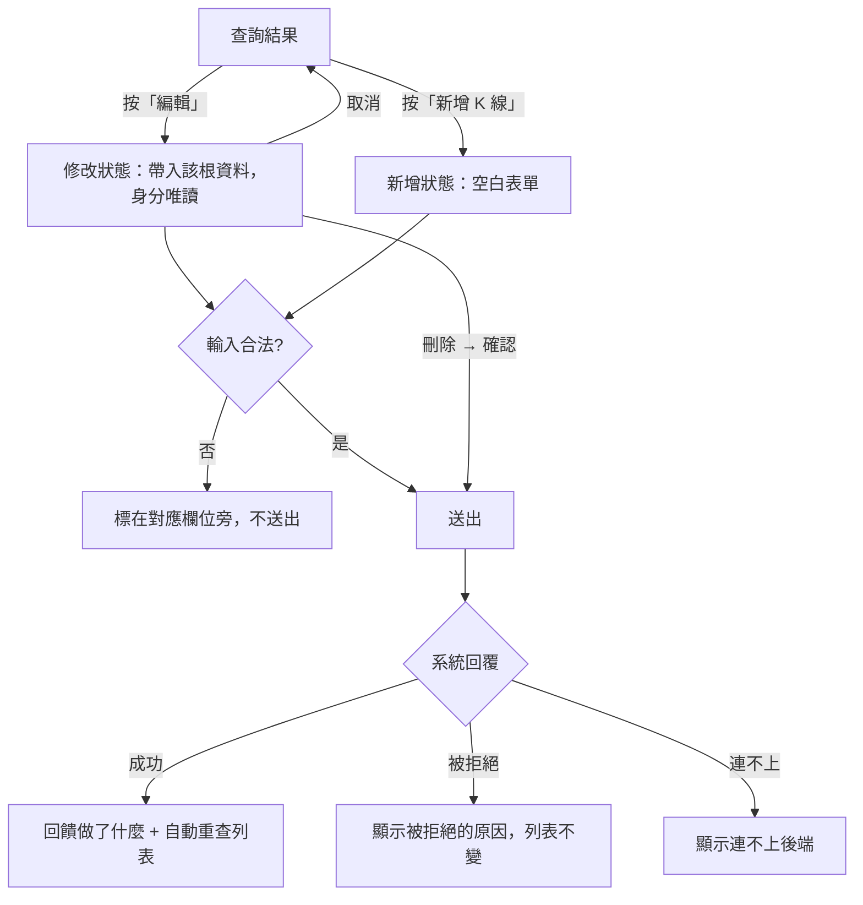

# Product Requirements Document (PRD) — K 線維護

**Status:** Finalized
**Version:** v1.0
**Owner:** James Hsueh
**Stakeholders:** 專案作者本人（同時是使用者、開發者與審查者）

---

## 1. Background & Goal (Why & Goal)

- **Problem Statement:** 行情資料餵錯時，目前只能離開畫面去手打一整包資料才能更正或刪除；
  而且會被系統拒絕的規則（五分鐘刻度、不得指向未來、最高價不得低於最低價、不得為負）
  要等到送出後才知道踩到哪一條。
- **Expected Outcome:** 在既有的 K 線畫面上就能新增、修改與刪除單一一根 K 線；
  不合規則的輸入在送出前就被擋下並**指出是哪一欄**；每次成功的維護都會自動重查，
  讓列表立刻反映真實狀態。
- **Out of Scope:** 批次新增／匯入／一次刪除多根、以標的與時間直接載入單一一根、
  外部行情補資料、修改歷史與稽核紀錄。

---

## 2. User Personas

- **Primary Role(s):** 資料維護者（專案作者本人）——同時也是行情的使用者。
- **Usage Context:** 桌機瀏覽器、本機執行。通常是在瀏覽行情時發現某根數字不對，當場更正。

---

## 3. User Stories & Acceptance Criteria

### US-01 — 新增一根 K 線 [priority: P0]

**As a** 資料維護者, **I want** 自己補一根 K 線進去,
**so that** 我能補上缺漏或用來試驗，而不必離開畫面。

```gherkin
Scenario: 新增一根尚不存在的 K 線
  Given BTCUSDT 在起始時間 09:00 尚無 K 線
  When 使用者填妥該根 K 線並送出
  Then 該根 K 線建立成功
  And 畫面回饋「已新增這根 K 線」
  And 畫面自動重新查詢一次

Scenario: 同一個標的與起始時間再送一次會覆蓋
  Given BTCUSDT 起始時間 09:00 已有一根收盤價 100 的 K 線
  When 使用者以相同標的與起始時間、收盤價 120 送出
  Then BTCUSDT 09:00 仍只有一根 K 線，且收盤價為 120
  And 畫面在送出前就已說明相同標的與起始時間會覆蓋既有的那一根

Scenario: 起始時間不在五分鐘刻度上
  Given 使用者把起始時間填成 09:03
  When 使用者送出
  Then 不進行新增
  And 起始時間欄位提示「起始時間必須落在五分鐘刻度上」

Scenario: 起始時間指向未來
  Given 目前時間為 09:00
  And 使用者把起始時間填成 09:05
  When 使用者送出
  Then 不進行新增
  And 起始時間欄位提示「起始時間不得指向未來」

Scenario: 起始時間就是目前這一刻
  Given 目前時間為 09:05
  And 使用者把起始時間填成 09:05
  When 使用者送出
  Then 視為合法並進行新增

Scenario: 最高價低於最低價
  Given 使用者把最高價填成 90、最低價填成 100
  When 使用者送出
  Then 不進行新增
  And 最高價欄位提示「最高價不得低於最低價」

Scenario: 最高價與最低價相同
  Given 使用者把最高價與最低價都填成 100
  When 使用者送出
  Then 視為合法並進行新增

Scenario: 價量數字為負
  Given 使用者把成交量填成 -1
  When 使用者送出
  Then 不進行新增
  And 成交量欄位提示「價格與成交數字不得為負數」

Scenario: 價量數字為零
  Given 使用者把成交量填成 0
  When 使用者送出
  Then 視為合法並進行新增

Scenario: 價量欄位留空
  Given 使用者把收盤價留空
  When 使用者送出
  Then 不進行新增
  And 收盤價欄位提示「請填寫收盤價」

Scenario: 價量欄位填的不是數字
  Given 使用者把收盤價填成「一百」
  When 使用者送出
  Then 不進行新增
  And 收盤價欄位提示「收盤價必須是數字」

Scenario: 未指定交易標的
  Given 使用者把交易標的留空
  When 使用者送出
  Then 不進行新增
  And 交易標的欄位提示「請指定交易標的」
```

### US-02 — 修改一根既有的 K 線 [priority: P0]

**As a** 資料維護者, **I want** 就地更正一根 K 線的價量數字,
**so that** 我不必先刪掉再重建，也不會不小心把它搬到別的時間去。

```gherkin
Scenario: 修改一根存在的 K 線
  Given 使用者正在修改 BTCUSDT 起始時間 09:00、收盤價 100 的那根 K 線
  When 使用者把收盤價改成 120 並送出
  Then 該根 K 線的收盤價變成 120
  And 畫面回饋「已更新這根 K 線」
  And 畫面自動重新查詢一次

Scenario: 修改時不得更換身分
  Given 使用者正在修改一根既有的 K 線
  When 使用者觀察畫面
  Then 交易標的與起始時間為唯讀，無法更換

Scenario: 要修改的那根已經不存在
  Given 使用者正在修改的那根 K 線已被刪除
  And 系統以「找不到該根 K 線」拒絕
  When 使用者送出修改
  Then 畫面顯示「找不到該根 K 線」
  And 列表維持原狀

Scenario: 修改後的數字不合理
  Given 使用者正在修改一根既有的 K 線
  When 使用者把最高價改成 90、最低價改成 100 並送出
  Then 不進行修改
  And 最高價欄位提示「最高價不得低於最低價」
```

### US-03 — 刪除一根 K 線 [priority: P1]

**As a** 資料維護者, **I want** 刪掉明顯錯誤的那一根,
**so that** 它不會繼續污染我看到的行情，而且不會手滑就刪掉。

```gherkin
Scenario: 刪除一根存在的 K 線
  Given 使用者正在修改 BTCUSDT 起始時間 09:00 的那根 K 線
  When 使用者按下刪除並確認
  Then 該根 K 線被刪除
  And 畫面回饋「已刪除這根 K 線」
  And 表單收起來，不可能再對這根已刪除的 K 線送出更新
  And 畫面自動重新查詢一次

Scenario: 刪除前反悔
  Given 使用者已按下刪除、正在確認
  When 使用者選擇取消
  Then 不進行刪除
  And 畫面維持在修改狀態

Scenario: 要刪除的那根已經不存在
  Given 使用者要刪除的那根 K 線已被刪除
  And 系統以「找不到該根 K 線」拒絕
  When 使用者按下刪除並確認
  Then 畫面顯示「找不到該根 K 線」
```

### US-04 — 維護入口就在瀏覽畫面上 [priority: P0]

**As a** 資料維護者, **I want** 直接對查到的那一根動手,
**so that** 我不必在兩個畫面之間抄交易標的與時間。

```gherkin
Scenario: 從查詢結果挑一根來修改
  Given 查詢結果有三根 K 線
  When 使用者對第二根按下「編輯」
  Then 表單帶入該根的交易標的、起始時間與所有價量數字
  And 畫面進入修改狀態

Scenario: 開始新增一根
  Given 使用者正在瀏覽 ETHUSDT 的 K 線
  When 使用者按下「新增 K 線」
  Then 出現一張空白表單，交易標的預先帶入 ETHUSDT
  And 畫面進入新增狀態

Scenario: 中途放棄
  Given 使用者正在維護一根 K 線
  When 使用者按下「取消」
  Then 畫面回到只有查詢結果的狀態
  And 沒有任何資料被變更
```

---

## 4. Business Flow & Logic



- **Core Business Rules:**
  - **身分**：一根 K 線以「交易標的 + 起始時間」唯一辨識；新增時相同身分即**覆蓋**，
    修改時身分**不得更換**。
  - **起始時間**：必須填寫、必須落在五分鐘刻度（:00、:05、…、:55）、不得指向未來；
    等於目前這一刻視為合法。
  - **價量**：八個數字都必須填寫、必須是數字、不得為負；最高價不得低於最低價（相等合法）。
  - **交易標的**：去掉前後空白後不得為空。
  - **成功後重查**：任何一次成功的新增／修改／刪除都會用目前的查詢條件重查一次。
  - **時間基準**：輸入與呈現一律世界標準時間。
- **Edge Cases:**
  - 要維護的那根已被別處刪除：如實顯示系統回覆的原因，列表維持原狀。
  - 送出途中重複觸發：進行中時送出與刪除按鈕皆不可觸發，刪除的確認列也會收起來。
  - 送出途中切換到別根：維護請求進行中時，查詢結果上的「編輯」不可觸發——
    切換會把維護區塊換掉，正在飛的那次結果就沒人接得住。
  - 價量數字大到或小到以指數形式呈現（如 `1e-8`）時，仍必須存得回去：
    那正是系統自己在表單裡帶出來的值。
  - 連不上後端：與「被拒絕」分開呈現。
  - 後端自己出錯（系統自身的問題，使用者改什麼都沒用）：與「被拒絕」分開呈現，
    明確說明不是使用者的維護內容有問題。

---

## 5. UI/UX Design & Interaction

- **位置**：維護入口就在 K 線瀏覽畫面。查詢結果每一列多一個「編輯」；結果區塊上方有「新增 K 線」。
- **表單**：交易標的、起始時間（分鐘精度、標示世界標準時間）、八個價量數字。
  修改狀態時交易標的與起始時間唯讀並說明原因。
- **覆蓋提醒**：新增狀態時，表單上明確寫著「相同交易標的與起始時間會覆蓋既有的那一根」。
- **刪除確認**：在同一塊裡出現確認列（「確定刪除？」＋確定／取消），不使用另開的對話框——
  單一用途還不值得為它多一個元件。
- **回饋**：成功後在表單區塊顯示做了什麼（已新增／已更新／已刪除），並自動重查列表。
- **狀態**：載入中、被拒絕、連不上的呈現方式沿用 K 線瀏覽切片。

---

## 6. Non-Functional Requirements

- **Performance:** 單筆維護，無效能考量。
- **Security:** 無登入機制；刪除必須二次確認以避免誤刪。
- **Compatibility:** 桌機瀏覽器最新版。
- **Analytics / Tracking:** 無。

---

## 7. Dependencies & Risks

- **External Dependencies:** 後端 `go-trading` 的 K 線新增／修改／刪除能力。
- **Known Risks:**
  - 「新增即覆蓋」對使用者而言是意料之外的行為，因此畫面必須事先寫明，否則會被當成資料遺失。
  - 「不得指向未來」以瀏覽器的時間判斷，與後端的判斷可能差幾秒；
    邊界上被後端拒絕時，如實轉達後端的原因即可。

---

## 8. Appendix

- 需求共識：[BRIEF.md](BRIEF.md)
- 通用語言：[../UL-MAP.md](../UL-MAP.md)
- 前一個切片：[../2026-08-30-k-candle-browsing/PRD.md](../2026-08-30-k-candle-browsing/PRD.md)
- **Open Decisions 的裁決**：
  1. 新增表單的起始時間**預設帶入「目前時間往前對齊到最近的五分鐘刻度」**，省一次輸入且必定合法。
  2. 刪除的二次確認採**同一塊裡的確認列**，不另開對話框。
