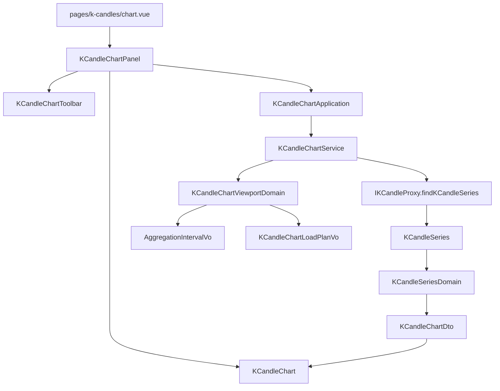

# K 線圖表 — Architecture Design

**Status:** Confirmed
**Source PRD:** `.sdd/2026-09-02-k-candle-chart-view/PRD.md`
**Tech context:** Nuxt 3 · Vue 3 · TypeScript（strict）· Clean Architecture 前端版（元件 → Application → Domain ← Proxy）

---

## 1. Design Goal & Guiding Principle

- **In one sentence:**
  新增一個 `/k-candles/chart` 畫面，把「使用者正在看哪一段」翻譯成「該取哪一段、每根多粗、還是根本不必取」，
  再把取回的彙總 K 線畫成一張可拉遠拉近的圖。

- **Guiding principle:**
  **把「正在看的區間」變成一個會自己回答問題的領域物件。**
  這個切片真正的複雜度只有一個地方：使用者滾了一下滾輪之後，到底該做什麼。
  它牽涉四個判斷（要不要收回、用哪一種刻度、要不要重新取、要取哪一段），
  而這四個判斷彼此相依——分散開來就會變成元件裡一串互相牽扯的 `if`，
  也正是「重畫觸發取資料、取資料又觸發重畫」那個循環的溫床。
  因此它們全部收進 `KCandleChartViewportDomain`，對外**只有一個問題可以問**：
  `toLoadPlan()`——「我在看這一段，手上有這些，那接下來呢？」
  元件因此完全不知道 400 這個數字、不知道五種刻度、也不知道兩側預取這回事。

---

## 2. Change Scope

| Area | Action | What / Why |
| :--- | :--- | :--- |
| `app/domain/models/vo` | **Add** | `AggregationIntervalVo`（彙總刻度的值與可選清單）、`KCandleChartLoadPlanVo`（已判斷完的取回計畫，proxy 的參數） |
| `app/domain/models/entities` | **Add** | `KCandleSeries`——後端回覆的彙總序列在 domain 內的本體形狀 |
| `app/domain/models/domains` | **Add** | `KCandleChartViewportDomain`（本切片的核心判斷）、`KCandleSeriesDomain`（序列轉成圖表要畫的形狀） |
| `app/domain/models/dto` | **Add** | `KCandleChartViewportDto`（元件交進來的）、`KCandleChartDto`（畫面拿回去的）、`KCandleChartRangePresetDto`（快捷區間，帶 `toViewportDto()`） |
| `app/domain/service` | **Add** | `KCandleChartService`——圖表的兩個用例 |
| `app/application` | **Add** | `KCandleChartApplication`——兩行轉呼叫 |
| `app/domain/interface/i-k-candle-proxy.ts` | **Modify** | 加一個 `findKCandleSeries`。K 線是同一個外部資源，**不另立第二個 proxy** |
| `app/infrastructure/proxy/k-candle-proxy.ts` | **Modify** | 實作 `findKCandleSeries`，把序列的 wire 形狀收乾淨 |
| `app/components/molecules` | **Add** | `KCandleChart`（唯一認識繪圖函式庫的地方）、`KCandleChartToolbar`（交易標的、快捷區間、畫法、目前刻度） |
| `app/components/organisms` | **Add** | `KCandleChartPanel`——這一整塊的互動與四種狀態 |
| `app/pages/k-candles/chart.vue` | **Add** | 只做接線 |
| `app/components/templates/ConsoleLayout.vue` | **Modify** | 導覽多一條「K 線圖表」 |
| `app/plugins/dependencies.ts` | **Modify** | 組裝並 provide `$kCandleChartApplication` |
| `nuxt.config.ts` | **Modify** | 繪圖函式庫只在元件掛載後才動態載入，比照 CodeMirror 先在 `optimizeDeps` 報名 |
| `KCandleService` / `KCandleApplication` / 既有的表格畫面 | **Not touched** | 表格要的是可編輯的原始 K 線，圖表要的是不可編輯的彙總 K 線。硬塞進同一個用例只會讓兩邊都得先問「我這批是哪一種」 |
| `app/domain/models/domains/k-candle-domain.ts` | **Not touched** | 漲跌沿用既有規則，圖表直接用它算好的 `trend` |

---

## 3. New Classes / Modules

| Name | Kind | Responsibility (purpose) | Collaborators | Satisfies (PRD scenario) |
| :--- | :--- | :--- | :--- | :--- |
| `AggregationIntervalVo` | VO | 一種彙總刻度的值：代號、畫面標籤、涵蓋幾分鐘。不可變、無行為。同檔匯出五個實例與**由細到粗**的清單——多支援一種刻度就是在清單裡多一列 | — | 五個「每根涵蓋多久」情境 |
| `KCandleChartViewportDomain` | Domain Model | **本切片的核心。** 收下「正在看哪一段 + 手上有什麼」，一口氣做完四個判斷：交易標的有沒有、要不要把區間收回上限、挑哪一種刻度、要不要重新取以及取哪一段 | `AggregationIntervalVo`、`KCandleChartDto`、`KCandleChartLoadPlanVo` | 刻度挑選全部七個情境、重新取的五個情境、兩側預取、未指定交易標的 |
| `KCandleChartLoadPlanVo` | VO | 判斷完的結論：要不要重新取，以及（要的話）取哪一段、哪一種刻度、哪個交易標的。**它同時就是 proxy 的參數**，所以 proxy 收到的必定是已經判斷過的東西 | — | 重新取的五個情境、兩側預取 |
| `KCandleSeries` | Entity | 後端回覆的彙總序列在 domain 內的本體形狀：交易標的、後端回報的刻度代號、一串 K 線。只有欄位 | `KCandle` | （全部） |
| `KCandleSeriesDomain` | Domain Model | 把一串彙總 K 線變成圖表要畫的東西：逐根算好漲跌、把後端回報的刻度代號對回可選清單（對不上就沿用這次要求的），並記下這批涵蓋的範圍 | `KCandleDomain`、`AggregationIntervalVo` | 三個漲跌情境、查無 K 線 |
| `KCandleChartDto` | DTO | 畫面拿到的唯一形狀：交易標的、每根涵蓋多久、這批涵蓋的範圍、逐根 K 線 | `KCandleDto` | （全部） |
| `KCandleChartViewportDto` | DTO | 元件交進來的形狀：交易標的、正在看的起訖、手上這批（沒有就是 `null`） | `KCandleChartDto` | （全部） |
| `KCandleChartRangePresetDto` | DTO | 一個快捷區間：標籤與長度，並帶 `toViewportDto()`——「選這個」等於「以目前時間為結束、往前這麼長」，這個換算屬於快捷區間自己 | `KCandleChartViewportDto` | 畫面提供固定的幾個長度、選一個月 |
| `KCandleChartService` | Domain Service | 圖表的兩個用例：`loadKCandleChart`（判斷 → 必要時取 → 轉 DTO；不必取時回 `null`）與 `listRangePresets` | `IKCandleProxy` 與上列 domain models | （全部） |
| `KCandleChartApplication` | Application | 元件唯一認識的下層，兩行轉呼叫 | `KCandleChartService` | （全部） |
| `KCandleChart` | Molecule | **唯一認識繪圖函式庫的檔案。** 把 DTO 畫出來、把使用者拉出來的新區間丟回去（停手之後才丟一次）。畫法是它的 variant | `KCandleChartDto` | 兩種畫法、拉遠拉近、取資料節流 |
| `KCandleChartToolbar` | Molecule | 交易標的輸入、快捷區間按鈕、畫法切換、目前刻度的唯讀標示 | `KCandleChartRangePresetDto` | 畫面提供固定的幾個長度、每根涵蓋多久的標示 |
| `KCandleChartPanel` | Organism | 這一整塊的互動：持有正在看的區間與手上這批、呼叫 Application、四種狀態的分流、把慢回來的舊結果丟掉 | `KCandleChartApplication`、上列兩個分子 | 四種狀態全部六個情境、換交易標的 |

> **深度檢查**：元件要完成「使用者動了一下之後該做什麼」只需要一次呼叫
> （`loadKCandleChart(viewportDto)`），拿回「要畫的東西」或「沒事」。
> 它不需要先問刻度、再問要不要取、再自己組區間——那正是被拒絕的淺介面。

---

## 4. Modified Components

| Component | Current role | Change needed |
| :--- | :--- | :--- |
| `IKCandleProxy` | K 線這個外部資源的唯一入口 | 加 `findKCandleSeries(kCandleChartLoadPlanVo): Promise<KCandleSeries>` |
| `KCandleProxy` | 實作，唯一允許 `$fetch` 的地方 | 打 `GET /k-candles/series`，把 `{symbol, interval, kCandles}` 的 wire 形狀轉成 `KCandleSeries` |
| `ConsoleLayout` | 全站版面骨架 | 導覽多一條「K 線圖表」，指向 `/k-candles/chart` |
| `dependencies.ts` | 組裝根 | 多組一條 proxy → service → application 並 provide |
| `nuxt.config.ts` | 建置設定 | 繪圖函式庫加進 `optimizeDeps.include`，理由與註解比照既有的 CodeMirror 那段 |

---

## 5. Component Relationships

---

## 6. Extensibility & Handoff Notes

- **Most likely next requirement:** 在圖上疊一條均線或一個指標，或多一種更粗的刻度（一週）。
- **Where it lands:**
  多一種刻度 → `aggregation-interval-vo.ts` 的清單多一列（清單是**由細到粗**排序的，挑選規則只是走過它），
  後端也得認得同一個代號。其他檔案一行都不用改。
  疊一條線 → `KCandleChart` 多一個 series，資料由 `KCandleChartDto` 多帶一欄；
  「正在看哪一段」那組判斷完全不受影響。
- **How to add it:** 加清單裡的一列 / 加 DTO 裡的一欄，不需要新增 `if`。
- **Patterns applied & why:**
  - **值與行為分家**（`AggregationIntervalVo` 純值、`KCandleChartViewportDomain` 帶行為）——
    與後端同一個切片的做法一致，兩邊看起來是同一件事。
  - **判斷結果就是下一步的參數**（`KCandleChartLoadPlanVo` 既是結論也是 proxy 的入參）——
    因此不可能發生「判斷說不用取、卻還是取了」。
- **Do not hardcode:**
  - 400（看得清楚的根數上限）與兩側各半段的預取比例：只寫在 `KCandleChartViewportDomain` 一處。
  - 五種刻度：只寫在 `aggregation-interval-vo.ts` 一處。
  - 顏色：一律讀 token 展開出來的 CSS 變數，繪圖函式庫要的色碼**不得**寫在 TypeScript 裡。
- **Known debt / deferred:**
  - 手上這批資料只留最後一次取回的，沒有跨區間的快取——來回拉遠拉近會重複取同一段。
    以單人本機使用而言可以接受；要處理時，快取屬於 Application 或 composable，**不進 Domain**。
  - 沒有十字準星讀值與畫線工具。
  - **四個 organism 各自抄了一份「後端失敗的四種呈現」**（欄位錯誤／被拒絕／後端出錯／連不上）。
    這一份重複在這個切片之後變成四份，是明顯的整併機會，但沒有在這裡做：
    四個畫面的文案是刻意不同的（「不是你的查詢條件有問題」／「不是你看的區間有問題」…），
    而動到另外三個畫面遠超出本切片該有的影響範圍。
    要整併時的形狀是一個收下「這次的失敗」的分子，加上一個把 `unknown` 分類成失敗種類的領域物件；
    重新檢視的訊號：出現第五個會失敗的畫面時。

---

## 7. Traceability

| PRD Scenario | Fulfilled by |
| :--- | :--- |
| 進入畫面就看到最近一天的行情 | `KCandleChartPanel` + `KCandleChartRangePresetDto.toViewportDto` |
| 一根上漲／下跌／持平的 K 線 | `KCandleSeriesDomain`（沿用 `KCandleDomain.trend`）+ `KCandleChart` |
| 換一個交易標的 | `KCandleChartViewportDomain.toLoadPlan` |
| 看一天用五分鐘一根 | `KCandleChartViewportDomain` + `AggregationIntervalVo` |
| 看兩天改用十五分鐘 | `KCandleChartViewportDomain` |
| 看五天改用一小時 | `KCandleChartViewportDomain` |
| 看一年用一天一根 | `KCandleChartViewportDomain` |
| 恰好落在看得清楚的上限 | `KCandleChartViewportDomain` |
| 再拉遠就不讓它更遠 | `KCandleChartViewportDomain`（建構子 clamp） |
| 拉到很近也沒有比五分鐘更細的 | `KCandleChartViewportDomain` |
| 畫面提供固定的幾個長度 | `KCandleChartService.listRangePresets` + `KCandleChartToolbar` |
| 選一個月 | `KCandleChartRangePresetDto.toViewportDto` |
| 拖動後仍在手上這批資料的範圍內 | `KCandleChartViewportDomain.toLoadPlan`（`needsReload` 為否） |
| 拖出手上這批資料的範圍 | `KCandleChartViewportDomain.toLoadPlan` |
| 每根涵蓋的時間改變 | `KCandleChartViewportDomain.toLoadPlan` |
| 換交易標的（重新取） | `KCandleChartViewportDomain.toLoadPlan` |
| 取資料時兩側各多取半段 | `KCandleChartViewportDomain.toLoadPlan` |
| 預設是蠟燭／切換到曲線 | `KCandleChart` 的 `drawing` variant |
| 切換畫法不重新取資料 | `KCandleChartPanel`（切換畫法不動正在看的區間） |
| 未指定交易標的 | `KCandleChartViewportDomain`（丟出既有的欄位錯誤）+ `KCandleChartPanel` |
| 這段區間內沒有任何 K 線 | `KCandleChartDto`（`isEmpty`）+ `KCandleChartPanel` |
| 被系統拒絕／連不上後端／載入中／失敗後再成功 | `KCandleChartPanel`（沿用既有四種狀態的分流） |

---

## 8. Risks & Open Decisions

- **Risks / trade-offs:**
  - **重畫 ↔ 取資料的循環**：把資料餵進圖之後，圖本身可能再丟一次「正在看的區間變了」。
    切斷點是 `needsReload` 為否時 service 回 `null`，元件因此什麼也不做。
    這條保證必須有測試守著，否則哪天有人讓 service「不必取時也回傳手上這批」，循環就回來了。
  - **繪圖函式庫碰得到 `document`**：只能在元件掛載之後才載入，伺服器端不執行。
    這與既有的 `AppCodeEditor` 是同一個處理方式，連 `optimizeDeps` 的理由都一樣。
  - **金額型別**：領域內一律精確小數，繪圖函式庫只吃一般數值——
    轉換只發生在 `KCandleChart` 真的要畫的那一刻，等同既有畫面上的 `.toString()`。
- **Open decisions:** 無。
