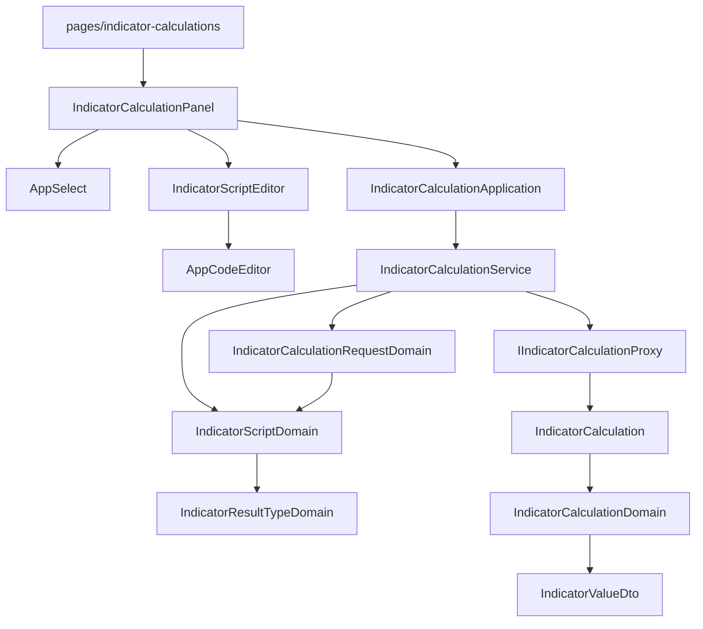

# 只寫算式的內容 — Architecture Design

**Status:** Confirmed
**Source PRD:** `.sdd/2026-09-02-strategy-script-authoring/PRD.md`
**Tech context:** Nuxt 3 · Vue 3 · TypeScript(strict) · SCSS token · Clean / Onion（前端版）· Vitest

---

## 1. Design Goal & Guiding Principle

- **In one sentence:**
  使用者只提供**算式內容**與**指標值種類**；外框、範例、以及「內容如何變成一整段算式」
  全部由領域負責，畫面只負責把兩樣輸入交出去、把回來的值照種類擺好。

- **Guiding principle:**
  **算式的文字只有一個產生地。** `IndicatorScriptDomain` 是全前端唯一知道
  「一段算式長什麼樣」的地方——外框的頭、外框的尾、每個種類的範例內容、以及組裝。
  後端哪天改了進入點的形式，要改的就只有這一個檔案；
  元件、application、proxy 一行都不必動，也不可能各自組出不一樣的外框。
  種類本身（是不是一串、裝的是不是數字、中文標籤）則住在 `IndicatorResultTypeDomain`，
  與「算式長什麼樣」分開——前者是領域概念，後者是那個概念在 Go 裡的寫法。

---

## 2. Change Scope

| Area | Action | What / Why |
| :--- | :--- | :--- |
| `app/domain/models/vo/indicator-result-type.ts` | **Add** | 四種指標值種類的字面量聯合與它們的固定順序。有限字面量聯合是規範允許 `type` 的唯一情形 |
| `app/domain/models/domains/indicator-result-type-domain.ts` | **Add** | 種類的行為：解讀（不認得就退回一個數字）、`isList()` / `holdsNumbers()`、中文標籤 |
| `app/domain/models/domains/indicator-script-domain.ts` | **Add** | **全前端唯一產生算式文字的地方**：外框頭尾、每個種類的範例內容、內容組成完整算式 |
| `app/domain/models/dto/indicator-script-template-dto.ts` | **Add** | 交給畫面的算式樣板：外框的頭、外框的尾、這個種類的範例內容。一次呼叫拿齊 |
| `app/domain/models/dto/indicator-result-type-option-dto.ts` | **Add** | 下拉清單的一個選項：值與中文標籤 |
| `app/domain/models/dto/indicator-value-dto.ts` | **Add** | 一個指標的值離開領域的形狀：名稱、**已格式化好的值序列**、是不是一串 |
| `app/domain/models/vo/indicator-value-vo.ts` | **Modify** | 由「名稱＋一個數字」改為「名稱＋一串原始值」，一個值就是長度一的那一串 |
| `app/domain/models/entities/indicator-calculation.ts` | **Modify** | 多帶後端回報的指標值種類 |
| `app/domain/models/domains/indicator-calculation-domain.ts` | **Modify** | 依種類把每個值格式化成可顯示的字串序列（是非→是／否），並帶出種類標籤 |
| `app/domain/models/dto/indicator-calculation-result-dto.ts` | **Modify** | 值改為 `IndicatorValueDto[]`，並多帶種類標籤 |
| `app/domain/models/dto/indicator-calculation-request-dto.ts` | **Modify** | `script` 改為 `scriptBody`，並多收 `resultType` |
| `app/domain/models/domains/indicator-calculation-request-domain.ts` | **Modify** | 驗算式內容（訊息改為「請填寫算式內容」）、解讀種類、**對外提供組好的完整算式** |
| `app/domain/errors/indicator-calculation-field-error.ts` | **Modify** | 欄位名 `script` 改為 `scriptBody` |
| `app/domain/service/indicator-calculation-service.ts` | **Modify** | `buildExampleScript()` 換成 `describeIndicatorScript(resultType)` 與 `listResultTypeOptions()` |
| `app/application/indicator-calculation-application.ts` | **Modify** | 同上，逐一轉呼叫 |
| `app/domain/interface/i-indicator-calculation-proxy.ts` · `app/infrastructure/proxy/indicator-calculation-proxy.ts` | **Modify** | 送出多一個 `resultType`；收下的 `values` 由「名稱→數字」變成「名稱→數字／一串數字／是非／一串是非」，在 proxy 收乾淨成 VO |
| `app/components/atoms/AppSelect.vue` | **Add** | 全站唯一的下拉選單。**以 slot 收 `<option>`**，因此原子不必認識任何 DTO |
| `app/components/atoms/AppCodeEditor.vue` | **Add** | 全站唯一的程式碼編輯區。CodeMirror 在 `onMounted` 內**動態載入**，SSR 期間只留一個容器 |
| `app/components/molecules/IndicatorScriptEditor.vue` | **Add** | 把唯讀外框的頭、內容編輯區、外框的尾疊成一段完整算式的樣子 |
| `app/components/organisms/IndicatorCalculationPanel.vue` | **Modify** | 多一個種類下拉；算式欄位換成新的分子；結果依種類呈現 |
| `app/components/atoms/AppTextarea.vue` | **Delete** | 原本只有指標算式在用；改用編輯區之後全專案沒有任何地方用得到它。留著沒人用的元件只會腐爛 |
| `app/pages/indicator-calculations/index.vue` | **Not touched** | 頁面只把 application 往下傳，介面沒變 |
| `package.json` | **Modify** | 新增 CodeMirror 相關套件（語言支援、編輯器核心、補齊） |

---

## 3. New Classes / Modules

| Name | Kind | Responsibility (purpose) | Collaborators | Satisfies (PRD scenario) |
| :--- | :--- | :--- | :--- | :--- |
| `IndicatorResultTypeDomain` | Domain Model | 種類是什麼：解讀使用者／後端給的字串（不認得退回一個數字）、`isList()`、`holdsNumbers()`、中文標籤。**「沒有特別挑是哪一種」也由它回答**（`defaultResultType()` 一路透到 application），畫面不自己指定預設值 | `IndicatorResultType` | US-02 全部、US-05「結果說明自己是哪一種」 |
| `IndicatorScriptDomain` | Domain Model | 算式長什麼樣：外框的頭與尾（依種類決定產出形狀）、該種類的範例內容、把內容組成完整算式 | `IndicatorResultTypeDomain` | US-01、US-02、US-03 全部 |
| `IndicatorScriptTemplateDto` | DTO | 畫面要的算式樣板：外框頭、外框尾、範例內容。**一次呼叫拿齊**，畫面不必為了同一個種類問三次 | — | US-01「外框看得見」、US-02、US-03 |
| `IndicatorResultTypeOptionDto` | DTO | 下拉清單的一個選項：種類的值與中文標籤 | — | US-02 全部 |
| `IndicatorValueDto` | DTO | 一個指標的值離開領域的形狀：名稱、**已格式化好的值序列**、是不是一串。畫面因此不需要判斷是非該顯示什麼字 | — | US-05 全部 |
| `AppSelect` | Atom | 全站唯一的下拉選單。選項以 slot 傳入，原生屬性走 fallthrough | — | US-02 全部 |
| `AppCodeEditor` | Atom | 全站唯一的程式碼編輯區：著色、自動縮排、常用片段。**只是撰寫協助，不執行也不驗證** | — | US-04 全部 |
| `IndicatorScriptEditor` | Molecule | 把唯讀外框頭、內容編輯區、唯讀外框尾疊成一段看起來完整的算式，並掛上標籤與錯誤訊息 | `AppCodeEditor`、`FormField`、`IndicatorScriptTemplateDto` | US-01「外框看得見」、US-04 |

**刻意不建立的類別**

- **沒有 `IndicatorScriptFrameDomain`。** 外框沒有自己的行為，它是算式的一部分；
  拆出去只會讓「算式的文字只有一個產生地」這條原則立刻破功。
- **沒有 `IndicatorValueDomain`。** 值的格式化需要知道種類，而種類是**整次計算**的屬性；
  由 `IndicatorCalculationDomain` 一次做完，比讓每個值各自帶著種類誠實。
- **沒有 `GoCodeFormatter` 之類的工具模組。** 產生算式文字是領域行為，不是技術轉換。

**Depth check（deep-module 診斷）**

- 畫面切換種類只呼叫**一次** `describeIndicatorScript(resultType)` 就拿到外框與範例，
  不必依序問「頭是什麼」「尾是什麼」「範例是什麼」。
- 畫面完成一次計算仍只呼叫一次 `calculateIndicator`，並且**完全不知道**
  送出去的是外框加內容——組裝藏在 domain model 裡。
- 畫面不判斷是非該顯示「是」還是「否」、也不判斷一串該怎麼攤開：DTO 給的是可直接顯示的字串序列。
- 新增一種種類不需要改任何元件。

---

## 4. Modified Components

| Component | Current role | Change needed |
| :--- | :--- | :--- |
| `IndicatorCalculationRequestDomain` | 驗證一次計算的輸入 | 欄位由 `script` 改為 `scriptBody`（訊息改為「請填寫算式內容」）、解讀種類、對外提供**組好的完整算式**與種類 |
| `IndicatorCalculationDomain` | 依名稱排序指標 | 依種類把值格式化成字串序列（是非→是／否）、帶出種類標籤 |
| `IndicatorValueVo` | 名稱＋一個數字 | 名稱＋一串原始值（數字或是非）；一個值就是長度一的那一串，一串就是它本來的長度 |
| `IndicatorCalculation`（entity） | 交易標的、採用根數、值 | 多帶後端回報的種類 |
| `IndicatorCalculationProxy` | 送出算式、收下「名稱→數字」 | 送出多一個 `resultType`；wire 的值型別擴為四種，於 proxy 收乾淨成 VO |
| `IndicatorCalculationService` | 計算 ＋ 範例算式 | `buildExampleScript()` → `describeIndicatorScript(resultType)`；新增 `listResultTypeOptions()`。公開方法之間仍互不呼叫 |
| `IndicatorCalculationPanel` | 表單 ＋ 結果 | 多一個種類下拉、算式欄位換成新分子、結果依種類呈現（一串逐個、是非顯示是／否、空的一串明說） |

---

## 5. Component Relationships

---

## 6. Extensibility & Handoff Notes

- **Most likely next requirement:** 再多一種指標值種類，或把寫好的算式存起來重複使用。
- **Where it lands:**
  - 多一種種類 → `IndicatorResultType` 的聯合加一個值、`IndicatorResultTypeDomain`
    的描述表加一列（標籤、是不是一串、裝的是不是數字）、`IndicatorScriptDomain`
    的範例表加一列。**元件、application、proxy 全都不用動。**
  - 存算式 → 存的是「內容＋種類」這兩樣，不是整段算式；外框永遠可以從種類重建。
    這也是為什麼送出前才組裝，而不是讓畫面持有一整段算式。
- **How to add it:** 加在描述表裡，不要在元件裡寫 `if (resultType === ...)`。
  元件一旦出現對種類的判斷，這個設計就開始腐爛。
- **Patterns applied & why:** 以**描述表**取代分支——四種種類的差別只有
  「是不是一串」「裝的是不是數字」「叫什麼」「範例怎麼寫」四個欄位，列成表比寫成四段程式誠實。
- **Do not hardcode:** 元件裡不得出現任何算式文字（`package main`、`func Calculate`…）、
  也不得出現「是」／「否」的判斷——兩者都由領域給。
- **Known debt / deferred:**
  - 常用片段先收四個常見寫法，之後依實際使用增補；片段清單放在編輯區原子裡，
    因為它們是「怎麼寫程式」的協助，不是領域規則。
  - 編輯區在測試環境（無真實瀏覽器排版）下只驗它把值傳上來，不驗著色與縮排——
    那是編輯器套件自己的行為，不是我們的業務。

---

## 7. Traceability

| PRD Scenario | Fulfilled by |
| :--- | :--- |
| 只寫內容也能算 | `IndicatorScriptDomain`（組裝）＋ `IndicatorCalculationRequestDomain` |
| 外框看得見／無法編輯 | `IndicatorScriptTemplateDto` ＋ `IndicatorScriptEditor` |
| 內容前後多餘的空白不影響計算 | `IndicatorCalculationRequestDomain`（去空白後組裝） |
| 內容留空／只有空白 | `IndicatorCalculationRequestDomain` → `IndicatorCalculationFieldError('scriptBody')` |
| 挑四種種類外框跟著變 | `IndicatorResultTypeDomain` ＋ `IndicatorScriptDomain.frameHeader()` |
| 切換種類不會弄丟內容 | `IndicatorCalculationPanel`（種類與內容是兩個各自獨立的狀態） |
| 沒有特別挑就是一個數字 | `IndicatorResultTypeDomain` 的預設 |
| 四種範例內容 | `IndicatorScriptDomain.exampleBody()` |
| 帶入範例會取代已寫的內容 | `IndicatorCalculationPanel` |
| 看得出程式的結構／自動縮排／常用片段 | `AppCodeEditor` |
| 畫面不執行也不驗證算式 | `AppCodeEditor`（只提供撰寫協助）＋ 既有的錯誤分流 |
| 一個數字／一串數字／一個是非／一串是非的呈現 | `IndicatorCalculationDomain` → `IndicatorValueDto` → `IndicatorCalculationPanel` |
| 空的一串 | `IndicatorValueDto.isEmptySeries` |
| 沒有算出任何指標 | `IndicatorCalculationResultDto.isEmpty`（既有） |
| 結果說明自己是哪一種 | `IndicatorCalculationDomain`（種類標籤來自後端回報的種類） |

---

## 8. Risks & Open Decisions

- **Risks / trade-offs:**
  - 外框由前端產生，與後端的算式形式是一份**沒有型別保障的約定**。
    以「只有一處產生」＋ 後端在形狀不符時明講期望形式，來把代價壓到最低。
  - 引入編輯器套件會增加前端體積；以 `onMounted` 內動態載入把它移出首屏。
  - 值的顯示字串在領域算好，畫面拿到的是字串而非數字——
    這是刻意的：判斷「是非要顯示什麼字」屬於領域，不屬於畫面。
- **Open decisions (for implementation):**
  - 後端回報的種類若是前端不認得的字串，一律當「一個數字」呈現，不讓畫面壞掉。

**實作階段調整的兩件事**

1. 畫面原本打算拿「清單第一個」當預設種類，那會留下一條永遠走不到的 fallback；
   改成由領域直接回答預設是哪一種。
2. `AppTextarea` 原本列為不動，實際上改用編輯區後全專案就沒人用它了，因此刪除。
