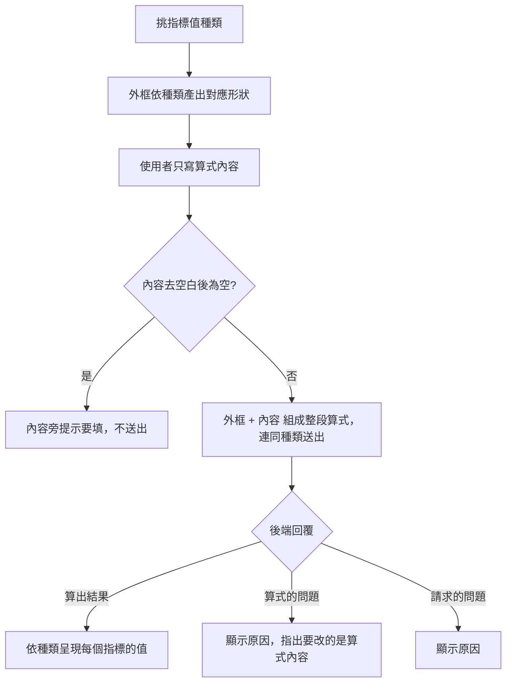

# Product Requirements Document (PRD) — 只寫算式的內容

**Status:** Finalized
**Version:** v1.0
**Owner:** James Hsueh
**Stakeholders:** 專案作者本人（同時是使用者、開發者與審查者）

---

## 1. Background & Goal (Why & Goal)

- **Problem Statement:** 要試一條指標算式，使用者得從空白開始把**整段算式**寫完——
  套件宣告、匯入、進入點的名字與它收下的 K 線、收尾的括號。這些每次都一模一樣，
  卻每次都要重打；打錯一個字，換來的是一段技術性的拒絕訊息。
  寫算式的地方也只是一個純文字框：沒有顏色、沒有縮排、沒有任何補齊。
- **Expected Outcome:** 使用者只寫**算式內容**——真正在算的那幾行；外框由畫面備妥、
  看得見但改不動，並跟著挑選的**指標值種類**改變產出形狀。內容區具備語法著色、
  自動縮排與常用片段補齊。四種指標值種類的結果都能正確呈現。
- **Out of Scope:** 儲存／命名／重複使用算式；在畫面上執行或驗證算式；
  讓使用者自訂外框或加入自己的匯入與其他函式；同一次計算混用多種指標值種類；
  結果的圖表呈現；多個算式分頁。

---

## 2. User Personas

- **Primary Role(s):** 策略研究者（專案作者本人）。
- **Usage Context:** 桌機瀏覽器、本機執行。連續試很多次：改內容 → 執行 → 看值 → 再改；
  種類多半在一開始就決定，之後整輪不動。

---

## 3. User Stories & Acceptance Criteria

### US-01 — 只寫算式真正在算的那幾行 [priority: P0]

**As a** 策略研究者, **I want** 只撰寫算式的內容、外框交給畫面,
**so that** 我不必每次重打那些每次都一樣的行，也不會因為打錯它們而被拒絕。

```gherkin
Scenario: 只寫內容也能算
  Given 指標值種類是「一個數字」
  And 使用者在算式內容裡寫下算出收盤價平均並放進結果的那幾行
  When 使用者執行計算
  Then 送出的算式是外框加上這段內容
  And 送出的指標值種類是「一個數字」

Scenario: 外框看得見
  When 使用者進入指標計算畫面
  Then 畫面顯示算式外框
  And 外框無法被編輯

Scenario: 內容前後多餘的空白不影響計算
  Given 使用者寫的內容前後各有幾個空白行
  When 使用者執行計算
  Then 照樣送出，計算正常進行

Scenario: 內容留空
  Given 算式內容是空的
  When 使用者執行計算
  Then 不進行計算
  And 算式內容旁提示「請填寫算式內容」

Scenario: 內容只有空白
  Given 算式內容只有空白與換行
  When 使用者執行計算
  Then 不進行計算
  And 算式內容旁提示「請填寫算式內容」
```

### US-02 — 挑一個指標值種類，外框跟著變 [priority: P0]

**As a** 策略研究者, **I want** 從清單挑出這次要算的指標值種類,
**so that** 我不可能挑了一種卻寫成另一種，也不必自己去記外框該怎麼寫。

```gherkin
Scenario: 挑一個數字
  Given 使用者挑選指標值種類「一個數字」
  When 使用者觀察算式外框
  Then 外框顯示這段算式產出的是一個數字

Scenario: 挑一串數字
  Given 使用者挑選指標值種類「一串數字」
  When 使用者觀察算式外框
  Then 外框顯示這段算式產出的是一串數字

Scenario: 挑一個是非
  Given 使用者挑選指標值種類「一個是非」
  When 使用者觀察算式外框
  Then 外框顯示這段算式產出的是一個是非

Scenario: 挑一串是非
  Given 使用者挑選指標值種類「一串是非」
  When 使用者觀察算式外框
  Then 外框顯示這段算式產出的是一串是非

Scenario: 切換種類不會弄丟寫到一半的內容
  Given 使用者已在算式內容裡寫了一段東西，種類是「一個數字」
  When 使用者改挑「一串數字」
  Then 外框改成產出一串數字
  And 算式內容一字不變

Scenario: 沒有特別挑就是一個數字
  Given 使用者沒有動過指標值種類
  When 使用者執行計算
  Then 送出的指標值種類是「一個數字」
```

### US-03 — 一鍵帶入這個種類能跑的範例 [priority: P1]

**As a** 策略研究者, **I want** 一鍵得到一段當下種類能直接跑的範例內容,
**so that** 我換種類時不必從空白重想那個種類該怎麼寫。

```gherkin
Scenario: 帶入一個數字的範例
  Given 指標值種類是「一個數字」
  When 使用者按下帶入範例
  Then 算式內容變成一段算出單一平均值的範例

Scenario: 帶入一串數字的範例
  Given 指標值種類是「一串數字」
  When 使用者按下帶入範例
  Then 算式內容變成一段算出一整串數值的範例

Scenario: 帶入一個是非的範例
  Given 指標值種類是「一個是非」
  When 使用者按下帶入範例
  Then 算式內容變成一段算出單一是非的範例

Scenario: 帶入一串是非的範例
  Given 指標值種類是「一串是非」
  When 使用者按下帶入範例
  Then 算式內容變成一段逐根算出是非的範例

Scenario: 帶入範例會取代已經寫的內容
  Given 算式內容已經寫了東西
  When 使用者按下帶入範例
  Then 算式內容被範例取代
```

### US-04 — 寫算式的地方像個寫程式的地方 [priority: P1]

**As a** 策略研究者, **I want** 內容區有著色、自動縮排與常用片段,
**so that** 我看得出程式的結構，也不必逐行對齊空白。

```gherkin
Scenario: 看得出程式的結構
  Given 算式內容裡有關鍵字、字串與數字
  When 使用者觀察內容區
  Then 不同性質的字在視覺上分得出來

Scenario: 換行自動接續縮排
  Given 游標停在一行縮排過的內容尾端
  When 使用者換行
  Then 新的一行自動接續同樣的縮排

Scenario: 常用片段補得出來
  Given 使用者在內容區開始輸入
  When 使用者叫出補齊
  Then 出現走訪每一根 K 線之類的常用片段

Scenario: 畫面不執行也不驗證算式
  Given 算式內容寫得根本不成立
  When 使用者執行計算
  Then 畫面照樣送出，由後端判定並回報原因
```

### US-05 — 四種指標值都看得懂 [priority: P0]

**As a** 策略研究者, **I want** 結果的呈現對得上種類,
**so that** 一串就看得到每一個值，是非就看得到是或否。

```gherkin
Scenario: 一個數字
  Given 指標值種類是「一個數字」，算出「均價」為 110
  When 使用者看結果
  Then 「均價」顯示 110

Scenario: 一串數字
  Given 指標值種類是「一串數字」，算出「均線」為 100、105、110
  When 使用者看結果
  Then 「均線」的三個值依序都看得到

Scenario: 一個是非
  Given 指標值種類是「一個是非」，算出「黃金交叉」為真
  When 使用者看結果
  Then 「黃金交叉」顯示「是」

Scenario: 一串是非
  Given 指標值種類是「一串是非」，算出「逐根收紅」為真、假、真
  When 使用者看結果
  Then 「逐根收紅」依序顯示「是」「否」「是」

Scenario: 空的一串
  Given 指標值種類是「一串數字」，「均線」算出空的一串
  When 使用者看結果
  Then 「均線」明說是空的一串

Scenario: 沒有算出任何指標
  Given 算式沒有把任何指標放進結果
  When 使用者看結果
  Then 畫面顯示「這次沒有算出任何指標」
  And 畫面不顯示任何錯誤

Scenario: 結果說明自己是哪一種
  Given 任何一次成功的計算
  When 使用者看結果
  Then 結果說明這次的指標值種類
```

---

## 4. Business Flow & Logic



- **Core Business Rules:**
  - **外框由畫面產生**：使用者只提供內容；送出的算式一律是外框加內容。
  - **外框唯讀**：使用者看得見但改不動，這樣後端回報的行號才對得上。
  - **種類決定外框**：外框的產出形狀跟著指標值種類走，不可能挑一種寫成另一種。
  - **預設一個數字**：沒有特別挑就是「一個數字」。
  - **切換種類不動內容**：外框換，內容一字不變。
  - **內容不得為空**：去空白後為空即不送出，錯誤標在內容旁。
  - **畫面不執行也不驗證算式**：著色、縮排、片段都只是撰寫協助；算式一律由後端判定。
  - **是非的呈現**：真顯示「是」、假顯示「否」，這個轉換屬於領域，不寫在畫面上。
  - **一串的呈現**：每個值都要看得到、順序不變；空的一串要明說是空的。
  - **結果自帶種類**：畫面照後端回報的種類呈現，不是照送出時挑的那個猜。
- **Edge Cases:**
  - 內容裡用到常見的數學或排序運算：外框已一併備妥，使用者不必自己張羅。
  - 計算進行中：沿用既有行為，執行按鈕不可再次觸發。
  - 一次成功的計算清掉先前的錯誤與結果。

---

## 5. UI/UX Design & Interaction

- **表單**：交易標的、計算根數、**指標值種類（從清單挑一個）**、算式內容。
- **算式內容區**：等寬、著色、自動縮排、常用片段補齊；上下方分別是唯讀的外框開頭與收尾，
  視覺上連成一段完整的算式。
- **帶入範例**：一個動作，帶入當下種類可直接執行的範例內容。
- **結果**：「實際採用 N 根」＋這次的指標值種類；每個指標一列，
  一串的值逐個呈現、是非顯示「是」／「否」、空的一串明說是空的。
- **錯誤**：內容為空標在內容旁；「算式的問題」與「請求的問題」沿用既有的兩種呈現。

---

## 6. Non-Functional Requirements

- **Performance:** 內容區的載入不得拖慢整個畫面的第一次顯示。
- **Security:** 畫面**不執行**任何使用者提供的程式碼；算式一律送到後端沙箱執行。
- **Compatibility:** 桌機瀏覽器最新版。
- **Analytics / Tracking:** 無。

---

## 7. Dependencies & Risks

- **External Dependencies:** 後端 `go-trading` 的指標值種類能力（四種種類與依宣告驗收）。
- **Known Risks:**
  - 外框由畫面產生，若後端日後改變算式的形式，兩邊必須一起改；
    這個風險以「外框只有一處產生」來控制。
  - 內容區需要額外的程式庫，體積與首次載入時間要留意。

---

## 8. Appendix

- 需求共識：[BRIEF.md](BRIEF.md)
- 通用語言：[../UL-MAP.md](../UL-MAP.md)
- **Open Decisions 的裁決**：
  1. 切換種類時**一律不動內容**，即使內容還是上一個種類的範例。
     「看看換個種類外框長怎樣」是常見動作，讓它有機會覆寫使用者的東西不划算；
     要新範例按一下帶入即可。
  2. 常用片段先收**走訪每一根 K 線、取收盤價、加總平均、放進結果**四個常見寫法，
     之後依實際使用增補。
