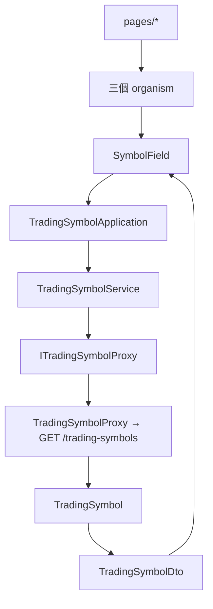

# 交易標的選單 — Architecture Design

**Status:** Confirmed
**Source PRD:** `.sdd/2026-09-02-trading-symbol-picker/PRD.md`
**Tech context:** Nuxt 3 · Vue 3 · TypeScript（strict）· Clean Architecture 前端版（元件 → Application → Domain ← Proxy）

---

## 1. Design Goal & Guiding Principle

- **In one sentence:**
  把後端的 `GET /trading-symbols` 接到畫面上，讓三個讀行情的畫面共用同一個下拉式選單，
  而新增／修改 K 線的表單維持手打。

- **Guiding principle:**
  **「怎麼挑一個交易標的」只有一個元件知道，包括選項從哪來。**
  三個畫面都要這件事。如果只把它做成一個笨元件、由三個 organism 各自去取清單、
  各自處理載入中與取不到，那份重複會有三份，而且三份會慢慢長歪。
  因此 `SymbolField` 自己認識 `ITradingSymbolProxy` 那條鏈：它收下 Application，
  自己取清單、自己決定落單時改選誰、自己說明取不到——
  使用端只寫 `<SymbolField v-model="symbol" :application="…" />`。

---

## 2. Change Scope

| Area | Action | What / Why |
| :--- | :--- | :--- |
| `app/domain/models/entities/trading-symbol.ts` | **Add** | 後端回覆的一個交易標的在 domain 內的本體形狀 |
| `app/domain/models/dto/trading-symbol-dto.ts` | **Add** | 交給畫面的唯一形狀 |
| `app/domain/interface/i-trading-symbol-proxy.ts` | **Add** | 能力介面。`/trading-symbols` 是**另一個資源**，因此是自己的 proxy，不塞進 `IKCandleProxy` |
| `app/infrastructure/proxy/trading-symbol-proxy.ts` | **Add** | 實作；把 wire 形狀收乾淨 |
| `app/domain/service/trading-symbol-service.ts` | **Add** | 一個用例：列出可查交易標的 |
| `app/application/trading-symbol-application.ts` | **Add** | 一行轉呼叫 |
| `app/components/molecules/SymbolField.vue` | **Modify** | 從「文字輸入 + 建議清單」改成「下拉式選單」，並自己取清單、自己處理落單、空清單與取不到 |
| `KCandleSearchPanel` / `KCandleChartPanel` / `IndicatorCalculationPanel` | **Modify** | 多收一個 `tradingSymbolApplication` prop 往下傳。`IndicatorCalculationPanel` 原本自己刻了一份交易標的欄位，改用 `SymbolField` |
| `pages/k-candles/index.vue`、`pages/k-candles/chart.vue`、`pages/indicator-calculations/index.vue` | **Modify** | 多注入一個 Application |
| `app/plugins/dependencies.ts` | **Modify** | 組裝並 provide `$tradingSymbolApplication` |
| `app/components/molecules/KCandleForm.vue` | **Not touched** | 新增／修改 K 線是**寫**的路徑，交易標的維持手打——那正是新的交易標的誕生的地方，只能從既有清單挑就永遠建不出第一根 |
| `KCandleChartViewportDomain` 等既有 domain | **Not touched** | 交易標的是不是合法、要不要重新取，規則一行不動 |

---

## 3. New Classes / Modules

| Name | Kind | Responsibility (purpose) | Collaborators | Satisfies (PRD scenario) |
| :--- | :--- | :--- | :--- | :--- |
| `TradingSymbol` | Entity | 一個可查交易標的在 domain 內的本體形狀。只有欄位，帶一個 `toDto()` 形狀轉換 | `TradingSymbolDto` | （全部） |
| `TradingSymbolDto` | DTO | 交給 application 與畫面的唯一形狀 | — | （全部） |
| `ITradingSymbolProxy` | 介面 | 「取得可查交易標的」這個能力 | — | （全部） |
| `TradingSymbolProxy` | Proxy | 打 `GET /trading-symbols`，把 wire 形狀轉成 entity | `BackendApiProxy`、`TradingSymbol` | （全部） |
| `TradingSymbolService` | Domain Service | 一個用例：取回清單並轉成 DTO。**順序原樣沿用後端給的**，不重排 | `ITradingSymbolProxy` | 依後端給的順序呈現 |
| `TradingSymbolApplication` | Application | 元件唯一認識的下層 | `TradingSymbolService` | （全部） |

> **深度檢查**：使用端要完成「讓使用者挑一個交易標的」只需要
> `<SymbolField v-model="symbol" :trading-symbol-application="…" />` ——
> 不必自己取清單、不必自己判斷落單、不必自己寫載入中與取不到的文案。

---

## 4. Modified Components

| Component | Current role | Change needed |
| :--- | :--- | :--- |
| `SymbolField` | 文字輸入 + 建議清單（`datalist`） | 改用 `AppSelect`；掛載時取清單；清單非空且目前這一檔不在裡面就 emit 第一個；清單空的維持原樣並說明；取不到時說明並停用選單。**沒有清單可用時選單一律停用**——一個空白又點得開的選單只會讓人一直點 |
| `KCandleSearchPanel`、`KCandleChartPanel` | 各自收一個 Application | 多收 `tradingSymbolApplication` 往下傳給 `KCandleQueryForm` / `KCandleChartToolbar` |
| `IndicatorCalculationPanel` | 自己刻了一份交易標的的 `FormField` + `AppInput` | 改用 `SymbolField`——一個 UI 概念只留一個元件 |
| `KCandleQueryForm`、`KCandleChartToolbar` | 使用 `SymbolField` | 把 `tradingSymbolApplication` 往下傳 |
| 三個 page | 只做接線 | 多注入一個 Application |

---

## 5. Component Relationships

---

## 6. Extensibility & Handoff Notes

- **Most likely next requirement:** 清單旁邊顯示「有幾根 / 最新一根是什麼時候」，
  或標的變多之後要能搜尋。
- **Where it lands:**
  多帶資訊 → 後端 DTO 多一欄、`TradingSymbol` 多一個欄位、`SymbolField` 的選項多顯示一段。
  要搜尋 → `SymbolField` 從 `AppSelect` 換成一個可輸入的選單元件，**使用端一行都不用改**，
  因為它們只給 v-model 與 Application。
- **How to add it:** 動 `SymbolField` 一個檔案。
- **Patterns applied & why:** 沒有套用模式。這個切片的重點是**把重複收在一個元件裡**，
  不是加抽象層。
- **Do not hardcode:** 畫面上不得再出現任何交易標的名稱。
  原本 `SymbolField` 與 `KCandleQueryForm` 裡寫死的 `['BTCUSDT','ETHUSDT']` 建議清單一併移除。
  各 organism 的 `DEFAULT_SYMBOL = 'BTCUSDT'` **保留**：它是「進畫面時先帶哪一檔」的起點，
  清單回來之後會依 BR-3 修正——完全不帶的話，畫面一進去就會顯示「請指定交易標的」，
  那是在怪使用者沒填。
- **Known debt / deferred:**
  - 三個畫面各自取一次清單。以單人本機使用而言可以接受；
    要處理時快取屬於 Application 或 composable，**不進 Domain**。
    重新檢視的訊號：出現第四個要讀行情的畫面，或清單變大到取一次有感。
  - **清單取不到時整個選單停用**，是 PRD §5 明訂的行為，但它記錄了兩件退步：
    以前是文字輸入框，所以 `/trading-symbols` 掛掉就換不了標的（即使 `/k-candles` 完全健康）；
    而且**停用的 `<select>` 無法取得焦點**，鍵盤使用者走不到這一欄，也就聽不到旁邊那句說明。
    現在不改，是因為清單空的時候本來就沒有第二個選項可挑，而這是單人桌機用的操作台。
    重新檢視的訊號：這個介面開始有鍵盤導覽的需求，或後端變得沒那麼可靠。
    屆時的做法是選單維持可用、只放目前那一檔，而不是停用它。

---

## 7. Traceability

| PRD Scenario | Fulfilled by |
| :--- | :--- |
| 讀行情的畫面呈現可挑的清單 | `SymbolField` + `TradingSymbolApplication` |
| 挑另一檔就換那一檔的行情 | `SymbolField`（v-model）+ 各 organism 既有的 `watch(symbol)` |
| 依後端給的順序呈現 | `TradingSymbolService`（不重排）+ `TradingSymbolProxy` |
| 原本帶的那一檔就在清單上 | `SymbolField`（落單修正只在不在清單上時觸發） |
| 原本帶的那一檔不在清單上 | `SymbolField` |
| 後端一檔都沒有 | `SymbolField` |
| 連不上後端 | `SymbolField` |
| 取清單失敗時仍看得出目前是哪一檔 | `SymbolField` |
| 新增一根系統還沒有過的交易標的 | `KCandleForm`（刻意不動） |
| 修改既有的一根時交易標的仍然唯讀 | `KCandleForm`（刻意不動） |

---

## 8. Risks & Open Decisions

- **Risks / trade-offs:**
  - **`SymbolField` 是一個會自己去取資料的分子**，比純展示的分子重。
    這是刻意的取捨：另一條路是三個 organism 各自重複一次取清單與四種狀態，
    那份重複會長歪，而這個元件的職責仍然只有一個——讓使用者挑一個交易標的。
    它收的是 Application（由使用端注入），因此測試時照樣是替身，沒有隱藏的相依。
  - 落單修正會透過 v-model 改變使用端的值，使用端既有的 `watch(symbol)` 會因此再取一次行情。
    這是正確的行為（現在看的是另一檔了），但要留意它是一次額外的請求。
- **Open decisions:** 無。
