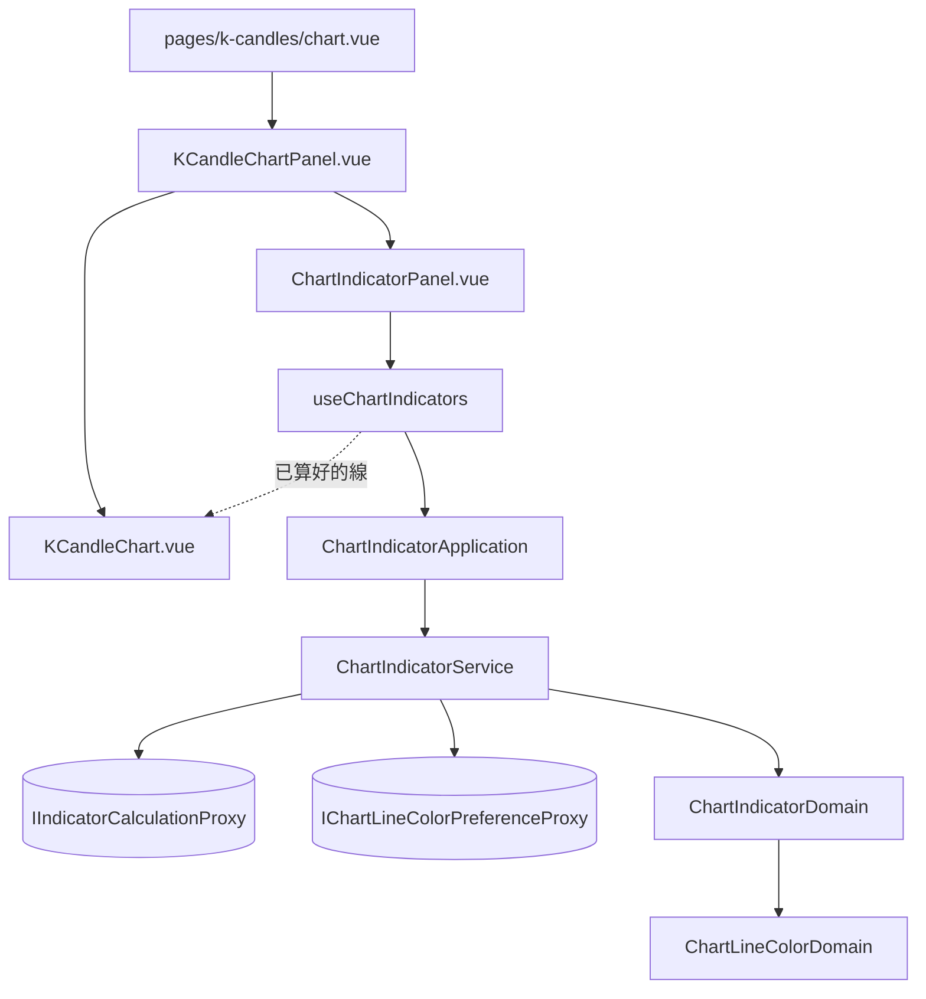

# 在 K 線圖表上套用策略 — Architecture Design

**Status:** Confirmed
**Source PRD:** `.sdd/2026-09-03-chart-indicator-overlay/PRD.md`
**Tech context:** Nuxt 3 · TypeScript · Clean / Onion · lightweight-charts（只有一個檔案認識它）

---

## 1. Design Goal & Guiding Principle

- **In one sentence:**
  讓圖表畫面能對「圖上正在畫的那批 K 線」執行任意幾支已存策略，
  並把結果交給圖表以**已經算好的線**（位置、顏色、標籤都定好）畫出來。

- **Guiding principle：`KCandleChart.vue` 不得學會任何新的判斷。**

  這不是我加的原則，是那個檔案**自己的註解已經寫著的**：

  > 這是全站唯一認識繪圖函式庫的檔案。
  > **它不判斷任何事**：每根多粗、要不要重新取、取哪一段，全部在領域算好了。

  指標一進來，它會被三件事誘惑：分辨「這是一個數字還是一串」、決定「這條線該什麼顏色」、
  判斷「是非要不要畫」。**那三個全部是業務規則**，而它們一旦落進那個檔案，
  那句註解就不再成立，之後每一個新的指標形態都會再往裡面加一個 `if`。

  因此領域交給它的不是「一次計算的結果」，而是**兩份已經分好類的清單**：
  `levels`（水平線）與 `series`（跟著 K 線走的曲線），每一條都已經帶著顏色與標籤。
  圖表只剩兩個迴圈，各對應繪圖函式庫的一個呼叫，**沒有一個 `if` 在問業務問題**。

- **第二原則：重算不發明新的觸發條件。**
  圖表既有的設計已經回答過「這一次要不要重新取資料」——
  `KCandleChartViewDto.reloadedChart` 為 `null` 就是「手上那批就夠了」。
  指標掛在同一個訊號上，於是 PRD 的 US-02 四條規則**沒有一條是新寫的判斷**。
  自己再開一個 `watch` 監看顯示區間，會讓每一格拖動都重算，而那幾次結果必定相同。

---

## 2. Change Scope

| Area | Action | What / Why |
| :--- | :--- | :--- |
| `domain/models/vo/chart-line-color-vo.ts` | **Add** | 可挑的線色：token 名稱＋給人看的名字。**畫面不得寫死任何顏色** |
| `domain/models/dto/chart-line-color-option-dto.ts` | **Add** | 換色選單上的一個選項 |
| `domain/models/dto/indicator-point-dto.ts` | **Add** | 曲線上的一點：起始時間與值 |
| `domain/models/dto/indicator-level-dto.ts` | **Add** | 一條水平線：線的身分、指標名稱、顏色 token、值 |
| `domain/models/dto/indicator-series-dto.ts` | **Add** | 一條曲線：同上，外加一串點 |
| `domain/models/dto/chart-indicator-dto.ts` | **Add** | 一支已套用指標算成功後該畫的東西：策略身分與名稱、levels、series |
| `domain/models/dto/chart-indicator-request-dto.ts` | **Add** | 「拿這支策略對這張圖算一次」要給的東西 |
| `domain/models/domains/chart-line-color-domain.ts` | **Add** | 一條線的顏色：記住的優先，沒記過就從沒被用掉的裡面依序取 |
| `domain/models/domains/chart-indicator-domain.ts` | **Add** | 一次計算的結果在圖上該畫成什麼——**唯一知道「一個數字→水平線、一串→曲線」的地方** |
| `domain/interface/i-chart-line-color-preference-proxy.ts` | **Add** | 記住／讀回一條線的顏色（能力抽象，不綁瀏覽器儲存） |
| `infrastructure/proxy/chart-line-color-preference-proxy.ts` | **Add** | 上者的實作，**第二個碰瀏覽器儲存的地方**，比照既有的時區偏好 |
| `domain/service/chart-indicator-service.ts` | **Add** | 圖表指標的三個用例：算一支、換一條線的顏色、列出可挑的顏色 |
| `application/chart-indicator-application.ts` | **Add** | 上者的用例入口 |
| `composables/use-chart-indicators.ts` | **Add** | 已套用清單這一塊的**畫面狀態**，比照既有的 `use-strategy-library` |
| `components/molecules/ChartIndicatorPanel.vue` | **Add** | 加入的選單、已套用清單、換色與移除 |
| `assets/styles/abstracts/_tokens.scss` | **Modify** | 新增一組線色 token（目前一個都沒有） |
| `domain/models/entities/indicator-calculation.ts` | **Modify** | 新增「這次讀了哪幾根」——一串數字靠它對回 K 線 |
| `infrastructure/proxy/indicator-calculation-proxy.ts` | **Modify** | wire 多收那份起始時間 |
| `domain/models/dto/indicator-calculation-request-dto.ts` | **Modify** | 新增「算到哪一刻」（圖表要算到它畫得到的右緣） |
| `domain/models/domains/indicator-calculation-request-domain.ts` | **Modify** | 攜帶它 |
| `domain/models/dto/strategy-dto.ts` | **Modify** | 新增「畫不畫得成線」——**是非畫不成線是領域的判斷**，元件不得自己比對種類 |
| `domain/models/domains/strategy-domain.ts` | **Modify** | 由既有的 `IndicatorResultTypeDomain.holdsNumbers()` 算出上者 |
| `components/molecules/KCandleChart.vue` | **Modify** | 多收一個 `indicators` prop，兩個迴圈畫出來。**不新增任何業務判斷** |
| `components/organisms/KCandleChartPanel.vue` | **Modify** | 掛上指標那一塊，並在「圖上那批真的換了」時要求重算 |
| `pages/k-candles/chart.vue`／`plugins/dependencies.ts` | **Modify** | 注入與組裝 |
| **指標計算畫面** | **Not touched** | 一行都不動 |
| **`KCandleChartService` 與取回計畫** | **Not touched** | 指標不影響「取哪一段、要不要重新取」 |
| **`IndicatorResultTypeDomain`** | **Not touched** | 「值是不是數字」它已經會回答，借用而不是再寫一次 |

---

## 3. New Classes / Modules

| Name | Kind | Responsibility (purpose) | Collaborators | Satisfies |
| :--- | :--- | :--- | :--- | :--- |
| `ChartIndicatorDomain` | Domain Model | 一次計算的結果在圖上該畫成什麼：依指標值種類分成水平線與曲線，替每一條配上顏色與標籤 | `IndicatorCalculation`、`ChartLineColorDomain` | US-03 全部、US-04.5／04.6 |
| `ChartLineColorDomain` | Domain Model | 一條線用什麼顏色：記住的優先，沒記過就從**目前沒被用掉的**裡面依序取 | `CHART_LINE_COLORS`、記住的顏色、已用掉的顏色 | US-04.1／04.5／04.6 |
| `ChartIndicatorService` | Domain Service | 圖表指標的三個用例 | `IIndicatorCalculationProxy`、`IChartLineColorPreferenceProxy` | US-01／US-02／US-05 |
| `ChartIndicatorApplication` | Application | 上者的用例入口，全程只碰 DTO | `ChartIndicatorService` | 同上 |
| `ChartLineColorPreferenceProxy` | Proxy | 把一條線的顏色記在這台瀏覽器上；存不進去不影響這一次 | — | US-04.3／04.4 |
| `useChartIndicators` | Composable（畫面狀態） | 誰在清單上、誰正在算、誰失敗了、重算怎麼發動 | `ChartIndicatorApplication` | US-01／US-02／US-05 |
| `ChartIndicatorPanel.vue` | Molecule | 加入的選單、已套用清單、換色與移除 | `useChartIndicators` 交出來的狀態 | US-01／US-04／US-05 |

**深度檢查（`ChartIndicatorService.calculateChartIndicator`）：**
一個參數（一份請求 DTO）、一個回傳（該畫的線）。呼叫端**不必依序做任何事**——
不必先算顏色、再送出、再分類。內部藏起來的是：組出計算請求、跨越邊界、
依種類分類、查記住的顏色、避開已用掉的顏色。

**為什麼 `ChartLineColorDomain` 要獨立於 `ChartIndicatorDomain`。**
「這條線該什麼顏色」有三個輸入（記住的、已經被用掉的、清單順序）與一條優先序規則。
把它塞進後者，會讓後者同時負責「畫成什麼」與「什麼顏色」——兩件會各自改變的事。

**為什麼 `ChartIndicatorService` 不需要 `StrategyService`。**
畫面上挑策略時手上已經有那支策略的完整內容（算式與種類），
再用識別碼回頭讀一次只是多一趟往返。它收的是**已經在手上的那份**。

---

## 4. Modified Components

| Component | Current role | Change needed |
| :--- | :--- | :--- |
| `IndicatorCalculation`（entity） | 一次計算的結果本體 | 新增「這次讀了哪幾根」。**一串數字唯一正確的對位依據**——照位置硬對，只要算式少回一個值，整條線就位移，而位移的線看起來完全正常 |
| `IndicatorCalculationRequestDto` / `Domain` | 一次計算的請求 | 新增「算到哪一刻」。圖表要算到它畫得到的右緣，而不是「現在」 |
| `StrategyDto` / `StrategyDomain` | 一支已存策略對畫面的樣子 | 新增「畫不畫得成線」。判斷來自既有的 `IndicatorResultTypeDomain.holdsNumbers()`——**不新增第二套種類判斷** |
| `KCandleChart.vue` | 全站唯一認識繪圖函式庫的檔案 | 多收 `indicators`；每個 level 一條價格線、每個 series 一條線圖。**零個新的業務判斷**（見 §1） |
| `KCandleChartPanel.vue` | K 線圖表這一整塊 | 掛上指標那一塊；在既有的「這一批真的換了」那一個點上要求重算 |

### 重算的觸發點（唯一）

```ts
if (chartView.reloadedChart !== null) {
  chart.value = chartView.reloadedChart
  void chartIndicators.recalculateAll(chart.value)   // ← 唯一的觸發點
}
```

US-02 的五條規則全部由既有的取回計畫決定，**沒有一條是新寫的判斷**。

---

## 5. Component Relationships



---

## 6. Extensibility & Handoff Notes

- **Most likely next requirement:** 支援是非類型——一串是非標在為真的那幾根 K 線上。
- **Where it lands:** `ChartIndicatorDomain` 多一種產物（標記），`ChartIndicatorDto` 多一個陣列，
  `KCandleChart.vue` 多一個迴圈，`drawableOnChart` 的判斷跟著放寬。**沒有既有規則要改。**
- **再下一個：獨立副圖**（與價格不同量級的指標）。屆時 `ChartIndicatorDto` 需要說出
  「這條線該畫在主圖還是副圖」——那是**領域的判斷**（值的量級與價格差多遠），不是畫面的。
- **Patterns applied & why:** 沒有套用任何具名模式。唯一的結構性選擇是
  **把「畫成什麼」與「什麼顏色」分成兩個模型**，因為它們會因不同理由改變。
- **Do not hardcode:**
  - **顏色一律是 token 名稱**，由領域交出來。元件內不得出現任何色碼；
    `KCandleChart.vue` 沿用既有的 `readColor(host, token)` 把 token 讀成實際顏色。
  - 「一個數字畫水平線、一串畫曲線」只寫在 `ChartIndicatorDomain` 裡一次。
  - 重算的觸發只有一個點（見 §4），不得在別處再加 `watch`。
- **Known debt / deferred:**
  - 已套用的清單**不留存**。**回頭處理的訊號**：使用者開始抱怨每次都要重挑同一組。
  - 一次重算對每一支各發一支請求，不合併。**訊號**：同時套用的支數多到看得出延遲。
  - **圖表面板往指標那塊 UI 傳九個東西**（三份資料、一份選項、兩個查詢函式、三個事件）。
    看起來像可以包成一個物件傳下去——**刻意不做**：那九個正是 composable 的自然表面，
    包成一包只是把接線藏進一個沒有名字的信封，讀的人反而要多拆一層才看得到誰接誰。
    **回頭處理的訊號**：出現第二個畫面也要掛同一塊 UI，屆時那個信封才有名字（它是一份契約）。
  - **把水平線與曲線攤平成同一份清單的邏輯住在元件裡**（已套用清單上它們長得一樣）。
    可以搬進 DTO——**刻意不做**：那需要為一個純畫面上的便利新增一個合併型別，
    而 levels 與 series 分開的整個理由就是圖表需要它們分開。
    **回頭處理的訊號**：第二個地方也要攤平它們。

---

## 7. Traceability

| PRD Scenario | Fulfilled by |
| :--- | :--- |
| US-01.1 挑一支就立刻算並畫出來 | `useChartIndicators.applyStrategy` + `ChartIndicatorService.calculateChartIndicator` |
| US-01.2 可以同時疊好幾支 | `useChartIndicators` 持有的是一份清單 |
| US-01.3 已套用的不再出現在可挑清單 | `useChartIndicators.selectableStrategies` |
| US-01.4 移除一支就只移除它 | `useChartIndicators.removeStrategy` |
| US-01.5 一支都沒套用時圖表與先前一樣 | `KCandleChart.vue` 的 `indicators` 預設空陣列 |
| US-01.6 一支策略都還沒存過 | `ChartIndicatorPanel.vue` 的空狀態 |
| US-02.1 用圖上那批 K 線去算 | `KCandleChartPanel` 由 `KCandleChartDto` 組請求 + `ChartIndicatorService` |
| US-02.2／02.3 換標的／換到需重取時重算 | `reloadedChart !== null` 這一個觸發點 |
| US-02.4／02.5 那批沒換不重算／沒套用不計算 | 同上（既有取回計畫 + 空清單） |
| US-03.1 一個數字畫成水平線 | `ChartIndicatorDomain.toLevelDtos` |
| US-03.2／03.3 一串數字畫成曲線、少的不補 | `ChartIndicatorDomain` 以「這次讀了哪幾根」對位 |
| US-03.4 好幾個指標名稱就畫好幾條線 | 同上（逐個指標名稱產出一條） |
| US-03.5 是非類型挑不到 | `StrategyDto.drawableOnChart` + `ChartIndicatorPanel` 停用該選項 |
| US-03.6 一個指標名稱都沒產出不是失敗 | `ChartIndicatorDto` 交出空的兩份清單，狀態仍是成功 |
| US-04.1 剛套上去就分得出來 | `ChartLineColorDomain` 依序取沒被用掉的 |
| US-04.2 換色只換那一條 | `ChartIndicatorDto.withLineColor` + `ChartIndicatorService.changeChartLineColor` |
| US-04.3 記住挑過的顏色 | `ChartLineColorPreferenceProxy` |
| US-04.4 存不進去照樣換色 | 同上（讀寫都吞掉例外，比照時區偏好） |
| US-04.5 同一支的兩條線不同色 | `ChartIndicatorDomain` 逐條配色 |
| US-04.6 挑過的顏色即使被用掉也照樣採用 | `ChartLineColorDomain` 的優先序 |
| US-05.1～05.3 算式跑不動／根數不足／連不上就地說明 | `useChartIndicators` 逐支持有失敗訊息 |
| US-05.4 一支失敗不影響其他支 | 每一支各發各的請求、各自記錄成敗 |
| US-05.5 失敗的留在清單上並在下次重算時再試 | `recalculateAll` 對清單上每一支一視同仁 |
| US-05.6 重算失敗時收掉上一輪那條線 | `useChartIndicators` 的失敗路徑同時移除該支的線 |

---

## 8. Risks & Open Decisions

- **Risks / trade-offs:**
  - `KCandleChart.vue` 是本切片唯一「變重」的既有檔案。緩解方式是它只增加兩個迴圈、
    零個業務判斷；**一旦發現要在裡面寫 `if` 判斷指標的性質，就是設計錯了**。
  - 顏色以 token 名稱在領域裡流動，看起來像是領域認識了 CSS。取捨是刻意的：
    另一個選擇是領域交出色碼，那會讓字面值離開 token 檔，
    而「顏色只有一個來源」這條規則比「領域完全不知道 token」更值得守。
  - 繪圖函式庫沒有「清掉全部指標」這種呼叫，得逐一交回它給的把手；
    少收一次，上一批指標就會留在圖上與新的疊在一起。**一律先整批收掉再重畫。**

- **Open decisions (for implementation):**
  - 圖表送出的根數取「手上這批的根數」、算到哪一刻取「已取回區間的結束」——
    兩者都直接來自圖上那一批，因此線涵蓋的正是圖上畫得出來的那一段。
  - 曲線用繪圖函式庫的線圖，水平線用主序列的價格線。
