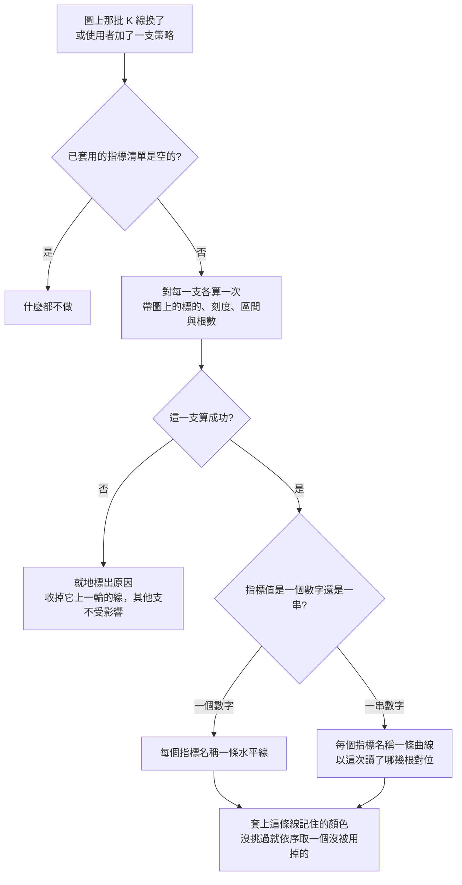

# Product Requirements Document (PRD)

**Feature:** 在 K 線圖表上套用策略
**Status:** Finalized
**Version:** v1.0
**Owner:** James Hsueh
**Stakeholders:** 前端（go-trading-frontend）

---

## 1. Background & Goal (Why & Goal)

- **Problem Statement:**
  策略算得出數字，但那些數字只出現在一張表上。看行情的人要知道的不是數字是多少，
  而是**它落在圖上的哪裡**——均線壓不壓著價格、支撐位離現在多遠。表格答不出這件事。

- **Expected Outcome:**
  在 K 線圖表上挑一支已存策略，系統立刻對眼前這段行情算一次並畫在同一張圖上；
  可同時疊多支，每條線的顏色自己挑；換標的、拉遠拉近會跟著重算，線永遠對得上 K 線。

- **Out of Scope:**
  - 在圖表上編輯或新增策略。
  - 是非類型的呈現（標記、背景色帶）。
  - 把已套用的清單存起來（只有顏色被記住）。
  - 線的粗細、線型、透明度；獨立副圖；線上的數值標籤。
  - 指標計算畫面的任何改動。

---

## 2. User Personas

- **Primary Role(s):** 看行情、並且自己寫策略的人（本專案作者本人）。
- **Usage Context:** 一邊拉動圖表一邊看指標怎麼跟著動；同一次瀏覽中會反覆換標的與粗細。

---

## 3. User Stories & Acceptance Criteria

### US-01 — 挑一支策略套上去 [priority: P0]

**As a** 看行情的人，**I want** 從已存策略中挑一支加到圖上，
**so that** 我不必再對著一張表自己想像那個數字在圖的哪裡。

```gherkin
Scenario: 挑一支就立刻算並畫出來
  Given 已套用的指標清單是空的
  And 有一支名為「二十根均線」的策略
  When 把「二十根均線」加進來
  Then 它出現在已套用的指標清單上
  And 系統立刻對圖上那批 K 線算了一次
  And 圖上出現它畫的線

Scenario: 可以同時疊好幾支
  Given 已套用「二十根均線」
  When 再加一支「布林上緣」
  Then 兩支都在已套用的指標清單上
  And 圖上同時有兩條線

Scenario: 已經套用的那一支不再出現在可挑清單裡
  Given 已套用「二十根均線」
  When 打開可挑的策略清單
  Then 「二十根均線」不在可挑的選項裡

Scenario: 移除一支就只移除它
  Given 已套用「二十根均線」與「布林上緣」
  When 移除「二十根均線」
  Then 已套用的指標清單上只剩「布林上緣」
  And 圖上只剩「布林上緣」那條線

Scenario: 一支都沒套用時圖表與先前完全一樣
  Given 一支策略都沒套用
  When 看圖表
  Then 圖上沒有任何指標的線

Scenario: 一支策略都還沒存過
  Given 系統裡一支策略都沒有
  When 打開可挑的策略清單
  Then 明說還沒有任何策略，而不是呈現一個空選單
```

### US-02 — 算的是眼前這張圖 [priority: P0]

**As a** 看行情的人，**I want** 指標永遠是用圖上那批 K 線算的，
**so that** 線與 K 線不會錯位——一條錯位的線看起來完全正常。

```gherkin
Scenario: 用圖上正在畫的那批 K 線去算
  Given 圖上畫的是 BTCUSDT、一小時的彙總刻度
  When 套用一支策略
  Then 這次計算以 BTCUSDT、一小時的彙總刻度、圖上那段時間執行

Scenario: 換交易標的時每一支都重算
  Given 已套用兩支策略
  When 把交易標的換成 ETHUSDT
  Then 兩支都以 ETHUSDT 重算一次
  And 圖上的線換成新算出來的

Scenario: 換到需要重新取 K 線的區間時重算
  Given 已套用一支策略
  When 拉遠到需要重新取一批 K 線
  Then 那一支以新的彙總刻度與新的區間重算一次

Scenario: 圖上那批 K 線沒換就不重算
  Given 已套用一支策略
  When 小幅拖動，圖上仍是手上那批 K 線
  Then 不發生任何計算

Scenario: 一支都沒套用時不發生任何計算
  Given 一支策略都沒套用
  When 換交易標的
  Then 不發生任何計算
```

### US-03 — 畫成什麼 [priority: P0]

**As a** 看行情的人，**I want** 一個數字畫成水平線、一串數字畫成跟著 K 線走的曲線，
**so that** 我一眼看得出它與價格的關係。

```gherkin
Scenario: 一個數字畫成水平線
  Given 一支產出一個數字 115、指標名稱為「均價」的策略
  When 套用它
  Then 圖上出現一條位置在 115 的水平線
  And 那條線標著「均價」

Scenario: 一串數字畫成跟著 K 線走的曲線
  Given 一支產出一串數字的策略，值的個數與圖上的 K 線根數相同
  When 套用它
  Then 圖上出現一條曲線
  And 第 n 個值畫在第 n 根 K 線的位置上

Scenario: 值比圖上的 K 線少時靠右對齊
  Given 一支產出一串數字的策略，值的個數比圖上的 K 線少
  When 套用它
  Then 最後一個值畫在最後一根 K 線上，往前逐一對回去
  And 最前面那幾根沒有點，不補值

Scenario: 一支算式產出好幾個指標名稱就畫好幾條線
  Given 一支一次產出「最高」與「最低」兩個名稱的策略
  When 套用它
  Then 圖上出現兩條各自獨立的線
  And 兩條線分別標著「最高」與「最低」

Scenario: 是非類型的策略挑不到
  Given 一支指標值種類為一個是非的策略
  When 打開可挑的策略清單
  Then 那一支被標明畫不出來
  And 它不能被挑選

Scenario: 一個指標名稱都沒產出不是失敗
  Given 一支一個指標名稱都沒放進結果的策略
  When 套用它
  Then 它在已套用的指標清單上，且沒有任何失敗說明
  And 圖上沒有它的線
```

### US-04 — 線的顏色自己挑 [priority: P0]

**As a** 看行情的人，**I want** 每條線的顏色由我決定且被記住，
**so that** 我不必每次重挑，也不會有兩條同色的線疊在一起。

```gherkin
Scenario: 剛套上去就已經分得出來
  Given 已套用的指標清單是空的
  When 連續套用三支各畫一條線的策略
  Then 三條線是三種不同的顏色，使用者一次都沒動手挑

Scenario: 換一條線的顏色只換那一條
  Given 已套用兩支各畫一條線的策略
  When 替第一條線挑另一個顏色
  Then 圖上第一條線立刻換成新顏色
  And 第二條線的顏色不變

Scenario: 這台瀏覽器記住挑過的顏色
  Given 替「二十根均線」的線挑了某個顏色
  When 重新打開畫面並再次套用「二十根均線」
  Then 那條線仍是上次挑的那個顏色

Scenario: 瀏覽器不讓存東西時照樣換色
  Given 這台瀏覽器不允許網站儲存資料
  When 替一條線挑另一個顏色
  Then 圖上那條線這一次照樣換成新顏色
  And 不出現任何錯誤

Scenario: 同一支策略畫出的兩條線是不同顏色
  Given 一支一次產出兩個指標名稱的策略
  When 套用它
  Then 那兩條線是不同的顏色

Scenario: 挑過的顏色即使已經被別條線用掉也照樣採用
  Given 某一條線挑過的顏色，剛好與圖上另一條線目前的顏色相同
  When 畫出那條線
  Then 它用的是挑過的那個顏色
```

### US-05 — 算不出來的時候 [priority: P0]

**As a** 看行情的人，**I want** 失敗就地說清楚且不影響其他指標，
**so that** 我知道要修哪一支，而不是整張圖壞掉。

```gherkin
Scenario: 算式跑不動時就地說明
  Given 一支算式跑不起來的策略
  When 套用它
  Then 那一支旁邊說明算式跑不動
  And 圖上沒有它的線

Scenario: K 線根數不足時就地說明
  Given 圖上的 K 線湊不出這支策略要的根數
  When 套用它
  Then 那一支旁邊說明湊不出足夠的根數

Scenario: 連不上系統時就地說明
  Given 系統連不上
  When 套用一支策略
  Then 那一支旁邊說明連不上

Scenario: 一支失敗不影響其他支
  Given 已套用兩支策略，其中一支會算失敗
  When 兩支都算過
  Then 失敗的那一支旁邊有說明且圖上沒有它的線
  And 另一支照常畫在圖上

Scenario: 失敗的那一支留在清單上並在下次重算時再試
  Given 一支算失敗的策略留在已套用的指標清單上
  When 換交易標的
  Then 它跟著重算一次
  And 算得出來時它的失敗說明消失、線出現在圖上

Scenario: 重算失敗時上一輪那條線要收掉
  Given 一支上一輪畫得出線的策略
  When 換交易標的後那一支重算失敗
  Then 圖上沒有它的線
  And 那一支旁邊有失敗說明
```

---

## 4. Business Flow & Logic



**Core Business Rules**

- **套用的單位是策略**，畫線的單位是**指標名稱**——一支策略可畫出好幾條線。
- **同一支策略不重複套用**；可挑清單排除已套用的那些。
- **是非類型不可套用**：可挑清單上標明並停用。
- **重算的觸發是「圖上那批 K 線換了」**，沿用系統既有的「要不要重新取」那個答案。
- **每一支各自成敗**：一支失敗只標在它自己旁邊，並收掉它上一輪的線。
- **顏色的身分是「策略＋指標名稱」**，記在這台瀏覽器上；沒挑過時依序取一個目前沒被用掉的；
  挑過的優先於避開重複。
- **一串數字以「這次讀了哪幾根」靠右對位**：最後一個值對最後一根。少掉的那幾個在最前面，因為滾動窗口的指標前幾根湊不滿窗口。
- **一個指標名稱都沒產出**是成功，不是失敗。

**Edge Cases**

- 圖上還沒有任何 K 線（系統沒起來、查無資料）→ 不發計算。
- 一串數字的個數與圖上的 K 線根數對不上 → 以「這次讀了哪幾根」**靠右**對位；
  值比 K 線少就是最前面幾根沒有點，值比 K 線多則多出來的那幾個落在頭部之外、不畫。

---

## 5. UI/UX Design & Interaction

- 圖表畫面的控制列多一塊「指標」：一個加入用的選單，加下面一份已套用清單。
- 已套用清單以策略為一列；該策略畫出的每一條線是其下的一行：
  顏色色票、指標名稱、換色的選單。策略層級有一顆移除鈕。
- 正在算的那一支先以「計算中」呈現；失敗說明就地標在該策略那一列。
- 算完但一條線都沒有時，明說「算完了但沒有東西可畫」，與失敗分開。
- 顏色從一組**固定的線色**裡挑，不是自由色票——它們要在深色底上都看得清楚。
- 已套用清單長起來時**自己捲**，不把圖擠掉——這個畫面是為了看圖而存在的。

---

## 6. Non-Functional Requirements

- **Performance:** 每次重算對每一支各發一次請求，並行送出；已套用的數量由使用者控制。
- **Security:** 無新增。顏色偏好只存在這台瀏覽器。
- **Compatibility:** 依賴系統回覆中的「這次讀了哪幾根」，一串數字才對得上 K 線。
- **Analytics / Tracking:** N/A。

---

## 7. Dependencies & Risks

- **External Dependencies:** 前一個切片（策略與執行參數分離）已完成，
  計算收得下彙總刻度、根數與算到哪一刻，並回覆這次讀了哪幾根。
- **Known Risks:**
  - 套用很多支時，一次重算會發出很多請求。個人專案、數量由使用者自己控制，可接受。
  - 一串數字的個數與圖上 K 線根數不一定相同（算式可能只回一部分）。
    以「這次讀了哪幾根」**靠右**對位是避免錯位的唯一方法——靠左對齊會讓滾動窗口的指標
    整條往左位移一個窗口，而那條線看起來完全正常。

---

## 8. Appendix

- 需求共識：`BRIEF.md`（同一資料夾）
- 前置切片：`.sdd/2026-09-03-strategy-execution-parameters/`
- 重算觸發沿用的既有決定：`.sdd/2026-09-02-k-candle-chart-view/`（不必重新取就不取）
- 通用語言：`.sdd/UL-MAP.md`
