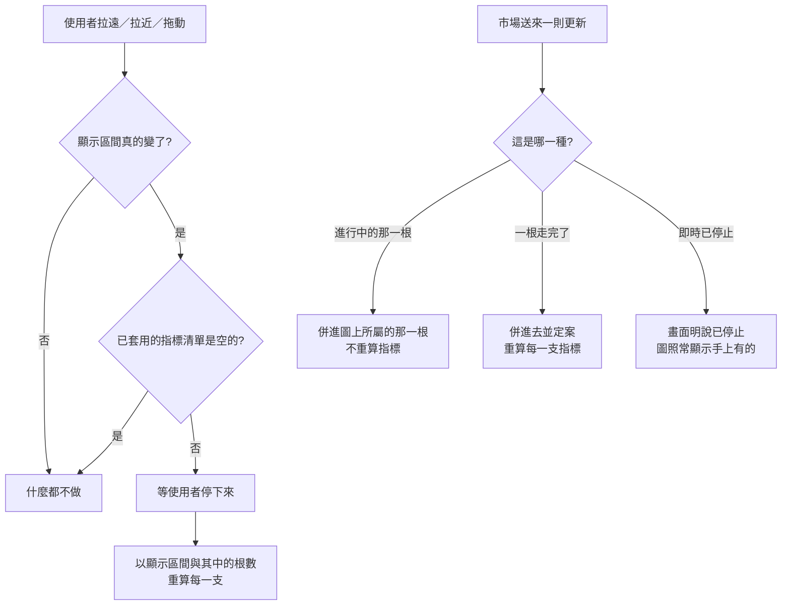

# Product Requirements Document (PRD)

**Feature:** 圖表跟著眼前這一刻走
**Status:** Finalized
**Version:** v1.0
**Owner:** James Hsueh
**Stakeholders:** 前端（go-trading-frontend）

---

## 1. Background & Goal (Why & Goal)

- **Problem Statement:**
  K 線圖表有兩處跟不上使用者眼前看到的東西。
  **指標算的不是他正在看的那一段**——拿去算的是手上那一整批 K 線（比顯示區間更寬），
  而且只在需要重新取資料時才重算，於是拉遠拉近數字幾乎不動。
  **圖本身五分鐘才動一次**——中間那五分鐘畫面靜止，市場卻已走完一整根。

- **Expected Outcome:**
  指標跟著顯示區間走：拉遠、拉近、拖動都重算，而且算的正是他看得見的那一段。
  圖跟著市場走：最後那一根隨成交跳動，一根走完就多出一根新的。
  兩者互不干擾，即時那一層壞掉時圖表其餘部分照常。

- **Out of Scope:**
  - 改變什麼時候要重新取一批 K 線（取資料的規則完全沿用）。
  - 把進行中 K 線算進指標。
  - 把進行中 K 線畫成不同樣子（虛線、半透明）。
  - 五分鐘以外的即時粒度；讓使用者調整更新快慢。
  - 把即時更新的歷史留下來；同時跟好幾個交易標的。
  - 指標線的顏色、粗細、線型。

---

## 2. User Personas

- **Primary Role(s):** 看行情、並且自己寫策略的人（本專案作者本人）。
- **Usage Context:**
  長時間開著同一個畫面盯著某一檔走勢，期間反覆拉遠拉近、左右拖動、換標的。
  市場全天無休，畫面可能一開就是好幾個小時。

---

## 3. User Stories & Acceptance Criteria

### US-01 — 指標算的是我正在看的那一段 [priority: P0]

**As a** 看行情的人，**I want** 指標跟著顯示區間走，
**so that** 它回答的是「我正在看的這一段裡發生了什麼」，而不是一段我沒在看的行情。

```gherkin
Scenario: 算的是顯示區間，不是手上那一整批
  Given 已套用一支「這段區間的最高價」的策略
  And 顯示區間是 09:00 到 12:00
  When 看那一支的指標
  Then 它算的是 09:00 到 12:00 這一段
  And 不是手上那批更寬的 K 線

Scenario: 拖到另一段就跟著重算
  Given 已套用一支「這段區間的最高價」的策略
  When 使用者把顯示區間拖到 06:00 到 09:00 並停下來
  Then 那一支以 06:00 到 09:00 重算
  And 圖上的最高價換成這一段的最高價

Scenario: 拉遠也重算
  Given 已套用一支策略
  When 使用者拉遠到一段更長的顯示區間並停下來
  Then 那一支以新的顯示區間與新的根數重算

Scenario: 還在動的時候不算
  Given 已套用一支策略
  When 使用者連續拖動、還沒停手
  Then 不發生任何計算
  And 停下來之後只算一次

Scenario: 一支都沒套用時不發生任何計算
  Given 一支策略都沒套用
  When 使用者拖動畫面
  Then 不發生任何計算

Scenario: 顯示區間沒真的變就不重算
  Given 已套用一支策略
  When 拖動後的顯示區間與上次完全相同
  Then 不重算——同一段區間算出來的必然一樣
```

### US-02 — 圖跟著市場走 [priority: P0]

**As a** 看行情的人，**I want** 最後那一根隨市場跳動，
**so that** 我看到的是現在的行情，而不是五分鐘前的。

```gherkin
Scenario: 成交價變了，最後那一根跟著變
  Given 畫面看的是 BTCUSDT
  When 市場成交價變成 118
  Then 圖上最後那一根的收盤價變成 118

Scenario: 更高的成交價推高那一根的最高價
  Given 最後那一根目前最高價是 120
  When 市場成交在 125
  Then 那一根的最高價變成 125

Scenario: 較低的成交價不會拉低最高價
  Given 最後那一根目前最高價是 120
  When 市場成交在 115
  Then 那一根的最高價仍是 120
  And 只有收盤價變成 115

Scenario: 一根走完，圖上多出一根新的
  Given 09:55 那一根走完了
  When 10:00 那一根開始
  Then 圖上多出一根 10:00 的新 K 線
  And 09:55 那一根不再變動

Scenario: 同一根被反覆更新時成交量不重複累加
  Given 最後那一根在十秒內被更新三次
  And 每次都報成交量 12
  When 三次都收到
  Then 那一根的成交量是 12
  And 不是 36

Scenario: 換交易標的就換跟的對象
  Given 正在看 BTCUSDT
  When 換成 ETHUSDT
  Then 圖跟著 ETHUSDT 動
  And 不再收到 BTCUSDT 的變動

Scenario: 離開畫面就不再跟
  Given 正在看 BTCUSDT
  When 離開這個畫面
  Then 不再跟任何交易標的
```

### US-03 — 更粗的刻度上，五分鐘的變動要併進所屬的那一根 [priority: P0]

**As a** 看行情的人，**I want** 看一小時一根時五分鐘的變動併進那一小時，
**so that** 圖上不會冒出一根不屬於這個刻度的 K 線。

```gherkin
Scenario: 併進所屬的那一根，不自成一根
  Given 畫面看一小時一根
  And 最後那一根是 10:00 那一小時
  When 10:25 那五分鐘的變動送到
  Then 併進 10:00 那一根
  And 圖上不會多出一根 10:25

Scenario: 併進去時最高價取兩者較高
  Given 10:00 那一根目前最高價是 120
  When 10:25 那五分鐘的最高價是 125
  Then 10:00 那一根的最高價變成 125

Scenario: 跨過邊界才多出新的一根
  Given 畫面看一小時一根
  And 最後那一根是 10:00 那一小時
  When 11:00 那五分鐘的變動送到
  Then 圖上多出 11:00 這一根新的

Scenario: 畫面看五分鐘一根時不需要併
  Given 畫面看五分鐘一根
  When 10:25 那五分鐘的變動送到
  Then 它直接就是圖上最後那一根
```

### US-04 — 進行中 K 線不影響指標 [priority: P0]

**As a** 看行情的人，**I want** 還沒走完的那一根不參與計算，
**so that** 同一支策略在同一個時間點不會有兩個答案。

```gherkin
Scenario: 進行中那一根的變動不觸發重算
  Given 已套用一支策略
  And 圖上最後那一根還在走
  When 那一根的價格變動了
  Then 不重算任何指標

Scenario: 一根走完時每一支都重算
  Given 已套用一支策略
  When 一根走完了
  Then 那一支重算一次

Scenario: 一支都沒套用時，一根走完也不發生計算
  Given 一支策略都沒套用
  When 一根走完了
  Then 不發生任何計算
```

### US-05 — 即時更新停掉的時候 [priority: P0]

**As a** 看行情的人，**I want** 即時停掉時畫面明說，
**so that** 我不會照著一張已經不動的圖做決定。

```gherkin
Scenario: 停止時明白說出來
  Given 正在看 BTCUSDT
  When 即時更新停止
  Then 畫面明說即時更新已停止

Scenario: 停止時圖照樣顯示手上有的
  Given 即時更新已經停止
  When 看圖
  Then 圖照樣顯示手上那批 K 線
  And 不清空、也不跳成錯誤畫面

Scenario: 恢復之後說明自己消失
  Given 即時更新停止過
  When 即時更新恢復
  Then 那個說明消失
  And 最後那一根繼續跟著動

Scenario: 即時完全不能用時圖表其餘照常
  Given 即時更新完全不能用
  When 使用圖表
  Then 查詢、換交易標的、換彙總刻度、套用與移除指標全部可用
  And 資料回到五分鐘才更新一次
```

---

## 4. Business Flow & Logic



**Core Business Rules**

- **指標的計算範圍是顯示區間**：起訖為顯示區間的兩端，根數為那一段裡的根數。
- **重算的觸發是「顯示區間變了」**，而不是「要不要重新取一批 K 線」。
  取資料的規則**完全沿用**，本切片不更動。
- **使用者還在動時不算**：停下來 **300 毫秒**才算一次。
- **顯示區間沒真的變就不算**——同一段區間算出來必然一樣。
- **圖上最後那一根跟著市場走**：最高取較高、最低取較低、收盤換成最新、成交量加上新增的部分；
  **同一根反覆更新不重複累加成交量**。
- **五分鐘的變動併進它所屬的那一根**，由畫面正在看的彙總刻度決定歸屬；跨過邊界才多一根。
- **進行中 K 線只給人看**：不參與任何指標計算，因此它的變動**不觸發重算**。
- **一根走完要重算**——那一刻指標可用的資料真的多了一根；五分鐘才一次，不必節流。
- **即時停掉時圖不清空**，但**必須明說**。
- **較新的那一次勝出**：重算與重算若撞在一起（例如一根剛走完、使用者同時在拖動），
  只採用最新那一次的結果，不是兩者都畫。

**Edge Cases**

- 顯示區間拉得極遠 → 那一段裡的根數受畫面可讀上限約束（一段裡最多四百根還看得清楚，
  彙總刻度本來就是照這個上限挑的），因此不會超過單次查詢的上限。
- 圖上還沒有任何 K 線 → 不發計算，也沒有最後那一根可以更新。
- 即時更新送來的那一根不屬於畫面目前的交易標的 → 不採用。

---

## 5. UI/UX Design & Interaction

- **即時更新已停止**的說明放在圖表上方的狀態列，與載入中、錯誤訊息同一處，**不遮住圖**。
- 進行中 K 線在圖上**就是最後那一根**，不另外標示——它與其他 K 線的差別是語意上的，
  不是視覺上的。
- 重算指標時沿用既有的「計算中」呈現；不因為變頻繁而新增任何閃爍或動畫。

---

## 6. Non-Functional Requirements

- **Performance:**
  拖動與縮放期間不發出任何計算；停下來 **300 毫秒**後才發一次。
  即時更新每則只改圖上最後那一根，不重畫整張圖、不重算指標。

- **Security:** 無新增。不儲存任何東西。

- **Compatibility:**
  依賴系統那頭持續送出更新的能力。該能力不可用時，圖表其餘部分完全不受影響。

- **Analytics / Tracking:** N/A。

---

## 7. Dependencies & Risks

**External Dependencies:**

- **系統持續送出行情更新的能力** —— 由前一個系統切片提供：
  它在有人看某個交易標的時持續送出該市場的更新，每則說明這一根是**還在走**、
  **走完了**、還是**即時已停止**，送出的一律是五分鐘一根。

**取代前一個切片的決定：**

本切片**取代** `.sdd/2026-09-03-chart-indicator-overlay/` 的兩條驗收條件：

| 被取代的條款 | 原本怎麼寫 | 為什麼不夠 |
| :--- | :--- | :--- |
| 該切片 US-02「換到需要重新取 K 線的區間時重算」 | 重算掛在「要不要重新取一批 K 線」上 | 它讓「拉遠拉近」多數時候完全不重算 |
| 該切片 US-02「圖上那批 K 線沒換就不重算」 | 理由是「同一批資料算出來必然相同」 | 那句話只對**吃固定根數的滾動指標**成立。二十期均線看的是最後二十根，往左看不改變那二十根是哪二十根；但**一段區間內的極值**換一段就該變。把一條只對某類指標成立的性質當成通則，另一類指標就會看起來壞掉——數字停著，而且不會有任何地方報錯 |

新的規則是：**重算的觸發是顯示區間變了**，而「不重算」的條件收窄為
**顯示區間真的沒變**（而不是「那批資料沒換」）。

**Known Risks:**

- **重算會變頻繁。** 從「換標的才算」變成「每次停下來就算」。以停手 300 毫秒節流，
  且顯示區間沒真的變就不算，因此代價可控；同時掛著幾支由使用者自己決定。
- **兩種重算可能撞在一起**（一根剛走完、使用者同時在拖動）。以「較新的那一次勝出」化解，
  這是圖表與指標既有的做法，不是新機制。
- **併進更粗的那一根是畫面自己算的。** 系統那頭給的一律是五分鐘一根，
  合併結果與系統下次回覆的彙總 K 線理論上應一致；若不一致，
  下一次重新取資料就會蓋過去，因此偏差不會累積。

---

## 8. Appendix

- 需求共識：`BRIEF.md`（同一資料夾）
- 被取代的決定：`.sdd/2026-09-03-chart-indicator-overlay/`
- 取資料的規則（本切片不動）：`.sdd/2026-09-02-k-candle-chart-view/`
- 系統那頭的即時能力：go-trading 的 `.sdd/2026-09-03-live-k-candle-stream/`
- 通用語言：`.sdd/UL-MAP.md`
