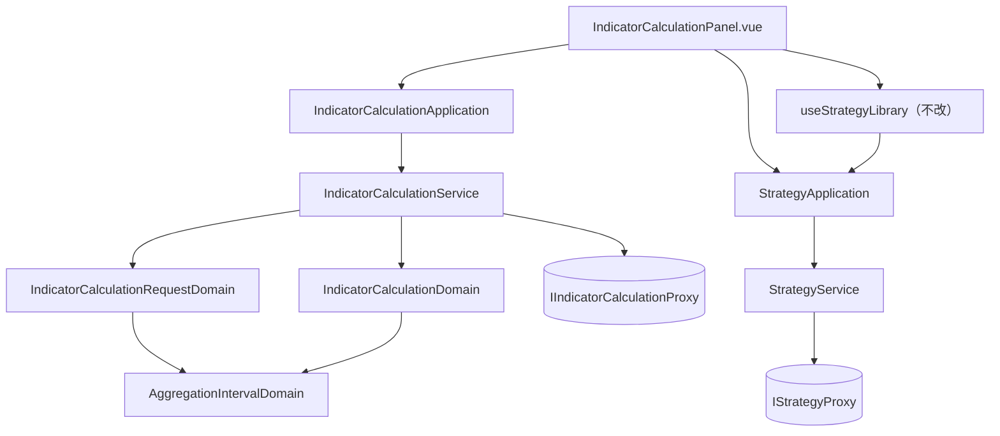

# 策略與執行參數分離（操作介面） — Architecture Design

**Status:** Confirmed
**Source PRD:** `.sdd/2026-09-03-strategy-execution-parameters/PRD.md`
**Tech context:** Nuxt 3 · TypeScript · Clean / Onion（`.vue` = Controller、無 Repository、對外一律 Proxy）

---

## 1. Design Goal & Guiding Principle

- **In one sentence:**
  把彙總刻度與計算根數從 `StrategyContentDto`（策略記著的東西）搬到
  `IndicatorCalculationRequestDto`（這一次執行的東西），並讓結果帶回系統回報的刻度。

- **Guiding principle:**
  **讓 `StrategyContentDto` 縮小，其餘的行為自己就對了。**

  這個切片看起來有三條獨立的規則（載入不覆蓋執行設定、改刻度不算未儲存的變更、
  儲存時不寫進去），但它們其實是同一件事的三個面向：
  那個 DTO 同時是「載入時帶進畫面的」「儲存時送出去的」「拿來比對有沒有改過的」——
  這是它現有註解就寫明的設計。**把它從四欄縮成兩欄，三條規則同時成立**，
  而管理未儲存狀態的 `useStrategyLibrary` 一行都不必改。

  若改成保留四欄、再在三處各加一個「這兩欄不算」的例外，就會有三個各自會漂移的地方，
  而漏掉任何一個的徵狀是靜靜蓋掉使用者寫的東西。

- **第二原則：一個刻度字串該怎麼被讀，只能有一份。**
  目前這條規則唯一的家是 `StrategyDomain` 裡的私有方法 `aggregationInterval()`——
  它把系統給的字串對上認得的那五種，認不得就退回最細的。
  本切片把它從策略身上拿掉，但這條規則現在有**兩個**需要它的地方
  （送出前的請求、收回來的結果標籤），所以它不會被複製兩份，
  而是升成一個 Domain Model：`AggregationIntervalDomain`，
  形狀完全比照既有的 `IndicatorResultTypeDomain`——
  同一個問題已經在這個 codebase 裡被解過一次，第二次不該長得不一樣。

---

## 2. Change Scope

| Area | Action | What / Why |
| :--- | :--- | :--- |
| `domain/models/domains/aggregation-interval-domain.ts` | **Add** | 一個彙總刻度，以及別人需要知道的關於它的一切（值、給人看的名字、選項形狀）。比照 `IndicatorResultTypeDomain` |
| `domain/models/dto/strategy-content-dto.ts` | **Modify** | **本切片的支點**：四欄縮成兩欄（算式內容、指標值種類） |
| `domain/models/entities/strategy.ts` | **Modify** | 移除 `aggregationInterval`、`candleCount` |
| `domain/models/domains/strategy-domain.ts` | **Modify** | 移除私有的 `aggregationInterval()`——規則搬進新的 Domain Model，且策略不再需要它 |
| `domain/models/domains/strategy-write-domain.ts` | **Modify** | 不再攜帶那兩樣 |
| `domain/models/domains/strategy-draft-domain.ts` | **Modify** | 少比兩欄。**不是順手簡化**——多比一欄就會為不屬於策略的東西跳確認 |
| `infrastructure/proxy/strategy-proxy.ts` | **Modify** | wire 型別與送出的 body 各去掉兩個欄位 |
| `domain/service/strategy-service.ts`／`application/strategy-application.ts` | **Modify** | 移除 `listAggregationIntervalOptions` / `defaultAggregationInterval` / `defaultCandleCount`——它們描述的是一次計算，不是一支策略 |
| `domain/models/dto/indicator-calculation-request-dto.ts` | **Modify** | 新增 `aggregationInterval` |
| `domain/models/domains/indicator-calculation-request-domain.ts` | **Modify** | 以 `AggregationIntervalDomain` 讀它並攜帶 |
| `infrastructure/proxy/indicator-calculation-proxy.ts` | **Modify** | body 多送刻度；wire 多收系統回報的刻度 |
| `domain/models/entities/indicator-calculation.ts` | **Modify** | 新增 `interval`——**系統回報的**那一個，不是送出時挑的 |
| `domain/models/domains/indicator-calculation-domain.ts` | **Modify** | 把回報的刻度翻成給人看的名字放進 DTO |
| `domain/models/dto/indicator-calculation-result-dto.ts` | **Modify** | 新增 `intervalLabel` |
| `domain/service/indicator-calculation-service.ts`／`application/indicator-calculation-application.ts` | **Modify** | 接手那三個「一次計算的預設與選項」方法 |
| `components/organisms/IndicatorCalculationPanel.vue` | **Modify** | 兩個欄位改由自己的 ref 持有（不再進出策略內容）；兩句說明改寫；結果列多一項 |
| `composables/use-strategy-library.ts` | **Not touched** | 它只認識 `StrategyContentDto`；那個形狀變小了，它一行都不必改。**這是支點選對了的證據** |
| `domain/interface/i-indicator-calculation-proxy.ts` | **Not touched** | 契約形狀不變（仍收已驗證的請求 Domain Model） |
| **結果的「這次讀了哪幾根」與「算到哪一刻」** | **Not touched** | 系統會回、也收得下，但這個畫面沒有人要用。等圖表那一邊有理由再收 |
| **圖表畫面** | **Not touched** | 本切片一行都不動它 |

---

## 3. New Classes / Modules

| Name | Kind | Responsibility (purpose) | Collaborators | Satisfies (PRD scenario) |
| :--- | :--- | :--- | :--- | :--- |
| `AggregationIntervalDomain` | Domain Model | 一個彙總刻度：把宣告的字串讀成認得的那五種之一（認不得退回最細的），並說得出它給人看的名字與選項形狀 | `AGGREGATION_INTERVALS`（VO）、`AggregationIntervalOptionDto` | US-04 全部、US-05 全部 |

**深度檢查。** 它的介面是「餵一個字串進去，問它三件事（值、名字、選項）」——
呼叫端不必依序做任何事，沒有 And/Then 式的方法名，參數只有一個且不會成長。
內部藏起來的是「認得哪五種、比對時要不要管大小寫與空白、認不得時退到哪裡」。

**為什麼它是 Domain Model 而不是一個匯出函式。**
它有狀態（就是那個刻度）、有行為（讀取、命名），而且要被 `new` 出來當值傳遞。
寫成 `normalizeInterval(declared: string)` 這種匯出函式，
就是 `utils.ts` 的第一步，而且會讓「認不得就退回最細」這條規則沒有一個明確的家。

**為什麼不新增別的類別。**
其餘全部是既有型別的欄位增減。特別是**沒有**替「執行設定」新開一個
`ExecutionSettingsDto`：那三樣（交易標的、彙總刻度、計算根數）已經全部住在
`IndicatorCalculationRequestDto` 裡了，再包一層只是多一個要拆的信封。

---

## 4. Modified Components

| Component | Current role | Change needed |
| :--- | :--- | :--- |
| `StrategyContentDto` | 策略記著的四樣，同時是載入、儲存與比對的唯一形狀 | 剩兩樣。US-01／US-02／US-03 三組 AC **全部由它縮小推導出來** |
| `StrategyDraftDomain` | 比對載入當下與現在 | 少比兩欄——不是簡化，是把比對範圍收回策略真正記著的範圍 |
| `IndicatorCalculationRequestDomain` | 一次計算的請求，建構即驗證 | 多讀一個彙總刻度。刻度**不做合法性拒絕**（使用者從清單挑，挑不出非法值）；認不得退回最細，與既有的種類處理一致 |
| `IndicatorCalculation`（entity） | 一次計算的結果本體 | 多一個 `interval`。**存系統回報的那一個**，理由與既有的 `resultType` 一字不差：照回報的呈現才不會說謊——US-05 的整個意義就在這裡 |
| `IndicatorCalculationService` | 指標計算的編排 | 接手三個「一次計算的預設與選項」方法。搬家的判準是「這個問題屬於誰」：一次計算要吃多粗，不是一支策略的事 |
| `IndicatorCalculationPanel.vue` | 指標計算這一整塊 | 兩個 ref 不再進出 `StrategyContentDto`；刻度選項改問指標計算那一側；兩句過期的說明改寫；結果列多一項 |

---

## 5. Component Relationships

`AggregationIntervalDomain` 是**送出去與收回來共用**的那一份解讀規則。

---

## 6. Extensibility & Handoff Notes

- **Most likely next requirement:** 在 K 線圖表上套用一支策略、把值畫出來。
  （`2026-09-03-strategy-library` 的 ARCH 已經預言過這一步，只是當時說的是「一鍵執行」。）
- **Where it lands:**
  - `IndicatorCalculationRequestDto` 再多一個「算到哪個時間為止」——圖表會傳它畫得到的右緣。
  - `IndicatorCalculation` 與其 DTO 再多收系統已經在回的「這次讀了哪幾根」，
    一串值才對得回 K 線。
  - 兩者都是**加欄位**，不動任何既有規則。本切片刻意不先加：沒有呼叫端的欄位沒有測試能釘住。
- **How to add it:** 新的 organism／molecule 與一個 composable 管「已套用的指標」狀態，
  圖表元件多收一個 prop。**不要**把它塞進 `IndicatorCalculationPanel`。
- **Patterns applied & why:** 沒有套用任何具名模式。
  唯一的結構性動作是**把一個私有方法升成一個 Domain Model**，讓第二個呼叫端得以共用同一份規則——
  這是消除重複，不是加一層抽象。多一種彙總刻度仍然只要在 `AGGREGATION_INTERVALS` 加一列。
- **Do not hardcode:**
  - 彙總刻度的清單與預設一律問 `AGGREGATION_INTERVALS` / `AggregationIntervalDomain`，
    **元件內不得再出現任何刻度字串**。
  - 結果上顯示的刻度一律用系統**回報**的那一個，不得改用送出時挑的那一個——
    兩者一旦被畫面當成同一件事，US-05 的整個意義就沒了。
- **Known debt / deferred:**
  - 系統回的「這次讀了哪幾根」目前被丟棄。**回頭處理的訊號**：圖表切片開工。
  - 彙總刻度真的生效使同一支策略以相同根數執行會得到與先前不同的數字。
    靠結果列上寫出刻度讓它看得見，不另做遷移提示。

---

## 7. Traceability

| PRD Scenario | Fulfilled by |
| :--- | :--- |
| US-01 另存為新策略時只存下算法 | `StrategyContentDto` 縮小 + `StrategyWriteDomain` + `StrategyProxy` 的 body |
| US-01 載入一支策略帶進來的只有算法 | `StrategyDomain.toDto` |
| US-01 讀回一支策略時沒有取數計畫可讀 | `Strategy`（entity）+ `StrategyProxy` 的 wire 型別 |
| US-02 載入策略不動彙總刻度與計算根數 | `IndicatorCalculationPanel.vue` 的 `applyContent` 只寫兩個 ref |
| US-02 載入策略不動交易標的 | 既有行為（不改） |
| US-02 開一份新的空白策略也不動執行設定 | 同上（`blankStrategyContent` 也只有兩欄） |
| US-03 改動彙總刻度／計算根數不算未儲存的變更 | `StrategyDraftDomain` 只比兩欄 |
| US-03 改動算式內容／指標值種類算未儲存的變更 | 同上（保留的那兩欄） |
| US-03 還沒載入過任何策略且算式空白時不問 | `StrategyDraftDomain` 既有規則（不改） |
| US-04 以挑選的粗細執行計算／挑最細的那一種 | `IndicatorCalculationRequestDomain` + `IndicatorCalculationProxy` 的 body |
| US-04 什麼都沒挑就是五分鐘 | `AggregationIntervalDomain` 的讀取 + `IndicatorCalculationService.defaultAggregationInterval` |
| US-04 那句道歉的話不再出現 | `IndicatorCalculationPanel.vue` 的欄位說明 |
| US-05 結果寫出這次採用的彙總刻度／最細的那一種也照樣寫 | `IndicatorCalculation.interval` → `IndicatorCalculationDomain` → `IndicatorCalculationResultDto.intervalLabel` |
| US-05 寫的是系統回報的刻度 | 同上（entity 存的就是回報的那一個） |
| US-05 一個指標都沒算出來時照樣寫得出粗細 | 同上（與 `indicatorValues` 無關） |
| US-05 計算失敗時沒有粗細可說 | `IndicatorCalculationPanel.vue` 既有的「失敗就不呈現結果」（不改） |
| US-06 說明講的是走完的那幾格／不再說排除最新一根 | `IndicatorCalculationPanel.vue` 的計算說明 |
| US-07 存回／名稱被佔用／算式跑不起來／認不出外框 | 既有元件與既有錯誤分流，均不改動 |

---

## 8. Risks & Open Decisions

- **Risks / trade-offs:**
  - **依賴後端先部署。** 舊的系統端會拒絕少了兩個欄位的策略請求形狀。個人專案、兩邊一起更新，可接受。
  - `AggregationIntervalDomain` 與既有的 `AggregationIntervalVo` 名字只差一個後綴。
    這正是命名規範要的樣子（VO 是值、Domain Model 帶行為），但讀 import 時要看清楚。
  - 刻度**不做合法性拒絕**（認不得就退回最細）。使用者從清單挑，挑不出非法值；
    真正會給出陌生字串的是系統那頭，而讓整個結果畫面因此壞掉遠比退回預設更糟。

- **Open decisions (for implementation):**
  - 結果列上的刻度以**給人看的名字**呈現（「一小時」），不呈現代號（`1h`）——
    與既有的指標值種類一致，翻譯屬於領域。
  - 計算說明改寫成「只採用已經走完的那幾格」，與 UL-MAP 上「計算不採用的範圍」那一列一致。
