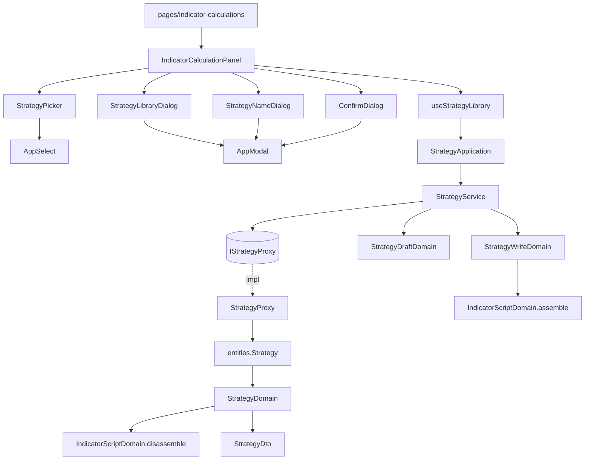

# 策略庫 — Architecture Design

**Status:** Confirmed
**Source PRD:** `.sdd/2026-09-03-strategy-library/PRD.md`
**Tech context:** Nuxt 3 · Vue 3 · TypeScript(strict) · SCSS · Clean Architecture（元件 → Application → Domain ← Proxy）

---

## 1. Design Goal & Guiding Principle

- **In one sentence:**
  讓指標計算這一頁能挑、存、另存、列、刪一支策略，全程不換頁，
  且**絕不弄丟使用者寫到一半的算式**。

- **Guiding principle:**
  **「一支策略記的四樣東西」只有一種形狀。**
  算式內容、指標值種類、彙總刻度、計算根數這四樣，在四個地方被用到——
  載入時帶進畫面、儲存時送出去、判斷有沒有被改過、以及（下一個切片）拿去執行計算。
  四處各自定義一份，就有四份會漂移的複本；因此它們共用一個 `StrategyContentDto`，
  「有沒有改過」也就退化成兩個同型別物件的比對，而不是四個欄位的手工對照。

  第二條原則：**外框的知識只有一個家。**
  存進後端的是完整算式，帶回畫面要拿掉外框。`IndicatorScriptDomain` 現在多一個
  `disassemble()`，與既有的 `assemble()` 並排——它的檔案註解說「這是全前端唯一產生算式文字的地方」，
  把逆運算放進同一個檔案，這條就仍然成立，外框改了兩邊在同一個檔案裡一起改。

---

## 2. Change Scope

| Area | Action | What / Why |
| :--- | :--- | :--- |
| `domain/models/entities/strategy.ts` | **Add** | `Strategy`——乾淨資料模型（含後端原樣的完整 `script`）+ `toDomain()` |
| `domain/models/domains/strategy-domain.ts` | **Add** | `StrategyDomain`——把完整算式拆回內容、產出 `StrategyDto` |
| `domain/models/domains/strategy-write-domain.ts` | **Add** | `StrategyWriteDomain`——存檔前的不變式（名稱非空）與「內容包回外框」 |
| `domain/models/domains/strategy-draft-domain.ts` | **Add** | `StrategyDraftDomain`——回答「畫面上的東西跟載入時比有沒有改過」 |
| `domain/models/domains/indicator-script-domain.ts` | **Modify** | 新增 `disassemble()`（見 §4）。既有的 `assemble()`／`frameHeader()`／範例內容一行不動 |
| `domain/models/dto/strategy-content-dto.ts` | **Add** | **四樣東西的唯一形狀**——載入、存檔、比對、未來執行計算全部共用 |
| `domain/models/dto/strategy-dto.ts` | **Add** | 一支策略離開 domain 的形狀：識別碼、名稱、內容，外加**外框認不認得出來** |
| `domain/models/dto/strategy-write-dto.ts` | **Add** | 存檔的輸入形狀：名稱＋內容（＋識別碼，沒有就是新增） |
| `domain/models/dto/aggregation-interval-option-dto.ts` | **Add** | 彙總刻度選單上的一個選項，比照 `IndicatorResultTypeOptionDto` |
| `domain/errors/strategy-field-error.ts` | **Add** | 欄位層級的拒絕（目前只有名稱），比照 `IndicatorCalculationFieldError` |
| `domain/errors/strategy-name-conflict-error.ts` | **Add** | 名稱已被使用——與「內容不合規則」是兩件事 |
| `domain/errors/strategy-not-found-error.ts` | **Add** | 找不到那一支——與「內容不合規則」是兩件事 |
| `domain/interface/i-strategy-proxy.ts` | **Add** | `IStrategyProxy`——策略這個資源的全部端點收在一起 |
| `domain/service/strategy-service.ts` | **Add** | `StrategyService`——公開用例互不呼叫 |
| `domain/models/vo/aggregation-interval-vo.ts` | **Modify** | **只改註解**：它原本寫「使用者不直接選它」，策略這邊使用者會直接選。取值與清單一行不動 |
| `application/strategy-application.ts` | **Add** | `StrategyApplication`——轉呼叫，全程只碰 DTO |
| `infrastructure/proxy/strategy-proxy.ts` | **Add** | `StrategyProxy`——五個端點；`409`／`404` 在這一層翻成領域錯誤 |
| `composables/use-strategy-library.ts` | **Add** | 策略在這個畫面上的**畫面狀態**：清單、使用中那一支、載入當下的快照、哪個對話框開著、進行中旗標 |
| `components/atoms/AppModal.vue` | **Add** | 覆蓋層＋面板＋關閉。**專案目前沒有任何對話框元件**。原子，不認識 DTO |
| `components/molecules/ConfirmDialog.vue` | **Add** | 「再問一次」——刪除與放棄未存變更**共用同一個**，不是兩個元件 |
| `components/molecules/StrategyPicker.vue` | **Add** | 挑策略的選單＋目前使用中是哪一支＋一支都沒有時的說法 |
| `components/molecules/StrategyNameDialog.vue` | **Add** | 只問名稱的對話框，含就地顯示的錯誤 |
| `components/molecules/StrategyLibraryDialog.vue` | **Add** | 完整清單＋逐列載入／刪除。**是 molecule 不是 organism**——見 §4 |
| `components/organisms/IndicatorCalculationPanel.vue` | **Modify** | 接上以上元件與 composable；既有的計算流程一行不動 |
| `pages/indicator-calculations/index.vue` | **Modify** | 多注入一個 Application |
| `plugins/dependencies.ts` | **Modify** | 多組一條 proxy → service → application |
| 指標計算的既有行為（`IndicatorCalculationRequestDomain`、計算按鈕、結果呈現） | **Not touched** | 不挑任何策略時，這一頁的用法與這個切片之前完全一致 |
| K 線、圖表、交易標的、時區 | **Not touched** | 與策略無關 |

---

## 3. New Classes / Modules

| Name | Kind | Responsibility (purpose) | Collaborators | Satisfies (PRD scenario) |
| :--- | :--- | :--- | :--- | :--- |
| `entities.Strategy` | Entity | 後端那一支策略的原樣：識別碼、名稱、**完整算式**、種類、刻度、根數、兩個時間。只有欄位與 `toDomain()` | `StrategyDomain` | （全部讀取情境） |
| `domains.StrategyDomain` | Domain Model | 一支策略對畫面的樣子：把完整算式**拆回內容**，並說明外框認不認得出來 | `IndicatorScriptDomain`、`StrategyDto` | 載入時拿掉外框／縮排原樣／認不出外框整段原樣帶入 |
| `domains.StrategyWriteDomain` | Domain Model | 存檔前的不變式：名稱去空白後非空；**內容包回外框**成為要送出的完整算式。名稱長度**不檢查**——那是後端的規則 | `IndicatorScriptDomain`、`StrategyWriteDto` | 名稱沒填／一趟來回不長不掉 |
| `domains.StrategyDraftDomain` | Domain Model | 只回答一個問題：畫面上的四樣東西與載入當下的那一份**是不是同一份**。沒有載入過任何一支時，只要內容非空就算有東西可弄丟 | `StrategyContentDto` | 有未儲存變更時先確認／沒改過就不問／沒有使用中策略但已寫了東西 |
| `dto.StrategyContentDto` | DTO | **四樣東西的唯一形狀**。載入帶進畫面、存檔送出去、比對有沒有改過，三處共用同一個型別。種類與刻度收字串而非窄型別——這個形狀是雙向的，畫面上的選單天生交出字串，硬要窄型別只會在畫面上多一個編譯器檢查不了的斷言；把關由 domain 負責 | — | （幾乎全部） |
| `dto.StrategyDto` | DTO | 一支策略離開 domain 的形狀：識別碼、名稱、`StrategyContentDto`、`frameRecognised` | `StrategyContentDto` | 挑策略全部帶入／清單依名稱排列 |
| `dto.StrategyWriteDto` | DTO | 存檔輸入：名稱＋`StrategyContentDto`＋可選識別碼。**識別碼有無決定是更新還是新增** | `StrategyContentDto` | 儲存存回那一支／沒有使用中時等同另存 |
| `dto.AggregationIntervalOptionDto` | DTO | 彙總刻度選單的一個選項（代號＋中文） | — | 挑刻度／沒挑就是五分鐘 |
| `errors.StrategyFieldError` | Sentinel error | 欄位層級、使用者自己改得掉的（目前只有名稱沒填） | — | 名稱沒填 |
| `errors.StrategyNameConflictError` | Sentinel error | 名稱已被使用。**單獨一種**，才能就地標在名稱欄旁而不是整塊報錯 | — | 名稱重複就地說明、不關閉、不清空 |
| `errors.StrategyNotFoundError` | Sentinel error | 找不到那一支。**單獨一種**，才能與「內容不合規則」分開呈現 | — | 使用中的那一支已被刪掉 |
| `interface.IStrategyProxy` | Interface | 策略這個資源的全部端點：`listStrategies`／`createStrategy`／`updateStrategy`／`deleteStrategy` | `Strategy` | （全部） |
| `StrategyProxy` | Proxy | 打後端五條路由，把 wire 收成 entity，並把 `409`／`404` 翻成領域錯誤。**狀態碼只在這一層被解讀** | `BackendApiProxy` | 名稱重複／找不到／連不上 |
| `service.StrategyService` | Domain Service | application 的唯一入口，公開用例互不呼叫：列出、儲存、刪除、判斷有沒有改過、列出刻度選項 | `IStrategyProxy`、上述 Domain Model | （全部） |
| `application.StrategyApplication` | Application | 轉呼叫，全程只碰 DTO | `StrategyService` | （全部） |
| `useStrategyLibrary()` | Composable | 策略在這個畫面上的**畫面狀態**：清單、使用中那一支、載入當下的快照、開著哪個對話框、進行中旗標。**不做任何業務判斷**，一律問 Application | `StrategyApplication` | （全部互動情境） |
| `AppModal` | Atom | 覆蓋層＋面板＋關閉。不認識任何領域概念 | — | 清單／取名／確認三處共用 |
| `ConfirmDialog` | Molecule | 「這件事要再問一次」。**刪除與放棄未存變更共用同一個** | `AppModal` | 刪除前確認／覆蓋前確認 |
| `StrategyPicker` | Molecule | 挑一支策略；顯示目前使用中；一支都沒有時明說 | `AppSelect`、`StrategyDto` | 挑策略／一支都沒有 |
| `StrategyNameDialog` | Molecule | 只問名稱；錯誤就地顯示、不關閉、不清空 | `AppModal`、`AppInput` | 另存只問名稱／名稱沒填／名稱重複 |
| `StrategyLibraryDialog` | Molecule | 完整清單，逐列載入與刪除；空清單與連不上分開呈現 | `AppModal`、`AppButton`、`StrategyDto` | 從清單載入／依名稱排列／清單為空／打開清單時連不上 |

> **深度檢查。** 元件要完成任何一個業務動作都只需要**一次**呼叫：
> 存檔是 `saveStrategy(writeDto)`，不是「先判斷有沒有使用中 → 再決定呼叫新增還是更新」；
> 「該不該問使用者」是 `hasUnsavedChanges(...)` 一次問完，不是元件自己比四個欄位。
> 元件裡沒有任何關於「怎麼做」的條件判斷，只有「使用者按了什麼」與「畫面怎麼呈現結果」。

---

## 4. Modified Components

| Component | Current role | Change needed |
| :--- | :--- | :--- |
| `IndicatorScriptDomain` | 全前端唯一產生算式文字的地方：外框頭尾、範例內容、`assemble()` | 新增 `disassemble(script)`（見下） |
| `AggregationIntervalVo` | 圖表的彙總刻度，註解寫「使用者不直接選它」 | **只改註解**：策略這邊使用者會直接選。取值、清單、順序一行不動 |
| `IndicatorCalculationPanel` | 指標計算這一整塊 | 上方接 `StrategyPicker`，工具列接儲存／另存／開清單；掛上三個對話框。**既有的計算流程與結果呈現一行不動** |
| `pages/indicator-calculations/index.vue` | 只做接線 | 多取一個 `$strategyApplication` 往下傳 |
| `plugins/dependencies.ts` | 組裝根 | 多組一條 |

### `disassemble()` 怎麼做，以及為什麼這樣做

**錨定結構，不比對外框文字。** 找出 `func Calculate` 開頭那一行當起點、最後一個 `}` 當終點，
中間退一層縮排。**不逐字比對外框**——那樣的話外框日後多一個匯入，所有舊策略就全部認不出來了。

**認不出來就整段原樣交還**，並讓 `StrategyDto.frameRecognised` 為 `false`。
畫面據此告知使用者「這一支看起來不是在這裡寫出來的」。
**絕不硬拆**：寧可讓使用者看到多了幾行、自己刪掉，也不能靜靜把程式碼剪壞——
後者使用者可能過很久才發現，而那時原稿已經沒了。

**它與 `assemble()` 放在同一個檔案**，這是刻意的：那個檔案的註解說「這是全前端唯一產生算式文字的地方」，
逆運算放進同一個檔案，這條規則就仍然成立。外框改了，兩邊在同一個畫面裡一起改，
不可能只改一半。**兩者互為往返**——ARCH 要求的驗收之一就是「載入後不改任何東西再存回去，算式完全相同」。

### `StrategyLibraryDialog` 為什麼是 molecule 而不是 organism

它看起來夠大，像個獨立區塊。但它只會被 `IndicatorCalculationPanel`（organism）用，
而專案的組合規則是「**有機體只能組合原子與分子**」。做成 organism 會讓一個 organism 依賴另一個 organism，
違反那條規則的用意。它組合的東西（`AppModal`、`AppButton`）也確實都是原子，
且只認識 `StrategyDto`——分子本來就可以認識 DTO。

### 為什麼多一個 composable

`IndicatorCalculationPanel` 已經不小。策略帶來的**畫面狀態**（清單、使用中那一支、載入快照、
三個對話框的開關、三個進行中旗標）如果全部塞進 panel 的 `<script setup>`，
那一段會變成整個專案最長的一塊。`useStrategyLibrary()` 把這些收在一起，
panel 只剩「使用者按了什麼」的接線。

**它不做任何業務判斷**——「有沒有改過」「要不要問」「這次是新增還是更新」全部問 Application。
它持有的是狀態，不是規則。（規範允許：快取／重新整理策略寫在 Application 或 composable，不寫進 Domain。）

---

## 5. Component Relationships



**載入一支策略的呼叫鏈**

```
StrategyPicker 選了一支
  → useStrategyLibrary 先問 StrategyApplication.hasUnsavedChanges(快照, 畫面現值)
      → 有 → 開 ConfirmDialog，使用者說不要就到此為止
  → 把那一支的 StrategyContentDto 交給 panel 灌進四個欄位
  → 記下這一份為新的快照，並記下使用中的是哪一支
```

**存檔的呼叫鏈**

```
按儲存
  → 有使用中的策略 → StrategyApplication.saveStrategy(帶識別碼的 StrategyWriteDto)
  → 沒有            → 開 StrategyNameDialog → 填完 → saveStrategy(不帶識別碼)
      → StrategyWriteDomain 驗名稱、把內容包回外框
      → StrategyProxy 依識別碼有無決定 PUT 或 POST
      → 成功：更新使用中那一支與快照；失敗：畫面內容一字不動
```

---

## 6. Extensibility & Handoff Notes

- **Most likely next requirement:** **用一支存好的策略直接執行計算**（一鍵執行），
  以及**讓彙總刻度真的生效**（後端接上聚合之後）。
- **Where it lands:**
  `StrategyContentDto` 帶的四樣東西，**正好就是一次計算需要的東西減去交易標的**。
  下一個切片要做的是「拿 `StrategyContentDto` ＋ 一個交易標的去算」，
  而不是回頭從策略身上一個欄位一個欄位挖。這是本設計刻意留的縫。
  彙總刻度生效時，改的是計算那條路徑怎麼用 `content.aggregationInterval`，
  策略這一側**一行都不用改**——它早就存好也帶得出來了。
- **How to add it:** 在 `IndicatorCalculationRequestDto` 收下 `StrategyContentDto`
  （而不是四個散裝參數），再讓計算那條路徑讀它的刻度。策略庫這些檔案不必動。
- **Patterns applied & why:**
  - **「預設是最細的那一種」有名字**（`FINEST_AGGREGATION_INTERVAL`）——
    原本 domain model 與 domain service 各自寫了一次 `AGGREGATION_INTERVALS[0]`，
    等於同一條規則有兩個地方要記得。
  - **一種形狀四處共用**（`StrategyContentDto`）——「有沒有改過」因此是兩個同型別物件的比對，
    而不是四個欄位的手工對照；漏比一個欄位就會弄丟使用者的東西，那是本切片最嚴重的失敗。
  - **往返成對**（`assemble` / `disassemble` 同檔）——外框的知識只有一個家。
  - **失敗分型別不分狀態碼**（三個哨兵錯誤）——畫面只認錯誤型別，狀態碼只在 proxy 被解讀，
    沿用專案既有做法。
  - **一個 UI 概念一個元件**——刪除確認與放棄確認共用 `ConfirmDialog`，不做兩個。
- **Do not hardcode:**
  - 名稱長度上限**不准寫進前端**。那是後端的規則，抄一份下來只會在對方改了之後說謊。
  - 彙總刻度的清單**不准另列一份**，一律用既有的 `AGGREGATION_INTERVALS`。
  - 指標值種類的清單同理，用既有的 `INDICATOR_RESULT_TYPES`。
  - 外框的文字只准出現在 `IndicatorScriptDomain`。
- **Known debt / deferred:**
  - **彙總刻度是一張支票**——存得下、讀得回，但計算還沒理它。畫面必須明說。
  - 清單一次全取、不分頁、不快取。策略數量到數百支再回頭看。
  - 「有沒有改過」以四樣東西的字面比對為準；使用者把內容改掉又改回來會判定為沒改過。
    這是刻意的——那確實是同一份東西。

---

## 7. Traceability

| PRD Scenario | Fulfilled by |
| :--- | :--- |
| 挑一支策略就把它記住的東西全部帶進畫面 | `StrategyDomain.toDto` + `StrategyContentDto` + `useStrategyLibrary` |
| 挑策略不會動到交易標的 | `StrategyContentDto`（**不含交易標的**——由型別保證，不是靠自律） |
| 一支策略都沒有 | `StrategyPicker`（空狀態）+ `StrategyService.listStrategies` |
| 編輯區還沒動過時直接帶入 | `StrategyDraftDomain.hasUnsavedChanges` |
| 有未儲存的變更時先確認／使用者不放棄／使用者放棄 | `StrategyDraftDomain` + `ConfirmDialog` + `useStrategyLibrary` |
| 沒有改過就不問 | `StrategyDraftDomain` |
| 沒有使用中策略但編輯區已經寫了東西 | `StrategyDraftDomain`（沒有快照時，內容非空即算有東西可弄丟） |
| 存回使用中的那一支 | `StrategyService.saveStrategy` + `StrategyProxy`（帶識別碼→更新） |
| 沒有使用中策略時，儲存等同另存為新策略 | `useStrategyLibrary` + `StrategyNameDialog` |
| 存成新的一支之後就換它當使用中 | `useStrategyLibrary` |
| 名稱沒填 | `StrategyWriteDomain` → `StrategyFieldError` |
| 名稱與既有策略重複 | `StrategyProxy`（`409`）→ `StrategyNameConflictError` → `StrategyNameDialog` 就地顯示 |
| 使用中的策略已經不在了 | `StrategyProxy`（`404`）→ `StrategyNotFoundError` |
| 儲存時連不上後端 | `BackendApiProxy` → `BackendUnreachableError`（既有） |
| 從既有策略衍生一支新的／另存後換成新的／另存只問名稱 | `StrategyWriteDto`（識別碼可選）+ `StrategyNameDialog` |
| 從清單載入一支／清單依名稱排列／清單為空／打開清單時連不上 | `StrategyLibraryDialog` + `StrategyService.listStrategies` |
| 刪除前先確認／取消／確認 | `ConfirmDialog` + `StrategyService.deleteStrategy` |
| 刪掉的正好是使用中的那一支 | `useStrategyLibrary`（只解除關聯，不動編輯區） |
| 刪掉別的不影響使用中的那一支 | `useStrategyLibrary` |
| 刪除時連不上後端 | `BackendApiProxy`（既有） |
| 載入時把外框拿掉／縮排原樣／認不出外框整段原樣帶入 | `IndicatorScriptDomain.disassemble` |
| 一趟來回不會讓算式長出東西或掉東西 | `IndicatorScriptDomain`（`assemble` 與 `disassemble` 互為往返） |
| 挑的刻度存得住也讀得回來／沒挑就是五分鐘 | `StrategyContentDto` + `AGGREGATION_INTERVALS`（既有） |
| 挑了刻度不改變計算的行為 | 指標計算那條路徑**完全未修改**——由變更範圍保證 |
| 儲存被拒絕時內容一字不動 | `useStrategyLibrary`（失敗時不寫回任何畫面狀態） |
| 說得出是哪一件事不成立 | 三個哨兵錯誤 + `IndicatorCalculationFieldError` 既有的欄位錯誤呈現 |

---

## 8. Risks & Open Decisions

- **Risks / trade-offs:**
  - **`disassemble()` 是字串處理，天生比 `assemble()` 脆。** 緩解有兩層：錨定結構而非比對文字，
    以及認不出就原樣交還。往返測試（存了再載、載了再存）是這一塊的主要保障。
  - **「有沒有改過」判錯的兩種後果不對稱**：該問不問會弄丟使用者的東西，不該問卻問只是煩人。
    因此 `StrategyDraftDomain` 在沒有快照時**傾向認定有東西可弄丟**（只要內容非空）。
  - **`AppModal` 是新的原子**，專案第一個對話框。三處共用它，但無障礙細節（焦點鎖定、Esc 關閉）
    需要一次做對，否則三處一起壞。
  - **彙總刻度的 VO 註解與現實不符**（原本寫「使用者不直接選它」）。只改註解不改行為，
    但這代表同一個 VO 現在服務兩種決定者，UL-MAP 的歧義表已記錄。
- **Open decisions:** 無。
