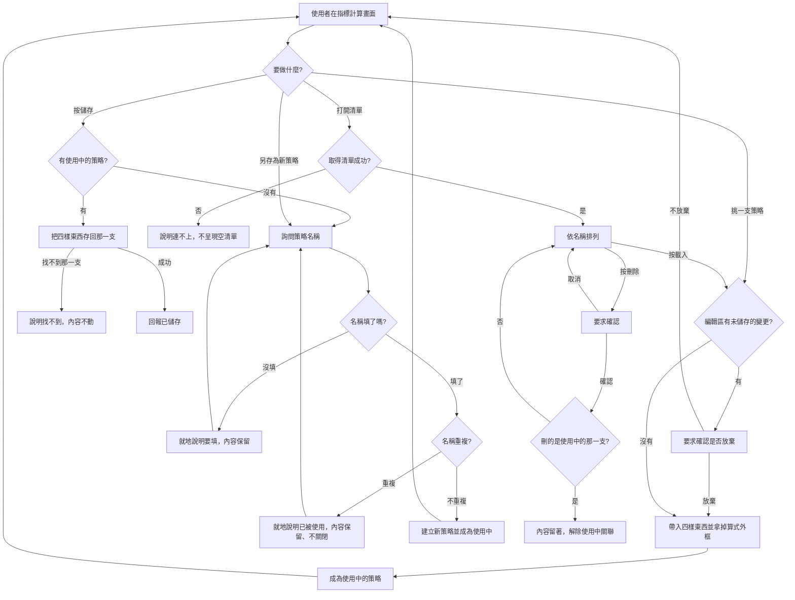

# Product Requirements Document (PRD) — 策略庫

**Status:** Finalized
**Version:** v1.0
**Owner:** James Hsueh
**Stakeholders:** 專案作者本人（同時是使用者、開發者與審查者）

---

## 1. Background & Goal (Why & Goal)

- **Problem Statement:** 指標計算這一頁每次都從一張白紙開始。使用者寫完算式內容、按下計算、看到結果，
  這段內容就只活在畫面上，重新整理即消失。想比較「二十根的均線」與「六十根的均線」，
  得自己把兩段幾乎一樣的文字記在別的地方；一支調了半天才對的算式，隔天要用仍得重打；
  改壞了也回不去。
- **Expected Outcome:** 寫過的算式能被留下來成為一支**策略**——取個名字，
  連同指標值種類、彙總刻度、計算根數一起記住——之後用名字叫回來、改它、或丟掉。
  成功的樣子是：使用者不再為了重跑同一套算法而重打算式，
  且整個過程**都在指標計算這一頁完成**，不必換頁。
- **Out of Scope:** 用一支存好的策略「一鍵執行」計算（仍是帶進畫面後按原本的計算按鈕）；
  讓彙總刻度真的作用在計算上；策略的版本歷史、回上一版、還原刪掉的策略；
  分類、標籤、搜尋、分頁、我的最愛；在畫面上檢查算式寫得對不對；
  把交易標的記進策略；匯入匯出與共用。

---

## 2. User Personas

- **Primary Role(s):** 策略研究者（專案作者本人）——同時是算式的作者與結果的讀者。
- **Usage Context:** 本機瀏覽器，單人使用。節奏是「寫一支 → 存起來 → 過幾天想起來 → 叫回來改」，
  中間可能隔很久。手上同時留著的策略數量在數十支等級，一眼看得完，因此清單一次全給、不分頁。

---

## 3. User Stories & Acceptance Criteria

### US-01 — 挑一支策略來用 [priority: P0]

**As a** 策略研究者, **I want** 從一份清單挑一支存好的策略並把它帶進畫面,
**so that** 我不必為了重跑同一套算法而重打算式。

```gherkin
Scenario: 挑一支策略就把它記住的東西全部帶進畫面
  Given 有一支名為「二十根均線」的策略
  And 它記著一段算式內容、指標值種類「一串數字」、彙總刻度「一小時」、計算根數 20
  When 使用者挑這一支策略
  Then 算式編輯區出現那段算式內容
  And 指標值種類變成「一串數字」
  And 彙總刻度變成「一小時」
  And 計算根數變成 20
  And 畫面顯示目前使用中的策略是「二十根均線」

Scenario: 挑策略不會動到交易標的
  Given 目前選的交易標的是 ETHUSDT
  When 使用者挑一支策略
  Then 交易標的仍是 ETHUSDT

Scenario: 一支策略都沒有
  Given 系統目前一支策略都沒有
  When 使用者查看可挑的策略
  Then 畫面明說還沒有任何策略
  And 這不是錯誤

Scenario: 編輯區還沒動過時直接帶入
  Given 編輯區是空的，且沒有使用中的策略
  When 使用者挑一支策略
  Then 直接帶進畫面，不多問任何事
```

### US-02 — 不要弄丟我寫到一半的東西 [priority: P0]

**As a** 策略研究者, **I want** 任何會蓋掉編輯區的動作都先問過我,
**so that** 我寫到一半的算式不會因為手滑點了別的東西就消失。

```gherkin
Scenario: 有未儲存的變更時先確認
  Given 目前使用中的策略是「二十根均線」
  And 編輯區的內容已被改過且尚未儲存
  When 使用者挑另一支策略
  Then 畫面先要求確認是否放棄尚未儲存的變更

Scenario: 使用者選擇不放棄
  Given 承上，畫面正在要求確認
  When 使用者選擇不放棄
  Then 畫面完全不變，仍是「二十根均線」與改過的內容

Scenario: 使用者選擇放棄
  Given 承上，畫面正在要求確認
  When 使用者選擇放棄
  Then 換成新挑的那一支，原本的改動不再保留

Scenario: 沒有改過就不問
  Given 目前使用中的策略是「二十根均線」
  And 載入之後一個字都沒有改過
  When 使用者挑另一支策略
  Then 不要求確認，直接換過去

Scenario: 沒有使用中策略但編輯區已經寫了東西
  Given 沒有使用中的策略
  And 編輯區已經寫了內容
  When 使用者挑一支策略
  Then 畫面先要求確認是否放棄那些內容
```

### US-03 — 把改動存回去 [priority: P0]

**As a** 策略研究者, **I want** 一顆儲存按鈕就能把畫面上的內容存回目前那一支,
**so that** 調整參數時不必刪掉重建，也不必先判斷自己算是新增還是修改。

```gherkin
Scenario: 存回使用中的那一支
  Given 目前使用中的策略是「二十根均線」，計算根數 20
  And 使用者把計算根數改成 60
  When 使用者按儲存
  Then 「二十根均線」的計算根數變成 60
  And 畫面明確回報已儲存

Scenario: 沒有使用中策略時，儲存等同另存為新策略
  Given 沒有使用中的策略
  And 編輯區已寫好內容
  When 使用者按儲存
  Then 畫面先詢問策略名稱

Scenario: 存成新的一支之後就換它當使用中
  Given 承上，使用者把名稱填成「六十根均線」
  When 使用者確認
  Then 系統多出一支名為「六十根均線」的策略
  And 畫面顯示目前使用中的策略是「六十根均線」

Scenario: 名稱沒填
  Given 畫面正在詢問策略名稱
  And 使用者沒有填名稱
  When 使用者確認
  Then 不送出，並說明必須填寫策略名稱
  And 畫面上已填的其他內容都還在

Scenario: 名稱與既有策略重複
  Given 已有一支名為「二十根均線」的策略
  And 畫面正在詢問策略名稱，使用者填的是「二十根均線」
  When 使用者確認
  Then 就地說明該名稱已被使用
  And 輸入框裡的字還在，可以直接改
  And 詢問名稱的畫面不關閉

Scenario: 使用中的策略已經不在了
  Given 目前使用中的策略是「二十根均線」
  And 那一支已經在別處被刪掉
  When 使用者按儲存
  Then 畫面說明找不到那一支策略
  And 該說明與「內容不合規則」分開呈現
  And 編輯區的內容一字不動

Scenario: 儲存時連不上後端
  Given 目前使用中的策略是「二十根均線」
  And 後端連不上
  When 使用者按儲存
  Then 畫面沿用既有的連線失敗說法
  And 編輯區的內容一字不動
```

### US-04 — 另存為新策略 [priority: P0]

**As a** 策略研究者, **I want** 把畫面上的內容另存成一支新策略,
**so that** 我能從一支既有的策略衍生出變體，而不必覆蓋原本那一支。

```gherkin
Scenario: 從既有策略衍生一支新的
  Given 目前使用中的策略是「二十根均線」
  And 使用者已經改過內容
  When 使用者另存，並把名稱填成「二十根均線 v2」
  Then 系統多出一支名為「二十根均線 v2」的策略
  And 「二十根均線」的內容完全沒有改變

Scenario: 另存之後使用中的變成新的那一支
  Given 承上，另存已完成
  When 使用者再按儲存
  Then 存回的是「二十根均線 v2」

Scenario: 另存只問名稱
  Given 畫面上已有算式內容、指標值種類、彙總刻度與計算根數
  When 使用者另存
  Then 畫面只詢問策略名稱
  And 其餘四樣東西取自畫面當下的值，不再詢問一次
```

### US-05 — 看看手上留了哪些策略 [priority: P0]

**As a** 策略研究者, **I want** 一次看完留著的每一支策略並就地載入或刪除,
**so that** 我能挑出要改或要丟的那一支，而不必離開正在寫的畫面。

```gherkin
Scenario: 從清單載入一支
  Given 策略清單上有「二十根均線」與「六十根均線」
  When 使用者對「六十根均線」按載入
  Then 那一支被帶進畫面
  And 清單關閉
  And 使用者仍留在指標計算的畫面上

Scenario: 清單依名稱排列
  Given 系統留著三支策略
  When 使用者打開策略清單
  Then 三支依名稱由小到大排列

Scenario: 清單為空
  Given 系統一支策略都沒有
  When 使用者打開策略清單
  Then 清單明說還沒有任何策略，這不是錯誤

Scenario: 打開清單時連不上後端
  Given 後端連不上
  When 使用者打開策略清單
  Then 畫面說明連不上後端
  And 不呈現一份空清單
```

### US-06 — 丟掉不要的策略 [priority: P1]

**As a** 策略研究者, **I want** 刪掉試過但不用的策略，且刪掉之前被問一次,
**so that** 清單上留下的都是我還在用的，而我不會手滑刪掉還要用的。

```gherkin
Scenario: 刪除前先確認
  Given 策略清單上有「二十根均線」
  When 使用者對它按刪除
  Then 畫面要求確認

Scenario: 使用者取消刪除
  Given 承上，畫面正在要求確認
  When 使用者取消
  Then 「二十根均線」仍在清單上

Scenario: 使用者確認刪除
  Given 承上，畫面正在要求確認
  When 使用者確認
  Then 「二十根均線」從清單消失

Scenario: 刪掉的正好是使用中的那一支
  Given 目前使用中的策略是「二十根均線」
  When 使用者刪除「二十根均線」並確認
  Then 編輯區的內容留著不動
  And 畫面不再顯示任何使用中的策略
  And 之後按儲存會先詢問策略名稱

Scenario: 刪掉別的不影響使用中的那一支
  Given 目前使用中的策略是「二十根均線」
  When 使用者刪除「六十根均線」並確認
  Then 畫面上使用中的仍是「二十根均線」，內容完全沒有改變

Scenario: 刪除時連不上後端
  Given 後端連不上
  When 使用者刪除某一支並確認
  Then 那一支仍在清單上
  And 畫面說明連不上後端
```

### US-07 — 算式帶回畫面時只留我寫的那幾行 [priority: P0]

**As a** 策略研究者, **I want** 載入策略時編輯區裡只有我自己寫的內容,
**so that** 它與我從頭寫一支新的時看到的完全一樣，我不必每次去分辨哪幾行是系統加的。

```gherkin
Scenario: 載入時把每段算式都一樣的那些行拿掉
  Given 某支策略存的是完整算式，含每段算式都一樣的外框行
  When 使用者載入它
  Then 編輯區只出現使用者當初寫的那幾行
  And 內容與從頭寫一支新的時看到的形式一致

Scenario: 內容原有的縮排原樣保留
  Given 某支策略的內容裡本來就有縮排
  When 使用者載入它
  Then 縮排與當初撰寫時完全相同，不多一層也不少一層

Scenario: 認不出外框時整段原樣帶入
  Given 某支策略的算式認不出外框
  When 使用者載入它
  Then 整段算式原樣進入編輯區
  And 畫面告知這一支看起來不是在這裡寫出來的
  And 系統沒有試圖拆掉任何一行

Scenario: 一趟來回不會讓算式長出東西或掉東西
  Given 使用者載入一支策略
  And 一個字都沒有改
  When 使用者按儲存
  Then 存回去的算式與載入前完全相同
```

### US-08 — 記下這支策略要吃多粗的 K 線 [priority: P1]

**As a** 策略研究者, **I want** 替策略挑一個彙總刻度並存下來,
**so that** 等系統支援時不必回頭一支一支改；在那之前我也清楚知道它還沒生效。

```gherkin
Scenario: 挑的刻度存得住也讀得回來
  Given 使用者挑彙總刻度「一小時」並儲存
  When 使用者再載入這一支策略
  Then 彙總刻度仍是「一小時」

Scenario: 沒挑就是五分鐘
  Given 使用者沒有挑彙總刻度
  When 使用者儲存
  Then 記下來的彙總刻度是「五分鐘」

Scenario: 挑了刻度不改變計算的行為
  Given 使用者挑彙總刻度「一小時」
  When 使用者按計算
  Then 計算仍以五分鐘的 K 線執行
  And 畫面上早已標明彙總刻度目前尚未生效
```

### US-09 — 失敗不會改變畫面上的東西 [priority: P0]

**As a** 策略研究者, **I want** 任何一次失敗都不動到我畫面上的內容,
**so that** 一次存檔失敗不會連帶把我寫的東西弄丟。

```gherkin
Scenario: 儲存被拒絕
  Given 編輯區有內容
  When 儲存被拒絕
  Then 編輯區的內容一字不動
  And 拒絕的原因另外呈現

Scenario: 說得出是哪一件事不成立
  Given 一次操作被拒絕
  When 畫面呈現拒絕
  Then 畫面說明是哪一件事不成立——名稱沒填、名稱重複、找不到那一支，或內容不合規則
  And 不只是說「操作失敗」
```

---

## 4. Business Flow & Logic



- **Core Business Rules:**
  - **一支策略記四樣東西加一個名字**：算式內容、指標值種類、彙總刻度、計算根數。
    **不記交易標的**——同一支策略要能套用在不同市場上。
  - **挑一支就全部帶入**：四樣東西一次到位，不讓使用者自己補齊剩下的。
  - **覆蓋前必問**：任何會蓋掉編輯區的動作，在有未儲存變更時一律先確認。
    這是本切片最不能出錯的一條——其他事情做錯可以重來，弄丟寫到一半的算式沒得重來。
  - **儲存只有一顆按鈕**：有使用中的策略就存回那一支，沒有就等同另存為新策略。
    使用者不必先判斷自己算哪一種。
  - **另存只問名稱**：其餘四樣東西畫面上都有了，再問一次是多餘的。
  - **存的是完整算式，帶回畫面時拿掉外框**：存下來的東西自己就是一支能跑的算式；
    **認不出外框時整段原樣交還並告知，絕不硬拆**。
  - **刪除要確認、且不動編輯區**：刪掉使用中的那一支只解除關聯，內容留著。
  - **失敗不改畫面**：任何一次拒絕或連線失敗，畫面上已有的內容一字不動。
  - **說得出是哪一件事**：名稱沒填、名稱重複、找不到那一支、內容不合規則，四者分開呈現。
  - **名稱長度不在畫面上檢查**：那是系統另一端的規則，畫面抄一份下來只會在對方改了之後說謊。
    畫面只擋它自己確定知道的事（名稱沒填），其餘照實轉達對方的拒絕。
  - **彙總刻度只記錄、不生效**：計算一律仍以五分鐘的 K 線執行，畫面須明說。
- **Edge Cases:**
  - 載入之後一個字都沒改就再挑另一支：不問，因為沒有東西會被弄丟。
  - 沒有使用中的策略但編輯區已經寫了東西：仍要問——那些字一樣是使用者寫的。
  - 另存成功之後，使用中的立刻換成新的那一支；再按儲存存的是它，不是原本那一支。
  - 使用中的那一支在別處被刪掉之後才按儲存：說明找不到，且與內容不合規則分開呈現。
  - 打開清單時連不上後端：明說連不上，**不呈現空清單**——空清單會讓人以為自己什麼都沒存過。

---

## 5. UI/UX Design & Interaction

**整個功能都在指標計算這一頁裡**，不新增分頁、不換頁。

- **挑策略**：算式編輯區上方一份可挑的清單，同時顯示目前使用中的是哪一支。
- **儲存**：一顆按鈕，擺在會讓人聯想到「把現在這份東西留下來」的位置。
- **另存為新策略**：另一個入口，任何時候都能用。
- **策略清單**：以覆蓋在畫面上的方式呈現，關掉就回到原本正在寫的地方，**不離開這一頁**。
- **詢問名稱**：以覆蓋在畫面上的方式呈現，只有一個輸入欄。
  名稱重複時**就地顯示、不關閉、不清空**。
- **空狀態**：一支策略都沒有時明說「還沒有任何策略」，而不是給一份空選單。
- **載入狀態**：取清單、儲存、刪除進行中時，對應的操作不可重複觸發。
- **錯誤狀態**：欄位層級的問題標在該欄位旁；連不上後端整塊告知並可重試——沿用畫面既有的兩種呈現方式。
- **彙總刻度**：選單旁必須有一句話說明它目前尚未生效。

---

## 6. Non-Functional Requirements

- **Performance:** 策略數量在數十支等級，清單一次全取、不分頁、不快取。
  載入一支策略不觸發任何計算。
- **Security:** 單人本機使用，無登入與權限。算式在畫面上**只被當成文字**，不執行、不解讀。
- **Compatibility:** 指標計算原有的行為完全不變——不挑任何策略時，這一頁的用法與這個切片之前一致。
- **Analytics / Tracking:** 無。

---

## 7. Dependencies & Risks

- **External Dependencies:** 後端 `go-trading` 的策略資料。策略的真相永遠在後端，畫面不自行留存。
- **Known Risks:**
  - **外框認不出來。** 存的是完整算式，帶回畫面要拿掉外框。
    若外框日後改變，舊策略可能認不出來——因此規則是**認不出就整段原樣交還並告知**，
    寧可讓使用者看到多了幾行，也不能靜靜把程式碼剪壞。
  - **彙總刻度是一張支票。** 使用者挑了它、也存下來了，但計算還沒理它。
    畫面必須明說，否則使用者會以為自己已經在用一小時的 K 線算指標。
  - **未儲存的變更判定。** 「有沒有改過」判斷錯會導致兩種壞事：該問的時候不問（弄丟內容），
    或不該問的時候一直問（煩人）。前者嚴重得多，判斷有疑慮時**寧可問**。
