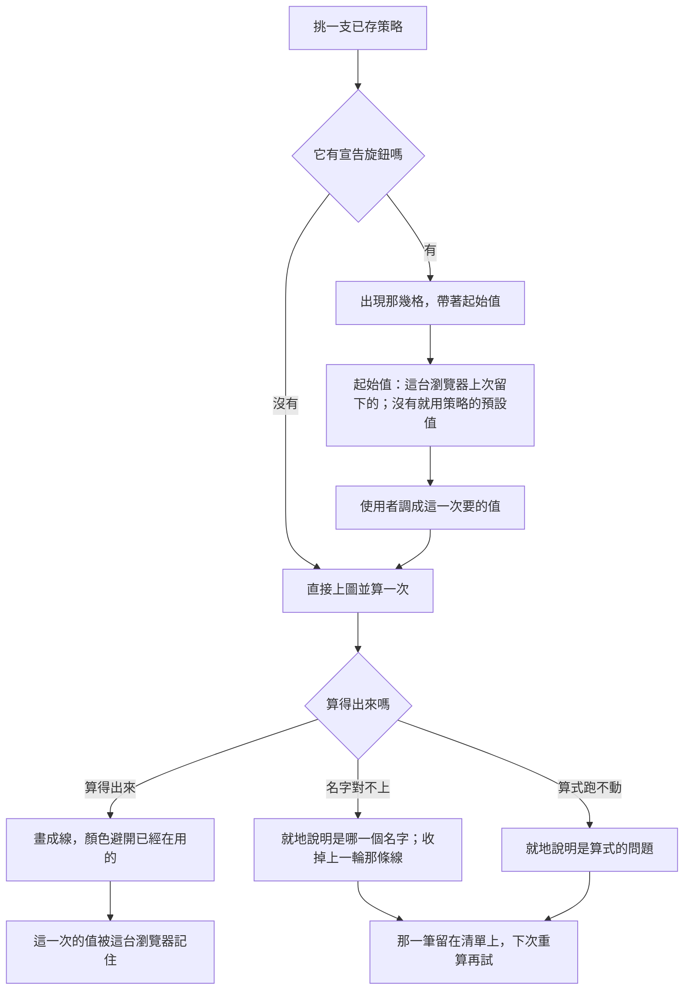

# 在 K 線圖表上調策略的旋鈕 — PRD

**Feature slug:** `chart-indicator-parameters`
**Brief:** [`BRIEF.md`](BRIEF.md)
**Ubiquitous Language:** [`../UL-MAP.md`](../UL-MAP.md)

---

## 1. Background & Goal

### 問題

策略已經記得住自己的旋鈕，但那件事只在**寫算法的地方**做完了。
真正會反覆調那幾個數字的地方是**圖表**——看行情的人想把同一支均線同時擺上二十期與
六十期看它們什麼時候交叉，想把布林的倍數從 2 調到 2.5 看價格有沒有跑出去。

今天他做不到兩件事：**調不了**（圖上一律用策略記著的預設值），
以及**擺不了兩次**（同一支策略只能套用一次）。於是他只剩一條路：
回到寫算法的地方把預設值改掉、存檔、回到圖表、再看一次，然後為了看另一個值再來一輪——
而且他的策略被自己改過了，明天打開別的圖會發現它不是原本那支。

### 目標

在圖表上套用一支策略時，**先調它的旋鈕再讓它上圖**；**同一支可以擺好幾次**，
每一次配自己的值、各自一條線；調過的值**這台瀏覽器記得住**。
調的是「這一次」，**策略記著的預設值一個字都不會變**。

### 成功的樣子

- 使用者要同時看二十期與六十期兩條均線，**不必回到寫算法的地方，也不必改動那支策略**。
- 他昨天調過的值，今天挑同一支策略時**已經在那幾格裡**。

### 明確不做

- 在圖表上編輯策略的**旋鈕宣告**（新增／刪除／改名／改預設值）——那是寫算法的地方的事。
- 把**已套用的清單**存起來：重新打開畫面後清單仍然是空的。
- 旋鈕的**型別系統**（字串、是非、選單）：仍然只有回看根數與數值兩種。
- 把同一支策略的多次套用**群組起來呈現**（摺疊、共用一組顏色）。

---

## 2. User Personas

| Persona | 是誰 | 在什麼情境下 |
| :--- | :--- | :--- |
| **看行情的人** | 這個系統唯一的使用者，本人 | 盯著 K 線圖，想在同一張圖上比較同一套算法在不同參數下的樣子。他要的是**這一次想這樣看**，不是改那支策略 |

---

## 3. User Stories & Acceptance Criteria

### US-01 — 套上去之前就先調 [priority: P0]

**As a** 看行情的人，**I want** 在策略上圖之前先把它的旋鈕調成這一次要的值，
**so that** 圖上出現的第一條線就是我要看的那一條。

```gherkin
Scenario: 挑一支有旋鈕的策略，先看到那幾格
  Given 一支策略宣告了「期數」，預設值是 20
  When 挑它
  Then 出現一格「期數」，裡面是 20
  And 它還沒上圖

Scenario: 調好之後才上圖，算的是調過的值
  Given 上一個情境的那一格
  When 把它改成 60 並按下加入
  Then 它上圖並立刻算了一次
  And 這次計算用的期數是 60

Scenario: 一個旋鈕都沒有的策略挑了就直接上圖
  Given 一支一個旋鈕都沒有宣告的策略
  When 挑它
  Then 它直接上圖並立刻算了一次
  And 中間沒有多出任何一步

Scenario: 上次調過的值就是這次那一格的起點
  Given 這台瀏覽器上次把某支策略的「期數」調成 60
  When 再挑那一支
  Then 那一格是 60

Scenario: 這台瀏覽器不讓網站存東西時照樣調得動
  Given 這台瀏覽器不讓網站存東西
  And 某支策略的「期數」預設值是 20
  When 挑它
  Then 那一格是 20
  And 調得動、也算得出來，畫面沒有出現任何錯誤

Scenario: 在圖上調過的值不會改動策略記著的預設值
  Given 某支策略的「期數」預設值是 20
  And 在圖上把它調成 60 並加入
  When 回到寫算法的地方看那支策略
  Then 它記著的預設值仍然是 20
```

### US-02 — 同一支可以擺好幾次 [priority: P0]

**As a** 看行情的人，**I want** 把同一支策略配不同的值擺上好幾次，
**so that** 我能在同一張圖上比較它們。

```gherkin
Scenario: 已套用的策略仍然挑得到
  Given 已套用「均線」，期數 20
  When 打開可挑清單
  Then 「均線」仍然在可挑的選項裡

Scenario: 同一支擺第二次
  Given 已套用「均線」，期數 20
  When 再套用一次「均線」，期數填 60
  Then 清單上有兩筆
  And 圖上有兩條線

Scenario: 清單上用值分辨它們
  Given 已套用「均線」兩次，期數分別是 20 與 60
  When 看清單
  Then 一筆標著期數 20，另一筆標著期數 60

Scenario: 移除其中一次只影響那一次
  Given 已套用「均線」兩次，期數分別是 20 與 60
  When 移除期數 20 那一筆
  Then 清單上只剩期數 60 那一筆
  And 圖上只剩它那一條線

Scenario: 沒有旋鈕的策略也可以擺兩次
  Given 一支一個旋鈕都沒有的策略
  When 套用它兩次
  Then 清單上是兩筆，名稱相同、沒有值可以標

Scenario: 同一支擺兩次，兩條線預設就分得開
  Given 已套用同一支策略兩次
  When 看圖
  Then 兩條線是不同顏色
  And 使用者一次都沒有動手挑過顏色
```

### US-03 — 調完之後 [priority: P0]

**As a** 看行情的人，**I want** 改掉某一次套用的值只影響那一次，且下次不必重打，
**so that** 我調一條線的時候不會弄亂別條。

```gherkin
Scenario: 改一次套用的值，只有那一次重算
  Given 已套用「均線」期數 20，以及「布林」倍數 2
  When 把均線那一筆的期數改成 60
  Then 均線那一筆重算了一次
  And 布林那一條線一個點都沒有變

Scenario: 改過的值下次還在
  Given 在圖上把某支策略的期數改成 60
  When 重新打開畫面並挑那一支
  Then 那一格是 60

Scenario: 清單本身不留存
  Given 圖上已套用兩筆
  When 重新打開畫面
  Then 清單是空的
  And 圖上只有 K 線

Scenario: 同一支被調過兩個值時，記住的是最後設定的那一個
  Given 同一支策略被套用兩次，期數分別設成 20 與 60，60 是後設的
  When 重新打開畫面並挑那一支
  Then 那一格是 60
```

### US-04 — 策略的旋鈕被改過之後 [priority: P0]

**As a** 看行情的人，**I want** 策略的宣告改過之後圖上以宣告為準，
**so that** 一個已經不存在的旋鈕不會繼續影響計算。

```gherkin
Scenario: 策略多宣告了一個旋鈕
  Given 這台瀏覽器記住某支策略的「期數」是 60
  And 那支策略現在多宣告了「倍數」，預設值 2
  When 挑它
  Then 「期數」那一格是 60
  And 「倍數」那一格是 2

Scenario: 策略不再宣告某個旋鈕
  Given 這台瀏覽器記住某支策略的「期數」是 60
  And 那支策略現在不再宣告「期數」
  When 挑它
  Then 沒有「期數」那一格
  And 記住的 60 不參與這次計算

Scenario: 旋鈕被改名
  Given 這台瀏覽器記住某支策略的「期數」是 60
  And 那個旋鈕已被改名成「週期」，預設值 20
  When 挑它
  Then 只有「週期」一格，值是 20
```

### US-05 — 算不出來的時候 [priority: P0]

**As a** 看行情的人，**I want** 名字對不上時被指名，
**so that** 我不會盯著一段其實沒問題的算式看很久。

```gherkin
Scenario: 名字對不上就地說明並指名
  Given 一支策略宣告的旋鈕叫「週期」
  And 它的算式取用的是「期數」
  When 套用它
  Then 那一筆旁邊說明「期數」這個名字沒有被宣告
  And 圖上沒有它的線

Scenario: 它與「算式跑不動」是兩則不同的說明
  Given 上一個情境的失敗
  When 看那則說明
  Then 它指出的是哪一個名字對不上
  And 它沒有說算式本身跑不動

Scenario: 同一支的兩次套用，只有失敗那一次沒有線
  Given 同一支策略被套用兩次
  And 其中一次的值讓它算失敗
  When 看圖
  Then 只有失敗那一次沒有線且旁邊帶著說明
  And 另一次照樣畫出來

Scenario: 失敗的那一筆留在清單上，下次重算再試
  Given 一筆算失敗的套用留在清單上
  When 換交易標的
  Then 它跟著重算了一次
  And 算得出來時說明消失、線出現

Scenario: 這一輪算失敗要收掉上一輪那條線
  Given 一筆上一輪畫得出線的套用
  And 這一輪它算失敗
  When 重算後看圖
  Then 上一輪那條線被收掉
  And 原地換成失敗說明
```

### US-06 — 顏色盡量別撞 [priority: P1]

**As a** 看行情的人，**I want** 兩條線不要同色，
**so that** 我分得出哪條是哪條。

```gherkin
Scenario: 挑過顏色的照挑的畫
  Given 替某支策略的線挑過藍色
  When 套用它
  Then 那條線是藍色

Scenario: 同一支的第二次套用不沿用記住的顏色
  Given 替某支策略的線挑過藍色，而那條線還在圖上
  When 再套用同一支一次
  Then 第二條線不是藍色
  And 它是一個目前沒有被用掉的顏色

Scenario: 沒有別條線在用它時，記住的顏色回來
  Given 同一支策略被套用兩次，第一次是藍色
  When 移除第一筆之後再套用一次
  Then 那條線是藍色

Scenario: 顏色用光了照樣畫得出來
  Given 顏色清單上每一個都已經被用掉
  When 再套用一支
  Then 它照樣畫得出線
  And 顏色與別條重複
```

---

## 4. Business Flow & Logic

### 主流程



### 核心商業規則

- **調的是「這一次」。** 圖上填的值只屬於這一次套用，不改動策略記著的預設值。
- **每一次套用是獨立的一筆。** 參數值、線色、失敗說明、移除、重算，全都只影響那一筆。
- **同一支策略可以套用任意多次**，靠**參數值**分辨——那是它們唯一的差別。
- **記住的是「這支策略的這個旋鈕上次被調成什麼」**，不是「上次擺了哪幾條線」。
- **宣告是唯一的真相**：策略現在宣告什麼就有哪幾格；記住的值裡名字不在的丟掉，
  名字還在的沿用，新多出來的用策略的預設值。
- **顏色**：挑過的照挑的畫；沒挑過的取一個目前沒被用掉的；
  **同一支的第二次以後的套用不沿用記住的顏色**。

---

## 5. UI/UX

- **挑策略之後、加入之前**，那幾格與加入的動作出現在可挑清單附近——
  使用者的視線不必離開他剛剛挑的那一支。
- **已套用清單的每一筆**帶著：策略名稱、這一次的參數值、它畫出的那幾條線與各自的顏色、
  移除的動作。有旋鈕的那幾筆可以就地改值。
- **狀態**：
  - **計算中** — 那一筆標示計算中，不擋住其他筆。
  - **空的** — 一筆都沒有時照既有的說法，圖上只有 K 線。
  - **失敗** — 就地標在那一筆旁邊；名字對不上與算式跑不動是**兩則不同的說明**。
- **文案不得說謊**：清單上標的值必須是**那一次真正拿去算的值**，
  而不是策略記著的預設值。

---

## 6. Non-Functional Requirements

- **只有那一次重算**：改一筆的值不得觸發其他筆的計算。
- **記不住不是失敗**：這台瀏覽器不讓網站存東西時，一切照常運作，
  只是下次回到策略記著的預設值；不得出現任何錯誤畫面。
- **不新增對外往返**：策略的旋鈕宣告隨策略清單一起來，挑一支不必再問一次。

---

## 7. Dependencies & Risks

### Dependencies

- **上一個切片**（`.sdd/2026-09-04-indicator-calculation-parameters/`，已完成）：
  策略帶著自己的旋鈕、計算時可以帶參數值、名字對不上是一種可以被指名的失敗。
- **系統那一側**（`go-trading` 的 `feat/strategy-parameters`，**尚未併入主線**）：
  策略的旋鈕與帶參數值的計算都在那裡。**本地測試時系統那一側必須切到那個分支執行**，
  否則旋鈕欄位不存在，圖上永遠看不到那幾格。

### Known Risks

- **推翻了「同一支策略不重複套用」。**
  那條規則來自 `.sdd/2026-09-03-chart-indicator-overlay/`，理由是
  「已經在圖上了，再加一次只會得到一模一樣的線」。旋鈕讓這個前提不成立：
  同一段算法配不同的值畫出來是不同的線。**規則沒有錯，是它的前提消失了。**
  代價：可挑清單不再會因為套用而變短，使用者可能不小心擺上兩筆一模一樣的——
  這是可以接受的，因為它一眼看得出來（兩筆的值相同），而擋掉它要付的代價
  是使用者永遠擺不出他真正想要的第二筆。

- **「挑過的顏色即使被用掉也照樣採用」在同一支套用多次時破例。**
  那條規則保護的是使用者的明確選擇，而他選的是「**這條線**是藍色」。
  第二次套用是**另一條線**，只是恰好共用同一段算法。
  兩條同色的線在圖上等於沒有顏色，而顏色存在的唯一理由就是分辨它們。
  代價：使用者可能預期「這支策略永遠是藍色」而看到第二條不是——
  但那正是他要求「盡量別撞色」時想避免的情況。

- **記住的是最後設定的那一個值。**
  習慣同時看二十期與六十期的人，下次要再擺一次。
  這與「清單不留存」是**同一個代價**，不是新的：清單本來就不留存，兩條線本來就得重挑。

---

## 8. Appendix

驗收條件逐條對應 `BRIEF.md` 的 Examples（五組共 24 條，全數轉成情境並補上兩條
「策略記著的預設值不變」與「沒有旋鈕的策略也可以擺兩次」的邊界）。
