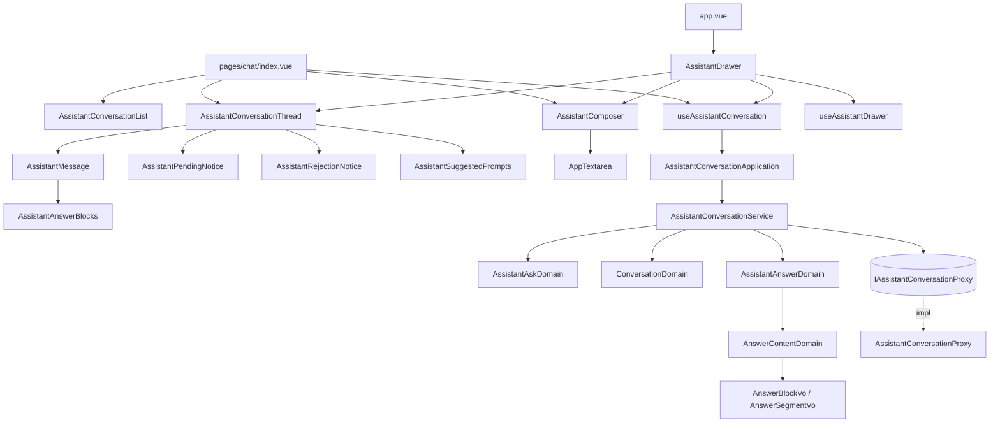
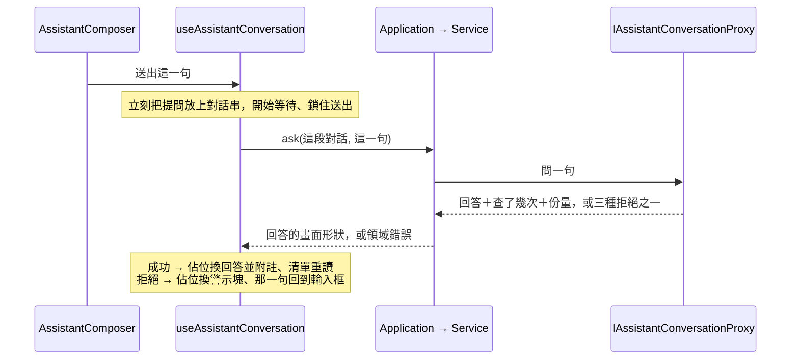

# 行情對話助手上操作台 — Architecture Design

**Status:** Draft
**Source PRD:** `.sdd/2026-09-04-chat-assistant-console/PRD.md`
**Tech context:** Nuxt 3 + Vue 3 · Clean / Onion（前端版）· Atomic Design · SCSS token · Vitest

---

## 1. Design Goal & Guiding Principle

- **In one sentence:**
  讓操作台的任何畫面都能問助手一句話並讀到有結構的回答，抽屜與整頁共用**同一段對話**，
  而助手回傳的任何內容都只能是文字。

- **Guiding principle:**
  **「目前這段對話」是一份跨畫面的畫面狀態，抽屜與整頁都只是它的兩種呈現密度。**

  這條線一畫下去，一整類 bug 就不可能發生：兩邊不會各記一份、切走再回來不會掉、
  等待中換畫面不會重送。抽屜與整頁因此**共用同一個對話串元件與同一個輸入元件**，
  差別只有「有沒有清單」與「多寬」——不是兩套實作。
  沿用專案既有的做法（`useBackendHealth` 那顆燈也是這樣跨畫面共用一次檢查）。

  次要原則：**回答的結構由 Domain Model 拆出來，畫面只照著渲染。**
  這同時解決兩件事——帶數字的回答讀得懂，以及**回答內容永遠不可能被當成指令執行**
  （沒有任何一處把回答交給會解析標記的東西）。這也是本切片不引入外部套件的理由。

---

## 2. Change Scope

| Area | Action | What / Why |
| :--- | :--- | :--- |
| `app/domain/models/entities/` | **Add** | `Conversation`、`ConversationMessage`、`ConversationSummary`、`AssistantAnswer`——後端回來的東西正規化後的乾淨形狀 |
| `app/domain/models/domains/` | **Add** | `AssistantAskDomain`、`AnswerContentDomain`、`AssistantAnswerDomain`、`ConversationDomain`、`ConversationSummaryDomain` |
| `app/domain/models/vo/` | **Add** | `AnswerBlockVo`、`AnswerSegmentVo`——回答拆解後的塊與行內片段 |
| `app/domain/models/dto/` | **Add** | `AssistantAskDto`、`AssistantAnswerDto`、`ConversationMessageDto`、`ConversationDto`、`ConversationSummaryDto` |
| `app/domain/interface/` | **Add** | `i-assistant-conversation-proxy.ts` |
| `app/domain/errors/` | **Add** | `DailyUsageAllowanceExhaustedError`、`AssistantUnavailableError`、`ConversationNotFoundError`——三種拒絕要讓畫面說三句不同的話 |
| `app/domain/service/` | **Add** | `assistant-conversation-service.ts` |
| `app/application/` | **Add** | `assistant-conversation-application.ts` |
| `app/infrastructure/proxy/` | **Add** | `assistant-conversation-proxy.ts`（繼承既有 `BackendApiProxy`） |
| `app/composables/` | **Add** | `use-assistant-conversation.ts`（跨畫面共用的那一段對話）、`use-assistant-drawer.ts`（抽屜開關） |
| `app/components/atoms/` | **Add** | `AppTextarea.vue`——`AppInput` 是 `<input>`，多行提問要 `<textarea>`。**不同元素、不同語意**，比照 `AppButton` 與 `AppLink` |
| `app/components/molecules/` | **Add** | `AssistantMessage.vue`、`AssistantAnswerBlocks.vue`、`AssistantComposer.vue`、`AssistantSuggestedPrompts.vue`、`AssistantPendingNotice.vue`、`AssistantRejectionNotice.vue` |
| `app/components/organisms/` | **Add** | `AssistantConversationThread.vue`、`AssistantConversationList.vue`、`AssistantDrawer.vue` |
| `app/pages/` | **Add** | `chat/index.vue`（助手整頁） |
| `app/app.vue` | **Modify** | 掛上 `AssistantDrawer`——它要在每一個畫面都存在，而 `NuxtPage` 之外正是「每一個畫面」 |
| `app/components/templates/ConsoleLayout.vue` | **Modify** | 導覽多一個目的地「行情助手」。**只加一列常數**，不碰它的插槽或版面 |
| `app/assets/styles/abstracts/_tokens.scss` | **Modify（若缺）** | 補這個切片需要而目前沒有的 token（抽屜寬度、對話泡泡底色…） |
| `app/plugins/dependencies.ts` | **Modify** | 組裝新的 proxy → service → application 並 provide |
| `tests/` | **Add** | 鏡射上面每一個有行為的單位 |
| **K 線瀏覽／圖表／指標計算／策略庫的任何行為** | **Not touched** | 這個切片只是**多一個地方**。既有畫面唯一的變化是導覽多一列、以及畫面上多一顆浮動的助手鍵 |
| **`ConsoleLayout` 的插槽與版面** | **Not touched** | 抽屜掛在 `app.vue` 而不是塞進樣板，正因為樣板**不得綁任何資料**——抽屜要讀對話，它是 organism 不是骨架 |
| **後端** | **Not touched** | 三件事已經齊了。「舊訊息拿不到附註」是後端目前的形狀，本切片接受它而不去改（見 §8） |

---

## 3. New Classes / Modules

### 3.1 Domain — Entities（乾淨資料模型）

| Name | Kind | Responsibility (purpose) | Satisfies |
| :--- | :--- | :--- | :--- |
| `AssistantAnswer` | Entity | 一次問答的產出：落在哪一段對話、回答的原文、查了幾次、是否提早收尾、動用多少份量 | US-02、US-05 |
| `Conversation` | Entity | 一段對話：識別碼、最後有動靜的時刻、它的每一則訊息 | US-07 |
| `ConversationMessage` | Entity | 一則訊息：是提問或回答、內容、時刻 | US-07 |
| `ConversationSummary` | Entity | 清單上的一列：識別碼、最後有動靜的時刻、有幾則訊息 | US-07 |

### 3.2 Domain — Value Objects

| Name | Kind | Responsibility (purpose) | Satisfies |
| :--- | :--- | :--- | :--- |
| `AnswerBlockVo` | VO | 回答拆解後的一塊：段落／小標／條列／編號／表格原文。持有它的行內片段 | US-04 |
| `AnswerSegmentVo` | VO | 一塊裡的一段行內文字：普通、強調、或等寬 | US-04 |

兩者都是**不可變、無行為**的資料，因此是 VO 而不是 domain model。
它們刻意**不帶任何 HTML 概念**（沒有 tag 名、沒有 class）——那是元件的事。

### 3.3 Domain — Domain Models（行為所在地）

| Name | Kind | Responsibility (purpose) | Satisfies |
| :--- | :--- | :--- | :--- |
| `AssistantAskDomain` | Domain Model | 一句提問能不能送：去掉前後空白後為空即不可送 | US-02 |
| `AnswerContentDomain` | Domain Model | **把一則回答的原文拆成塊與行內片段** | US-04 |
| `AssistantAnswerDomain` | Domain Model | 一次問答的產出轉成畫面形狀：拆好的塊、附註要不要講查詢次數、有沒有提早收尾 | US-02、US-05 |
| `ConversationDomain` | Domain Model | 一段對話轉成畫面形狀：每一則訊息，回答那幾則連帶拆成塊 | US-07 |
| `ConversationSummaryDomain` | Domain Model | 清單上一列轉成畫面形狀 | US-07 |

**`AnswerContentDomain` 是本切片唯一有份量的計算**，也是它獨立成一個 model 的理由：
「一則回答長什麼樣」與「一次問答回報了什麼」是兩個會分開改變的東西。
它認得的結構只有五種（小標、條列、編號、表格原文、段落）與三種行內片段
（普通、強調、等寬），**認不出來的一律當普通段落**——寧可少認一種結構，
不可為了多認一種而讓內容有機會逃出文字的身分。

### 3.4 Domain — Interface

```ts
/**
 * 介面以能力命名。同一個外部資源一個 Proxy——問一句、列出對話、讀一段都收在這裡。
 * 問一句一律收**已判定可送**的 AssistantAskDomain，因此不存在一條繞過判定的送出路徑。
 */
export interface IAssistantConversationProxy {
  ask(assistantAskDomain: AssistantAskDomain): Promise<AssistantAnswer>
  listConversations(): Promise<ConversationSummary[]>
  getConversation(id: number): Promise<Conversation>
}
```

### 3.5 Domain — Errors

| Name | 對應後端的拒絕 | 使用者要做什麼 |
| :--- | :--- | :--- |
| `DailyUsageAllowanceExhaustedError` | 今日額度用盡 | 等（錯誤訊息裡有重置時刻） |
| `AssistantUnavailableError` | 助手沒回應或逾時 | 稍後再試 |
| `ConversationNotFoundError` | 指名的對話不存在 | 開一段新的 |
| *(既有)* `BackendUnreachableError` | 連不上後端 | 去把後端啟動 |

四種分開，因為**使用者要做的事不同**。合成一種的代價是有人對著一個要等到明天的
拒絕重試一整個小時。比照既有的 `StrategyNameConflictError` / `StrategyNotFoundError`。

### 3.6 Domain — Service

| Name | Kind | Responsibility | Satisfies |
| :--- | :--- | :--- | :--- |
| `AssistantConversationService` | Service | 三個用例：問一句、列出對話、讀一段對話。取回 entity、包成 domain model、轉 DTO | 全部 US |

```ts
ask(askDto: AssistantAskDto): Promise<AssistantAnswerDto>
listConversations(): Promise<ConversationSummaryDto[]>
getConversation(id: number): Promise<ConversationDto>
```

`ask` 在打後端之前先建 `AssistantAskDomain`——**不可送的提問不會產生一次呼叫**。
三個公開方法互不呼叫。

### 3.7 Application

| Name | Kind | Responsibility |
| :--- | :--- | :--- |
| `AssistantConversationApplication` | Application | 三個用例各一次 domain 呼叫，不做任何決定 |

### 3.8 Infrastructure

| Name | Kind | Responsibility |
| :--- | :--- | :--- |
| `AssistantConversationProxy` | Proxy | 打後端三條路由，把回來的東西**正規化成 entity**（時刻轉成瞬間），並把被拒絕的狀態翻成上面那三個領域錯誤 |

繼承既有的 `BackendApiProxy`，因此「後端拒絕 vs 後端自己壞了 vs 連不上」這條翻譯規則
**沿用同一份**，不會養出第二份會漂移的複本。它在那之上多做一件事：
依狀態碼把拒絕再細分成三種領域錯誤。

### 3.9 Composables（跨畫面的畫面狀態）

| Name | Responsibility (purpose) | Satisfies |
| :--- | :--- | :--- |
| `useAssistantConversation()` | **目前這段對話這一份共用狀態**：對話串、等待中、被拒絕的那一次、目前哪一段、清單，以及送出／再試一次／開新對話／挑一段 | US-01、US-02、US-03、US-06、US-07 |
| `useAssistantDrawer()` | 抽屜開著沒有；換路由即關 | US-01 |

**兩個而不是一個**：一個回答「我們正在談什麼」，一個回答「抽屜開著沒有」。
前者跨畫面且要活過抽屜的開關，後者是純粹的畫面開關——它們的生命週期不同。

`useAssistantConversation` 用 `useState` 持有，因此**抽屜與整頁拿到的是同一份**。
等待狀態也在裡面，所以「等待中切走再回來不會重送」是結構保證，不是小心寫出來的。

### 3.10 Components

| Name | Layer | Responsibility | Satisfies |
| :--- | :--- | :--- | :--- |
| `AppTextarea` | Atom | 全站唯一的多行輸入。自己長高到上限後內部捲動；不認識任何領域概念 | US-02 |
| `AssistantAnswerBlocks` | Molecule | 把一串塊渲染出來。**每一塊都以文字繩定輸出**，沒有任何一處交給會解析標記的東西 | US-04 |
| `AssistantMessage` | Molecule | 一則訊息：提問或回答、附註、提早收尾的標明 | US-02、US-05 |
| `AssistantSuggestedPrompts` | Molecule | 幾句可直接點的範例提問 | US-08 |
| `AssistantPendingNotice` | Molecule | 等待佔位，超過二十秒補一句 | US-03 |
| `AssistantRejectionNotice` | Molecule | 警示塊：一句說明＋再試一次 | US-06 |
| `AssistantComposer` | Molecule | 輸入區：多行輸入、送出、鎖住、`Enter` 送出／`Shift+Enter` 換行、下方免責一句 | US-02、US-03 |
| `AssistantConversationThread` | Organism | 對話串一整塊：每一則、佔位、警示塊、空狀態與建議提問、新訊息捲到底 | US-02～US-06、US-08 |
| `AssistantConversationList` | Organism | 對話清單：每一列、選中、空狀態、取不到 | US-07 |
| `AssistantDrawer` | Organism | 抽屜外框：浮動的叫出鍵、標頭（展開／關閉）、裡面裝 thread ＋ composer | US-01 |
| `pages/chat/index.vue` | Page | 整頁：左清單右對話串，接線 composable 與元件 | 全部 US |

**`AssistantConversationThread` 與 `AssistantComposer` 由抽屜與整頁共用。**
兩個地方的差別只有「有沒有清單」與「多寬」，不是兩套實作——這是 §1 那條線的直接結果。

**抽屜掛在 `app.vue`**，因為它要在每一個畫面都存在，而 `NuxtPage` 之外正是「每一個畫面」。
不塞進 `ConsoleLayout`：樣板**不得綁任何資料**，而抽屜要讀對話。
叫出鍵因此長在抽屜自己身上（畫面右下的浮動鍵），這也讓 `ConsoleLayout` 只需要多一列導覽常數。

---

## 4. Modified Components

| Component | Current role | Change needed |
| :--- | :--- | :--- |
| `app/app.vue` | 只有 `NuxtRouteAnnouncer` ＋ `NuxtPage` | 多掛一個 `AssistantDrawer` |
| `ConsoleLayout.vue` | 版面骨架與插槽 | `DESTINATIONS` 多一列「行情助手」。**其餘一行不動** |
| `dependencies.ts` | 組裝根 | 組 proxy → service → application 並 provide |
| `_tokens.scss` | 全站唯一的字面值 | 補缺的 token（若有） |

---

## 5. Component Relationships



一次送出：



---

## 6. Extensibility & Handoff Notes

- **Most likely next requirement:** **逐字浮現的回答**（後端加了串流）；
  或**顯示助手每一次查了什麼**（後端讓讀一段對話也回那些）。
- **Where it lands:**
  - 逐字浮現 → `IAssistantConversationProxy` 多一個串流方法，
    `useAssistantConversation` 的等待狀態從「一個佔位」變成「一則正在長的回答」。
    **`AssistantConversationThread` 與 `AssistantMessage` 不必改**——它們吃的是塊，
    塊變多就是重新渲染。
  - 顯示查了什麼 → `ConversationMessage` 多帶那幾筆，`AssistantMessage` 下方多一塊可收合的。
- **How to add it:**
  - 多認一種回答結構（例如真的畫表格）→ 在 `AnswerContentDomain` 加一種 `AnswerBlockVo`
    的 kind，在 `AssistantAnswerBlocks` 加對應的一個分支。**其餘一行不動。**
  - 多一句建議提問 → 改一份常數。
- **Patterns applied & why:**
  - **跨畫面共用狀態（`useState`）** — 綁在「同一段對話要在兩個地方出現」這條軸上。
  - **Rich Domain Model（`AnswerContentDomain`）** — 綁在「回答的結構會變多」這條軸上，
    且讓它可以單獨 table-driven 測，不必掛任何元件。
  - **一個 UI 概念一個元件** — 對話串與輸入區各只有一份，抽屜與整頁共用。
- **Do not hardcode:**
  - 建議提問、輸入框行數上限、抽屜寬度、補話門檻——一律常數集中，別散在元件裡。
  - 顏色／間距／圓角一律 token。
- **Known debt / deferred:**
  - **附註重新載入後消失。** 後端讀一段對話時不回那些數字。要它留下來得先改後端。
  - **等待中重新載入整個畫面**，那一次問答的結果前端看不到（沒有留存），
    但它已經落在後端，重讀那一段就看得到。
  - **不畫表格。** 助手被要求直接講結論，表格在 420 像素的抽屜裡也不好讀。
    真的要做，位置在上面「How to add it」那一條。

---

## 7. Traceability

| PRD Scenario | Fulfilled by |
| :--- | :--- |
| **US-01** 在任何畫面叫出抽屜 | `AssistantDrawer`（掛在 `app.vue`）＋ `useAssistantDrawer` |
| **US-01** 展開成整頁時帶著同一段對話 | `useAssistantConversation`（`useState` 共用一份） |
| **US-01** 整頁是左清單右對話串 | `pages/chat/index.vue` |
| **US-01** 換畫面時抽屜收起來 | `useAssistantDrawer`（監看路由） |
| **US-01** 再叫出抽屜仍是同一段 | `useAssistantConversation` |
| **US-01** 抽屜裡沒有對話清單 | `AssistantDrawer`（不組 `AssistantConversationList`） |
| **US-02** 在空的對話問第一句 | `useAssistantConversation.ask` ＋ `AssistantConversationThread` |
| **US-02** 第一句開出新對話並排到最前 | `useAssistantConversation`（成功後重讀清單） |
| **US-02** 之後的每一句追加在同一段 | `useAssistantConversation`（帶著目前的識別碼） |
| **US-02** 前後空白不予保留 | `AssistantAskDomain` |
| **US-02** 空的／只有空白的輸入框送不出去 | `AssistantAskDomain` ＋ `AssistantComposer`（送出鍵不可按） |
| **US-02** 多行提問長高到上限 | `AppTextarea` |
| **US-03** 送出後先看到提問與佔位 | `useAssistantConversation` ＋ `AssistantPendingNotice` |
| **US-03** 等待中輸入框鎖住 | `AssistantComposer` |
| **US-03** 等待很久時多說一句 | `AssistantPendingNotice`（二十秒） |
| **US-03** 回答回來後解鎖並聚焦 | `AssistantComposer` |
| **US-03** 等待中按 Enter 不送第二句 | `AssistantComposer` |
| **US-03** 等待中切換畫面不影響那一次 | `useAssistantConversation`（等待狀態在共用狀態裡） |
| **US-03** 抽屜與整頁是同一個等待 | 同上 |
| **US-04** 小標／條列／編號／強調／等寬 | `AnswerContentDomain` ＋ `AssistantAnswerBlocks` |
| **US-04** 一整段白話就是一段 | `AnswerContentDomain` |
| **US-04** 表格那幾行照原樣當文字 | `AnswerContentDomain`（表格原文那一種塊） |
| **US-04** 像網頁標籤的字不會被當成指令 | `AssistantAnswerBlocks`（一律文字繩定，全域無任何標記解析） |
| **US-05** 附註說出查了幾次與份量 | `AssistantAnswerDomain` → `AssistantAnswerDto` ＋ `AssistantMessage` |
| **US-05** 一次都沒查時只講份量 | `AssistantAnswerDomain` |
| **US-05** 提早收尾另外標明 | `AssistantAnswerDomain` ＋ `AssistantMessage` |
| **US-05** 重新載入後附註消失 | `ConversationDomain`（讀回來的訊息沒有附註可帶） |
| **US-05** 舊對話的每一則都沒有附註 | 同上 |
| **US-06** 額度用盡／助手沒回應／找不到對話 | `AssistantConversationProxy` 的三個領域錯誤 ＋ `AssistantRejectionNotice` |
| **US-06** 連不上後端 | 既有 `BackendUnreachableError`（沿用說法） |
| **US-06** 提問留在輸入框裡 | `useAssistantConversation`（拒絕時把那一句放回） |
| **US-06** 再試一次重送 | `useAssistantConversation.retry` |
| **US-06** 警示塊長在對話串裡 | `AssistantConversationThread` |
| **US-07** 最近有動靜的排最前面 | 後端已排序，`AssistantConversationList` 照序渲染 |
| **US-07** 每一列說出時刻與則數 | `ConversationSummaryDomain` ＋ `AssistantConversationList` |
| **US-07** 正在看的那一段標出來 | `AssistantConversationList` |
| **US-07** 挑另一段就換過去 | `useAssistantConversation.selectConversation` |
| **US-07** 開新對話不影響舊的 | `useAssistantConversation.startNewConversation` |
| **US-07** 沒有對話時明說並給建議提問 | `AssistantConversationList` ＋ `AssistantConversationThread` |
| **US-07** 時刻照顯示時區呈現 | 既有 `TimeZoneDto.formatDateTime` |
| **US-07** 取不到清單時明說 | `useAssistantConversation`（清單的錯誤與空清單是兩個狀態） |
| **US-08** 空的對話出現建議提問 | `AssistantSuggestedPrompts` |
| **US-08** 點一下直接送出 | `AssistantSuggestedPrompts` → `useAssistantConversation.ask` |
| **US-08** 有訊息之後收起來 | `AssistantConversationThread` |

---

## 8. Risks & Open Decisions

**Risks / trade-offs**

| 取捨 | 代價 | 為什麼可接受 |
| :--- | :--- | :--- |
| 自己拆解回答，不引 markdown 套件 | 多一個要維護的拆解器；認得的結構有限 | **這是唯一能保證回答內容不可能被執行的做法**；認得五種塊足以讓帶數字的回答讀得懂，而拆解器可以完全用單元測試釘死 |
| 抽屜掛在 `app.vue` 而非樣板 | 抽屜不在 `ConsoleLayout` 的版面流裡，要自己定位 | 樣板不得綁資料；換來的是 `ConsoleLayout` 只需多一列常數，四個既有畫面一行不改 |
| 抽屜不放對話清單 | 在抽屜裡換對話要先展開 | 420 像素硬塞兩欄的結果是兩邊都難用；換對話是低頻動作 |
| 附註只在剛收到時出現 | 前後不一致 | 那組數字只在那一刻拿得到。與其為了對稱全部不顯示，不如在拿得到時誠實顯示 |
| 等待狀態放共用狀態 | 前端沒有留存，重新載入就看不到那一次 | 換來「切走再回來不重送」；而結果已落在後端，重讀那一段就看得到 |

**Open decisions（留給實作）**

- 拆解器認「小標」的寫法（例如行首的井號幾個算幾級），以及**強調**與等寬的界定符號——
  依助手實際回傳的樣子定，並全部寫進單元測試。
- 抽屜叫出鍵的確切位置與圖示（右下浮動鍵）。
- 對話串捲到底的時機（新訊息、切換對話、開新對話各自要不要捲）。
- 免責那一句的文案。
