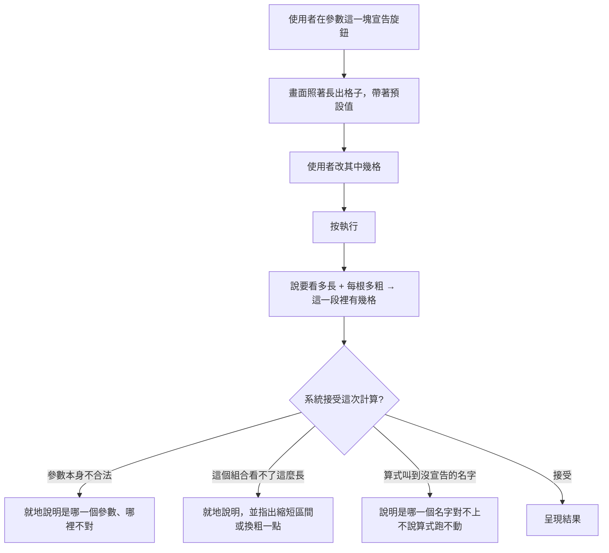

# Product Requirements Document (PRD)

**Feature:** 在指標計算畫面上調策略的旋鈕
**Status:** Finalized
**Version:** v1.0
**Owner:** James Hsueh
**Stakeholders:** 前端（go-trading-frontend）

---

## 1. Background & Goal (Why & Goal)

- **Problem Statement:**
  畫面上有一格「計算根數」，而使用者答不出來該填多少。他想同時看快線、中線、慢線
  三條均線，並在執行的當下把快線從二十期改成五十期——**不必去改算式**。
  現在那三個期數寫死在算式裡，而「計算根數」只有一格，他得自己算出三者的最大值。

- **Expected Outcome:**
  使用者在這個畫面上宣告策略的參數、就地調整它們，並且**再也不必回答「要幾根」**——
  他說的是「我要看最近一小時」，剩下的系統自己算。

- **Out of Scope:**
  - K 線圖表上的參數（每一份各自的值、同一支策略套用多次、顏色怎麼分）。
  - 是非、下拉選單之類的參數種類。
  - 由系統去讀算式、猜出它需要哪些參數。
  - 參數之間互相依賴的規則。
  - 在畫面上把「這一次的值」與「存起來的預設值」分成兩格。
  - 彙總刻度的既有規則（它仍屬於這一次計算，不跟著策略存）。

---

## 2. User Personas

- **Primary Role(s):** 自己寫策略、也自己看行情的人（本專案作者本人）。
- **Usage Context:**
  寫好一支算法之後，會反覆調整它的數字來比較——二十期跟五十期哪個好、
  倍數兩倍跟兩倍半差在哪。每調一次就重跑一次。

---

## 3. User Stories & Acceptance Criteria

### US-01 — 在這裡宣告策略的參數 [priority: P0]

**As a** 寫策略的人，**I want** 在寫算式的地方宣告它有哪些旋鈕，
**so that** 那些數字不必寫死在算式裡。

```gherkin
Scenario: 新增一個參數
  Given 參數這一塊是空的
  When 按下新增
  Then 多出一列，名稱是空的、種類是回看根數、預設值是 20

Scenario: 參數跟著策略一起存
  Given 已宣告「期數」是回看根數、預設 20
  When 把它存成一支策略
  Then 那個參數連同種類與預設值都被存起來

Scenario: 載入策略時參數跟著換
  Given 一支已存的策略帶著「期數」與「倍數」
  When 載入它
  Then 參數這一塊換成那兩個，連同它們的種類與預設值

Scenario: 刪掉一個參數
  Given 已宣告兩個參數
  When 刪掉其中一個
  Then 參數這一塊只剩另一個

Scenario: 一個參數都不宣告時照常運作
  Given 一個參數都沒有宣告
  When 執行計算
  Then 計算照常進行，與沒有這項功能時完全相同

Scenario: 改動參數算是還沒存的東西
  Given 一支已載入的策略
  When 改掉某個參數的預設值
  Then 畫面把它當成還沒存的變更，與改動算式內容一樣

Scenario: 名稱是空的就地說明
  Given 某個參數的名稱是空白
  When 執行計算
  Then 就地說明參數名稱不得為空白

Scenario: 名稱重複就地說明
  Given 兩個參數都叫「期數」
  When 執行計算
  Then 就地說明參數名稱不得重複

Scenario: 回看根數不合法就地說明
  Given 一個回看根數的值是 0
  When 執行計算
  Then 就地說明回看根數必須是大於零的整數
```

### US-02 — 再也不必回答「要幾根」 [priority: P0]

**As a** 執行計算的人，**I want** 說「我要看多長」而不是「我要幾根」，
**so that** 我不必替算式記帳，也不必換算刻度。

```gherkin
Scenario: 說要看多長就夠了
  Given 要看的是一小時，每根五分鐘
  When 執行計算
  Then 這次計算涵蓋那一小時裡的 12 格

Scenario: 換粗一點的刻度，同一段時間裡的格數跟著變
  Given 要看的是一小時，每根一小時
  When 執行計算
  Then 這次計算涵蓋 1 格

Scenario: 有回看根數時使用者仍然一格都不必填
  Given 已宣告「期數」是回看根數、預設 20
  And 要看的是一小時，每根五分鐘
  When 執行計算
  Then 計算照常完成
  And 使用者沒有被問過任何關於根數的問題

Scenario: 畫面上沒有「計算根數」這一格
  Given 打開指標計算畫面
  When 看執行條件那一塊
  Then 找不到「計算根數」
  And 找得到「要看多長」

Scenario: 看不了那麼長就地說明
  Given 要看的是一年，每根五分鐘
  When 執行計算
  Then 就地說明這個組合看不了這麼長
  And 指出可以縮短區間或換粗一點的刻度
```

### US-03 — 算式叫到不存在的名字時 [priority: P0]

**As a** 寫算式的人，**I want** 名字對不上時被指名，
**so that** 我不會盯著一段其實沒問題的算式看很久。

```gherkin
Scenario: 名字對不上就失敗並指名
  Given 宣告的參數叫「週期」
  And 算式取用的是「期數」
  When 執行計算
  Then 這次計算失敗
  And 說明「期數」這個名字沒有被宣告

Scenario: 它與「算式跑不動」是兩則不同的說明
  Given 上一個情境的失敗
  When 看畫面
  Then 那則說明指出的是哪一個名字對不上
  And 畫面沒有說算式本身跑不動

Scenario: 把名字改對就算得出來
  Given 上一個情境的失敗
  When 把算式裡的名字改成「週期」並再執行一次
  Then 正常算出結果
```

---

## 4. Business Flow & Logic



**Core Business Rules**

- **參數是策略內容**，與算式內容、指標值種類同一個層級：載入時跟著換，
  改動算是還沒存的東西。
- **參數種類只有兩種**：回看根數與數值。
- **新增出來的那一列**：名稱空白、種類是回看根數、預設值 20。
- **畫面上只有一組數字**：改的那個值既是這一次要用的，也是存起來後的預設值。
- **「計算根數」不存在**；使用者說的是「要看多長」，格數由那一段的長度除以彙總刻度得出，
  至少一格。
- **「名字對不上」與「算式跑不動」是兩則不同的說明**——要去改的地方完全不同。

**Edge Cases**

- 要看的那一段比一根還短 → 仍然是一格。
- 一個參數都不宣告 → 與沒有這項功能時完全相同。
- 看一年配五分鐘一根 → 就地說明看不了這麼長，並指出兩條出路。

---

## 5. UI/UX Design & Interaction

- **參數這一塊放在算式旁邊**，與指標值種類同一區——它們都是「這支算法是什麼」。
  執行條件那一區只留交易標的、要看多長、彙總刻度。
- 每一列是：參數名稱、參數種類、值，加一顆移除鈕。整塊底下一顆「新增參數」。
- 一個參數都沒有時，那一塊明說「這支算式沒有可調的東西」，而不是一片空白。
- 失敗的呈現沿用既有的分流：**「名字對不上」自成一則**，
  與「算式跑不動」「欄位錯」「連不上」並列而不混在一起。

---

## 6. Non-Functional Requirements

- **Performance:** 參數不改變計算的成本。畫面上多幾格輸入不影響任何既有互動。
- **Security:** 無新增。參數只影響這一次計算與這支策略記著的內容。
- **Compatibility:** 無新增依賴。
- **Analytics / Tracking:** N/A。

---

## 7. Dependencies & Risks

**External Dependencies:**

- **系統那一側的策略參數能力**（go-trading 的 `.sdd/2026-09-04-strategy-parameters/`）。
  **它尚未併入主線。** 本地測試時，系統那一側必須切到對應的分支執行，
  否則參數欄位不存在，畫面送出去的宣告會被當成沒送。

**Known Risks:**

- **「畫面上只有一組數字」在這個畫面成立，在圖表上不成立。**
  這裡是寫算式的地方，試一個值與定一個預設值是同一件事；
  但在圖表上套用的是一支**已經存好**的策略，那時「這一次調成 50」不該改動它的預設值。
  那是另一個切片，兩邊的決定必須各自成立而不互相引用。
- **「看不了那麼長」的說明來自系統那一側**，它說得出用到幾根與上限是多少。
  畫面要把它放在使用者能據以行動的位置——那是「要看多長」與「彙總刻度」兩格旁邊，
  而不是一則籠統的錯誤。

---

## 8. Appendix

- 需求共識：`BRIEF.md`（同一資料夾）
- 系統那一側：go-trading 的 `.sdd/2026-09-04-strategy-parameters/`
- 下一個切片（圖表那一側）：尚未建立
- 通用語言：`.sdd/UL-MAP.md`
