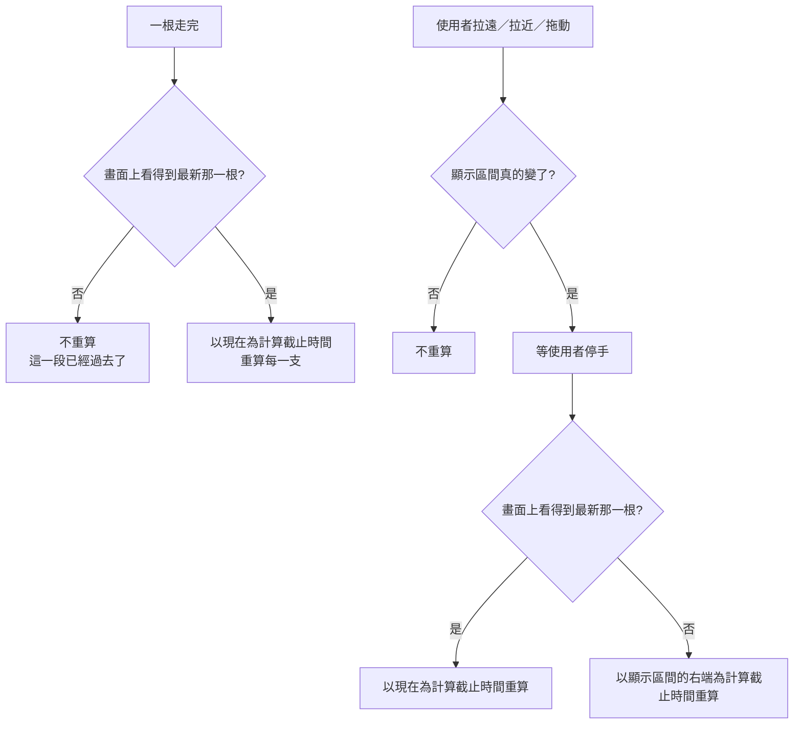

# Product Requirements Document (PRD)

**Feature:** 看現在的時候，指標也要跟著現在
**Status:** Finalized
**Version:** v1.0
**Owner:** James Hsueh
**Stakeholders:** 前端（go-trading-frontend）

---

## 1. Background & Goal (Why & Goal)

- **Problem Statement:**
  圖上最後那一根已經跟著市場跳動了，指標卻沒有。指標的**計算截止時間**取自
  顯示區間的右端，而顯示區間只在使用者親手動它時才更新。於是他盯著一根正在跳的 K 線，
  指標回答的卻是「他上次動畫面的那一刻」。一根走完時雖然重算了，
  但截止時間沒動，算出來一模一樣——那次重算是白算的。

- **Expected Outcome:**
  使用者在看最新的行情時，指標也算到現在，一根走完答案就往前走一格。
  往回看一段過去的行情時維持不動——那時不動才是對的。

- **Out of Scope:**
  - 讓圖自己捲動去追最新那一根。
  - 在畫面上標出「現在算到哪一刻」。
  - 讓使用者手動指定計算截止時間。
  - 改變「看哪一段」的任何規則（怎麼推彙總刻度、什麼時候重新取資料）。
  - 改變即時更新本身（多久送一次、停掉怎麼呈現）。
  - 指標線的顏色、粗細、線型。

---

## 2. User Personas

- **Primary Role(s):** 看行情、並且自己寫策略的人（本專案作者本人）。
- **Usage Context:**
  畫面一開就是好幾個小時，多數時間盯著最新的行情；偶爾往回拖去看一段已經過去的走勢，
  看完再拖回來。

---

## 3. User Stories & Acceptance Criteria

### US-01 — 在看現在，就算到現在 [priority: P0]

**As a** 看行情的人，**I want** 我在看最新行情時指標也算到現在，
**so that** 圖上那一根在跳、指標卻停著這件事不再發生。

```gherkin
Scenario: 一根走完，指標的答案往前走一格
  Given 畫面上看得到最新那一根
  And 已套用一支「這段區間的最高價」的策略
  When 一根走完
  Then 那一支以現在重算
  And 圖上的值換成把新那一根算進去之後的值

Scenario: 放著不動也一直跟著走
  Given 畫面上看得到最新那一根
  And 使用者一整天沒有碰過畫面，期間走完了好幾根
  When 看那一支的指標
  Then 它算到的是現在
  And 不是他早上打開畫面的那一刻

Scenario: 往回拖一點但最新那一根還看得見，仍然算到現在
  Given 使用者往回拖了一點
  And 最新那一根仍然看得見
  When 一根走完
  Then 那一支仍然以現在重算

Scenario: 一支都沒套用時，一根走完不發生任何計算
  Given 一支策略都沒套用
  And 畫面上看得到最新那一根
  When 一根走完
  Then 不發生任何計算
```

### US-02 — 在看過去，就停在那一段 [priority: P0]

**As a** 看行情的人，**I want** 我往回看時指標停在那一段，
**so that** 一段已經過去的行情不會因為現在又走完一根而改變答案。

```gherkin
Scenario: 看不見最新那一根時，一根走完不重算
  Given 使用者往回拖到看不見最新那一根
  And 已套用一支策略
  When 一根走完
  Then 不重算
  And 指標仍是那一段的答案

Scenario: 待再久答案也不變
  Given 使用者在看不見最新那一根的位置待了一小時
  And 期間走完了十二根
  When 看那一支的指標
  Then 它的值一次都沒有變過

Scenario: 拖回來看得見最新那一根時，重新跟著現在
  Given 使用者原本看不見最新那一根
  When 他往前拖到看得見最新那一根並停手
  Then 那一支重算
  And 算到的是現在
```

### US-03 — 「看哪一段」與「算到哪一刻」互不干擾 [priority: P0]

**As a** 看行情的人，**I want** 這兩件事分開，
**so that** 我換一段看不會意外改變它算到哪一刻，反之亦然。

```gherkin
Scenario: 換一段仍在看現在時，算的是新那一段、算到現在
  Given 畫面上看得到最新那一根，顯示區間是最近三小時
  When 使用者拉遠成最近三天，最新那一根仍然看得見
  Then 以最近三天這一段重算
  And 算到的是現在

Scenario: 換一段在看過去時，算到那一段的右端
  Given 使用者看不見最新那一根，顯示區間是 06:00 到 09:00
  When 他拖到 03:00 到 06:00 並停手
  Then 以 03:00 到 06:00 這一段重算
  And 算到的是 06:00

Scenario: 顯示區間沒真的變就不重算
  Given 畫面上看得到最新那一根
  When 拖動後的顯示區間與上次完全相同
  Then 不重算

Scenario: 還在拖的時候不重算
  Given 畫面上看得到最新那一根
  When 使用者還在拖、沒有停手
  Then 不發生任何計算
```

### US-04 — 看過去時，圖照樣跟著市場走 [priority: P1]

**As a** 看行情的人，**I want** 我往回看時圖仍在更新，
**so that** 我拖回來看到的就是最新的，不必重新整理。

```gherkin
Scenario: 看不見最新那一根時，它照樣在更新
  Given 使用者往回拖到看不見最新那一根
  When 市場成交價變動
  Then 最新那一根跟著更新
  And 使用者這時看不到它

Scenario: 拖回來就是最新的
  Given 使用者往回看期間市場動過好幾次
  When 他往前拖回到看得見最新那一根
  Then 他看到的是最新的那一根
  And 不需要重新整理畫面

Scenario: 即時更新停掉時照樣明說，與在看哪一段無關
  Given 使用者往回拖到看不見最新那一根
  When 即時更新停止
  Then 畫面明說即時更新已停止
```

---

## 4. Business Flow & Logic



**Core Business Rules**

- **「在看現在」的判準是「畫面上看得到最新那一根」**：顯示區間的右端在最新那一根的
  起始時間**之後（含）**。不用任何時間門檻。
- **在看現在時，計算截止時間就是現在**——不由畫面指定，交給系統自己判斷。
- **在看過去時，計算截止時間是顯示區間的右端。**
- **「一根走完就重算」只在看現在時成立**。看過去時，一根走完與他正在看的那一段無關。
- **既有規則一字不改**：顯示區間沒真的變就不重算；停手三百毫秒才算；
  拖動期間不算；每一支各記自己第幾次要求，只採用最新那一次。
- **即時更新不因為使用者往回看而停下來**：最新那一根照樣更新，只是他看不到。

**Edge Cases**

- **最新那一根剛好卡在畫面邊緣** → **算看得見**。凍住比跟著走更容易讓人困惑
  （他明明拖到了最新那一根卻發現指標不動），兩種誤判的代價不對稱。
- **從看過去切回看現在** → 走既有那條路徑，**等停手才算**。切回來的動作本身就是拖動，
  而拖動途中必然經過「剛好看得見最新那一根」的瞬間，立刻算等於在拖動途中算。
- **圖上還沒有任何 K 線** → 沒有「最新那一根」可比，不發計算。

---

## 5. UI/UX Design & Interaction

畫面不新增任何東西。兩種情況下的行為都符合直覺——看現在時指標跟著動、
看過去時指標停著——使用者不會問「為什麼它停了」，因為他知道自己正在看一段過去的行情。
**多一行說明是在解釋一件不需要解釋的事**，而畫面上每多一行字，
真正需要被看見的那幾行就少一分注意力。

---

## 6. Non-Functional Requirements

- **Performance:**
  在看現在時，一根走完才重算一次——五分鐘一次，不必節流。
  看過去時完全不重算，比現在更省。

- **Security:** 無新增。

- **Compatibility:** 無新增依賴。

- **Analytics / Tracking:** N/A。

---

## 7. Dependencies & Risks

**External Dependencies:**

- **系統對「計算截止時間」的既有規定**：未指定時視為現在，指向未來時視同現在。
  本切片正是建立在它之上——「跟著市場走」不是新增機制，**而是不要去指定它**。

**收窄（而非取代）前一切片的一條規則：**

`.sdd/2026-09-03-live-chart-updates/` 定下「一根走完就重算每一支」。
本切片為它加上一個條件：**只有在看現在時才重算**。

這**不算取代**，因為那條規則的理由完全沒有改變——它的理由是
「那一刻指標可用的資料真的多了一根」。而使用者在看過去時，
多出來的那一根**不在他看的那一段裡**，所以「可用的資料多了」對他的問題並不成立。
本切片只是把那條規則的適用範圍講清楚，原本的意思一字未改。

其餘四條（觸發是顯示區間變了、停手才算、沒真的變就不算、較新的那次勝出）**完全不動**。

**Known Risks:**

- **判準依賴「最新那一根」存在。** 圖上一根 K 線都沒有時沒有東西可比，
  此時不發計算——與既有行為一致，不引入新的例外。
- **看現在時，答案會自己變。** 這正是本切片要的，但它也表示使用者截圖下來的指標值，
  幾分鐘後再看可能已經不同。這是「跟著市場走」的必然代價，
  且與圖上那一根會變是同一件事。

---

## 8. Appendix

- 需求共識：`BRIEF.md`（同一資料夾）
- 被收窄的規則：`.sdd/2026-09-03-live-chart-updates/`
- 計算截止時間的既有定義：go-trading 的 `.sdd/UL-MAP.md`
- 通用語言：`.sdd/UL-MAP.md`
