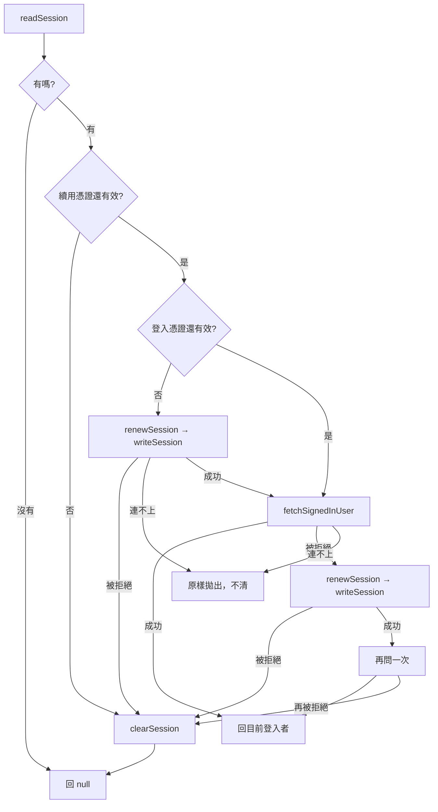

# 不必天天重登 — Architecture Design

**Status:** Draft
**Source PRD:** `.sdd/2026-09-05-session-renewal/PRD.md`
**Tech context:** Nuxt 3 · Vue 3 SFC · TypeScript · Clean/Onion

---

## 1. Design Goal & Guiding Principle

- **In one sentence:**
  讓「還原登入狀態」這件事能自己把過期的憑證修好，而畫面、把關、登入卡片一個字都不必改。

- **Guiding principle:**
  **修不修得好，是 domain service 的事；畫面連知道都不必知道。**

  這個切片的每一條規則——先看續用憑證再看登入憑證、被拒絕時試一次、
  試一次就是一次、連不上不等於壞掉——全部落在 `UserSessionService.restoreSession` 裡面。
  它對外的形狀**一個字都沒變**：收一個「現在」，回一位目前登入者或 `null`。

  所以 composable 不變、中介層不變、頁面不變。**一個切片改了系統的行為，卻沒有改任何一個呼叫端**，
  就是這一層當初把邊界畫對了的證據。

---

## 2. Change Scope

| Area | Action | What / Why |
| :--- | :--- | :--- |
| `app/domain/models/entities/access-token.ts` | **Replace** | 換成 `Session`：一對憑證與兩個到期時刻 |
| `app/domain/models/domains/access-token-domain.ts` | **Replace** | 換成 `SessionDomain`：兩份各自還算不算數 |
| `app/domain/interface/i-user-proxy.ts` | **Modify** | `signIn` 回 `Session`；多 `renewSession`、`revokeSession` |
| `app/domain/interface/i-access-token-storage-proxy.ts` | **Rename** | 成 `ISessionStorageProxy`——它記的已經不是一份憑證了 |
| `app/domain/service/user-session-service.ts` | **Modify** | `restoreSession` 長出修復邏輯；`signOut` 先告訴後端 |
| `app/infrastructure/proxy/user-proxy.ts` | **Modify** | 收下一對憑證；多兩條路 |
| `app/infrastructure/proxy/access-token-storage-proxy.ts` | **Rename／Modify** | 成 `SessionStorageProxy`，記一對 |
| `app/application/user-session-application.ts` | **Modify** | `signOut` 變成非同步（它現在要打後端） |
| `app/composables/use-user-session.ts` | **Modify** | 只有一行：`signOut` 要 `await` |
| `app/plugins/dependencies.ts` | **Modify** | 換一個 proxy 名字 |
| 登入畫面、把關中介層、五個畫面、側欄那一行 | **Not touched** | 這個切片對它們完全不可見 |
| 既有 K 線／指標／策略／助手的 proxy | **Not touched** | 後端仍然不問那些請求來者是誰（見 PRD §1） |

---

## 3. New / Changed Classes

### 3.1 Domain — Entity

| Name | Responsibility |
| :--- | :--- |
| `Session` | 這台瀏覽器手上的一段登入階段：登入憑證＋它的到期時刻，續用憑證＋它的到期時刻。附 `toDomain()` |

取代 `AccessToken`。**不是在它上面加兩個欄位而是換一個名字**，理由與後端那一側相同：
它裝的已經不是「一份登入憑證」了，沿用舊名會讓每個讀到它的人先誤會一次。

### 3.2 Domain — Domain Model

| Name | Responsibility |
| :--- | :--- |
| `SessionDomain` | `accessTokenUsable(now)`、`refreshTokenUsable(now)`、`accessToken()`、`refreshToken()`，以及 `withTokens(session)` |

**兩個「還算不算數」分開問**，因為它們導向不同的動作：登入憑證過期 → 去換一份；
續用憑證過期 → 沒救了，回登入畫面。合成一個布林，這個切片就沒有東西可做了。

### 3.3 Domain — Interfaces

| Name | 變更 |
| :--- | :--- |
| `IUserProxy` | `signIn` 回 `Session`；新增 `renewSession(refreshToken)` 回 `Session`、`revokeSession(refreshToken)` 回 `void` |
| `ISessionStorageProxy` | 由 `IAccessTokenStorageProxy` 更名。`readSession` / `writeSession` / `clearSession`，**三個方法一樣都不拋** |

`revokeSession` 的介面註解要寫明它**允許失敗**——呼叫端已經決定失敗不影響登出。

### 3.4 Domain — Service

`UserSessionService` 的公開形狀維持四個用例，只有兩個的內部變了：

| Method | 變更 |
| :--- | :--- |
| `registerUser` / `signIn` | 記的東西從一份變一對，其餘不變 |
| `restoreSession` | **長出全部的修復邏輯**（見下方流程），對外形狀不變 |
| `signOut` | 先請後端撤掉，再清本機。**後端失敗不影響清本機**，且變成非同步 |

私有 helper `rememberedSignIn` 已存在且仍被兩個公開方法共用。
新增 `renewedSession(refreshToken)`——換一對、記起來、回傳，被 `restoreSession` 的兩條路共用。

### 3.5 Infrastructure

| Name | 變更 |
| :--- | :--- |
| `UserProxy` | 收下四個欄位；多兩條路。續用被拒絕沿用 `AuthenticationRequiredError`——**與「憑證不算數」是同一件事**，不新增第二種錯誤 |
| `SessionStorageProxy` | 由 `AccessTokenStorageProxy` 更名，記一對。壞掉的紀錄仍然當成沒有 |

---

## 4. `restoreSession` 的流程

**「試一次」的邊界寫在結構裡，不是寫在一個計數器裡。** 第二次問被拒絕時直接放棄，
沒有迴圈也沒有 retry 次數——一個可以調的次數，總有一天會被調成二。

**而且「這一趟有沒有換過」必須先記下來。** 走上面那條路（登入憑證已經過期）換過之後，
手上原本那份續用憑證**在後端已經作廢了**；此時若拿它再換一次，會被判定為盜用，
把這台裝置整條登入階段撤掉——使用者從「重登一次」變成「連另一台也被登出」。
所以換過之後再被拒絕，就直接放棄。

「被拒絕」在這裡是一個**回傳值**（`signedInUserOrRefused` 回 `null`），不是例外。
兩個地方都要問同一件事，而它們對「被拒絕」的下一步不同；用例外表達的話，
那個唯一的差別會藏進兩段幾乎一樣的 try/catch 的 catch 裡。

---

## 5. Extensibility & Handoff Notes

- **最可能的下一個需求：後端替行情端點也裝上門。**
  落點仍然是 `BackendApiProxy`：注入 `ISessionStorageProxy` 統一附上標頭，
  並在 401 時走一次換發後重試。**這個切片讓那件事變簡單了**——換發已經是
  `UserSessionService` 的一個能力，那時候只要把它接上去。
  - 一併要處理的仍然是 `LiveKCandleProxy`：持續連線送不出授權標頭。
- **第二可能：背景定時換發**（趁使用者還在用時先換好）。落點是 `useUserSession` 的一個計時器。
  **訊號**是使用者抱怨「放著一陣子回來，第一次點什麼都要等一下」。
- **不得寫死：** 後端位址、登入後的預設去處。
- **刻意留簡單的：**
  - **不做前端的換發鎖。** 兩個分頁同時換發會互相踩到，後端會判定盜用並把兩邊都登出。
    做鎖等於在瀏覽器裡實作跨分頁互斥，複雜度遠高於它換到的東西。
    **訊號**是使用者常態開很多分頁而且真的被踩到。

---

## 6. Traceability

| PRD Scenario | Fulfilled by |
| :--- | :--- |
| US-01 記住一對／建立帳號後直接登入 | `UserSessionService.rememberedSignIn` + `SessionStorageProxy` |
| US-01 記著的東西壞掉時當成沒有 | `SessionStorageProxy.readSession` |
| US-01 記不住時這一次仍然能用 | `SessionStorageProxy`（三個方法都不拋） |
| US-02 兩份都有效時不換發 | `SessionDomain.accessTokenUsable` |
| US-02 登入憑證過期就先換 | `restoreSession` 的第一條換發路徑 |
| US-02 續用憑證也過期就當作沒登入且不打後端 | `SessionDomain.refreshTokenUsable` |
| US-02 沒有記住任何東西 | `restoreSession` 的第一個判斷 |
| US-03 被拒絕時試一次、成功就重問 | `restoreSession` 的第二條換發路徑 |
| US-03 換發也失敗就放棄且不再試 | 同上（結構上沒有第三次） |
| US-03 連不上不丟掉記著的東西 | `restoreSession` 只對 `AuthenticationRequiredError` 清除 |
| US-04 登出請後端撤掉 | `UserSessionService.signOut` → `IUserProxy.revokeSession` |
| US-04 後端連不上時登出仍然成功 | `signOut` 吞掉後端的失敗 |
| US-04 沒有東西可撤時不打擾後端 | `signOut` 先讀本機 |

---

## 7. Risks & Open Decisions

- **Risks:**
  - **登出仍然有一個尾巴**（後端撤不掉已發出的登入憑證）。這是後端的取捨。
  - **兩個分頁同時換發會互相踩到。** 見 §5 的「刻意留簡單的」。
- **Open decisions（留給實作）:** 瀏覽器儲存的鍵要不要換掉。
  換掉的話所有人被登出一次；不換的話舊格式會被當成壞掉的紀錄——**結果一樣是登出一次**，
  所以沿用同一個鍵即可，少一個要記得的東西。
