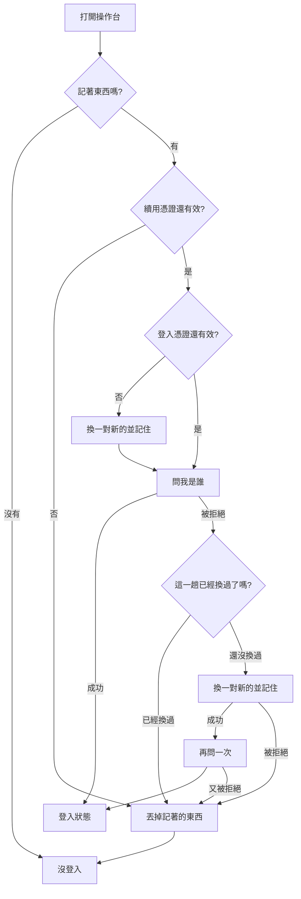

# Product Requirements Document (PRD)

**Feature:** 不必天天重登
**Status:** Draft
**Version:** v1.0
**Owner:** James Hsueh
**Stakeholders:** Engineering

---

## 1. Background & Goal (Why & Goal)

- **Problem Statement:**
  上一個切片的門有兩個講不過去的地方：**登出是假的**（前端丟掉憑證，後端照樣認到它自己過期），
  以及**每天都要重登**（為了壓短上面那個窗口，憑證只給 24 小時）。
  後端這一輪把憑證拆成一對來解決它，但畫面還在照舊只收一份。

- **Expected Outcome:**
  1. 使用者好幾週不必重打密碼；登入憑證過期時畫面**自己去換**，他看不到任何異狀。
  2. 按下登出，**後端真的被告知**，那台裝置從此換不到任何東西。
  3. 後端沒開的時候，登出**仍然成功**，畫面照樣回到登入畫面。
  4. 換發被拒絕時**不重試**——重試只會踩到後端的盜用偵測，把「需要重登」升級成「連別台也被登出」。

- **Out of Scope:**
  - 替 K 線／指標／策略／助手的呼叫自動附上憑證與自動換發重試。後端那些端點仍然不問來者是誰。
  - 裝置清單、登出其他所有裝置、背景定時換發、顯示到期倒數。
  - 登入畫面本身的任何改動。

---

## 2. User Personas

- **Primary Role(s):** **使用者**——這台操作台的主人。
- **Usage Context:** 每天打開就直接能用；離開幾週再回來才需要重登。按下登出時，希望它是真的。

---

## 3. User Stories & Acceptance Criteria

### US-01 — 記住的是一對憑證 [priority: P0]

**As a** 使用者，**I want** 這台瀏覽器把兩份憑證都記住，
**so that** 登入憑證過期時還有東西可以拿去換。

```gherkin
Scenario: 登入成功記住兩份憑證與兩個到期時刻
  Given 使用者的帳密正確
  When 使用者登入
  Then 這台瀏覽器記住登入憑證與它的到期時刻
  And 也記住續用憑證與它的到期時刻

Scenario: 建立帳號成功後同樣記住一對
  Given 使用者填了合法的電子郵件與密碼
  When 使用者建立帳號並成功
  Then 這台瀏覽器記住兩份憑證
  And 使用者直接就是登入狀態

Scenario: 記著的東西壞掉時當成沒有記過
  Given 這台瀏覽器記著的內容少了其中一半
  When 使用者打開操作台
  Then 視同沒有登入

Scenario: 瀏覽器記不住東西時這一次仍然能用
  Given 瀏覽器把儲存關掉了
  When 使用者登入成功
  Then 登入本身成功，這一次操作得起來
  And 不會因為記不住而顯示錯誤
```

### US-02 — 打開操作台時，能自己修好的就自己修 [priority: P0]

**As a** 使用者，**I want** 登入憑證過期時畫面自己去換一份，
**so that** 我不必為了一個我根本看不到的期限重打密碼。

```gherkin
Scenario: 兩份都還有效時不做多餘的事
  Given 這台瀏覽器記著的兩份憑證都還有效
  When 使用者打開操作台
  Then 直接問出目前登入者
  And 不會去換發

Scenario: 登入憑證過期就先換一對新的
  Given 登入憑證已經過期，續用憑證還有效
  When 使用者打開操作台
  Then 先換得一對新的憑證並記住
  And 接著問出目前登入者
  And 使用者看不到任何異狀

Scenario: 續用憑證也過期就當作沒登入
  Given 續用憑證已經過期
  When 使用者打開操作台
  Then 視同沒有登入
  And 不會向後端送出任何東西
  And 記著的東西被丟掉

Scenario: 沒有記住任何東西
  Given 這台瀏覽器沒有記住任何憑證
  When 使用者打開操作台
  Then 視同沒有登入
  And 不會向後端送出任何東西
```

### US-03 — 被拒絕時試著換一次，就一次 [priority: P0]

**As a** 系統的主人，**I want** 換發失敗之後不再重試，
**so that** 一次可以自己修好的小問題不會被放大成整條登入階段被撤掉。

```gherkin
Scenario: 問出目前登入者被拒絕時試著換一次
  Given 記著的兩份憑證看起來都還有效
  And 後端拒絕了這份登入憑證
  When 使用者打開操作台
  Then 系統換一對新的憑證
  And 用新的再問一次，並得到目前登入者

Scenario: 換發也被拒絕就當作沒登入，而且不再試
  Given 承上，換發同樣被後端拒絕
  When 使用者打開操作台
  Then 視同沒有登入
  And 記著的東西被丟掉
  And 不會再嘗試換發第二次

Scenario: 連不上後端不代表憑證壞了
  Given 登入憑證已經過期，續用憑證還有效
  And 後端沒有啟動
  When 使用者打開操作台
  Then 回報連不上後端
  And 記著的東西**不會**被丟掉
```

### US-04 — 登出時真的去告訴後端 [priority: P0]

**As a** 使用者，**I want** 按下登出時後端真的把那台裝置收掉，
**so that** 「登出」這兩個字是可信的。

```gherkin
Scenario: 登出會請後端撤掉這段登入階段
  Given 使用者已經登入
  When 使用者按下登出
  Then 後端被請求撤掉這段登入階段
  And 這台瀏覽器不再記著任何憑證
  And 使用者回到登入畫面

Scenario: 後端連不上時登出仍然成功
  Given 使用者已經登入，而後端沒有啟動
  When 使用者按下登出
  Then 這台瀏覽器照樣不再記著任何憑證
  And 使用者照樣回到登入畫面
  And 畫面上不出現錯誤

Scenario: 沒有東西可以撤時不打擾後端
  Given 這台瀏覽器沒有記住任何憑證
  When 使用者按下登出
  Then 不會向後端送出任何東西
  And 使用者回到登入畫面
```

---

## 4. Business Flow & Logic



- **Core Business Rules:**
  - **能先算出來的答案就不要去問。** 續用憑證自己就知道已經過期時，不打後端——
    那是一趟答案早就確定的來回。
  - **換發只試一次，而且「這一趟有沒有換過」要先記下來。**
    走上面那條路（登入憑證已經過期）換過之後，手上原本那份續用憑證**在後端已經作廢了**；
    此時若拿它再換一次，後端會判定為盜用並撤掉整條鏈——把「這台需要重登」
    升級成「這個人所有裝置都被登出」。
  - **「被拒絕」與「連不上」是兩件事。** 前者代表憑證不算數，要丟掉；
    後者只代表後端沒開，丟掉的話使用者會在後端一啟動就被迫重登。
  - **登出在畫面上一定要成功。** 做不到的是「立刻讓後端也忘記」，
    而使用者能做的只有稍後再登出一次——那不值得攔住他。

- **Edge Cases:**
  - 兩個分頁同時打開、同時換發 → 其中一個會踩到後端的盜用偵測，兩邊都被登出。
    這是後端那一側刻意接受的誤判，前端不另外處理（處理它就等於在前端做鎖）。
  - 換發成功但記不住 → 這一次仍然可用，下次打開要重登。
  - **換發送出去了，但回應沒有回到瀏覽器**（重新整理、網路斷、電腦睡著）→
    後端其實已經換過了，本機卻還留著舊的那一份。下一次打開會把它再送一次，
    於是被判定盜用、整條鏈被撤掉，使用者得重新登入。
    **這是刻意保留的**：另一種做法是「換發一失敗就把記著的東西丟掉」，
    而那會讓「後端只是還沒啟動」這個常見得多的情況直接把人登出。
    真正的解法在後端——給剛換發過的那一份幾秒鐘的寬限期，
    在那段時間內重放只回絕、不撤鏈。目前不做（見 §7）。

---

## 5. UI/UX Design & Interaction

**畫面一個字都不改。** 這個切片全部發生在使用者看不到的地方——
那正是它成功的樣子：他只會發現自己不必天天重登了。

唯一看得見的差別是登出之後真的登出了，而那在畫面上與之前完全相同。

---

## 6. Non-Functional Requirements

- **Security:** 兩份憑證都只放在這台瀏覽器的儲存裡，不進網址、不寫進紀錄。
- **Performance:** 常態是一趟（我是誰）。登入憑證過期時兩趟（換發 + 我是誰）；
  憑證看起來還有效卻被後端拒絕時**三趟**（我是誰 → 換發 → 我是誰），那是最壞的情況。
- **Compatibility:** 既有五個畫面、登入畫面、把關規則的行為完全不變。

---

## 7. Dependencies & Risks

- **External Dependencies:** 後端的 `POST /sessions/renewal` 與 `POST /sessions/revocation`。
- **Known Risks:**
  - **登出仍然有一個尾巴**：後端撤得掉續用憑證，撤不掉已經發出去的登入憑證，
    所以最長還有它的有效期限（預設 15 分鐘）那麼久仍然通得過。這是後端的取捨，寫出來而不是假裝沒有。
  - **兩個分頁同時換發會互相踩到。** 見上方 Edge Cases。
  - **換發的回應遺失時，下一次打開會誤觸盜用偵測。** 見上方 Edge Cases。
    要處理的話做法在後端（寬限期），不在前端；**訊號**是使用者抱怨「重新整理一下就被登出」。

---

## 8. Appendix

- 需求共識：`.sdd/2026-09-05-session-renewal/BRIEF.md`
- 後端切片：`go-trading` 的 `.sdd/2026-09-05-session-renewal/`
- 前一個前端切片：`.sdd/2026-09-05-user-sign-in/`
