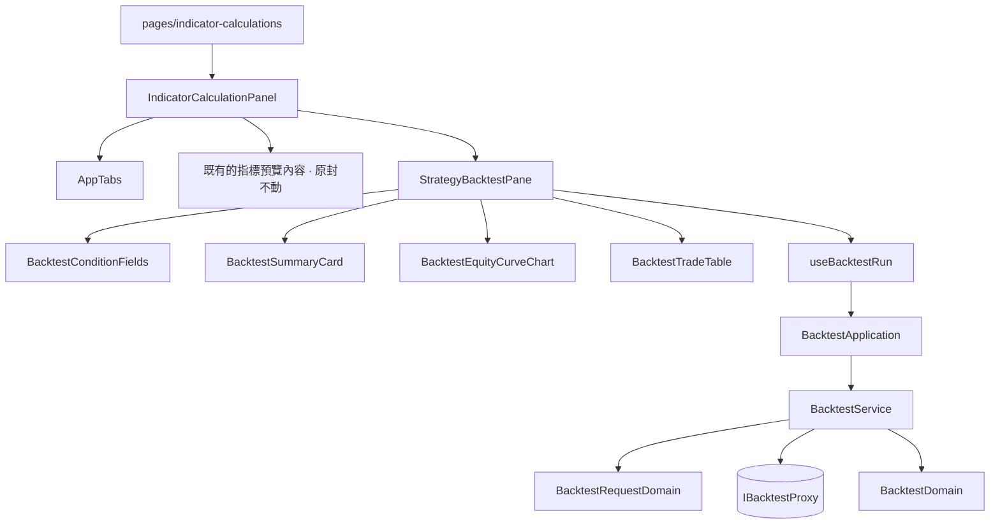

# 在寫策略的地方就把它重演一次 — Architecture Design

**Feature:** 策略回測（前端）
**Status:** Finalized
**PRD:** `PRD.md`（同一資料夾）
**Owner:** James Hsueh
**Tech context:** Nuxt 3 · Vue 3 · TypeScript · Clean/Onion Architecture · Atomic Design · lightweight-charts · decimal.js

---

## 1. Design Goal & Guiding Principle

三個問題必須正面回答，其餘都是它們的後果：

1. **兩個去處怎麼共用一份工作區，而不讓其中一邊擁有另一邊。**
2. **既有的指標預覽要怎麼一個字都不變。**
3. **「賺綠賠紅」「勝率不適用」這些呈現規則住在哪裡。**

指導原則：**工作區不屬於任何一個去處，所以它自己占一欄。**

這一句同時解決了前兩題。工作區（算式、策略、參數、市場、粗細）留在
`IndicatorCalculationPanel` 手上，兩個去處都只是右欄裡的一塊；
既有的指標預覽因此**原地不動**——它多的只是外面包了一層 `v-show`。
而編輯器在切換時完全不受影響，這正是本切片最核心的那條要求。

第三題的答案是規範早就寫好的：**規則不住在畫面上。**
一個數字該用什麼顏色、勝率算不算得出來、一段時間長什麼樣，
全部在 domain 決定，元件收到的 DTO 已經可以直接畫。

---

## 2. 核心決策一：左欄是工作區，右欄是去處

```
┌─ IndicatorCalculationPanel ──────────────────────────────────┐
│  策略列（挑策略／存／另存／改名／清單）        ← 共用、橫跨   │
├──────────────────────────┬───────────────────────────────────┤
│ 左欄：工作區（共用）      │ 右欄：去處                        │
│                          │  ┌ AppTabs ─────────────────┐     │
│  算式編輯器              │  │ 指標預覽 │ 回測         │     │
│  + 種類 / 參數 / 說明     │  └──────────────────────────┘     │
│                          │  ┌ v-show=預覽 ┐ ┌ v-show=回測 ┐ │
│                          │  │ 執行條件     │ │ Strategy    │ │
│                          │  │ → 提示       │ │ BacktestPane│ │
│                          │  │ → 結果       │ │             │ │
│                          │  └──────────────┘ └─────────────┘ │
└──────────────────────────┴───────────────────────────────────┘
```

**為什麼是兩個直欄**：左邊是**你在寫什麼**，右邊是**它算出什麼**——
每一台工作台（編輯器、筆記本、查詢頁）都是這個形狀。

它成立的前提是右欄真的填得滿。執行條件曾經是貼在頂上的一條橫列，
理由是「三個欄位撐不起一根側欄」；有了結果之後那個理由就不成立了——
撐起右欄的是成績單、資金曲線與交易明細，不是那三個欄位。

窄螢幕（`lg` 以下）兩欄疊起來：各半的寬度裝不下一段程式碼，而寫算式是這一頁存在的理由。

**為什麼是 `v-show` 而不是 `v-if`**：切過去再切回來，填到一半的本金、時間區間、
以及已經算出來的成績單都必須還在（PRD US-01）。`v-if` 會把那些狀態連同元件一起丟掉，
而把它們全部提到面板上只是把同一個問題換個地方擺——面板會開始知道回測有哪些欄位。

**為什麼工作區不進任何一個去處**：它是兩邊共用的那一份。放進其中一邊，
另一邊就得跟它借；放進去處底下的共用區塊，切換時它仍會被重新安排。
放在另一欄，它與去處完全無關——而 CodeMirror 編輯器因此一次都不會重新掛載。
這條由 `IndicatorCalculationPanelDestinations.spec.ts` 的巢狀結構斷言釘住。

**市場與彙總刻度**由面板持有，以 `v-model` 往兩個去處各發一份。
在哪一邊改都是改同一個 ref，「另一邊看到的就是改過的」不需要任何同步邏輯。

---

## 3. 核心決策二：回測整塊自成一個去處

`StrategyBacktestPane` 自己持有：時間區間、本金、押注模式與那一格的數字、
以及「最近那一次回測」的狀態（進行中／結果／五種失敗）。

它**不持有**工作區的任何一樣東西——那些以 props 進來。
因此它與指標預覽之間沒有任何直接關係：兩者都只認識面板。

**「工作區被換掉了」怎麼傳達**：面板在載入另一支策略或開一份空白策略時，
把一個 `workspaceGeneration` 數字加一。回測那一側看著它，變了就把上一次的結果清掉——
理由與指標預覽清掉自己的結果一模一樣：換了一份算式，上一次那次重演與畫面上這一份無關了。
用一個數字而不是比對算式內容，是因為後者每敲一個字都會變。

---

## 4. 核心決策三：呈現規則住在 domain

元件收到的 DTO 已經**可以直接畫**：

| 畫面上的東西 | DTO 帶的是 | 而不是 |
| :--- | :--- | :--- |
| 總報酬率 +25%（綠） | `'+25.00%'` 與 `'positive'` | 一個 `0.25` 讓元件自己判斷正負與小數位 |
| 勝率「不適用」 | `'不適用'` | 一個 `null` 讓元件自己想該說什麼 |
| 做多／做空 | `'做多'` | `'long'` 讓元件自己查表 |
| 每筆賺賠（紅） | `'-120.00'` 與 `'negative'` | 一個 `Decimal` 讓元件自己比大小、自己決定進位幾位 |

**金額也是直接可畫的**：DTO 帶的是**已經進位好的字串**——金額兩位小數，
價格最多八位並去掉尾端的零。精確小數是**算**用的，不是**看**用的：
口數是押注金額除以進場價，除出來動輒十幾位，於是「最後剩多少」會長成
`10219.284790870572…`，撐破自己那一格還蓋掉隔壁那一欄。
進位只發生在寫出來的那一刻，算的時候一位都不能少。
金額與價格分開進位，是因為量級天差地遠：帳戶餘額兩位小數綽綽有餘，
而一個標的的報價可能是 `0.00001234`，用兩位小數寫它會得到 `0.00`。

**唯一還是 `Decimal` 的是資金曲線的每一點**：它到繪圖那一刻才 `.toNumber()`，
與 K 線圖對價格的做法一致。繪圖函式庫只吃數字，那是繪圖的限制，
不是可以在別處把金額變成浮點數的許可。

---

## 5. Change Scope

### 新增

| 層 | 檔案 | 為什麼存在 |
| :--- | :--- | :--- |
| vo | `position-sizing-mode-vo.ts` | 三種押注模式與「旁邊那格要不要出現」 |
| vo | `position-direction-vo.ts` | 做多／做空與它們給人看的名字 |
| vo | `profit-tone-vo.ts` | 賺綠賠紅：一個數字該用什麼色調說 |
| entities | `backtest.ts` | 後端回來的東西在 domain 內的本體形狀 |
| domains | `backtest-time-range-domain.ts` | 起訖時間：預設值、起點不得晚於終點 |
| domains | `position-sizing-domain.ts` | 押注模式：旁邊那格要不要出現、值合不合法 |
| domains | `backtest-request-domain.ts` | 一次回測的條件：**送出前的每一條把關** |
| domains | `backtest-domain.ts` | 後端回來的東西 → 可以直接畫的形狀 |
| dto | `backtest-request-dto.ts` | 元件交給 application 的輸入形狀 |
| dto | `backtest-result-dto.ts` / `backtest-summary-dto.ts` / `closed-trade-dto.ts` / `equity-point-dto.ts` | domain 交給元件的唯一形狀 |
| dto | `position-sizing-mode-option-dto.ts` | 下拉選單上可以挑的每一個 |
| errors | `backtest-field-error.ts` | 哪一格出問題了——說明要留在那一格旁邊 |
| interface | `i-backtest-proxy.ts` | 「重演一次」這個能力 |
| service | `backtest-service.ts` | 編排：驗證 → 送出 → 轉成可以直接畫的形狀 |
| application | `backtest-application.ts` | 用例入口，另供畫面問預設值與選項 |
| proxy | `backtest-proxy.ts` | 打後端 `/backtests`，把 wire 正規化成 entity |
| composables | `use-backtest-run.ts` | 最近那一次回測：跑完了沒有、結果是什麼、哪一種失敗 |
| atoms | `AppTabs.vue` | 通用的去處切換（不認識任何領域概念） |
| molecules | `BacktestConditionFields.vue` | 回測要問的那幾格 |
| molecules | `BacktestSummaryCard.vue` | 成績單那六個數字 |
| molecules | `BacktestEquityCurveChart.vue` | 資金曲線 |
| molecules | `BacktestTradeTable.vue` | 交易明細，含「一筆都沒有」的說法 |
| organisms | `StrategyBacktestPane.vue` | 回測這一整個去處 |

### 修改

| 檔案 | 改什麼 | 為什麼必須 |
| :--- | :--- | :--- |
| `IndicatorCalculationPanel.vue` | 版面改成兩個直欄；加去處切換；既有的預覽內容原封包進 `v-show`；掛上回測去處；載入策略時把 `workspaceGeneration` 加一 | §2、§3 |
| `pages/indicator-calculations/index.vue` | 多注入一個 `$backtestApplication` | 頁面只做接線 |
| `plugins/dependencies.ts` | 組裝 proxy → service → application | 組裝根 |

### 刻意不動

| 區域 | 為什麼留在外面 |
| :--- | :--- |
| 指標預覽的每一行 | PRD 要求「一個字都沒變」。它唯一的改動是外面多了一層 `v-show` |
| `useIndicatorCalculationRun` | 回測有自己的一次，兩者的失敗種類不同（回測沒有「要看多長」那一格，卻有本金與押注） |
| 策略庫、參數宣告、算式編輯器 | 它們**就是**那份共用的工作區。本切片只是多一個去處用它們 |
| `KCandleChart` | 資金曲線是另一種圖（一條線、沒有 K 棒、沒有跟盤）。共用的是**繪圖函式庫**，不是那個元件 |

---

## 6. New Classes / Modules

| Name | Kind | Responsibility | Collaborators | Satisfies |
| :--- | :--- | :--- | :--- | :--- |
| `BacktestTimeRangeDomain` | Domain Model | 起訖時間：預設值（三十天前零點／昨天最後一刻）與「起點不得晚於終點」 | — | US-02 預設、US-03 時間 |
| `PositionSizingDomain` | Domain Model | 押注模式：旁邊那格要不要出現、這個值合不合法 | `PositionSizingModeVo` | US-02 那一格、US-03 範圍 |
| `BacktestRequestDomain` | Domain Model | 一次回測的條件，**建構即驗證**：不合法就帶著「是哪一格」拋出 | 上面兩個 | US-03 全部 |
| `BacktestDomain` | Domain Model | 後端回來的東西 → 成績單、資金曲線、交易明細，**全部可以直接畫** | `ProfitToneVo`、`PositionDirectionVo` | US-05 全部 |
| `BacktestService` | Domain Service | 編排：建條件（驗證）→ 送出 → 轉 DTO；另答預設值與選項 | `IBacktestProxy` | 全部 |
| `BacktestApplication` | Application | 用例入口 | `BacktestService` | 全部 |
| `BacktestProxy` | Proxy | 打 `/backtests`，把 wire 正規化成 entity，把「算式的問題」從一般拒絕裡分出來 | `BackendApiProxy` | US-04 |
| `useBacktestRun` | Composable | 最近那一次：進行中／結果／五種失敗，**一次只留一種** | `BacktestApplication` | US-04 全部 |
| `AppTabs` | Atom | 通用去處切換 | — | US-01 |
| `BacktestRuleGuideDialog` | Molecule | 回測照什麼規則走：信號怎麼讀、按下去之後會發生什麼、哪些事它不做 | `BacktestRuleDto`、`SignalReadingDto` | 見下方「回測只吃一個數字」 |
| `StrategyBacktestPane` | Organism | 回測這一整個去處：條件、狀態、三塊結果 | 下面四個 molecule | US-01…US-05 |

### 為什麼 `BacktestRequestDomain` 建構即驗證

「不合法就不送出」與「說明留在那一格旁邊」是同一條規則的兩半。
把驗證放在元件裡，兩半就分家了：元件判斷一次、後端再判斷一次，
兩邊的說法遲早不一樣。放在建構子裡，`new BacktestRequestDomain(...)` 成功就是條件成立，
失敗一定帶著「是哪一格」——與既有的 `IndicatorCalculationRequestDomain` 同一個形狀。

### 回測只吃「一個數字」的算式，而且要當場說

一次重演**一根 K 線問一次**，每一次只被問一個問題——這一棒要做什麼。答案是一個數字。
一支回傳一串數字的算式，重演也不知道該讀哪一格當這一棒的意見。

所以回測的請求**帶著工作區宣告的那個種類**，並在送出前檢查。
它一度是由回測自己假定成「一個數字」——那是個 bug：工作區是共用的，
假定一種就等於在使用者沒有改任何東西的情況下換掉他的算式外框，
而換出來的東西編不過，他看到的會是直譯器的 `mapT vs mapT`，
一句不會告訴他該按哪個下拉選單的話。

規則本身寫在 `BACKTEST_RULES` / `SIGNAL_READINGS`（domain 的 VO 清單），
由對話框呈現。字住在 domain 而不是那個元件裡，與「算式裡可以用什麼」同一個理由：
它們描述的是系統真正的行為，散在畫面上的話，行為改了沒有人會知道要回頭改它們——
於是那份說明會安靜地開始說謊。

### 為什麼 `ProfitToneVo` 值得一個型別

「正數綠、負數紅、零中性」看起來像樣式。它不是——它是**這個數字代表好事還是壞事**，
而那是領域知識。同一個 `-120` 在賺賠欄是壞事，在回撤欄卻是這個數字本來的樣子
（回撤永遠是壞事，所以它不帶色調）。讓元件自己 `value < 0 ? 'red' : 'green'`，
等於把這個判斷複製到每一個顯示數字的地方，而其中一個遲早會漏掉零。

---

## 7. Component Relationships



---

## 8. Extensibility & Handoff Notes

- **最可能的下一個需求：第三個去處**（例如「參數掃描」——同一支算式跑一整排參數值）。
  落點是 `AppTabs` 的選項清單加一項，加一個與 `StrategyBacktestPane` 平行的去處元件。
  工作區完全不必動——這正是把它擺在切換之上換來的東西。
- **第二可能：回測結果的比較**（把兩次的資金曲線疊在一起）。
  落點是 `BacktestEquityCurveChart` 收一組曲線而不是一條。它現在收一個 DTO，
  改成收一個陣列是加法，不是重寫——前提是不要讓它去讀 `useBacktestRun`。
- **第三可能：手續費**。後端加上之後，這一側是 `BacktestConditionFields` 多一格、
  `BacktestRequestDomain` 多一條驗證。兩處都已經是「多一格就多一條」的形狀。
- **不要硬寫**：預設時間區間、押注模式的三個選項、賺綠賠紅的判準，
  都必須留在 domain 的模型上，不得散進元件的判斷式。
- **已知欠債**：圖表沒有互動（停在某一點看數字、拉近拉遠）。
  刻意的——第一版一張看得懂的靜態線圖就夠。要加的時候，
  `lightweight-charts` 的 crosshair 訂閱就掛在那個 molecule 裡，不外漏。

---

## 9. Traceability

| PRD Scenario | Fulfilled by |
| :--- | :--- |
| US-01 全部（一份工作區、切換不清空、預設停在預覽） | `IndicatorCalculationPanel`（狀態上提 + `v-show`）+ `AppTabs` |
| US-02 預設時間區間 | `BacktestTimeRangeDomain` → `BacktestService.defaultTimeRange()` |
| US-02 押注模式決定旁邊那一格、換模式不清數字 | `PositionSizingDomain.requiresValue()` + `BacktestConditionFields`（數字留在自己的 ref 裡） |
| US-03 全部（就地把關） | `BacktestRequestDomain` 建構子 + `BacktestFieldError` + `useBacktestRun.messageFor()` |
| US-04 全部（進行中／連不上／算式出錯／名字對不上／不留上一次） | `useBacktestRun` + `BacktestProxy` 的錯誤分流 |
| US-05 三塊一起出現、賺綠賠紅、勝率不適用、沒有交易也說話 | `BacktestDomain` → `BacktestSummaryDto`／`ClosedTradeDto`／`EquityPointDto` + 四個 molecule |
| US-05 時間依顯示時區 | 沿用既有的顯示時區工具，時間以 `Date` 進元件 |

---

## 10. Risks & Open Decisions

- **風險：拆動了每天都在用的指標預覽。**
  緩解方式是不拆它——既有的三份面板測試（共 128 個案例）必須**一個字都不改**就全綠。
  改到了它們，就是動到了不該動的東西。
- **風險：`v-show` 讓兩個去處同時活著。**
  兩邊各有一次「最近的執行」，若其中一邊讀到另一邊的狀態，切過去會看到別人的結果。
  兩個 composable 各自獨立、互不知道對方，是這一條的保證。
- **無 open decision**：BRIEF 的四個待定事項已於 PRD §8 全數定案。
