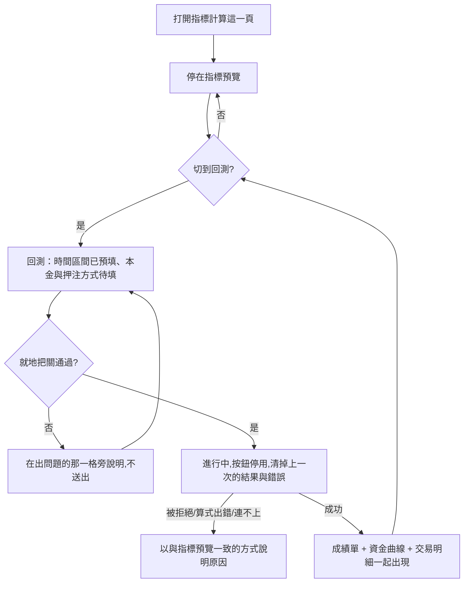

# Product Requirements Document (PRD)

**Status:** Finalized
**Version:** v1.0
**Owner:** James Hsueh
**Stakeholders:** Engineering, QA
**Source brief:** `.sdd/2026-09-05-strategy-backtest/BRIEF.md`

---

## 1. Background & Goal (Why & Goal)

- **Problem Statement**
  使用者寫策略的地方，就是他問問題的地方。他在指標計算那一頁把算式敲好、把旋鈕調到滿意，看到的卻只有**最後一批 K 線上的那幾個數字**。「這樣調到底比剛才好還是壞」——這一頁答不出來，因為它只看得到現在。

- **Expected Outcome**
  同一頁多開一個去處：**回測**。使用者不必離開他的算式、不必重挑策略、不必把參數重打一遍，就在原地選一段時間、填一筆本金、決定每次要押多重，按下去，接著在同一個畫面裡看到**這段期間的成績單、一條資金曲線、與每一筆進出場**。關鍵是「不必離開」——**調算式與驗算式是同一件事的兩半**，所以它們共用同一份工作區。

- **Out of Scope**
  - **回測結果的留存與歷史查詢**——算完就在畫面上，重新整理就沒了。後端本來就不留，前端也不假裝留得住。
  - **回測專屬的參數宣告**——沿用同一份策略參數，不另起一套。
  - **手續費輸入欄**——這一版的重演本來就不算手續費，畫一格出來只會誤導。
  - **圖表互動**（停在某一點看數字、拉近拉遠）——第一版一張看得懂的靜態線圖就夠。
  - **真實下單**——這裡從頭到尾都是模擬，不會有任何一筆單被送出去。

---

## 2. User Personas

- **Primary Role**：策略作者（本系統唯一的使用者）。他自己寫算式、自己調旋鈕、自己判斷一支策略值不值得留下來。
- **Usage Context**：在指標計算那一頁，算式剛剛改過、旋鈕剛剛轉過。他會**在同一份算式上來回切換**：看一眼最新的指標數字，再回頭重演一次整段歷史，然後再改一個數字。所以「切過去、切回來」是他一天裡做最多次的動作。

---

## 3. User Stories & Acceptance Criteria

### US-01 — 兩個去處，一份工作區 [priority: P0]

**As a** 策略作者，**I want** 指標預覽與回測共用同一份算式、策略、參數、市場與 K 線粗細，**so that** 我在兩者之間來回時不會弄丟剛剛寫的東西，也不必把同一件事填兩遍。

```gherkin
Scenario: 算式跨去處保留
  Given 在指標預覽寫好一段算式
  When 切到回測
  Then 算式原封不動地還在，不必重寫

Scenario: 市場的改動兩邊都看得到
  Given 在回測把市場改成另一個
  When 切回指標預覽
  Then 指標預覽的市場欄位顯示的是改過之後的那一個

Scenario: 填到一半的回測條件不會掉
  Given 在回測填好本金與時間區間
  When 切到指標預覽再切回回測
  Then 剛才填的每一格都還在，一格都沒有掉

Scenario: 打開這一頁時停在指標預覽
  Given 剛打開指標計算這一頁
  When 看目前在哪個去處
  Then 停在指標預覽——現有行為不變

Scenario: K 線粗細跨去處共用
  Given 在指標預覽把彙總刻度改成一小時
  When 切到回測
  Then 回測的彙總刻度也是一小時

Scenario: 換一支策略兩邊同時跟著換
  Given 目前在回測
  When 從策略清單載入另一支策略
  Then 算式、指標值種類與參數宣告全部換成那一支的
  And 切到指標預覽看到的也是那一支
```

---

### US-02 — 回測要問使用者的幾件事 [priority: P0]

**As a** 策略作者，**I want** 回測一打開就有合理的預設值、而且只問我真正要決定的那幾件事，**so that** 多數時候我按下去就好。

```gherkin
Scenario: 一打開就有合理的時間預設
  Given 今天是 9 月 5 日
  When 打開回測
  Then 起點預設為 8 月 6 日零點
  And 終點預設為 9 月 4 日的最後一刻

Scenario: 預設值直接按得下去
  Given 算式已寫好、本金已填、時間是預設值
  When 按下執行
  Then 送出，進入進行中

Scenario: 選了百分比就出現百分比那一格
  Given 每次開倉押多少選了百分比
  When 看旁邊
  Then 出現一格百分比輸入

Scenario: 選了固定金額就出現金額那一格
  Given 每次開倉押多少選了固定金額
  When 看旁邊
  Then 出現一格金額輸入

Scenario: 選了全押就沒有那一格
  Given 每次開倉押多少選了全押
  When 看旁邊
  Then 那一格不出現——沒有東西要填

Scenario: 換來換去不會弄丟已經填的數字
  Given 在百分比填了 50
  And 改選全押
  When 再改回百分比
  Then 那一格仍然是 50，不必重打

Scenario: 規則收在一顆鍵後面
  Given 剛打開回測
  When 看畫面
  Then 那份規則沒有攤在版面上

Scenario: 想讀的時候打得開
  Given 剛打開回測
  When 按下條件那一塊標題列上的說明鍵
  Then 看得到信號怎麼讀（含「沒放這個名字等同持平」）
  And 看得到這一版不算手續費
```

---

### US-03 — 送出之前就地把關 [priority: P0]

**As a** 策略作者，**I want** 填錯的時候當場在那一格旁邊被告知，**so that** 我知道要改哪一格，而不是把一個注定失敗的請求送出去再回來猜。

```gherkin
Scenario: 起點晚於終點
  Given 起點是 9 月 10 日、終點是 9 月 1 日
  When 按下執行
  Then 不送出
  And 在時間那裡說明起點不能晚於終點

Scenario: 本金留白
  Given 本金留白
  When 按下執行
  Then 不送出
  And 在本金那一格旁說明要填一個大於零的數

Scenario: 本金填零
  Given 本金填 0
  When 按下執行
  Then 不送出
  And 在本金那一格旁說明要填一個大於零的數

Scenario: 本金填負數
  Given 本金填 -100
  When 按下執行
  Then 不送出
  And 在本金那一格旁說明要填一個大於零的數

Scenario: 算式空白
  Given 算式空白
  When 按下執行
  Then 不送出
  And 在算式那裡說明——與指標預覽同一條規則、同一句話

Scenario: 百分比不在零到一百之間
  Given 每次開倉押多少選了百分比、值填 0
  When 按下執行
  Then 不送出
  And 在那一格旁說明百分比要大於零且不超過一百

Scenario: 固定金額不大於零
  Given 每次開倉押多少選了固定金額、值填 0
  When 按下執行
  Then 不送出
  And 在那一格旁說明固定金額要大於零

Scenario: 算式宣告的不是「一個數字」
  Given 工作區的指標值種類是「一串數字」
  When 按下執行
  Then 不送出
  And 說明回測只跑「一個數字」的算式、目前這支是「一串數字」、請去改那個種類

Scenario: 說明留在出問題的那一格旁邊
  Given 任何一項填錯
  When 看畫面
  Then 說明就在那一格旁邊，不是丟到頁面頂端
```

---

### US-04 — 按下去之後的每一種狀態都看得出來 [priority: P0]

**As a** 策略作者，**I want** 送出之後每一種狀態都在畫面上講清楚，**so that** 我不會以為沒反應而按第二次，也不會對著一片空白猜發生了什麼。

```gherkin
Scenario: 進行中
  Given 已送出、還沒算完
  When 看畫面
  Then 顯示進行中
  And 執行按鈕停用

Scenario: 後端連不上
  Given 後端連不上
  When 看畫面
  Then 說明連線狀況
  And 執行按鈕停用——按了也沒用，不要讓他按

Scenario: 算式出錯的呈現與指標預覽一致
  Given 算式在某一棒出錯
  When 算完
  Then 顯示原因
  And 呈現方式與指標預覽一模一樣

Scenario: 參數名字對不上與算式壞掉分開講
  Given 算式取用了一個沒有宣告的參數名稱
  When 算完
  Then 說明是哪一個名字對不上
  And 說法與指標預覽一致——要改的是參數那一列，不是算式本身

Scenario: 這一次的錯誤不會被上一次的成績單蓋住
  Given 上一次回測算成功、畫面上有成績單
  When 這一次被拒絕
  Then 看到的是這一次的錯誤
  And 上一次的成績單已經不在畫面上
```

---

### US-05 — 算完之後三塊東西一起出現 [priority: P0]

**As a** 策略作者，**I want** 成績單、資金曲線與交易明細一起出現，而且賺賠一眼看得出來，**so that** 我掃一眼就知道好壞，不必先讀數字再判斷正負。

```gherkin
Scenario: 三塊東西一起出現
  Given 回測成功，期間內有 12 筆已平倉交易
  When 看畫面
  Then 成績單、資金曲線與 12 列交易明細同時出現

Scenario: 成績單交代六件事
  Given 回測成功
  When 看成績單
  Then 看得到一開始多少錢、最後剩多少、總報酬率、最大回撤、勝率、交易次數

Scenario: 賺錢是綠的
  Given 總報酬率是 +25%
  When 看成績單
  Then 以綠色呈現

Scenario: 賠錢是紅的
  Given 總報酬率是 −8%
  When 看成績單
  Then 以紅色呈現

Scenario: 一筆都沒平倉時的勝率
  Given 回測成功，但一筆交易都沒有平倉
  When 看成績單的勝率
  Then 顯示為不適用，而不是 0%

Scenario: 資金曲線一棒一點
  Given 回測成功，期間內有 N 根 K 線
  When 看資金曲線
  Then 畫出一條線，橫軸是時間、縱軸是手上總共值多少，共 N 個點

Scenario: 交易明細一筆一列
  Given 回測成功，期間內有已平倉交易
  When 看交易明細
  Then 每一列說明做多還做空、什麼時候什麼價進場、什麼時候什麼價出場、這筆賺賠多少

Scenario: 交易的賺賠同樣賺綠賠紅
  Given 某一筆交易賺 300、另一筆賠 120
  When 看交易明細
  Then 前者以綠色呈現、後者以紅色呈現

Scenario: 一筆交易都沒觸發時明講
  Given 回測成功，但期間內一筆交易都沒有
  When 看畫面
  Then 明說「這段期間沒有觸發任何交易」
  And 不是一張空白表格

Scenario: 時間依使用者選的時區呈現
  Given 使用者選了某個顯示時區
  When 看資金曲線與交易明細上的時間
  Then 它們都以那個時區呈現——與這一頁其他說時間的地方一致
```

---

## 4. Business Flow & Logic

### Flow Diagram



### Core Business Rules

- **BR-1 一份工作區**：算式、選中的策略、指標值種類、參數宣告、市場、K 線粗細——兩個去處**共用同一份**。在一邊改了，另一邊看到的就是改過的樣子。
- **BR-2 換去處不清空任何東西**：包含填到一半的回測條件、以及已經算出來的結果。切過去再切回來，畫面與離開時一樣。
- **BR-3 預設時間區間**：起點是**三十天前的當日零點**、終點是**昨天的最後一刻**，皆為世界標準時間。多數時候按下去就好。
- **BR-4 押注方式決定旁邊那一格**：全押不出現任何格；百分比出現百分比格；固定金額出現金額格。**切換模式不清掉已填的數字**——切回來還在。
- **BR-5 就地把關的五條**：起點不得晚於終點；本金必須是大於零的數；百分比必須大於零且不超過一百；固定金額必須大於零；**指標值種類必須是「一個數字」**。另加算式不得空白（沿用指標預覽既有那一條，不另立一套）。**說明一律留在出問題的那一格旁邊。**
- **BR-12 回測只跑「一個數字」的算式**：重演一根 K 線問一次，每一次只讀一個叫「信號」的數字；一串數字的算式，重演不知道該讀哪一格。**種類不對就在送出前說清楚，不硬套外框**——硬套的話使用者什麼都沒改，卻會收到一句直譯器的型別抱怨，而那句話不會告訴他該去按哪一個下拉選單。
- **BR-6 一次只留一種結果**：新的一次送出時，上一次的成績單與所有錯誤訊息一起清掉。畫面上不會同時有上一次的成績單與這一次的錯誤。
- **BR-7 錯誤的呈現與指標預覽一致**：被拒絕、算式出錯、參數名字對不上、後端連不上、後端自己壞了——五種各自的說法與樣子，與指標預覽一字不差。同一頁上的兩個去處，錯誤不該長成兩種樣子。
- **BR-8 賺綠賠紅**：總報酬率與每一筆交易的賺賠，正數綠、負數紅、零為中性。
- **BR-9 勝率不適用**：一筆都沒平倉時顯示為不適用，不是 0%。
- **BR-10 沒有交易也要說話**：一筆都沒觸發時明講這件事，不留一片空白——空白讓人以為是壞了，明講讓人知道是策略沒開口。
- **BR-11 時間一律照使用者選的顯示時區呈現**，與這一頁其他說時間的地方同一套。

### Edge Cases

- **送出當下算式空白**：與指標預覽同一條規則、同一句話，不另立一套。
- **後端連不上**：按鈕停用（按了也沒用），並說明連線狀況。
- **回測期間很長、點很多**：後端本身已經有單次可讀根數的上限，因此曲線的點數天然有界，前端不另外抽稀，也不另外設限——兩個上限就是兩個真相。
- **重新整理頁面**：結果消失。這是刻意的：後端不留存，前端也不假裝留得住。

---

## 5. UI/UX Design & Interaction

- **版面**：策略那一列橫跨頂部，底下切成**兩個直欄**——
  **左欄是共用的工作區**（算式編輯器與它的旋鈕），**右欄是去處**（切換｜執行條件｜狀態｜結果）。
  左邊是「你在寫什麼」，右邊是「它算出什麼」。工作區自己占一欄，是因為它是兩個去處共用的那一份，擺進其中一邊就得選一邊；這也讓**切換去處時編輯器完全不受影響**，正是本切片最重要的那一條要求。
  窄螢幕兩欄疊起來——各半的寬度裝不下一段程式碼。
- **回測的執行條件**：起點、終點（兩個時間選擇器，可選到分鐘）、本金、每次開倉押多少（下拉）＋隨模式出現的那一格、執行按鈕。
- **狀態**：進行中／被拒絕／算式出錯／參數名字對不上／後端連不上／後端出錯——沿用指標預覽既有的那一套提示樣式與文案結構。
- **回測的規則說明**：條件那一塊的標題列上一顆 ⓘ 鍵，打開說明信號怎麼讀、按下去之後會發生什麼、以及這一版**不算手續費**。它是打開來看的，不是攤在版面上的——使用者九成的時間並不在讀它。
- **結果**：成績單（六個數字，總報酬率賺綠賠紅）→ 資金曲線（一條線）→ 交易明細（一筆一列，賺賠賺綠賠紅）。
- **空結果**：一筆交易都沒有時，在交易明細的位置明說「這段期間沒有觸發任何交易」。

---

## 6. Non-Functional Requirements

- **NFR-1 算式仍然由後端執行**：前端一行使用者寫的東西都不跑。沿用既有的安全界線。
- **NFR-2 回測是模擬，不是下單**：沒有任何一筆單會離開這台機器。
- **NFR-3 金額用精確小數**：本金、成交價、押注金額、賺賠、資金曲線的每一點，一律以精確小數處理，不用浮點數。
- **NFR-4 畫圖沿用這一頁既有的做法**：K 線圖已經在用的那一套繪圖方式，資金曲線沿用它，不引入第二套。
- **NFR-5 切換去處不重建編輯器**：算式編輯器不因切換去處而重新掛載。
- **NFR-6 元件只認識 Application 與 DTO**：驗證規則與呈現規則（賺綠賠紅、勝率不適用怎麼說）不寫在元件裡。

---

## 7. Dependencies & Risks

- **依賴後端本輪新增的回測端點**：交易標的、彙總刻度、起訖時間、算式與參數、初始資金與押注方式進去，成績單、交易明細與資金曲線出來，**不留存**。
- **依賴既有的指標計算工作區**：算式編輯器、策略庫、參數宣告、市場欄位、彙總刻度——本切片一個都不重寫，只是多一個去處共用它們。
- **風險：把既有的指標預覽拆動了。** 它是這一頁每天都在用的東西。以既有的三份面板測試為安全網：拆完之後那些測試必須一個字都不改就全綠。
- **風險：兩個去處共用狀態，卻各自有一份結果。** 共用的是「這一份工作區」，不共用的是「上一次算了什麼」。混在一起會出現切過去看到別人的結果。

---

## 8. Appendix

- 來源需求：`.sdd/2026-09-05-strategy-backtest/BRIEF.md`
- 後端同名切片：`go-trading/.sdd/2026-09-05-strategy-backtest/`
- 相依切片：`.sdd/2026-09-04-indicator-calculation-parameters`、`.sdd/2026-09-03-strategy-library`、`.sdd/2026-09-03-display-time-zone`
- 詞彙：`.sdd/UL-MAP.md`（領域詞彙沿用後端；本切片新增的是介面概念：去處、工作區、成績單、資金曲線、交易明細、賺綠賠紅）

### 來自 BRIEF 的待定事項，本 PRD 的定案

| 待定事項 | 定案 | 理由 |
| :--- | :--- | :--- |
| 資金曲線用哪一種畫法 | **沿用這一頁 K 線圖已經在用的那一套繪圖方式**（線圖系列） | 它已經在這個專案裡、已經處理過時區與座標軸，而且再引入第二套繪圖就有兩種圖表行為要維護 |
| 時間選到多細 | **選到分鐘**，用與 K 線查詢同一種時間選擇器 | 這一頁已經有一個時間選擇器了，用同一種是零學習成本；預設值仍然是零點與最後一刻，所以只想選日期的人不必碰到分鐘 |
| 點太密的時候怎麼辦 | **不抽稀、不另外設限** | 後端的單次可讀根數上限已經把點數封住了。前端再設一個，就有兩個上限要保持同步，而它們遲早會不一致 |
| 不合法的那一格什麼時候說話 | **按下執行才說** | 與指標預覽既有的行為一致。邊打邊說會在使用者還沒打完本金的第一個數字時就紅一次，那是在罵一個正在做對事情的人 |
| 兩個去處怎麼擺 | **兩個直欄：左欄是共用的工作區，右欄是去處（切換、條件、結果）** | 左邊「你在寫什麼」、右邊「它算出什麼」，是每一台工作台的形狀。工作區自己占一欄，同時保證了切換去處時編輯器不會重新掛載 |
| 回測收不收「一串數字」的算式 | **不收，而且送出前就說清楚** | 重演一根 K 線問一次，每一次只讀一個數字；一串的話它不知道該讀哪一格。默默換掉外框的代價是使用者收到一句直譯器的型別抱怨 |
