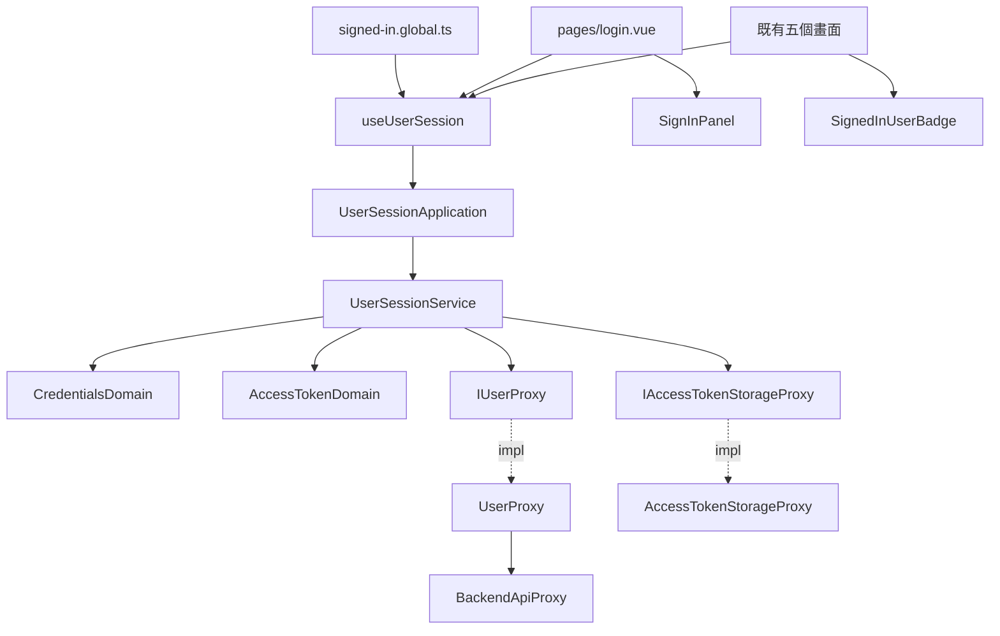
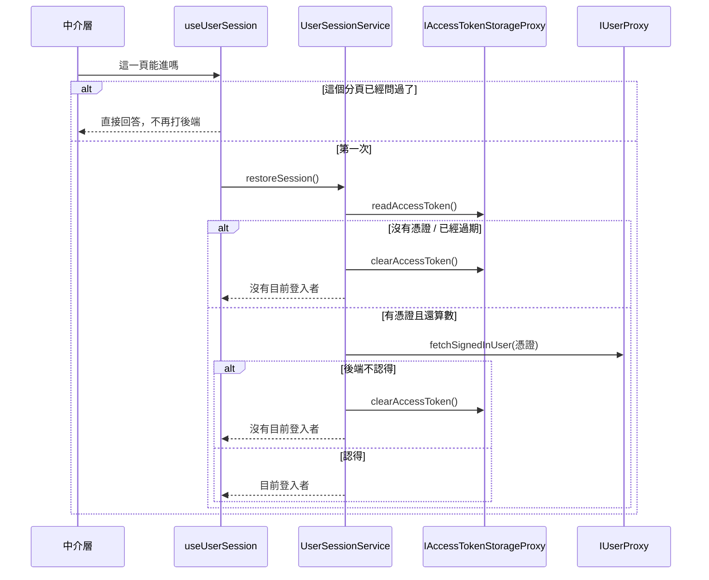

# 登入畫面 — Architecture Design

**Status:** Draft
**Source PRD:** `.sdd/2026-09-05-user-sign-in/PRD.md`
**Tech context:** Nuxt 3 · Vue 3 SFC · TypeScript · Clean/Onion（元件＝Controller，對外一律 Proxy）

---

## 1. Design Goal & Guiding Principle

- **In one sentence:**
  讓這個操作台知道「現在是誰在用」，沒登入就只看得到一張卡片；
  而既有五個畫面除了側欄多一行電子郵件之外，一行邏輯都不必改。

- **Guiding principle:**
  **「現在是誰在用」只有一個答案，住在一個地方。**

  這件事會被三個互不相干的地方問到：把關的中介層（要不要放行）、
  登入畫面（要不要讓開）、側欄（顯示誰）。三個地方各問一次後端，
  就會出現三個可能互相矛盾的答案，還會在每次換頁多打兩趟。

  所以它是一份**跨畫面共用的狀態**，由一個 composable 持有，
  第一次被問到時才去確認一次，之後所有人讀的都是同一個答案——
  與 `useBackendHealth` 對「後端還活著嗎」的做法完全一樣。

---

## 2. Change Scope

| Area | Action | What / Why |
| :--- | :--- | :--- |
| `app/domain/models/entities/` | **Add** | `SignedInUser`、`AccessToken`——兩個乾淨的資料模型 |
| `app/domain/models/domains/` | **Add** | 帳密的把關、憑證的過期判斷、目前登入者的呈現形狀 |
| `app/domain/models/dto/` | **Add** | 對元件的回傳形狀與交給 service 的輸入形狀 |
| `app/domain/errors/` | **Add** | 這個切片自己的哨兵錯誤 |
| `app/domain/interface/` | **Add** | `IUserProxy`（後端）、`IAccessTokenStorageProxy`（瀏覽器儲存） |
| `app/domain/service/` | **Add** | `UserSessionService`——這個切片全部四個用例的唯一入口 |
| `app/application/` | **Add** | `UserSessionApplication` |
| `app/infrastructure/proxy/` | **Add** | `UserProxy`、`AccessTokenStorageProxy` |
| `app/infrastructure/proxy/backend-api-proxy.ts` | **Modify** | 請求選項多一個 `headers`，好讓「我是誰」帶得出憑證 |
| `app/composables/` | **Add** | `useUserSession`——那一份共用的答案 |
| `app/components/molecules/` | **Add** | `SignedInUserBadge`（側欄那一行） |
| `app/components/organisms/` | **Add** | `SignInPanel`（那張卡片，互動全在這裡） |
| `app/pages/login.vue` | **Add** | 只做接線的那一頁 |
| `app/middleware/` | **Add** | 新資料夾。`signed-in.global.ts`——把關 |
| `app/components/templates/ConsoleLayout.vue` | **Modify** | 側欄多一個 `account` 插槽（樣板仍然不綁資料） |
| 既有五個畫面 | **Modify** | 各填一次 `account` 插槽——與它們早就在填 `status`／`timezone` 同一個做法 |
| 既有 K 線／指標／策略／助手的 proxy | **Not touched** | 後端目前不問那些請求來者是誰。要附憑證的那一天，落點是 `BackendApiProxy`，不是散在各處 |

---

## 3. New Classes / Modules

### 3.1 Domain — Entities（乾淨資料模型）

| Name | Responsibility | Satisfies |
| :--- | :--- | :--- |
| `SignedInUser` | 一位被認得的人：識別碼與電子郵件。附 `toDomain()` | US-05、US-07 |
| `AccessToken` | 一份登入憑證：憑證本身與到期時刻。附 `toDomain()` | US-05 |

### 3.2 Domain — Domain Models（行為所在地）

| Name | Responsibility | Satisfies |
| :--- | :--- | :--- |
| `CredentialsDomain` | 帳密的把關。建構子收下兩格與**現在是哪一個模式**，算出**每一格各自的錯誤**（而不是「合不合格」一個布林）——訊息要寫在該格底下，所以它得說得出是哪一格 | US-02 |
| `AccessTokenDomain` | 一份憑證還算不算數：拿它的到期時刻跟現在比 | US-05 |
| ~~`SignedInUserDomain`~~ | **沒有做**——這份資料沒有任何規則要保護，一個什麼都不做的 Domain Model 只是多一個要讀的檔案。`SignedInUser` 直接 `toDto()`（換一種形狀不算業務邏輯，見 architecture.md），與 `TradingSymbol` 同一個做法 | US-07 |

- **`CredentialsDomain` 為什麼收模式**：長度規則**只在建立帳號時套用**。
  登入時套用它，會對一個密碼確實比較短的既有帳號說「你格式填錯了」，
  而且最短長度一改，昨天設的密碼今天就登不進去。
  模式因此是這個模型的一部分，不是呼叫端自己記得要跳過哪幾條。
- **它不做電子郵件的格式判斷**，只要求不空白。畫面自己判斷格式，
  等於把後端那套規則抄一份過來，兩份一定會漂移；而且格式錯的代價只是多一趟來回。

### 3.3 Domain — DTO

| Name | Responsibility |
| :--- | :--- |
| `CredentialsDto` | 元件交給 application 的兩格內容與模式 |
| `CredentialsFieldErrorsDto` | 每一格各自的錯誤訊息（`null` 代表這一格沒問題） |
| `SignedInUserDto` | 目前登入者對元件的形狀：識別碼與電子郵件 |

### 3.4 Domain — Interfaces

| Name | Responsibility | 為什麼是介面 |
| :--- | :--- | :--- |
| `IUserProxy` | `registerUser`、`signIn`、`fetchSignedInUser` | 後端是外部資源 |
| `IAccessTokenStorageProxy` | `readAccessToken`、`writeAccessToken`、`clearAccessToken` | 瀏覽器儲存是外部資源，而且**這個能力遲早會搬家**（改記在 cookie、或後端偏好）。介面以能力命名，不叫 `ILocalStorage…` |

### 3.5 Domain — Errors

| Name | 什麼時候 | 畫面該說什麼 |
| :--- | :--- | :--- |
| `CredentialsRejectedError` | 後端回 401（帳密對不上） | 後端那一句，原文轉達 |
| `EmailAlreadyRegisteredError` | 後端回 409 | 後端那一句 |
| `AccessTokenUnavailableError` | 後端回 503（沒有簽章鑰匙） | 這不是你填錯了什麼 |
| `AuthenticationRequiredError` | 憑證缺席／過期／後端不認得 | 不顯示——它的意思是「當作沒登入」 |

既有的 `BackendUnreachableError`／`BackendRequestRejectedError`／`BackendServerError` 直接沿用。

### 3.6 Domain — Service

| Name | Responsibility |
| :--- | :--- |
| `UserSessionService` | 四個用例：`registerUser`、`signIn`、`restoreSession`、`signOut`。公開方法**互不呼叫** |

- `registerUser` 與 `signIn` 都是「拿到憑證 → 記住 → 回覆目前登入者」。
  兩者共用一個私有 helper，因為那是**兩個** public 方法都在用的同一段（見規則的 inline 門檻）。
- `restoreSession` 讀出憑證去問後端；**認不得就順手把它丟掉**——
  留著一份誰都不認得的憑證，只會讓下一次載入再白跑一趟。
- `signOut` 只丟掉憑證，**不問後端**：憑證本來就不在後端那裡。

### 3.7 Infrastructure

| Name | Responsibility |
| :--- | :--- |
| `UserProxy` | 打三條後端路徑，並把 401／409／503 從一般的拒絕裡分出來。回傳一律正規化成 entity |
| `AccessTokenStorageProxy` | 唯一碰瀏覽器儲存的地方。讀不到、寫不進去一律不拋——那與「還沒登入過」對使用者是同一件事 |

### 3.8 Composable / 元件

| Name | Kind | Responsibility |
| :--- | :--- | :--- |
| `useUserSession` | composable | **那一份共用的答案**：目前登入者、正在確認、剛才失敗的原因、每一格的錯誤。第一次被問到才確認一次。**送出與登出都自己換頁**——見下方 |
| `SignInPanel` | organism | 那張卡片。兩種模式、送出、擋掉明顯填錯的、顯示錯誤——**互動全在這裡** |
| `SignedInUserBadge` | molecule | 側欄那一行：電子郵件 + 登出。純展示，資料由 page 餵 |
| `pages/login.vue` | page | 只做接線 |
| `middleware/signed-in.global.ts` | middleware | 把關 |

- **`SignInPanel` 是 organism 不是 molecule**：它是畫面上獨立存在的一整塊，
  而且它自己就是那一頁的全部。
- **`submitCredentials` 與 `signOut` 自己換頁，不回傳「成功了沒有」讓呼叫端再換一次。**
  一個業務動作要呼叫端排兩次呼叫才完成，是介面太淺的訊號：漏掉第二次的畫面會停在原地，
  看起來像什麼都沒發生。因此「回到他本來要去的那一頁」是這一份共用狀態自己的事，
  `takeRedirectTo` 也就不必出現在對外的那張清單上。
- **把關為什麼在中介層而不是每一頁**：一頁忘了寫就是一個洞，而洞不會有人發現。
- **把關只在瀏覽器端跑**：伺服器算頁面時碰不到瀏覽器的儲存，在那裡判斷會得到
  「一律沒登入」，於是每一次載入都先閃一下登入畫面再跳回來。

---

## 4. Modified Components

| Component | Current role | Change needed |
| :--- | :--- | :--- |
| `BackendApiProxy` | 所有 proxy 共用的請求與錯誤翻譯 | 請求選項多一個 `headers`。**只是多一個選項，不是自動附上憑證**——後端還沒有任何行情端點要它 |
| `ConsoleLayout` | 版面骨架與插槽 | 側欄底部多一個 `account` 插槽，擺在那顆連線燈下面。仍然不綁任何資料 |
| `app/pages/*.vue`（五個） | 接線 | 各填一次 `account` 插槽——與它們早就在填 `status`／`timezone` 完全同一個做法 |
| `app/plugins/dependencies.ts` | 組裝根 | 組出這條線並 provide |

---

## 5. Component Relationships

還原登入狀態那條路：

---

## 6. Extensibility & Handoff Notes

- **最可能的下一個需求：後端替行情端點也裝上門，於是每一次呼叫都要帶憑證。**
  落點是 **`BackendApiProxy`**：把 `IAccessTokenStorageProxy` 注入它的建構子，
  在 `requestBackend` 裡統一附上標頭。九個 proxy 一個都不必改內容，
  只有組裝根的九行 `new XProxy(baseUrl)` 要多一個引數。
  **現在不先做**，因為後端還沒有任何端點要它——先做等於寫一段沒有人需要、也沒有東西測得到的程式。
  - 同時要處理的是 `LiveKCandleProxy`：它是瀏覽器的持續連線，**送不出授權標頭**。
- **第二可能：憑證改記在 cookie（好讓伺服器端也判斷得出來）。**
  落點是 `IAccessTokenStorageProxy`：換一個實作，組裝根改一行。
  介面刻意不叫 `ILocalStorage…` 就是為了這一天。
- **第三可能：登入畫面要加第三方登入。** 落點是 `IUserProxy` 多一個方法與 `SignInPanel` 多一顆鍵。
- **不得寫死：** 後端位址（已在 `runtimeConfig`）、登入後的預設去處。
- **刻意留簡單的：**
  - **憑證放在瀏覽器儲存**。訊號是「需要伺服器端算頁面時就知道是誰」——那時候改 cookie。
  - **這道門只在瀏覽器這一側**。訊號是後端把門裝到行情端點上；在那之前，
    繞過畫面直接打後端仍然做得到，這一點寫在 PRD 的風險裡，不假裝它更嚴。

---

## 7. Traceability

| PRD Scenario | Fulfilled by |
| :--- | :--- |
| US-01 預設是登入／切到建立帳號 | `SignInPanel` |
| US-01 切換時內容留著／錯誤訊息清掉 | `SignInPanel` |
| US-02 空白不送出（兩格） | `CredentialsDomain` → `CredentialsFieldErrorsDto` |
| US-02 建立帳號時太短／太長不送出、剛好 8 個字元送得出去 | `CredentialsDomain` |
| US-02 登入不套用長度規則 | `CredentialsDomain`（模式是它的一部分） |
| US-03 送出中不重複送／仍然打得了字 | `SignInPanel` + `useUserSession` 的 `pending` |
| US-04 帳密對不上／已被使用／連不上／簽不出憑證 | `UserProxy` 的錯誤翻譯 + `useUserSession` 的訊息對映 |
| US-05 登入成功就記住／建立帳號後直接是登入狀態 | `UserSessionService` |
| US-05 重新整理仍然是登入狀態 | `UserSessionService.restoreSession` + `useUserSession` |
| US-05 瀏覽器記不住時這一次仍然能用 | `AccessTokenStorageProxy`（寫不進去不拋） |
| US-05 憑證已過期 | `AccessTokenDomain` |
| US-06 沒登入被帶到登入畫面／已登入走得到／已登入被帶回首頁 | `signed-in.global.ts` |
| US-06 登入後停在原本想去的那一頁／沒有就去首頁 | `signed-in.global.ts` + `pages/login.vue` |
| US-07 側欄顯示目前登入者 | `SignedInUserBadge` + `ConsoleLayout` 的 `account` 插槽 |
| US-07 登出丟掉憑證並回到登入畫面 | `UserSessionService.signOut` + `useUserSession` |

---

## 8. Risks & Open Decisions

- **Risks / trade-offs:**
  - **畫面這一側重寫了一份長度規則。** 兩份規則一定會漂移，接受它：
    後端是唯一的真相，畫面這一份只是替使用者省一趟來回，且兩邊不同時後端說了算。
  - **把關只在瀏覽器端跑**，所以伺服器算出來的頁面不受保護。
    這台操作台在本機跑、沒有 SSR 的對外需求，接受。
  - **`useUserSession` 是跨畫面共用的狀態。** 這是刻意的（見 §1），
    代價是登出時要記得把它清乾淨，否則側欄會留著上一個人的電子郵件。
- **Open decisions（留給實作）:**
  - 瀏覽器儲存的鍵名，寫在 proxy 內一次。
  - 「正在確認既有憑證」時畫面呈現什麼：暫定整片底色，不閃卡片也不閃操作台。
