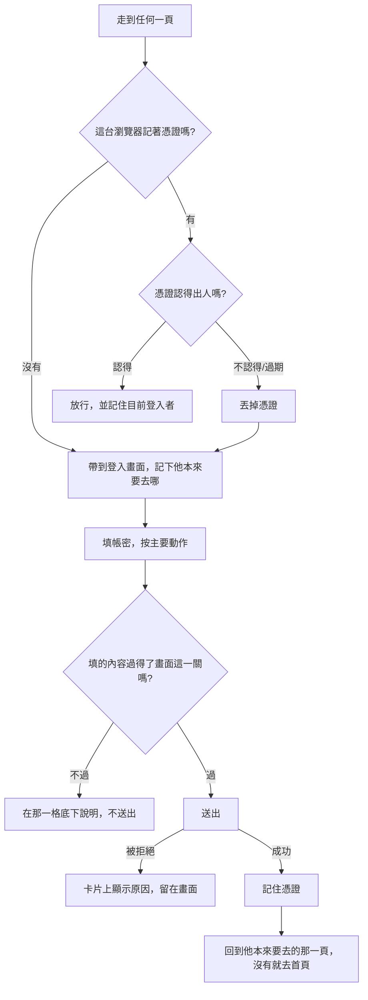

# Product Requirements Document (PRD)

**Feature:** 登入畫面
**Status:** Draft
**Version:** v1.0
**Owner:** James Hsueh
**Stakeholders:** Engineering

---

## 1. Background & Goal (Why & Goal)

- **Problem Statement:**
  這個操作台對任何打開它的人一視同仁。網址一貼，K 線、策略、要花錢的助手全部攤開，
  而且畫面本身也說不出「現在是誰在用」——因為它從來沒有「使用者」這個概念。
  後端剛長出這個概念，但一個沒有畫面的登入能力，等於沒有登入。

- **Expected Outcome:**
  這個操作台有一道門。可驗證的結果有四項：
  1. 沒登入時，走到任何一頁都會被帶到登入畫面；能做的只有建立帳號或登入。
  2. 登入之後，重新整理、關掉分頁再打開，都還是登入狀態。
  3. 側欄底下寫著現在是誰在用，旁邊按一下就登出。
  4. 送出前明顯填錯的（空白、密碼太短）當場就說，不必等一趟來回。

- **Out of Scope:**
  - 第三方登入、忘記密碼、改密碼、刪除帳號（後端都沒有這些能力）。
  - 「記住我」的長短選擇、裝置管理、同時登入數量限制。
  - 替 K 線／指標／策略／助手的呼叫附上憑證。後端目前不問那些請求來者是誰；
    等它問的那一天，這件事落在所有 proxy 共用的那一層請求上，不是散在各處。
  - 密碼強度提示條、大寫鎖定提醒、多國語言。

---

## 2. User Personas

- **Primary Role(s):**
  **使用者**——這台操作台的主人，也是唯一會建立帳號的人。

- **Usage Context:**
  在自己的電腦上打開操作台。第一次使用時建立帳號，之後每天開始看盤前登入一次；
  憑證還有效的期間內，重新整理與重開分頁都不必再登入。

---

## 3. User Stories & Acceptance Criteria

### US-01 — 一張卡片，兩種模式 [priority: P0]

**As a** 使用者，**I want** 在同一張卡片上切換「登入」與「建立帳號」，
**so that** 我第一次來與之後每一次來，都在同一個地方。

```gherkin
Scenario: 預設是登入
  Given 使用者打開登入畫面
  When 畫面顯示出來
  Then 標題是「登入」
  And 主要動作那顆鍵寫著「登入」

Scenario: 切到建立帳號
  Given 使用者在登入模式
  When 使用者按下「還沒有帳號？建立一個」
  Then 標題變成「建立帳號」
  And 主要動作那顆鍵寫著「建立帳號」

Scenario: 切換模式時已經打好的內容留著
  Given 使用者已經填了電子郵件與密碼
  When 使用者切換到另一個模式
  Then 兩格的內容都還在

Scenario: 切換模式時清掉上一次的錯誤訊息
  Given 上一次送出失敗，卡片上留著一則錯誤訊息
  When 使用者切換到另一個模式
  Then 那則訊息消失——它講的是上一件事
```

### US-02 — 送出之前先擋掉明顯填錯的 [priority: P0]

**As a** 使用者，**I want** 明顯填錯的當場就被告知，
**so that** 我不必按了鍵、等了一秒，才知道密碼太短。

```gherkin
Scenario: 電子郵件空白就不送出
  Given 使用者沒有填電子郵件
  When 使用者按下主要動作
  Then 不會向後端送出任何東西
  And 電子郵件那一格底下說明必須填

Scenario: 密碼空白就不送出
  Given 使用者填了電子郵件但沒有填密碼
  When 使用者按下主要動作
  Then 不會向後端送出任何東西
  And 密碼那一格底下說明必須填

Scenario: 建立帳號時密碼太短就不送出
  Given 使用者在建立帳號模式，密碼是 7 個字元
  When 使用者按下「建立帳號」
  Then 不會向後端送出任何東西
  And 密碼那一格底下說明至少要 8 個字元

Scenario: 建立帳號時剛好 8 個字元的密碼送得出去
  Given 使用者在建立帳號模式，密碼剛好 8 個字元
  When 使用者按下「建立帳號」
  Then 向後端送出建立使用者

Scenario: 建立帳號時密碼太長就不送出
  Given 使用者在建立帳號模式，密碼是 73 個位元組
  When 使用者按下「建立帳號」
  Then 不會向後端送出任何東西
  And 密碼那一格底下說明密碼太長

Scenario: 登入不套用建立時的長度規則
  Given 使用者在登入模式，密碼是 7 個字元
  When 使用者按下「登入」
  Then 照樣向後端送出登入——短密碼只代表它不對，不是填錯
```

### US-03 — 送出中不重複送 [priority: P0]

**As a** 使用者，**I want** 送出期間那顆鍵按不下去，
**so that** 我連按三次不會開出三個帳號。

```gherkin
Scenario: 送出期間主要動作按不下去
  Given 使用者按下主要動作，後端還沒回應
  When 使用者再按一次
  Then 不會送出第二次

Scenario: 送出期間仍然打得了字
  Given 使用者按下主要動作，後端還沒回應
  When 使用者修改密碼那一格
  Then 打得進去——擋住的只有那顆鍵
```

### US-04 — 失敗時如實轉達，並且留在畫面上 [priority: P0]

**As a** 使用者，**I want** 失敗時看到後端真正給的原因，
**so that** 我知道該改輸入、還是該去把後端啟動起來。

```gherkin
Scenario: 帳密對不上
  Given 使用者在登入模式，填的帳密對不上
  When 使用者按下「登入」
  Then 卡片上出現「電子郵件或密碼不正確」
  And 仍然停在登入畫面
  And 兩格的內容都還在

Scenario: 電子郵件已經有人用了
  Given 使用者在建立帳號模式，填的電子郵件已經被使用
  When 使用者按下「建立帳號」
  Then 卡片上出現後端說明這個電子郵件已經有人用了的那句話

Scenario: 連不上後端
  Given 後端沒有啟動
  When 使用者按下主要動作
  Then 卡片上說連不上後端，而不是說帳密不正確

Scenario: 後端簽不出憑證
  Given 後端沒有設定憑證簽章鑰匙
  When 使用者按下「登入」
  Then 卡片上說明系統目前簽不出憑證，這不是使用者填錯了什麼
```

### US-05 — 登入之後就記著 [priority: P0]

**As a** 使用者，**I want** 登入之後重新整理仍然是登入狀態，
**so that** 我不必每按一次重新整理就重填一次。

```gherkin
Scenario: 登入成功就記住憑證
  Given 使用者填了對得上的帳密
  When 使用者按下「登入」
  Then 這台瀏覽器記住這份憑證

Scenario: 重新整理仍然是登入狀態
  Given 這台瀏覽器記著一份有效憑證
  When 使用者重新打開操作台
  Then 不必再填，直接是登入狀態
  And 認得出目前登入者是誰

Scenario: 建立帳號成功後直接就是登入狀態
  Given 使用者在建立帳號模式，填了合法的電子郵件與密碼
  When 使用者按下「建立帳號」並成功
  Then 不必再填一次同樣的兩格，直接是登入狀態

Scenario: 瀏覽器記不住東西時這一次仍然能用
  Given 瀏覽器把儲存關掉了
  When 使用者登入成功
  Then 登入本身成功，這一次操作得起來
  And 不會因為記不住而顯示錯誤

Scenario: 記著的憑證已經過期
  Given 這台瀏覽器記著一份已經過期的憑證
  When 使用者重新打開操作台
  Then 視同沒有登入
```

### US-06 — 沒登入就只看得到登入畫面 [priority: P0]

**As a** 系統的主人，**I want** 沒登入的人只看得到登入畫面，
**so that** 打開瀏覽器不等於能用這台操作台。

```gherkin
Scenario: 沒登入時走到任何一頁都被帶到登入畫面
  Given 這台瀏覽器沒有記住任何憑證
  When 使用者走到 K 線瀏覽
  Then 使用者被帶到登入畫面

Scenario: 已登入時走得到操作台
  Given 這台瀏覽器記著一份有效憑證
  When 使用者走到 K 線瀏覽
  Then 使用者看到那一頁

Scenario: 已登入的人走到登入畫面會被帶回操作台
  Given 使用者已經登入
  When 使用者走到登入畫面
  Then 使用者被帶回首頁——已經進門的人不必再看一次門

Scenario: 登入後停在原本想去的那一頁
  Given 使用者沒登入時走到 K 線瀏覽，因而被帶到登入畫面
  When 使用者成功登入
  Then 使用者停在 K 線瀏覽，而不是首頁

Scenario: 沒有原本想去的地方就去首頁
  Given 使用者是直接打開登入畫面的
  When 使用者成功登入
  Then 使用者停在首頁
```

### US-07 — 認得他是誰，也走得掉 [priority: P1]

**As a** 使用者，**I want** 看得到現在是誰在用、也按得到登出，
**so that** 我確定自己登入的是哪一個帳號，也離得開。

```gherkin
Scenario: 側欄底下顯示目前登入者
  Given 使用者已經登入為「james@example.com」
  When 使用者看操作台的側欄
  Then 側欄底下寫著「james@example.com」

Scenario: 登出把憑證丟掉並回到登入畫面
  Given 使用者已經登入
  When 使用者按下登出
  Then 這台瀏覽器不再記著任何憑證
  And 使用者回到登入畫面
```

---

## 4. Business Flow & Logic



- **Core Business Rules:**
  - **畫面這一關是替使用者省一趟來回，不是規則的所在地。** 規則在後端；
    這裡先講出來，好讓他不必按了鍵、等了一秒才知道密碼太短。
    兩邊說法不同時，**後端說了算**。
  - **登入模式不套用建立時的長度規則。** 密碼太短只代表它不對，
    而且今天的最短長度改了，昨天設的密碼仍然應該登得進去。
  - **憑證只記在這台瀏覽器。** 記不住不影響這一次操作——
    畫面已經是登入狀態了，只是下次打開要重登。
  - **登出不必問後端。** 憑證本來就不在後端那裡，所以登出就是把它丟掉。
  - **把關只在瀏覽器這一側做。** 伺服器算頁面時碰不到瀏覽器的儲存，
    在那裡判斷會得到「一律沒登入」，於是每一次載入都先閃一下登入畫面。

- **Edge Cases:**
  - 重新整理時憑證還在但後端已經不認得（重啟時換過鑰匙）→ 視同沒登入，丟掉憑證。
  - 送出到一半後端斷線 → 卡片上說連不上，兩格內容留著。
  - 同一個分頁裡登出再登入另一個帳號 → 側欄立刻換成新的電子郵件。

---

## 5. UI/UX Design & Interaction

**取向：** 沿用這個操作台既有的調子——近全黑的底、面板浮在上面、髮絲線、
數字亮標籤暗。參考 Mobbin 上的 Fey（近全黑、置中、極簡）、
Rox（有邊框的卡片浮在暗場上）、Binance（欄位名在上、整寬主要鍵、底下一行小小的切換）。

**版面：**

```
              ·  go-trading

                 登入
        用你的電子郵件與密碼進入操作台

  電子郵件
  ┌─────────────────────────────┐
  └─────────────────────────────┘
  密碼
  ┌─────────────────────────────┐
  └─────────────────────────────┘

  ┌─────────────────────────────┐
  │            登入              │
  └─────────────────────────────┘

        還沒有帳號？建立一個
```

- **卡片**：置中，最大寬度約 22rem，面板底色、髮絲線邊、`md` 圓角。
  卡片後方一層極淡的主色光暈，讓它從近全黑的底浮起來（取自 Fey）。
- **標記**：與側欄同一顆小圓點 + `go-trading`（等寬字），置中。
- **主要鍵**：整寬（`block`），`primary`。送出中變成不能按並顯示「登入中…」。
- **錯誤**：卡片內、鍵的上方，`danger` 語氣的整塊訊息。
- **欄位錯誤**：寫在該格底下（沿用既有的 `FormField`）。
- **切換**：卡片最下面一行，`ghost` 的小鍵。
- **登入畫面不套用操作台外框**——側欄與頂欄是給進了門的人看的。
- **側欄的目前登入者**：釘在側欄最底、那顆連線燈的下面。
  一行電子郵件（會被截斷，滑鼠停留看得到全文）加一顆登出。

**狀態：**

| 狀態 | 畫面 |
| :--- | :--- |
| 預設 | 兩格空的，鍵可按 |
| 送出中 | 鍵不能按、寫著「登入中…」；兩格照常打得了字 |
| 欄位不合格 | 那一格底下一行紅字，不送出 |
| 後端拒絕 | 卡片內一塊紅色語氣訊息，兩格內容留著 |
| 正在確認既有憑證 | 整片底色，不閃登入卡片也不閃操作台 |

---

## 6. Non-Functional Requirements

- **Security:**
  - 密碼**只存在於那一格與送出的那一次請求裡**，不記進瀏覽器儲存、不寫進網址。
  - 憑證只放在這台瀏覽器的儲存裡，不放進網址、不寫進紀錄。
  - 登入畫面**不告訴任何人某個電子郵件是不是註冊過**——它只轉述後端那一句。
- **Compatibility:** 既有五個畫面的行為除了多一個「目前登入者」之外完全不變。
- **Accessibility:** 兩格都有欄位名；密碼那格是密碼型別；錯誤訊息與該格關聯得起來。

---

## 7. Dependencies & Risks

- **External Dependencies:**
  - 後端 `go-trading` 的三條路：`POST /users`、`POST /sessions`、`GET /users/me`。
  - 後端的 `CORS_ALLOWED_ORIGINS` 必須含本站來源，且允許 `Authorization` 標頭。
- **Known Risks:**
  - **後端沒設 `AUTH_ACCESS_TOKEN_SIGNING_KEY` 時登不進去。** 畫面要說得清楚這不是使用者的錯。
  - **這道門只在瀏覽器這一側。** 後端的 K 線／策略／助手端點目前仍然不問來者是誰，
    所以繞過畫面直接打後端仍然做得到。這是後端那一側的下一個切片，
    不是這裡能補起來的——寫出來，而不是假裝這道門比實際更嚴。

---

## 8. Appendix

- 需求共識：`.sdd/2026-09-05-user-sign-in/BRIEF.md`
- 後端切片：`go-trading` 的 `.sdd/2026-09-05-user-authentication/`
- 詞彙：`.sdd/UL-MAP.md`
