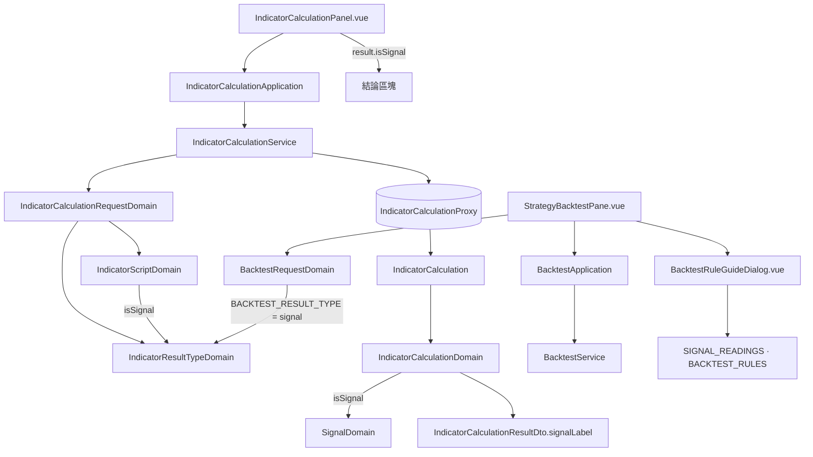

# 信號指標值種類（前端） — Architecture Design

**Status:** Confirmed
**Source PRD:** `.sdd/2026-09-06-signal-result-type/PRD.md`
**Tech context:** Nuxt 4 · Vue 3 · TypeScript · Clean/Onion（`.vue → application → domain ← infrastructure`）· Vitest

---

## 1. Design Goal & Guiding Principle

- **In one sentence:**
  讓「一個信號」成為第五種 `IndicatorResultType`：它在種類差異表多一列、多一個述詞 `isSignal()`；算式外框的進入點在這種種類下回傳 `indicator.Signal`；指標預覽把信號結果呈現成一個「買入／賣出／持有」的結論；回測把「只吃一個數字」改成「只吃一個信號」。

- **Guiding principle:**
  **信號是差異表的第五列，不是第五條分支。** 既有設計已經把「一個種類的全部差異」關在 `INDICATOR_RESULT_TYPE_DESCRIPTIONS` 一張表裡（`label` / `isList` / `holdsNumbers`），多一種種類是加一列 ＋ 一個述詞。因此：
  - `drawableOnChart = resultType.holdsNumbers()` 對信號**自動**為 `false`——US-06「信號畫不成線」不必寫一行程式。
  - 外框的元素型別已由 `holdsNumbers()` / `isList()` 推出，信號只是多一個「不是 map、是 `indicator.Signal`」的頂層分支。
  最容易被偷偷改壞、也最需要獨立測試的是「後端的 `signal` 字串怎麼變成中文結論」——它獨立成 `SignalDomain`。

---

## 2. Change Scope

| Area | Action | What / Why |
| :--- | :--- | :--- |
| `domain/models/vo/indicator-result-type.ts` | **Modify** | 聯合型別加 `'signal'`；`INDICATOR_RESULT_TYPES` 末尾加 `'signal'`（順序：數字→是非→信號） |
| `domain/models/domains/indicator-result-type-domain.ts` | **Modify** | 差異表加 `signal: { label: '一個信號', isList: false, holdsNumbers: false }`；新增述詞 `isSignal()`。`DEFAULT_INDICATOR_RESULT_TYPE` 不變 |
| `domain/models/domains/indicator-script-domain.ts` | **Modify** | `frameHeader()` 信號分支回傳 `func Calculate(data []indicator.KCandle) indicator.Signal {`；`EXAMPLE_SCRIPT_BODIES` 加 `signal` 範例（用 `indicator.Buy` / `indicator.Sell` / `indicator.Hold` 選一個）。`disassemble` 的錨（`func Calculate`）不變，拆解照舊 |
| `domain/models/vo/signal-vo.ts` | **Modify（重寫）** | 移除 `SIGNAL_INDICATOR_NAME`（「那個指標名稱」的概念已消失，Open Decision #3）。改為 `SignalVo` 具名字串聯合 `'buy' \| 'sell' \| 'hold'` ＋ `SIGNAL_VALUES` 常數 |
| `domain/models/domains/signal-domain.ts` | **Add** | Domain Model：讀後端的 `signal` 字串 → `label()`（買入／賣出／持有）、`tone()`（`positive` / `negative` / `neutral`，供畫面上色）。建構子把認不得的值正規化為 `hold`（安全預設，比讓結果畫面壞掉好，與 `IndicatorResultTypeDomain` 的寬容一致） |
| `domain/models/vo/signal-reading-vo.ts` | **Modify** | `SIGNAL_READINGS` 由 5 列「看正負號」換成 3 列：買入／賣出／持有，各配「算式回傳 `indicator.Buy` / `Sell` / `Hold`」 |
| `domain/models/vo/backtest-rule-vo.ts` | **Modify** | 移除 `SIGNAL_INDICATOR_NAME` import；「算式要說出這一棒的意見」改成「指標值種類選『一個信號』，算式回傳買入／賣出／持有」；「只跑一個數字的算式」改成「只跑『一個信號』的算式」 |
| `domain/models/dto/indicator-calculation-result-dto.ts` | **Modify** | 新增 `signalLabel: string \| null`（信號種類下的結論）與 `isSignal: boolean`。信號種類下 `indicatorValues` 為空、`signalLabel` 有值 |
| `domain/models/entities/indicator-calculation.ts` | **Modify** | 建構子多收 `signal: string \| null`（wire 的頂層信號值） |
| `domain/models/domains/indicator-calculation-domain.ts` | **Modify** | `toDto()` 信號分支：`new SignalDomain(signal).label()` 放進 `signalLabel`，`indicatorValues` 空 |
| `infrastructure/proxy/indicator-calculation-proxy.ts` | **Modify** | wire 型別加 `signal: string \| null`；`IndicatorWireValue` 不變；把 `wire.signal` 傳進 entity |
| `domain/models/domains/backtest-request-domain.ts` | **Modify** | `BACKTEST_RESULT_TYPE = 'signal'`；種類不符的訊息改寫（回測只跑「一個信號」的算式；目前宣告的是「X」；請把指標值種類改成「一個信號」）。移除 `SIGNAL_INDICATOR_NAME` import |
| `domain/service/backtest-service.ts` | **Modify** | 移除 `signalIndicatorName()` 方法與 `SIGNAL_INDICATOR_NAME` import |
| `application/backtest-application.ts` | **Modify** | 移除轉呼 `signalIndicatorName()` 的方法（若有） |
| `components/organisms/IndicatorCalculationPanel.vue` | **Modify** | 結果區：`result.isSignal` 時渲染一個結論區塊（買入綠／賣出紅／持有中性），取代名稱-數值表格 |
| `components/molecules/BacktestRuleGuideDialog.vue` | **Modify** | `<pre><code>` 範例改 `return indicator.Buy`；表頭改「算式回傳」／「意思」；移除 `signalIndicatorName` prop |
| `components/organisms/StrategyBacktestPane.vue` | **Modify** | 不再傳 `signalIndicatorName` 給 dialog |
| `domain/models/domains/strategy-domain.ts` | **Not touched** | `drawableOnChart = resultType.holdsNumbers()` 對信號已是 `false` |
| `domain/models/domains/chart-indicator-domain.ts` · `remembered-applied-indicators-domain.ts` | **Not touched** | 信號種類的策略在 `drawableOnChart` 就被濾掉，到不了這裡 |
| 回測結果（成績單／資金曲線／交易明細）相關 | **Not touched** | 後端這一版沒動 |

---

## 3. New Classes / Modules

| Name | Kind | Responsibility | Collaborators | Satisfies |
| :--- | :--- | :--- | :--- | :--- |
| `IndicatorResultType` `'signal'` | VO 聯合成員 | 第五種種類的字面值 | — | AC-01 |
| `IndicatorResultTypeDomain.isSignal()` | 述詞 method | 「這種種類的產出是一個信號」——外框與結果解讀用它分頂層分支 | 差異表 | AC-01/02、AC-02（外框）、AC-03（呈現） |
| `SignalVo` | VO 聯合型別 | 信號的三個合法值（`buy`/`sell`/`hold`） | — | AC-03、US-05 |
| `SignalDomain` | Domain Model | 把後端的 `signal` 字串讀成畫面要的東西：`label()`（中文結論）、`tone()`（上色語氣）。認不得即正規化為 `hold` | `SignalVo` | AC-03「算出買入/持有」、US-05（讀法表借用它的 label） |

**為什麼 `SignalDomain` 值得一個型別**：買入／賣出／持有的中文與語氣，同時被「指標預覽結果」與「信號讀法對照表」用到（2＋ 個 consumer），而且「認不得就當持有」這條規則最容易被人偷偷改成丟錯或顯示原字串——獨立成型別，它的三個情境各是一行表格測試。

**不新增**：沒有新的 service / application / component。信號是既有兩條 flow（指標預覽、回測送出前把關）的一個新分支。

---

## 4. Component Relationships

---

## 5. Extensibility & Handoff Notes

- **最可能的下一個需求：信號帶方向以外的資訊**（部位大小、停損、信心）。落點：wire 型別、`SignalDomain`、結論區塊——`SignalVo` 從聯合字串長成一個結構。外框簽章仍是 `indicator.Signal`，`frameHeader` 不動。
- **第二可能：把信號畫成圖上的買賣標記。** 落點：`drawableOnChart` 現在對信號是 `false`；屆時它要能分「畫成線」與「畫成標記」，那是 `strategy-domain` 與 chart 那一側的切片，不是這裡。
- **Patterns applied:** 述詞驅動的差異表（沿用既有 `INDICATOR_RESULT_TYPE_DESCRIPTIONS`）——四→五只加一列一述詞。
- **Do not hardcode:**
  - 買入／賣出／持有的中文——只在 `SignalDomain`。
  - `buy`/`sell`/`hold` 三個字面值——`SIGNAL_VALUES` 常數。
  - 「回測 = 一個信號」——只在 `BACKTEST_RESULT_TYPE`。
  - 外框的 `indicator.Signal` 簽章——只在 `IndicatorScriptDomain.frameHeader`。
- **Known debt:** `IndicatorCalculationResultDto` 多了 `isSignal` / `signalLabel` 兩個只在信號種類下有意義的欄位；`indicatorValues` 在信號種類下恆空。可接受——與其為信號另立一個結果 DTO，不如一個 flag 分支。

---

## 6. Traceability

| PRD Scenario | Fulfilled by |
| :--- | :--- |
| AC-01 選單依序列出五種 | `INDICATOR_RESULT_TYPES` ＋ `IndicatorCalculationService.listResultTypeOptions`（既有，順序驅動） |
| AC-01 信號不是預設 | `DEFAULT_INDICATOR_RESULT_TYPE`（不變） |
| AC-01 認不得的種類仍當一個數字 | `IndicatorResultTypeDomain` 建構子寬容解讀（不變） |
| AC-02 外框進入點回傳一個信號 | `IndicatorScriptDomain.frameHeader()` 信號分支 |
| AC-02 範例示範選一個信號 | `EXAMPLE_SCRIPT_BODIES.signal` |
| AC-02 切回一個數字外框變回原樣 | `frameHeader()` 依 `isSignal()` 分支（切換即重算） |
| AC-02 內容行數不變 | `assemble` 不動；`bodyStartLineNumber` 隨新外框行數自動對齊 |
| AC-03 算出買入／持有 | `IndicatorCalculationDomain.toDto()` 信號分支 ＋ `SignalDomain.label()` |
| AC-03 其他種類呈現不變 | `toDto()` 非信號分支（不變） |
| AC-04 信號種類正常送出 | `BacktestRequestDomain`（`BACKTEST_RESULT_TYPE = 'signal'` 相符即通過） |
| AC-04 一個數字／一串是非被擋下 | `BacktestRequestDomain` 種類檢查 ＋ 改寫的訊息（含目前種類 label） |
| AC-04 種類對就不再攔在種類上 | `BacktestRequestDomain` 驗證順序（種類先於本金，種類過了才檢查本金） |
| AC-05 回測規則講信號種類 | `BACKTEST_RULES` 改寫 |
| AC-05 讀法表是三個值 | `SIGNAL_READINGS` 改寫（3 列） |
| AC-06 信號種類策略標明畫不成線 | `StrategyDomain.toDto()` `drawableOnChart = holdsNumbers()`（信號 → false，零改動） |

---

## 7. Risks & Open Decisions（本 ARCH 定案）

- **Risks:**
  - 多個舊模型描述舊概念，漏改一個就顯示過時資訊——change scope 已逐檔列出，`SIGNAL_INDICATOR_NAME` 的每個 import 都要清掉。
  - 「信號沒有名稱」讓結果 DTO 形狀分岔——以 `isSignal` flag ＋ `signalLabel` 處理，呈現層一個 `v-if`。
- **Open Decisions（定案）:**
  1. 信號結果呈現 → **一個結論區塊**（大字＋語氣色），不是單列表格（沒有名稱欄的一列表格看起來像壞了）。
  2. 「持有」語氣 → **中性色**（`neutral`），對齊 `漲跌語氣` 的 `flat`。
  3. `SIGNAL_INDICATOR_NAME` → **移除**；由 `SignalDomain` ＋ `SIGNAL_VALUES` 取代。
