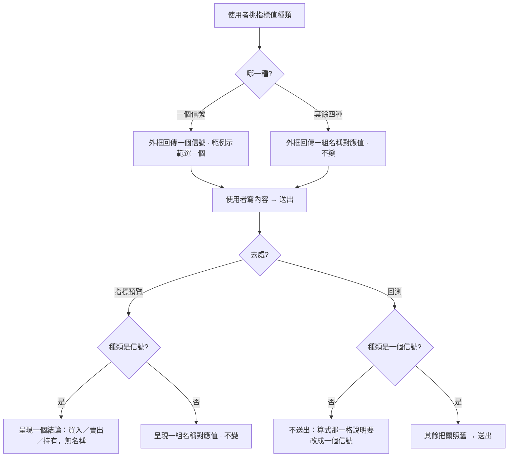

# Product Requirements Document (PRD) — 信號指標值種類（前端）

**Status:** Finalized
**Version:** v1.0
**Owner:** James Hsueh
**Stakeholders:** 專案作者本人（同時是使用者、開發者與審查者）
**Source brief:** `.sdd/2026-09-06-signal-result-type/BRIEF.md`

---

## 1. Background & Goal (Why & Goal)

- **Problem Statement:**
  後端把「信號」升級成第五種**指標值種類**：宣告「一個信號」時，算式回傳一個明確的意見——**買入、賣出、或持有**——而不是一個叫 `signal` 的數字讓回測看正負號。後端的回測也改成**只接受這種種類**。前端目前的模型（種類選單只有四項、信號讀法是「看正負號」對照表、回測擋「不是一個數字」）全都停在舊事實上。

- **Expected Outcome:**
  種類選單多「一個信號」；選它時算式外框回傳一個信號、範例示範怎麼選；指標預覽算出信號時畫面呈現一個「買入／賣出／持有」的結論（沒有指標名稱）；回測改成擋「不是信號種類」並把訊息改寫；過時的信號說明換成「算式回傳 buy／sell／hold」；信號比照是非，在圖上畫不成線、挑策略時擋下。

- **Out of Scope:**
  - 回測結果（成績單、資金曲線、交易明細）的呈現——後端沒動，前端不動。
  - 信號帶方向以外的資訊。
  - 在圖上把信號畫成買賣標記。
  - 既有數字型信號算式的自動遷移或提示。

---

## 2. User Personas

- **Primary Role(s):** 策略研究者（專案作者本人）——寫算式、調參數、判斷一支策略值不值得留下來。
- **Usage Context:** 桌面瀏覽器，指標計算那一頁。同一份工作區有「指標預覽」與「回測」兩個去處；改算式 → 預覽 → 調 → 回測，一輪跑很多次。

---

## 3. User Stories & Acceptance Criteria

### US-01 — 指標值種類多一個「一個信號」 [priority: P0]

**As a** 策略研究者, **I want** 種類選單多一個「一個信號」,
**so that** 我可以寫一支專門出買賣意見的算式。

```gherkin
Scenario: 選單依序列出五種
  Given 使用者打開指標值種類的選單
  When 使用者看選項
  Then 依序看到：一個數字、一串數字、一個是非、一串是非、一個信號

Scenario: 信號不是預設
  Given 使用者完全沒有挑過種類
  When 使用者看目前的種類
  Then 是「一個數字」

Scenario: 認不得的種類仍當成一個數字
  Given 後端回報這次的種類是「wizardry」
  When 畫面呈現結果
  Then 當成「一個數字」呈現，畫面不因此壞掉
```

### US-02 — 選信號種類時外框回傳一個信號 [priority: P0]

**As a** 策略研究者, **I want** 選「一個信號」時外框就換成回傳一個信號的形狀,
**so that** 我照著範例寫就能產出一個合法的信號，不必猜格式。

```gherkin
Scenario: 外框的進入點回傳一個信號
  Given 指標值種類是「一個信號」
  When 使用者看算式外框
  Then 進入點簽章是回傳一個信號的形狀，不是一組「名稱對應值」

Scenario: 範例示範怎麼選一個信號
  Given 指標值種類是「一個信號」
  When 使用者看範例內容
  Then 範例用系統提供的方式選出一個信號（買入／賣出／持有其一）並回傳

Scenario: 切回一個數字時外框變回原樣
  Given 指標值種類是「一個信號」
  When 使用者把種類切回「一個數字」
  Then 進入點簽章變回一組「名稱對應數字」的形狀

Scenario: 內容行數不變
  Given 使用者在信號種類下寫了三行內容
  When 畫面標示使用者第一行是整段算式的第幾行
  Then 那個行號與外框的行數一致，後端回報第幾行出錯時對得上
```

### US-03 — 指標預覽呈現一個信號 [priority: P0]

**As a** 策略研究者, **I want** 信號種類算出來時畫面直接給我一個結論,
**so that** 我一眼看出這支算式現在說買、說賣、還是說不動。

```gherkin
Scenario: 算出買入
  Given 指標值種類是「一個信號」
  And 算式這一次算出買入
  When 使用者看結果
  Then 畫面呈現一個結論「買入」，沒有指標名稱那一欄

Scenario: 算出持有
  Given 指標值種類是「一個信號」
  And 算式這一次算出持有
  When 使用者看結果
  Then 畫面呈現「持有」

Scenario: 其他種類的呈現不變
  Given 指標值種類是「一串數字」
  When 使用者看結果
  Then 是一組「名稱 → 一串值」，與這個切片之前完全一樣
```

### US-04 — 回測只接受信號種類 [priority: P0]

**As a** 策略研究者, **I want** 回測在種類不對時擋下並告訴我改哪裡,
**so that** 我不會送出一支回測跑不動的算式、再對著一句直譯器的抱怨發呆。

```gherkin
Scenario: 信號種類正常送出
  Given 指標值種類是「一個信號」
  And 其餘回測條件都成立
  When 使用者送出回測
  Then 回測正常送出

Scenario: 一個數字被擋下
  Given 指標值種類是「一個數字」
  When 使用者送出回測
  Then 回測不送出
  And 算式那一格旁邊說明回測只跑信號種類的算式，請把指標值種類改成「一個信號」

Scenario: 訊息說出目前的種類
  Given 指標值種類是「一串是非」
  When 使用者送出回測
  Then 回測不送出
  And 訊息說出目前宣告的是「一串是非」

Scenario: 種類對就不再攔在種類上
  Given 指標值種類是「一個信號」
  And 初始資金填 0
  When 使用者送出回測
  Then 回測不送出
  And 擋下的是初始資金那一格，不是種類
```

### US-05 — 過時的信號說明換掉 [priority: P1]

**As a** 策略研究者, **I want** 回測規則與信號讀法的說明講的是現在的事實,
**so that** 我照說明寫出來的算式回測跑得動。

```gherkin
Scenario: 回測規則講的是信號種類
  Given 使用者打開回測規則說明
  When 使用者讀「算式要說出這一棒的意見」那一條
  Then 說的是「指標值種類選『一個信號』，算式回傳買入／賣出／持有」
  And 沒有「多放一個叫 signal 的名稱」「看正負號」的說法

Scenario: 信號讀法對照表是三個值
  Given 使用者打開信號讀法的對照表
  When 使用者讀內容
  Then 看到買入、賣出、持有三個值，由系統提供的方式選出
  And 沒有「大於零／小於零／等於零／沒放這個名字」那幾列
```

### US-06 — 信號畫不成線 [priority: P1]

**As a** 策略研究者, **I want** 挑一支信號種類的策略要畫到圖上時被擋下,
**so that** 我不會套用之後才發現畫不出東西。

```gherkin
Scenario: 信號種類的策略標明畫不成線
  Given 一支策略的指標值種類是「一個信號」
  When 使用者在挑策略的清單看它
  Then 標明畫不成線，套用被擋下
  And 呈現方式與「一個是非」的策略一致
```

---

## 4. Business Flow & Logic



- **Core Business Rules:**
  - **BR-1 五選一**：種類選單是一個數字、一串數字、一個是非、一串是非、一個信號；順序如上，信號排最後。
  - **BR-2 預設不變**：沒挑、或後端回報認不得的種類，一律歸「一個數字」。
  - **BR-3 種類差異集中**：每種種類的中文標籤、是不是一串、裝的是不是數字、是不是信號，寫在同一張表；多一種是加一列。
  - **BR-4 信號外框**：選「一個信號」時，進入點簽章回傳一個信號；範例內容用系統提供的方式選一個。外框仍唯讀、仍備妥常用匯入、內容行數仍不變。產生／拆解外框仍只有同一個地方在做。
  - **BR-5 信號呈現**：信號種類的結果是一個信號、沒有指標名稱；畫面呈現一個買入／賣出／持有的結論，中文由領域給。其餘四種呈現不變。
  - **BR-6 回測把關**：回測送出前，種類不是「一個信號」即不送出，訊息落在算式那一格，說明回測只跑信號種類、請改成「一個信號」，並說出目前的種類。其餘把關規則與順序不變（種類先過，才輪到本金等其他格）。
  - **BR-7 說明更新**：回測規則清單裡的「說出意見」「只跑一個數字」兩條、以及信號讀法對照表，內容換成信號種類的事實。
  - **BR-8 信號畫不成線**：「一個信號」比照「一個是非」——挑策略時標明畫不成線並擋下，畫指標線時不畫。

- **Edge Cases:**
  - 後端回報一個從沒見過的種類字串：當「一個數字」呈現，不讓結果畫面壞掉（沿用既有的寬容解讀）。
  - 使用者在信號種類下把算式寫成回傳一組數字：送出後由後端擋下，前端如實轉達（與其他算式錯誤同一條路）。

---

## 5. UI/UX Design & Interaction

- 種類選單多一項「一個信號」，位置在末尾。
- 信號種類的指標預覽結果呈現方式：**Open Decision #1**（小卡片／一行文字／無名稱欄的表格列）。
- 「持有」的語氣／顏色：**Open Decision #2**（中性色或不上色，對比買入賺綠、賣出賠紅）。
- 回測種類不符的錯誤：紅字，落在算式編輯器旁邊，與其他 `scriptBody` 錯誤同一個位置。
- 載入／空／錯誤狀態：沿用指標計算頁既有規範，本切片不新增。

---

## 6. Non-Functional Requirements

- **Performance:** 無新增資料讀取；種類切換只重算外框文字。
- **Security:** 無。前端不執行算式。
- **Compatibility:**
  - 沒挑種類的既有使用方式不受影響。
  - **回測不再相容以數字表達信號的算式**——這是刻意的破壞性變更，前端的擋下訊息已改寫成講這件事。
- **Analytics / Tracking:** 無。

---

## 7. Dependencies & Risks

- **External Dependencies:** 後端 `.sdd/2026-09-06-signal-result-type`。前端外框產出的簽章、範例內容必須與後端注入的 `indicator.Signal` / `indicator.Buy` / `indicator.Sell` / `indicator.Hold` 對齊。
- **Known Risks:**
  - 前端有多個模型（`signal-vo`、`signal-reading-vo`、`backtest-rule-vo`、`indicator-result-type-domain`）描述舊概念，要一起更新，漏一個就會顯示過時資訊。
  - 「信號沒有名稱」讓信號結果的形狀與其他四種不同，呈現層要能分辨（見 Open Decision #1）。

---

## 8. Appendix

- 需求共識：[BRIEF.md](BRIEF.md)
- 通用語言：[../UL-MAP.md](../UL-MAP.md)
- 相依切片：`.sdd/2026-08-30-indicator-calculation`、`.sdd/2026-09-05-strategy-backtest`、`.sdd/2026-09-02-strategy-script-authoring`、`.sdd/2026-09-03-strategy-library`

### Open Decisions（交給 architecture 裁決）

1. 信號種類的指標預覽結果，畫面上呈現成什麼形狀（小卡片／一行文字／無名稱欄的表格列）。
2. 「持有」的語氣／顏色。
3. `signal` 字串常數（原本代表「那個指標名稱」）在前端是否還有意義，或整個移除。
