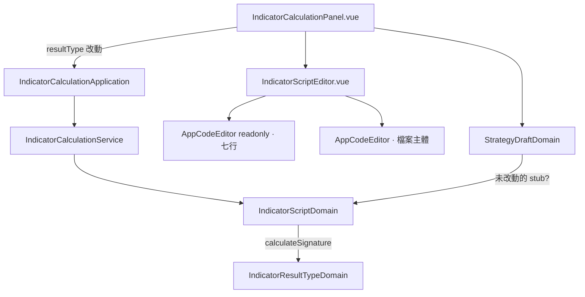

# 算式內容放寬到整個檔案主體 — Architecture Design

**Status:** Confirmed
**Source PRD:** `.sdd/2026-09-07-editable-script-body/PRD.md`
**Tech context:** Nuxt 4 · Vue 3 · TypeScript · Clean/Onion · Vitest

---

## 1. Design Goal & Guiding Principle

- **In one sentence:** 把「算式外框」從「package＋import＋`func Calculate` 簽章＋收尾」縮成「package＋import」；`func Calculate` 那一行移進可編輯的檔案主體，成為 stub 的一部分、也成為「改種類時要重打的那一行」。

- **Guiding principle:** `IndicatorScriptDomain` 仍然是**全前端唯一組出／拆解算式文字的地方**。這次它多兩個責任——產一個空的 stub、把主體裡第一個 Calculate 簽章重打成某個種類——但這兩件事與既有的 `assemble` / `exampleBody` 同源（都靠一個 `calculateSignature()` 私有 helper），不會有第二個地方知道進入點長什麼樣。

---

## 2. Change Scope

| Area | Action | What / Why |
| :--- | :--- | :--- |
| `domain/models/domains/indicator-script-domain.ts` | **Modify（重寫）** | `frameHeader()` → 七行固定內容（去掉簽章）；移除 `frameFooter()`；`EXAMPLE_SCRIPT_BODIES` 的每則前面加簽章、後面加 `}`；新增 `blankBody()`（空 stub）與 `retargetReturnType(body)`（重打第一個 Calculate 簽章）；`assemble()` 不再縮排、不再加收尾；`disassemble()` 改為錨定七行固定開頭 |
| `domain/models/dto/indicator-script-template-dto.ts` | **Modify** | 移除 `frameFooter`；新增 `blankBody`；`frameHeaderLineCount` / `bodyStartLineNumber` 由新的 `frameHeader` 推 |
| `domain/models/domains/strategy-draft-domain.ts` | **Modify** | 「還沒載入過」分支：`scriptBody` 去空白後為空、**或**等於該種類未改動的 stub，都算沒有未儲存變更 |
| `domain/service/indicator-calculation-service.ts` | **Modify** | 新增 `retargetScriptReturnType(body, resultType)`（轉呼 domain） |
| `application/indicator-calculation-application.ts` | **Modify** | 新增 `retargetScriptReturnType` 轉呼 |
| `components/molecules/IndicatorScriptEditor.vue` | **Modify** | 移除收尾 `AppCodeEditor` 與 `footerLineNumber`；可編輯區去掉 `indented`；提示文字改寫 |
| `components/organisms/IndicatorCalculationPanel.vue` | **Modify** | `blankStrategyContent.scriptBody` = 預設種類的 `blankBody`；種類 `<select>` 改動時呼叫 `retargetScriptReturnType` 更新 `scriptBody` |
| `composables/use-strategy-library.ts` | **Not touched** | 它拿 `blankContent` 當參數，內容由 panel 給——panel 換成帶 stub 的那份即可 |
| `domain/models/vo/indicator-script-body-vo.ts` | **Not touched** | `{ body, frameRecognised }` 形狀不變 |
| backend | **Not touched** | 收整段算式、允許頂層多個宣告 |

---

## 3. New / Changed Methods on `IndicatorScriptDomain`

| Name | Kind | Responsibility |
| :--- | :--- | :--- |
| `frameHeader()` | method（改） | 七行固定唯讀內容：`package main` / 空行 / `import (` / 三匯入 / `)` |
| `calculateSignature()` | private helper（新） | `func Calculate(data []indicator.KCandle) <shape> {`，`<shape>` 由 `resultType` 推（信號→`indicator.Signal`、其餘→`map[string]…`）。`blankBody`、`exampleBody`、`retargetReturnType` 三者共用它，進入點長相只寫這一處 |
| `blankBody()` | method（新） | `calculateSignature()` ＋ `\n\t\n` ＋ `}`——空 stub |
| `exampleBody()` | method（改） | `calculateSignature()` ＋ 內部範例行（各縮一層）＋ `}` |
| `retargetReturnType(body)` | method（新） | 把 `body` 裡第一個符合 `/func Calculate\(data \[\]indicator\.KCandle\)[^{\n]*\{/` 的那一行，回傳型別換成 `calculateSignature()` 的。找不到 → 原樣回傳 |
| `assemble(body)` | method（改） | `frameHeader() + '\n\n' + body 去尾端空白 + '\n'`——不縮排、不加收尾 |
| `disassemble(script)` | method（改） | `script` 以 `frameHeader()` 開頭 → 主體 = 其後去掉緊接的 `\n\n` 與尾端一個 `\n`；否則 `{ body: script, frameRecognised: false }` |
| `frameFooter()` | **移除** | 沒有收尾了 |

**round-trip 保證**（測試釘死）：`disassemble(assemble(b)).body === b`（當 `b` 尾端無空白）；`assemble(disassemble(s).body) === s`（當 `s` 是本模型組出來的）。舊編輯器存的算式因前七行相同，`disassemble` 認得，主體剛好是「整個 Calculate 函式」。

---

## 4. Component Relationships

---

## 5. Extensibility & Handoff Notes

- **最可能的下一個需求：** 讓範例內容也能是「多個函式」的示範。落點：`EXAMPLE_SCRIPT_BODIES` 那張表——它現在是「內部幾行」，屆時直接改成整段主體字串，`exampleBody()` 不再自己加簽章。
- **Do not hardcode:** 進入點的字面（`func Calculate(...)`）只在 `calculateSignature()` 與 `disassemble` 的錨（七行 header）兩處；`retargetReturnType` 的 regex 也在同一個檔案。
- **Known debt:** `retargetReturnType` 用 regex 認簽章——使用者把簽章拆成多行就認不出、不會重打（PRD 風險已載明）。若日後要更聰明，落點就是這個方法。
- 不改 `use-strategy-library`：它對「空白長什麼樣」不知情，那個定義只在 panel 一處（沿用既有註解裡的原則）。

---

## 6. Traceability

| PRD Scenario | Fulfilled by |
| :--- | :--- |
| US-01 唯讀區不含進入點／不隨種類變 | `frameHeader()`（七行固定）+ `IndicatorScriptEditor.vue`（讀它） |
| US-01 可編輯區可放進入點以外的函式 | `assemble()`（主體原樣接在 header 後）+ backend（本來就允許） |
| US-02 空白 stub（信號／一串數字） | `blankBody()` + `calculateSignature()` |
| US-02 未改動的 stub / 空白 不算變更 | `StrategyDraftDomain`（no-loaded 分支比對 `blankBody()` 或空白） |
| US-03 改種類換回傳型別／helper 不動／找不到不動 | `retargetReturnType()` + `IndicatorCalculationPanel.vue`（種類 select 改動時呼叫） |
| US-04 載入整個 Calculate／舊編輯器策略／認不出 | `disassemble()`（錨定七行 header） |
| US-05 行號接續 | `IndicatorScriptTemplateDto.bodyStartLineNumber` + `AppCodeEditor` `start-line-number` |

---

## 7. Risks & Open Decisions（定案）

- **Risk:** 大量既有測試要改（`indicator-script-domain.spec.ts` 幾乎重寫、`IndicatorScriptEditor.spec.ts`、`IndicatorCalculationPanel*.spec.ts`、`strategy-draft-domain.spec.ts`、`strategy.spec.ts`、`strategy-write-domain.spec.ts`）。以 round-trip 測試守住 `assemble`/`disassemble`。
- **Open decisions:** 無——PRD §8 兩項已定案。
