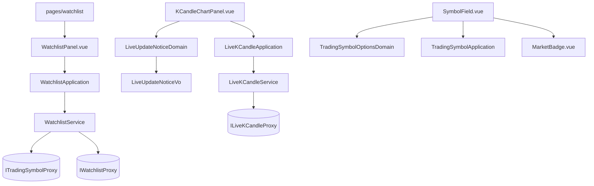

# 台股上這台終端機 — Architecture Design

**Status:** Confirmed
**Source PRD:** `.sdd/2026-09-07-taiwan-stock-console/PRD.md`
**Tech context:** Nuxt 4 · Vue 3 · TypeScript · Clean/Onion 分層 · 原子化設計 · SCSS token

---

## 1. Design Goal & Guiding Principle

- **In one sentence:**
  讓這台終端機說得出**三種「沒有東西是正常的」**——收盤中、這一檔沒有即時名額、
  即時已停止——而畫面上只有一個位置、一次只說一句。

- **Guiding principle:**
  **「該說哪一句」是一條業務規則，不是一段畫面邏輯。**

  它有優先序（收盤 ＞ 沒名額 ＞ 斷了）、有理由（收盤時即時本來就會停），
  而且會再長——第三個市場、第四種說法。這種東西寫進 `.vue` 的一串 `v-if`，
  就會變成三個布林值互相排列組合，每加一種說法就得回頭重讀所有排列。

  所以它住在一個 domain model 上：收下三件事實，交出**至多一句**話的身分。
  元件只負責把那個身分接到一句中文與一個語氣，跟它接漲跌語氣的方式一模一樣。

  第二個原則：**畫面不推算它沒有把握的事。** 收盤與名額都由後端回答並隨每一檔標的
  一起送來。畫面若自己依時間推算收盤，會把國定假日說成故障；若自己推算名額，
  會替一張永遠不動的圖保證即時更新。

---

## 2. Change Scope

| Area | Action | What / Why |
| :--- | :--- | :--- |
| `domain/models/vo/market-vo.ts` | **Add** | 市場的值與它給人看的標籤。沿用既有 VO 慣例（見 `k-candle-trend-vo.ts`）：值與標籤一起決定好，畫面不自己翻譯 |
| `domain/models/vo/live-update-notice-vo.ts` | **Add** | 圖表上那一句話的身分與語氣。至多一種 |
| `domain/models/domains/live-update-notice-domain.ts` | **Add** | **決定該說哪一句**：收下「在不在交易時段」「有沒有即時名額」「是不是斷了」，交出至多一個 notice |
| `domain/models/entities/trading-symbol.ts` | **Modify** | 多帶所屬市場、是否追蹤中、是否在交易時段內、是否有即時更新 |
| `domain/models/dto/trading-symbol-dto.ts` | **Modify** | 同上（外加市場的中文標籤，由 VO 帶著） |
| `domain/models/domains/trading-symbol-options-domain.ts` | **Add** | **決定選單上該出現哪幾檔**：依市場篩選，且**目前選著的那一檔一定看得見** |
| `domain/models/entities/live-k-candle-update.ts` | **Modify** | 第四種狀態 `unavailable` |
| `domain/models/dto/live-k-candle-report-dto.ts` | **Modify** | 多帶「這一檔沒有即時名額」這件事 |
| `domain/models/entities/k-candle.ts`、`dto/k-candle-dto.ts` | **Modify** | 三個成交數字改為**可以沒有值** |
| `domain/interface/i-trading-symbol-proxy.ts` | **Modify** | 回傳的實體多帶四個欄位（介面本身不變） |
| `domain/interface/i-watchlist-proxy.ts` | **Add** | 觀察清單的兩個寫入動作。以能力命名，不綁後端 |
| `domain/errors/trading-symbol-not-in-market-error.ts` | **Add** | 哨兵錯誤：代號在那個市場找不到。**必須與「市場問不到」分開** |
| `domain/errors/market-data-source-unavailable-error.ts` | **Add** | 哨兵錯誤：後端問不到那個市場 |
| `domain/service/watchlist-service.ts` | **Add** | 觀察清單的三個用例：列出追蹤中的、加入、移除 |
| `application/watchlist-application.ts` | **Add** | 觀察清單畫面的唯一 collaborator |
| `infrastructure/proxy/watchlist-proxy.ts` | **Add** | 打後端的兩條寫入路，並把兩種拒絕翻成兩種領域錯誤 |
| `infrastructure/proxy/trading-symbol-proxy.ts` | **Modify** | 讀四個新欄位 |
| `infrastructure/proxy/live-k-candle-proxy.ts` | **Modify** | 認得第四種狀態 |
| `components/molecules/SymbolField.vue` | **Modify** | 多一組市場切換鍵；選項改由 domain model 決定 |
| `components/molecules/MarketBadge.vue` | **Add** | 一檔標的旁邊那個「台股／加密貨幣」的標示 |
| `components/molecules/WatchlistEntryForm.vue` | **Add** | 加入觀察清單的那一組輸入 |
| `components/organisms/WatchlistPanel.vue` | **Add** | 觀察清單的整個畫面 |
| `pages/watchlist/index.vue` | **Add** | 觀察清單自己的一頁 |
| `components/organisms/KCandleChartPanel.vue` | **Modify** | 三個布林值換成一個 notice；一次只顯示一則 |
| `components/organisms/KCandleTable.vue`、`molecules/KCandleForm.vue` | **Modify** | 沒有值的欄位呈現成「沒有這一項」；沒有值的那三格不讓人填 |
| **既有的四種狀態元件** | **Not touched** | 載入中／查無資料／被拒絕／連不上一律沿用，本切片只是**不再**把正常狀態塞進它們 |
| **K 線圖表的取資料規則、彙總刻度、指標套用與重算** | **Not touched** | 一行未改 |
| **新增／修改 K 線表單的「交易標的手打」** | **Not touched** | 它是新標的誕生的地方，見 PRD §7 |

---

## 3. New Classes / Modules

| Name | Kind | Responsibility (purpose) | Collaborators | Satisfies (PRD scenario) |
| :--- | :--- | :--- | :--- | :--- |
| `MarketVo` | VO | 一個市場：值 + 給人看的標籤。不可變、無行為 | — | US-01 全部 |
| `LiveUpdateNoticeVo` | VO | 圖表上那一句話：身分 + 語氣。值域封閉（收盤中／沒有即時名額／即時已停止） | — | US-04、US-05 |
| `LiveUpdateNoticeDomain` | Domain Model | **決定該說哪一句**——收下三件事實，交出至多一個 notice。優先序住在這裡，不住在 `v-if` | `LiveUpdateNoticeVo` | US-04.3／US-04.4／US-04.5／US-05 全部 |
| `TradingSymbolOptionsDomain` | Domain Model | **決定選單上該出現哪幾檔**——依市場篩選，並保證目前選著的那一檔一定在裡面 | `TradingSymbolDto`、`MarketVo` | US-01.2／US-01.3／US-01.4 |
| `IWatchlistProxy` | Interface | 觀察清單的兩個寫入動作。以能力命名 | — | US-02、US-03 |
| `WatchlistProxy` | Proxy | 打後端；把「代號找不到」與「市場問不到」翻成兩種領域錯誤 | `BackendApiProxy` | US-02.2／US-02.3 |
| `WatchlistService` | Domain Service | 觀察清單的三個用例：列出追蹤中的、加入、移除。三者互不呼叫 | `ITradingSymbolProxy`、`IWatchlistProxy` | US-02、US-03 |
| `WatchlistApplication` | Application | 觀察清單畫面的**唯一** collaborator，全程只碰 DTO | `WatchlistService` | US-02、US-03 |
| `TradingSymbolNotInMarketError` | 哨兵錯誤 | 代號在那個市場找不到——使用者能自己修 | — | US-02.2 |
| `MarketDataSourceUnavailableError` | 哨兵錯誤 | 後端問不到那個市場——與上一種**必須**分開 | — | US-02.3 |
| `MarketBadge.vue` | Molecule | 一檔標的旁邊那個市場標示 | `AppBadge` | US-01.1 |
| `WatchlistEntryForm.vue` | Molecule | 加入觀察清單的那一組輸入與送出 | `FormField`、`AppInput`、`AppSelect`、`AppButton` | US-02 全部 |
| `WatchlistPanel.vue` | Organism | 觀察清單的整個畫面：列出、加入、移除（含二次確認） | `WatchlistApplication`、`WatchlistEntryForm`、`MarketBadge`、`ConfirmDialog` | US-02、US-03 全部 |

**深度檢查**：`LiveUpdateNoticeDomain` 把三個布林的排列組合收在一個問句後面——
元件從「三個 `v-if` 加一組優先序」變成「有沒有 notice，有的話畫它」。
`TradingSymbolOptionsDomain` 同理：元件不再自己寫「篩掉但要留下選著的那一檔」。
`WatchlistApplication` 是那一頁的唯一 collaborator，頁面不必自己編排三件事。
以上都通過「呼叫端不需要自己排步驟」這一關。

---

## 4. Modified Components

| Component | Current role | Change needed |
| :--- | :--- | :--- |
| `TradingSymbol` / `TradingSymbolDto` | 只有名字 | 多四個欄位；`toDto()` 一併帶出市場的中文標籤 |
| `TradingSymbolProxy` | 讀 `symbol` | 讀四個新欄位；wire 形狀仍止於本檔 |
| `LiveKCandleStatus` | 三種 | 四種（多 `unavailable`） |
| `LiveKCandleProxy` | 認得三種、認不得的當 `stalled` | 認得四種；認不得的仍當 `stalled`（保守：說「斷了」比說「沒有名額」安全，前者會自己恢復） |
| `LiveKCandleReportDto` | 帶 `hasClosedAKCandle`、`isStalled` | 多 `hasNoLivePlace` |
| `KCandle` / `KCandleDto` | 三個成交數字必有值 | 改為 `Decimal | null` |
| `SymbolField.vue` | 自己取清單、自己挑第一個 | 多一組市場切換鍵；選項與「選著的那一檔要留著」交給 `TradingSymbolOptionsDomain` |
| `KCandleChartPanel.vue` | 一個 `liveUpdateStalled` 布林、一則 alert | 換成一個 `LiveUpdateNoticeVo | null`，一次只畫一則 |
| `KCandleTable.vue` | 三欄直接 `.toString()` | 沒有值時畫「沒有這一項」 |
| `KCandleForm.vue` | 三格一律可填 | 沒有值的那三格不讓人填並說明原因 |
| `ConsoleLayout.vue` 的側欄 | 五個入口 | 多一個「觀察清單」 |

---

## 5. Component Relationships

---

## 6. Extensibility & Handoff Notes

- **Most likely next requirement:** **第四種說法**——「這一檔今天休市（個股停牌）」、
  「即時額度用完了」。次可能的是**第三個市場**。

- **Where it lands:**
  - 第四種說法 → `LiveUpdateNoticeVo` 多一個值、`LiveUpdateNoticeDomain` 的優先序多一列、
    元件的對照表多一行。**沒有任何 `v-if` 需要重讀。**
  - 第三個市場 → `MarketVo` 多一個值。篩選鍵由值域自動長出來，
    `TradingSymbolOptionsDomain` 一行不動。

- **How to add it（加第四種說法的完整步驟）:**
  1. `LiveUpdateNoticeVo` 多一個值與語氣。
  2. `LiveUpdateNoticeDomain` 的優先序清單插進去（順序即優先序，讀得出來）。
  3. 元件的「值 → 一句中文」對照表多一行。

- **Patterns applied & why:**
  - **VO ＋ Domain Model 配對**：沿用專案既有慣例（`KCandleTrendVo` ＋ 元件接 tone），
    不發明第二種寫法。畫面接 `tone` 而不是自己判斷，本切片一樣。
  - **優先序寫成一份有序清單**，而不是一串 `if/else if`：加一種說法是插一列，
    而不是在別人的分支之間找位置。
  - **哨兵錯誤分兩種**：因為使用者的下一步不同（改輸入 vs 等一下再試）。
    合併成一種會讓一半的人在對的輸入上一直重打。

- **Do not hardcode:**
  - **收盤與名額**——一律讀後端隨標的送來的欄位，畫面不推算。
  - **市場的中文標籤**——住在 `MarketVo` 裡，元件不自己翻譯。
  - **那一句話的優先序**——住在 domain model 裡，不散在 `v-if` 之間。

- **Known debt / deferred:**
  - **新增／修改 K 線的表單仍手打交易標的**，建出來的標的會被後端讀成加密貨幣。
    **訊號**：有人用它建了台股的 K 線然後發現市場標錯。
  - **「改動最多等一輪」沒有倒數**——後端沒告訴畫面下一輪何時到。
    **訊號**：後端開始對外提供下一輪的時間。
  - **認不得的即時狀態一律當成「斷了」**。若後端日後新增狀態而前端還沒跟上，
    使用者會看到「正在接回來」而不是實情。**訊號**：後端新增第五種狀態。

---

## 7. Traceability

| PRD Scenario | Fulfilled by |
| :--- | :--- |
| US-01.1 兩個市場並排看得出差別 | `MarketVo` + `MarketBadge.vue` |
| US-01.2 只看某一個市場 | `TradingSymbolOptionsDomain` + `SymbolField.vue` 的切換鍵 |
| US-01.3 篩掉目前選著的那一檔時仍看得見 | `TradingSymbolOptionsDomain`（保證選著的那一檔在選項內） |
| US-01.4 該市場一檔都沒有 | `SymbolField.vue` 的 hint（沿用既有四種狀態的說法） |
| US-02.1 加一檔存在的台股 | `WatchlistApplication.addToWatchlist` + `WatchlistProxy` |
| US-02.2 代號在那個市場找不到 | `TradingSymbolNotInMarketError` + `WatchlistPanel.vue` |
| US-02.3 後端問不到那個市場 | `MarketDataSourceUnavailableError` + `WatchlistPanel.vue` |
| US-02.4 重複加同一檔 | 後端冪等；`WatchlistPanel.vue` 成功後重取 |
| US-02.5 代號空白就地擋下 | `WatchlistEntryForm.vue`（不送出） |
| US-02.6 說得出改動不是立刻生效 | `WatchlistPanel.vue` 的常駐說明 |
| US-03.1 移除前確認並說明資料會留著 | `WatchlistPanel.vue` + 既有 `ConfirmDialog` |
| US-03.2 取消移除 | 同上 |
| US-03.3 拿掉最後一檔 | `WatchlistPanel.vue` 的空清單說法 |
| US-03.4 拿掉之後 K 線還查得到 | 不做任何事——後端只停追蹤，清單仍列出它 |
| US-04.1／US-04.2 挑之前就看得出有沒有即時更新 | `TradingSymbolDto.hasLiveUpdates` + `SymbolField.vue` |
| US-04.3 看一檔沒有即時更新的台股 | `LiveUpdateNoticeDomain` → `noLivePlace` |
| US-04.4 沒有名額與斷掉是兩句不同的話 | `LiveUpdateNoticeVo` 的兩個值 |
| US-04.5 加密貨幣不出現名額說明 | `LiveUpdateNoticeDomain`（`hasLiveUpdates` 為真即不產出） |
| US-04.6 拿到名額之後說明自己消失 | 同上（重新取回標的即重新判定） |
| US-05.1／US-05.2／US-05.3 收盤中的說明出現與消失 | `LiveUpdateNoticeDomain` → `marketClosed` |
| US-05.4 加密貨幣不出現收盤說明 | 同上（`isWithinTradingSession` 恆為真） |
| US-05.5 收盤壓過即時停止 | `LiveUpdateNoticeDomain` 的優先序 |
| US-06.1／US-06.3 那三欄沒有值／照常顯示 | `KCandleDto` 可空 + `KCandleTable.vue` |
| US-06.2 成交量真的是零時仍顯示 0 | 同上（零是有值） |
| US-06.4 修改時那三格不讓人填 | `KCandleForm.vue` |

---

## 8. Risks & Open Decisions

**Risks / trade-offs:**

- **三個成交數字改為可空會波及每一處讀它們的地方**（表格、表單、圖表工具提示）。
  這是刻意付的代價——整個 US-06 的重點就是不讓「沒有」與「零」長得一樣。
  TypeScript 的型別系統會逐一指出漏改的地方。

- **`SymbolField.vue` 同時是「取清單」與「挑一個」**，本切片又加上「篩市場」。
  它會變長。但它的對外介面仍然只有 `v-model` 與一個 application——
  三個畫面共用它的理由沒有變，而把篩選規則移出去之後，長的是模板不是邏輯。

- **觀察清單的加入會真的打到後端的行情來源**。沒設定台股金鑰時它會失敗，
  且失敗的說法是「稍後再試」。這在畫面上讀起來像後端壞了，實際上是設定沒給。
  接受：畫面無從分辨，而後端已經把兩者分得夠開了。

**Open decisions (for implementation):**

- `MarketBadge` 放在選項文字裡還是選項旁邊，取決於 `AppSelect` 的原生 `<option>`
  能不能承載元件——不能的話，選項文字內嵌市場名稱，而標示只出現在觀察清單那一頁。
- 「沒有這一項」的破折號要不要可以滑過去看說明，取決於既有表格元件有沒有這個位置。
