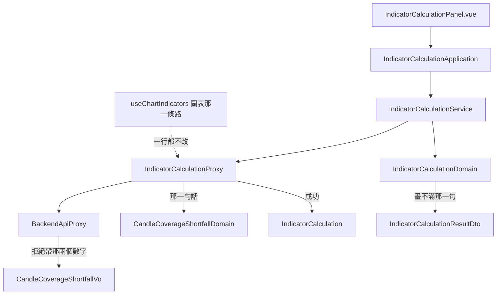

# 指標畫不滿時該說什麼 — Architecture Design

**Status:** Confirmed
**Source PRD:** `.sdd/2026-09-08-partial-indicator-coverage/PRD.md`
**Tech context:** Nuxt 3 + Vue 3 + TypeScript · Clean / Onion（`.vue` → Application → Domain ← Proxy）· Entity 乾淨、行為放 Domain Model

---

## 1. Design Goal & Guiding Principle

- **In one sentence:**
  收下系統新回報的「填滿要幾根」，在指標計算畫面上把畫不滿明講出來；
  並認出「湊不出最少可算根數」這一種拒絕，給出與「要得太多」**相反**的兩條出路。
  圖表上畫不滿則什麼都不做。

- **Guiding principle:**
  **每一句話由一個領域物件決定，畫面與 proxy 都只轉述。**
  兩句話講的是不同的事，所以分別由兩個地方決定：
  「畫不滿」由 `IndicatorCalculationDomain` 在組結果時決定（它手上就有那兩個根數），
  「湊不出最少可算根數」由 `CandleCoverageShortfallDomain` 決定（它手上是拒絕帶回來的那兩個數字）。
  兩個數字一律照系統回報的走——**畫面與領域都不重算那條式子**。

---

## 2. Change Scope

| Area | Action | What / Why |
| :--- | :--- | :--- |
| `app/domain/models/vo/candle-coverage-shortfall-vo.ts` | **Add** | 拒絕帶回來的那兩個數字（湊得出幾根、至少要幾根）。純資料、無行為 |
| `app/domain/models/domains/candle-coverage-shortfall-domain.ts` | **Add** | 那一句話：說出兩個數字並給兩條出路（要更**細**的刻度、或補歷史） |
| `app/domain/errors/backend-request-rejected-error.ts` | **Modify** | 多帶一個 `candleCoverageShortfall`（上面那個 VO）。**只多一個欄位**，因為那兩個數字是同一個概念——分成兩個參數會讓建構選項每次需求都變長 |
| `app/infrastructure/proxy/backend-api-proxy.ts` | **Modify** | 從回應內容把那兩個數字收成 VO 掛到拒絕上（比照既有的 `parameterName` / `field`） |
| `app/infrastructure/proxy/indicator-calculation-proxy.ts` | **Modify** | 收下回來的「填滿要幾根」；認出帶著 VO 的那種拒絕，翻譯成標在「要看多長」旁邊的領域錯誤 |
| `app/domain/models/entities/indicator-calculation.ts` | **Modify** | 多一個 `candleCount: number \| null`。**可為 null 是需求**：系統沒說時不猜 |
| `app/domain/models/dto/indicator-calculation-result-dto.ts` | **Modify** | 多一個 `shortCoverageMessage: string \| null`——**那一句話本身**，不是兩個數字。畫面只剩一個 `v-if` |
| `app/domain/models/domains/indicator-calculation-domain.ts` | **Modify** | 在組結果時決定那句話（兩個分支都要，所以是一個被兩處共用的私有 helper） |
| `app/components/organisms/IndicatorCalculationPanel.vue` | **Modify** | 把那句話擺在既有的「實際採用 N 根」旁邊 |
| **圖表那一整條路** — `use-chart-indicators.ts`、`chart-indicator-domain.ts`、`KCandleChart.vue`、`AppliedIndicatorRowDto`、`ChartIndicatorPanel.vue` | **Not touched** | **這是刻意的，也是本次最重要的一項。** 見下方「為什麼圖表一行都不用改」 |
| 「要得太多」那一句話 | **Not touched** | 既有措辭一字不動（PRD US-02 明列它是回歸守門） |
| 線怎麼畫、擺在哪一根上 | **Not touched** | 本來就照系統回報的那份起始時間擺，短一截自然就短一截 |

### 為什麼圖表一行都不用改

系統那一側把「湊不滿」從**拒絕**改成了**成功**。於是圖表這一條路上：

1. 那一次計算成功回來 → 線照既有規則擺上圖，只是點數比較少。
2. `useChartIndicators` 的 `failureMessage` 沒有被設 → 那一列的說明是 `null`。
3. `AppliedIndicatorRowDto` 因此與畫得滿的那一列**長得一模一樣**。

PRD US-01 的五個情境要的正是這個。**「不用改」不等於「漏做」**——所以 US-01 的每一個情境都
明白斷言「那一列沒有任何說明文字」，讓這件事被測試釘住，而不是靠沒有人去改它。

「湊不出最少可算根數」那一種同樣不必動圖表：它仍然是一個失敗，而那一列本來就顯示失敗的訊息，
換掉的只是**訊息內容**，而訊息內容是 proxy 翻譯出來的。

---

## 3. New Classes / Modules

| Name | Kind | Responsibility (purpose) | Collaborators | Satisfies (PRD scenario) |
| :--- | :--- | :--- | :--- | :--- |
| `CandleCoverageShortfallVo` | VO | 拒絕帶回來的那兩個數字：湊得出幾根、至少要幾根。不可變、無行為 | — | US-02 連一個值都算不出來時就地說明並給出路 |
| `CandleCoverageShortfallDomain` | Domain Model | **那一句話**：說出兩個數字，並提示改用細一點的彙總刻度或先把缺的歷史補回來 | `CandleCoverageShortfallVo` | US-02 同上；US-03 連一個值都算不出來時整次拒絕 |

> 兩者不與「畫不滿」那句話合併：一句是**拒絕**（湊得出幾根 vs 至少要幾根，附兩條出路），
> 一句是**通知**（填滿要幾根 vs 實際採用幾根，不附出路）。數字不同、用途不同、改動的理由也不同。

---

## 4. Modified Components

| Component | Current role | Change needed |
| :--- | :--- | :--- |
| `IndicatorCalculation`（entity） | 一次計算的結果本體，只有欄位 | 多 `candleCount: number \| null`。**null 是一個答案**（系統沒說），不是缺值 |
| `IndicatorCalculationDomain` | 解讀一次計算的結果，組出結果 DTO | 決定「畫不滿」那句話。實際採用根數 < 填滿要幾根時給出那句話，否則 `null`；`candleCount` 為 `null` 時一律 `null`（不猜、不推算） |
| `IndicatorCalculationResultDto` | 結果的唯一形狀 | 多 `shortCoverageMessage: string \| null` |
| `BackendRequestRejectedError` | 業務拒絕的哨兵，帶得出 `parameterName` / `field` | 多帶 `candleCoverageShortfall?: CandleCoverageShortfallVo`，理由與那兩個一致：**以值存在，不靠讀訊息認出來** |
| `BackendApiProxy` | 把 wire 失敗翻成領域錯誤 | 回應內容同時帶那兩個數字時收成 VO 掛上去 |
| `IndicatorCalculationProxy` | 打指標計算、把拒絕分流成精確的領域錯誤 | ①收下回來的 `candleCount`（沒有就是 `null`）；②新增一條分流：拒絕帶著那個 VO 時，翻成標在「要看多長」旁邊的領域錯誤，訊息取自 `CandleCoverageShortfallDomain` |
| `IndicatorCalculationPanel.vue` | 指標計算畫面 | 在既有的「實際採用 N 根」旁邊，`shortCoverageMessage` 不是 `null` 時多一行 |

**分流順序**：新的那一條要排在既有「`field` 是根數」那一條**之前或之後都可以**——
兩者的判準互斥（一種帶 VO、一種帶 `field`），系統那一側保證不會同時出現。
但一律要排在「狀態碼是算式跑不動」與最後那個通用拋出之前。

---

## 5. Component Relationships

---

## 6. Extensibility & Handoff Notes

- **Most likely next requirement:**
  **給一顆按鈕，直接跳到算得出來的彙總刻度**（本次 PRD 明列為 Out of Scope，只給提示文字）。
  一旦使用者讀到「改用細一點的彙總刻度」，下一句就是「那你幫我換」。

- **Where it lands:**
  `CandleCoverageShortfallDomain`。那兩個數字已經**以值**乘著拒絕進來了（不是藏在句子裡），
  所以那顆按鈕要的東西已經到得了——缺的只是「該換成哪一種刻度」這個判斷。

- **How to add it:**
  在 `CandleCoverageShortfallDomain` 上加一個回答「該換成哪一種刻度」的 method
  （它需要目前的彙總刻度，由建構子多收一個），畫面把它接成一顆按鈕。
  **不必動 proxy、不必動錯誤型別、不必動系統那一側**——這正是把數字當值傳、而不是寫進句子裡換來的。

- **Patterns applied & why:**
  只有一個：**以值辨識，不以文字辨識**。這個 repo 已經用過兩次
  （`parameterName` 認出名字對不上、`field` 認出是哪一格），這是第三次。
  讀訊息去辨認等於在比對寫給人看的散文，措辭一改就壞。

- **Do not hardcode:**
  - **不得在畫面或領域重算「填滿要幾根」。** 那條式子（宣告了回看根數時是格數 ＋ 最大回看根數 − 1，沒宣告時就是格數本身）是系統的規則；
    抄一份到這裡，兩邊哪天算得不一樣時，說出來的那句話會安靜地錯。
  - **不得把兩種根數不足講成同一句話。** 出路正好相反（要更細 vs 要更粗）。
  - **不得為「畫不滿」在圖表上加任何提示。** 那是 PRD 明文要求的沉默，不是漏做。
  - `candleCount` 不得預設成 `0` 或送出去的那個數字：`null` 才表達得出「系統沒說」。

- **Known debt / deferred:**
  「填滿要幾根」與畫面**送出去**的那個根數曾經共用 `candleCount` 這個名字但不是同一個數（回來的那一個現在叫 `requiredCandleCount`）。
  通用語地圖已把這條歧義記下來，回來的那一個一律稱「填滿要幾根」。
  改動 proxy 那一段時先讀那一條——這是本切片最容易踩的一個坑。

---

## 7. Traceability

| PRD Scenario | Fulfilled by |
| :--- | :--- |
| US-01 湊得出的根數足夠畫滿 | 既有：計算成功 → `useChartIndicators` 不設失敗訊息 → `AppliedIndicatorRowDto.failureMessage` 為 `null` |
| US-01 只畫得到一半時照樣不出聲 | 同上（湊不滿現在是成功） |
| US-01 線上只有一個點時也不出聲 | 同上 |
| US-01 一支畫得滿、一支畫不滿時各自照舊 | 既有：`useChartIndicators` 逐支持有各自的狀態 |
| US-01 畫不滿的那一支後來畫得滿了 | 既有：`recalculateForRange` → `calculateOne` |
| US-02 連一個值都算不出來時就地說明並給出路 | `BackendApiProxy` → `CandleCoverageShortfallVo` → `IndicatorCalculationProxy` → `CandleCoverageShortfallDomain.message()` → 那一列的失敗訊息 |
| US-02 要得太多是另一句話，出路相反 | 既有：`IndicatorCalculationProxy` 的「`field` 是根數」那一條分流（一字不動） |
| US-02 一支算不出來不影響另一支 | 既有：`useChartIndicators` 逐支持有失敗訊息 |
| US-02 算不出來的那一支留在清單上，換了資料再試 | 既有：換標的 → 重算 → 成功時 `forgetFailure` |
| US-02 上一輪畫得到一半、這一輪算不出來 | 既有：`calculateOne` 失敗時收掉該支上一輪的線 |
| US-03 填滿了就不多說什麼 | `IndicatorCalculationDomain` → `shortCoverageMessage` 為 `null` |
| US-03 畫不滿時明白說出兩個數字 | `IndicatorCalculationDomain` → `shortCoverageMessage` |
| US-03 連一個值都算不出來時整次拒絕 | `IndicatorCalculationProxy` 新分流 + `CandleCoverageShortfallDomain.message()` |
| US-04 兩個數字照抄 | `IndicatorCalculation.candleCount`（原樣收下）+ `IndicatorCalculationDomain`（只比較，不推算） |
| US-04 系統沒說「填滿要幾根」時不猜 | `candleCount: number \| null`；`null` 時 `shortCoverageMessage` 為 `null` |

---

## 8. Risks & Open Decisions

### Risks / trade-offs

- **US-01 全部由既有程式滿足。** 風險是把它讀成「漏做」，或反過來——有人日後「順手」
  在圖表上補一句提示，把 PRED 要求的沉默破壞掉。對策：US-01 的五個情境全部寫成測試，
  斷言那一列**沒有**說明文字；沉默因此有東西守著。
- **`candleCount` 一名兩義**（送出去的 vs 回來的）。對策：通用語地圖的歧義條目 + 本文的 debt 註記。
- `BackendRequestRejectedError` 的建構選項多一個欄位。以 VO 收成一個而不是兩個，
  是為了讓它下次需求不再變長。

### Open decisions (for implementation)

- 兩句話的確切措辭。兩者**不得長得像**：一句講「湊得出 vs 至少要」，
  一句講「填滿要 vs 實際採用」。實作時定案。
- 「畫不滿」那句話在指標計算畫面上與「實際採用 N 根」是並列同一行，還是另起一行——
  依既有版面的擁擠程度在實作時決定。
