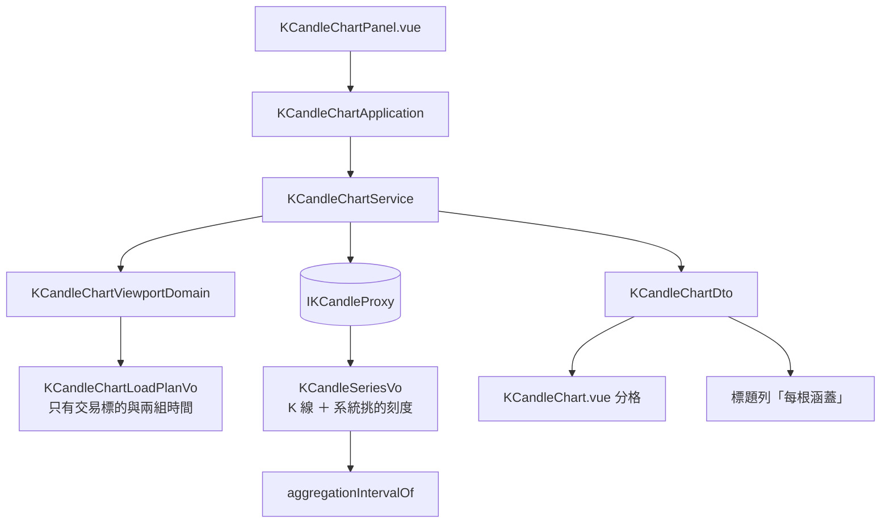

# 圖表只說使用者在看哪一段 — Architecture Design

**Status:** Confirmed
**Source PRD:** `.sdd/2026-09-09-chart-range-said-in-time/PRD.md`
**Tech context:** Nuxt · TypeScript · Clean/Onion · `app/domain/models/{entities,domains,dto,vo}` + `service` + `interface` + `infrastructure/proxy`

---

## 1. Design Goal & Guiding Principle

- **In one sentence:** 讓圖表交出去的只有一段時間，並把「每根多粗」整個交還給系統。

- **Guiding principle:** **拿掉，而不是換掉。**
  這次的正確做法幾乎全部是刪除：刪掉挑刻度的推導、刪掉寫死的一分鐘、刪掉根數換算出來的上限。
  唯一真正**新增**的判斷只有一個——「正在看的那一段長度變了就重新取」——
  而它之所以必須存在，正是因為刻度不再由畫面推導：
  畫面從此算不出「刻度變沒變」，只算得出「我看的長度變了」。

- **一句話設計：** 顯示區間送出去 → 系統回一個刻度 → 畫面照抄。

---

## 2. Change Scope

| Area | Action | What / Why |
| :--- | :--- | :--- |
| `domain/models/domains/k-candle-chart-viewport-domain.ts` | **Modify** | 刪掉刻度（不再持有、不再推導）；上限從「根數 × 刻度長度」改成**五百天**（由系統答得出的一千根 ÷ 預取倍數推導）；重新取的條件多一條「長度變化超過兩成半」 |
| `domain/models/vo/k-candle-chart-load-plan-vo.ts` | **Modify** | 刪掉 `interval`。取回計畫不再說用哪一種刻度——那不是畫面決定的事 |
| `domain/models/dto/k-candle-chart-dto.ts` | **Modify** | `interval` 保留，但它的來源從「取回計畫」變成**後端回覆** |
| `domain/service/k-candle-chart-service.ts` | **Modify** | 組 `KCandleChartDto` 時，刻度取自 proxy 回傳的那一個 |
| `domain/interface/i-k-candle-proxy.ts` | **Modify** | `findKCandleSeries` 的回傳從 `KCandle[]` 改成「K 線 ＋ 這次的刻度」。**這是本次唯一的介面變更** |
| `infrastructure/proxy/k-candle-proxy.ts` | **Modify** | 不再送 `interval`；**開始讀回覆裡的 `interval`**（既有註解說「刻意不讀」，那句話這次要改） |
| `domain/models/vo/aggregation-interval-vo.ts` | **Modify** | 新增一個依代號查出 VO 的入口（認不得就退回最細的），供 proxy 正規化用。`AggregationIntervalDomain` 已有這個規則，但它在 domain 層、且回傳 Domain Model——這裡要的是 VO |
| `components/organisms/KCandleChartPanel.vue` | **Not touched** | 它早就只讀 `chart.value.interval.label`，不必動 |
| `components/molecules/KCandleChart.vue` | **Not touched** | 它讀 `chart.interval.minutes` 分格，來源換了、讀法沒換 |
| **指標計算面板 / 其他頁面** | **Not touched** | 使用者自己挑刻度那條路一字不動 |
| **快捷區間** | **Not touched** | `KCandleChartRangePresetDto` 本來就是天數，被天花板吃掉而已 |

---

## 3. New Classes / Modules

| Name | Kind | Responsibility | Satisfies |
| :--- | :--- | :--- | :--- |
| `KCandleSeriesVo` | VO（`domain/models/vo/`） | 一次取回的成果：**那批 K 線，以及系統說它用了哪一種刻度**。它存在的理由是 proxy 現在有兩件事要往內傳，而把它們拆成兩個回傳值會讓每個呼叫端自己記得配對 | US-02 全部 |
| `aggregationIntervalOf(value)` | 純函式（`aggregation-interval-vo.ts` 內） | 把後端給的代號正規化成 VO，認不得就退回最細的那一種 | US-02「認不得的刻度不讓畫面壞掉」 |

> **`aggregationIntervalOf` 是純函式而不是 method**，理由與同檔既有的常數一致：
> 它把一個**外部字串**變成一個值，來源不是任何一個既有物件（字串不是我們的物件），
> 所以沒有「屬於誰」可搬。這是 code-style 對「真正無狀態的轉換」開的那個例外。

---

## 4. Modified Components

| Component | Current role | Change needed |
| :--- | :--- | :--- |
| `KCandleChartViewportDomain` | 圖表唯一在做判斷的地方 | **刪掉刻度**；上限改成五百天（`MAXIMUM_VISIBLE_DAYS`，由 `ANSWERABLE_CANDLE_COUNT / FETCH_SPAN_MULTIPLIER` 推導）；`toLoadPlan()` 的重新取條件從四條變成四條，但**其中「刻度變了」換成「長度變化超過兩成半」** |
| `KCandleChartLoadPlanVo` | 取回計畫 | 少一個欄位（`interval`）。少了它，「畫面決定刻度」在型別上就不再表達得出來 |
| `KCandleChartDto` | 圖表這次要畫的東西 | `interval` 的**來源**變了，欄位不變。畫面兩個消費者（標題列的標籤、繪圖的分格）都不必改 |
| `IKCandleProxy.findKCandleSeries` | 取一批彙總 K 線 | 回傳 `KCandleSeriesVo`。**這是唯一的介面變更**，而它是必要的：回覆裡多了一個畫面非讀不可的事實 |
| `KCandleProxy.findKCandleSeries` | 唯一允許出現 `$fetch` 的地方 | 送出去少一個參數、讀回來多一個欄位。wire 型別 `KCandleSeriesWire` 已經有 `interval`，只是既有註解決定不讀 |

### 為什麼「長度變了就重新取」是必要的，而不是保險

既有規則是「刻度變了就重新取」。畫面推導刻度時，它算得出「這一次該用的刻度」與「手上那批的刻度」，
所以判斷得出來。**這次拿掉推導之後，畫面手上沒有任何東西可以比對**——
它要等取回來才知道系統挑了什麼。

於是那條規則失去了判斷依據，必須換成畫面**算得出來**的東西：**我看的那一段長度變了多少。**

它是一個代理指標，不精確（長度變了刻度不一定變），所以門檻的兩端都會出事：

| 門檻 | 後果 |
| :--- | :--- |
| 太鬆（例如 5%） | 每一格縮放都重新取，圖不停閃 |
| 太緊（例如 200%） | 放大之後仍然畫著粗刻度，**放大這個動作看起來沒有用** |

**兩成半**的取法：相鄰兩種刻度之間至少差三倍（1m→5m、15m→1h），
所以要跨過一個刻度邊界，長度至少得變三倍——兩成半遠低於它，
因此「該換刻度時一定會重取」；而使用者手動微調很少超過兩成半，
因此「不該重取時通常不重取」。**寧可多取一次，也不要讓放大看起來壞掉。**

### 手上這批當初取的那一段有多長，從哪裡知道

不必新增欄位。取回時兩側各多取半段，所以**已取回區間的長度恰好是當初顯示區間的兩倍**。
除以二就是要比對的那個長度。

---

## 5. Component Relationships

刻度只有**一個**來源，而且它在圖的右邊——從後端進來，往畫面出去。**左邊那一條路上不再有它。**

---

## 6. Extensibility & Handoff Notes

- **Most likely next requirement:** (a) 圖上呈現收盤時段；(b) 使用者想手動鎖定一種刻度；
  (c) 第七種刻度。

- **Where it lands:**
  - (a) 純繪圖，落在 `KCandleChart.vue`。
  - (b) 那會是**把刻度放回取回計畫**——取回計畫刻意少掉那個欄位，所以這件事會逼人來讀這份設計，
    而不是悄悄長回來。屆時它是「使用者指定」，不是「畫面推導」，兩者不同。
  - (c) 只要 `AGGREGATION_INTERVALS` 多一列，`aggregationIntervalOf` 自動認得。

- **How to add it:** **不得**在畫面任何一處出現「一段時間除以刻度長度等於幾根」。
  那條式子讀的是牆上的鐘，而會收盤的市場不照牆上的鐘走——這是同一個 bug 的第四處，
  拿掉之後不要讓它長回來。

- **Do not hardcode:** 那個上限**必須推導**，不能寫死一個數字。它是
  「系統一次答一千根（最粗的刻度是一天一根）」**除以預取倍數**——
  因為**問出去的不是使用者看的那一段**，而是它加上兩側預取之後的兩倍。
  第一版把它寫成一千天，於是使用者拉到五百天以上整張圖就消失、換成一句「區間過大」，
  而那正是這個常數存在的目的要避免的事。系統那一側的上限若調整，這裡要跟著改。

- **Known debt / deferred:**
  - **兩成半是代理指標**，不是精確判斷。真正精確的做法是讓系統告訴畫面「這一段該用哪一種刻度」
    而不必取資料，但那要多一個往返，而放大縮小是高頻動作。目前接受多取一次。
  - **這裡的答得出的根數與系統那側的單次上限是兩份設定。** 兩邊都改才對得上；
    目前刻意不從系統取回這個數字（那要多一個端點，為一個幾乎不會變的常數）。

---

## 7. Traceability

| PRD Scenario | Fulfilled by |
| :--- | :--- |
| US-01 一天／一個月／一年各自不同長度；兩顆按鈕不同段 | `KCandleChartRangePresetDto`（不改）＋ `KCandleChartViewportDomain` 移除天花板 |
| US-02 只送交易標的與起訖時間 | `KCandleChartLoadPlanVo` 移除 `interval` ＋ `KCandleProxy` 不再送它 |
| US-02 每根涵蓋照系統回報顯示（五分鐘／一分鐘） | `KCandleProxy` 讀回覆的 `interval` → `KCandleSeriesVo` → `KCandleChartDto` |
| US-02 認不得的刻度不讓畫面壞掉 | `aggregationIntervalOf` 退回最細的那一種 |
| US-03 台股週六按五天／盤後按一天看得到 K 線 | 移除天花板後那一段涵蓋了交易時段；刻度由系統挑 |
| US-03 拉出整個週六呈現「查無 K 線」 | 既有空狀態（不改） |
| US-04 一年／一千天不被收回；一千零一天與十年收回一千天 | `KCandleChartViewportDomain` 的 `MAXIMUM_VISIBLE_DAYS` |
| US-05 放大就重新取／小幅平移不重取／只變一成不重取 | `KCandleChartViewportDomain.toLoadPlan()` 的長度變化判斷 |
| US-05 拖出範圍就重取／換交易標的重取／換畫法不重取 | 既有條件（不改） |

---

## 8. Risks & Open Decisions

- **Risks / trade-offs:**
  - **介面變更會擴散到測試替身。** `IKCandleProxy.findKCandleSeries` 的回傳型別變了，
    所有 mock 都要跟著給新形狀。那是機械性的，但數量不少。
  - **`KCandleChartLoadPlanVo` 少一個欄位會讓現有測試的斷言失效**（有測試在斷言 `loadPlan.interval`）。
    那些斷言該刪，不該改——它們斷言的正是這次要拿掉的行為。
  - **兩成半這個門檻是這次唯一的新判斷**，也是唯一可能讓使用者感覺「怪」的地方。
    兩側都要有測試（變一成不重取、變一半重取）。

- **Open decisions (for implementation):** 無。
