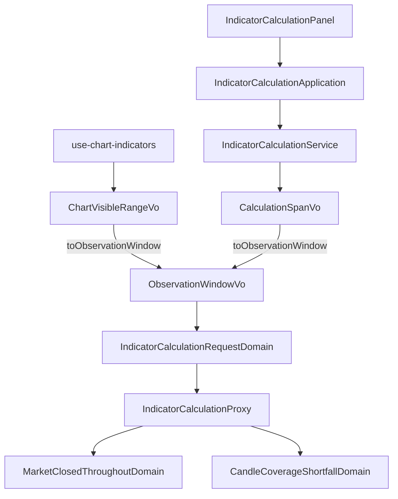

# 說要看哪一段，不再自己數格子 — Architecture Design

**Status:** Confirmed
**Source PRD:** `.sdd/2026-09-09-indicator-observation-window/PRD.md`
**Tech context:** Nuxt 4 · TypeScript · Vue 3 · Clean/Onion（元件 → Application → Domain ← Proxy）

---

## 1. Design Goal & Guiding Principle

- **In one sentence:** 讓兩個畫面各自把自己天生知道的東西轉成同一種形狀——**一段觀察區間**——然後交出去，中間不再有任何一處把時間除以刻度。

- **Guiding principle:** **一個新的值物件把兩個來源收斂成一種形狀，換算則各自寫在來源身上。**
  圖表天生知道「使用者正在看哪一段」，指標計算畫面天生知道「使用者想看多長」。
  這是兩件不同的事，硬要它們共用一個「幾格」的中介，就是現在這個 bug 的來源——
  那個中介需要一條只有系統才答得出的算式。
  改成各自 `toObservationWindow()`：轉換寫在讀得到自己資料的那一邊（不是掛在目標身上的
  `fromXxx`），而下游從此只認得一種形狀。第三個來源（回測、某個新畫面）就是第三個
  `toXxx()`，不是第三個分支。

---

## 2. Change Scope

| Area | Action | What / Why |
| :--- | :--- | :--- |
| `domain/models/vo/observation-window-vo.ts` | **Add** | 觀察區間：起點，加上「終點或現在」。下游唯一認得的形狀 |
| `domain/models/vo/chart-visible-range-vo.ts` | **Modify** | 以 `toObservationWindow(latestKCandleOpenTime)` 取代 `kCandleCountAt`；`calculationEndTime` 只剩這一個呼叫者，內聯進去 |
| `domain/models/vo/calculation-span-vo.ts` | **Modify** | 以 `toObservationWindow(now)` 取代 `kCandleCountAt` |
| `domain/models/domains/market-closed-throughout-domain.ts` | **Add** | 第三種拒絕該說的那一句話。與既有的 `CandleCoverageShortfallDomain` 同一個形狀、同一個理由 |
| `domain/models/dto/indicator-calculation-request-dto.ts` | **Modify** | `candleCount` + `endTime` → `observationWindow`（兩個欄位併成一個，因為它們本來就是一段的兩端） |
| `domain/models/dto/chart-indicator-request-dto.ts` | **Modify** | 同上 |
| `domain/models/domains/indicator-calculation-request-domain.ts` | **Modify** | 持有觀察區間，不再持有根數與截止時間 |
| `domain/service/indicator-calculation-service.ts` | **Modify** | `kCandleCountFor` → `observationWindowFor(span)`，以 `new Date()` 定住「現在」（與 `k-candle-service` 同一個既有寫法） |
| `domain/service/chart-indicator-service.ts` | **Modify** | 搬運觀察區間而非根數與截止時間 |
| `application/indicator-calculation-application.ts` | **Modify** | 跟著改名，維持「畫面不自己算」 |
| `infrastructure/proxy/indicator-calculation-proxy.ts` | **Modify** | 送 `startTime`／`endTime`；把「要得太多」的判準從 `candleCount` 改成 `startTime`；新增第三種拒絕的辨認與翻譯 |
| `infrastructure/proxy/backend-api-proxy.ts` | **Modify** | 把系統交出來的「這一段沒有交易」旗標帶進拒絕錯誤，與既有那兩個值同一種做法 |
| `composables/use-chart-indicators.ts` | **Modify** | 交出顯示區間換來的觀察區間 |
| `components/organisms/IndicatorCalculationPanel.vue` | **Modify** | 建請求時改帶觀察區間 |
| **回測那一整條**（`backtest-*`） | **Not touched** | 它收的本來就是一段起訖，系統那一側也沒改它 |
| **K 線圖取資料**（`k-candle-*`） | **Not touched** | 一直都是照時間區間取的，沒有這個毛病 |
| **`IndicatorCalculationField` 的四個值** | **Not touched** | 第三句話落在既有的 `span` 那一格，不新增欄位——畫面上本來就只有那一格可改 |
| **「畫不滿」的通知** | **Not touched** | 它講的是歷史不夠深，與收盤無關 |

---

## 3. New Classes / Modules

| Name | Kind | Responsibility (purpose) | Collaborators | Satisfies (PRD scenario) |
| :--- | :--- | :--- | :--- | :--- |
| `ObservationWindowVo` | VO | 一次計算要為**哪一段行情**拿到值：起點，加上終點——`null` 是一個答案（「算到現在」），不是缺值 | — | US-01 全部、US-02 全部 |
| `MarketClosedThroughoutDomain` | Domain Model | 「這一段時間市場沒有交易」該對使用者說的那一句話，以及它為什麼不能與另外兩句共用動詞 | — | US-03 前三個 Scenario |

> 只有兩個。其餘全是既有物件改口——這次要換的是說法，不是結構。

---

## 4. Modified Components

| Component | Current role | Change needed |
| :--- | :--- | :--- |
| `ChartVisibleRangeVo` | 使用者正在看的那一段，會回答「是不是同一段」「有幾根」「算到哪一刻」 | 新增 `toObservationWindow(latestKCandleOpenTime)`：起點是自己的左端，終點由既有的「看不看得到最新那一根」決定。`kCandleCountAt` 刪除；`calculationEndTime` 內聯進新方法（只剩一個呼叫者，照規則不留）。`isSameAs` 與 `showsTheLatestKCandle` 不動——後者另有呼叫者（一根走完要不要重算） |
| `CalculationSpanVo` | 「要看多長」：一個數字配一個單位 | 新增 `toObservationWindow(now)`：終點是 `null`（算到現在），起點是現在往回推自己這麼長。`kCandleCountAt` 刪除。`validationMessage` 不動 |
| `IndicatorCalculationRequestDto` / `ChartIndicatorRequestDto` | 一次計算要給的東西 | 兩個欄位（根數、截止時間）換成一個 `observationWindow`。**併成一個是重點**：它們本來就是同一段的兩端，分開放就有機會只搬走一半 |
| `IndicatorCalculationRequestDomain` | 一次計算的輸入驗證與定案 | 持有 `observationWindow`；不再持有 `candleCount`。既有的驗證（交易標的、算式內容、旋鈕）一字不改 |
| `IndicatorCalculationService` | 畫面的唯一入口 | `kCandleCountFor(span, interval)` → `observationWindowFor(span)`。**刻度參數消失**是這次的重點：一段裡有幾格不再與刻度有關，那是系統的答案 |
| `IndicatorCalculationProxy` | 打計算端點、把拒絕分成畫面聽得懂的話 | 送 `startTime`（必給）與 `endTime`（`null` 就整個省略，維持「省略即現在」）；把「要得太多」的判準常數由 `candleCount` 改為 `startTime`；在既有兩種拒絕之前多認一種：系統說「這一段沒有交易」時，丟出標在 `span` 那一格的錯誤，句子向 `MarketClosedThroughoutDomain` 要 |
| `BackendApiProxy` | 把後端的失敗正規化成領域錯誤 | 失敗資料多讀一個布林旗標並帶進 `BackendRequestRejectedError`，與既有的 `parameterName`／兩個根數同一種搬法 |
| `use-chart-indicators` | 圖表上什麼時候算、算什麼 | 把 `range.kCandleCountAt(...)` 與 `range.calculationEndTime(...)` 兩行換成一行 `range.toObservationWindow(chart.latestKCandleOpenTime)` |
| `IndicatorCalculationPanel.vue` | 指標計算畫面 | 建請求時把 `kCandleCountFor(...)` 換成 `observationWindowFor(span)` |

---

## 5. Component Relationships

一句話：**兩個來源各自轉成同一種形狀，下游只認得那一種；回來的三種拒絕各自有一句自己的話。**

---

## 6. Extensibility & Handoff Notes

- **Most likely next requirement:** (a) 回測也改成同一種說法；(b) 圖上把收盤時段畫成灰底；(c) 系統再多一種拒絕。

- **Where it lands:**
  - (a) 第三個 `toObservationWindow()`——寫在回測那一段時間自己身上，下游一行都不必動。
  - (b) 完全不在這條路上：那是圖的長相，與「算哪一段」無關。這次刻意沒有把交易時段帶進畫面，就是為了不讓它變成第二份作息知識。
  - (c) `IndicatorCalculationProxy` 那串「認出是哪一種」的分支多一列，配一個自己的 Domain Model 句子。

- **How to add it:** 新的來源寫 `toObservationWindow()`；新的拒絕寫一個 `XxxDomain.message()`。**不得**在元件裡拼句子，也不得靠讀訊息文字判斷是哪一種拒絕。

- **Patterns applied & why:**
  - **轉換寫在來源身上**（`a.toB()`）：兩個來源讀的是各自的資料，寫成 `ObservationWindowVo.fromXxx()` 會把兩份別人的資料整包搬進來，正是 Feature Envy。
  - **一句話一個 Domain Model**：三種拒絕的措辭各自有改動的理由，而它們必須**互相不像**——放在一起就會慢慢被寫成同一句。

- **Do not hardcode:** 三句話的措辭不得散進元件；判斷是哪一種拒絕不得讀訊息文字（文字改一次就失效）。「一段時間除以刻度等於幾格」這條算式**從此不得在畫面出現**——它正是這次要消滅的東西。

- **Known debt / deferred:**
  - 指標計算畫面的「現在」由領域服務讀系統時鐘取得（與既有 `k-candle-service` 同一寫法），沒有時鐘抽象。測試因此以區間長度斷言，不釘死絕對時刻。
  - 台股在深夜按計算會被拒絕，而使用者填的數字沒有錯。措辭要說「什麼時候」而不是「多長」，這一點靠句子本身承擔，不新增畫面元素。

---

## 7. Traceability

| PRD Scenario | Fulfilled by |
| :--- | :--- |
| US-01 圖上看一個交易日／拉遠之後重算 | `ChartVisibleRangeVo.toObservationWindow` + `use-chart-indicators` |
| US-01 看得到最新那一根／拖到過去的行情 | `ChartVisibleRangeVo.toObservationWindow`（內聯後的終點規則） |
| US-02 填最近兩小時／最近一天 | `CalculationSpanVo.toObservationWindow` + `IndicatorCalculationService.observationWindowFor` |
| US-02 要看多長填了零 | 既有 `CalculationSpanVo.validationMessage`（不改） |
| US-03 整段落在收盤後／整段是週末／不指向沒用的出路 | `BackendApiProxy`（辨認）＋`IndicatorCalculationProxy`（翻譯）＋`MarketClosedThroughoutDomain`（措辭） |
| US-03 歷史不夠深仍是既有那一句 | 既有 `CandleCoverageShortfallDomain`（不改） |
| US-03 一次要得太多仍是既有那一句 | `IndicatorCalculationProxy` 的判準常數改為 `startTime` |
| US-03 全天候市場的深夜照常算得出來 | 無需程式：系統不會回那一種拒絕 |
| US-04 台股線變短不多說／畫不滿仍然說／加密貨幣不變 | 無需程式：這次沒有新增任何提示，既有「畫不滿」那一句不動 |

---

## 8. Risks & Open Decisions

- **Risks / trade-offs:**
  - **判準常數改名是壞得最安靜的一處**：漏改不會有人喊，那一句只會從欄位旁邊掉下來變成籠統錯誤。必須有一個測試直接釘住「系統說 `startTime` 出問題時，訊息標在那一格旁邊」。
  - 兩個 DTO 的欄位合併會動到不少測試的建構呼叫；那是一次性的成本，換掉的是「只搬走一半」的可能。
  - `ObservationWindowVo` 的終點用 `null` 表示「現在」，與既有 `endTime: Date | null` 的約定一致，因此沒有新的語意要學。

- **Open decisions (for implementation):**
  - 第三句話的完整措辭由實作時定稿，準則寫在 `MarketClosedThroughoutDomain` 的註解裡：**不得出現「刻度」與「縮短／拉長」**，因為那兩條路對這一種一點用都沒有。
