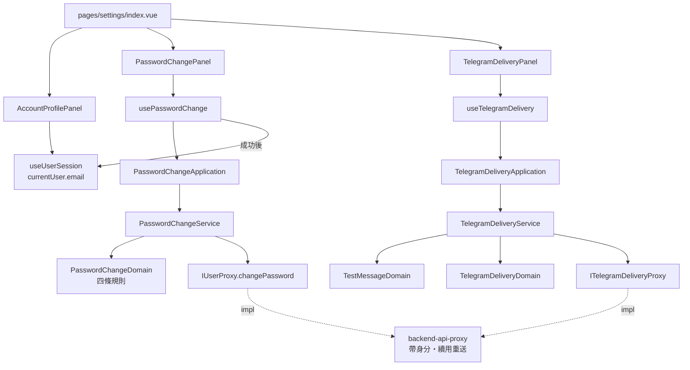

# 帳號設定畫面 — Architecture Design

**Status:** Draft
**Source PRD:** `.sdd/2026-09-10-account-settings/PRD.md`
**Tech context:** Nuxt 4 · Vue 3 · TypeScript · Clean/Onion（`app/{components,application,domain,infrastructure}`）

---

## 1. Design Goal & Guiding Principle

- **In one sentence:**
  多一個「設定」的去處，在那裡看得到帳號、換得掉密碼、留得下 Telegram 投遞設定並當場試送——
  而三個區塊的狀態**彼此獨立**，一個出錯不會蓋掉另外兩個。

- **Guiding principle — 三件事各自只寫一次：**

  1. **「這一次密碼變更哪裡不對」只判斷一次。**
     兩次不一致、太短、太長、與目前相同——這四條全部收進 `PasswordChangeDomain`。
     元件不判斷任何一條，只把它算出來的**逐格說明**掛回去。
     元件各自判斷的話，四條規則會散在三個 `computed` 裡，而其中一條遲早與後端不一致。
  2. **「送不出去是哪一種」只翻譯一次。**
     後端回的是一個**取值**（四選一），中文句子由 `DeliveryFailureReasonVo` 給。
     沿用這個專案對「三種算不出來」「漲跌語氣」已經定下的做法：
     **靠回應帶了哪一個值分辨，不讀訊息文字**——文字是寫給人看的，改一次措辭就會失效。
  3. **三個區塊三份狀態。** 每個區塊自己的 `pending` / `errorMessage`，
     不共用一個頁面級的錯誤。共用一份的話，Telegram 讀取失敗會讓換密碼那一區也看起來壞了。

  第四件順帶的：**畫面自己擋得住的就自己擋**（兩次不一致、訊息空白、訊息超長）。
  這不是為了少跑一趟後端，是因為**後端根本判斷不了第一條**——它只收得到一組新密碼。

---

## 2. Change Scope

| Area | Action | What / Why |
| :--- | :--- | :--- |
| `pages/settings/index.vue` | **Add** | 新的去處。只負責擺三張卡與填 `ConsoleLayout` 的插槽 |
| `components/templates/ConsoleLayout.vue` | **Modify** | `DESTINATIONS` 多一項「設定」，排最後 |
| `components/atoms/AppIcon.vue` | **Modify** | 多一個 `settings` 圖示。**自己畫、按 16px 設計**，與既有 20 個同一套筆畫 |
| `components/organisms/AccountProfilePanel.vue` | **Add** | 電子郵件 + 遮住的密碼 + 那句「密碼不會顯示，只能更換」 |
| `components/organisms/PasswordChangePanel.vue` | **Add** | 三格 + 一顆鍵 + 逐格說明 |
| `components/organisms/TelegramDeliveryPanel.vue` | **Add** | 目前狀態 + 兩格 + 儲存/移除 + 測試訊息框 + 送出 |
| `composables/use-password-change.ts` | **Add** | 換密碼這一區的狀態與編排 |
| `composables/use-telegram-delivery.ts` | **Add** | Telegram 這一區的狀態與編排 |
| `composables/use-user-session.ts` | **Modify** | 多一個 `signOutAfterPasswordChange(notice)`：清乾淨、帶著那句話回登入畫面 |
| `pages/login.vue` | **Modify** | 顯示上一頁帶過來的那句話（「密碼已更換，請用新密碼重新登入」） |
| `application/password-change-application.ts` | **Add** | 換密碼的用例 |
| `application/telegram-delivery-application.ts` | **Add** | Telegram 四個用例 |
| `domain/service/password-change-service.ts` | **Add** | 規則 + 呼叫 proxy + 轉 DTO |
| `domain/service/telegram-delivery-service.ts` | **Add** | 同上 |
| `domain/models/domains/password-change-domain.ts` | **Add** | **本設計的核心之一。** 四條規則的唯一所在地，產出逐格說明 |
| `domain/models/domains/test-message-domain.ts` | **Add** | 訊息不得空白、至多 4096、目前字數 |
| `domain/models/domains/telegram-delivery-domain.ts` | **Add** | 已設定與否、結尾怎麼講、轉成畫面形狀 |
| `domain/models/entities/telegram-delivery.ts` | **Add** | 後端交出來的那一份的樣子。**沒有完整金鑰欄位** |
| `domain/models/dto/telegram-delivery-dto.ts` | **Add** | 畫面看到的形狀 |
| `domain/models/dto/telegram-delivery-write-dto.ts` | **Add** | 送出去的形狀 |
| `domain/models/dto/test-message-result-dto.ts` | **Add** | 一次試送的結果 |
| `domain/models/dto/password-change-dto.ts` | **Add** | 三格的形狀（application → domain） |
| `domain/models/dto/password-change-field-errors-dto.ts` | **Add** | 逐格說明，比照既有的 `CredentialsFieldErrorsDto` |
| `domain/models/vo/delivery-failure-reason.ts` | **Add** | 四種原因的取值與**它們各自的那句話** |
| `domain/errors/current-password-rejected-error.ts` | **Add** | 「目前的密碼不正確」自己的型別（後端 403） |
| `domain/errors/secret-seal-unavailable-error.ts` | **Add** | 「系統目前存不了金鑰」自己的型別（後端 503） |
| `domain/errors/telegram-not-configured-error.ts` | **Add** | 「還沒完成設定」自己的型別（後端 409） |
| `domain/interface/i-user-proxy.ts` | **Modify** | 多一個 `changePassword` |
| `domain/interface/i-telegram-delivery-proxy.ts` | **Add** | 讀、寫、移除、試送 |
| `infrastructure/proxy/user-proxy.ts` | **Modify** | 實作 `changePassword`，把 403 認成 `CurrentPasswordRejectedError` |
| `infrastructure/proxy/telegram-delivery-proxy.ts` | **Add** | 四條路由，把 409／503 認成各自的型別 |
| `plugins/dependencies.ts` | **Modify** | 接上兩條新的線 |
| `infrastructure/proxy/backend-api-proxy.ts` | **Not touched** | 帶身分、認「請重新登入」、續用後重送——**它已經全部做到了**。兩個新 proxy 走同一份基底就自動有這些 |
| `middleware/signed-in.global.ts` | **Not touched** | 「沒登入就帶到登入畫面並記下他要去哪」**已經是全域的**。設定畫面自動被它保護，一行都不必寫 |
| 其他每一個畫面 | **Not touched** | 側欄多一項不影響它們 |

---

## 3. New Classes / Modules

| Name | Kind | Responsibility | Collaborators | Satisfies |
| :--- | :--- | :--- | :--- | :--- |
| `PasswordChangeDomain` | Domain Model | **四條規則的唯一所在地**：兩次是否一致、新密碼長度（字元數下限 8、位元組上限 72）、新舊是否相同。產出 `PasswordChangeFieldErrorsDto`；沒有錯誤時才吐得出送得出去的 DTO | `PasswordChangeFieldErrorsDto` | US-03 的 4/5/7/8、US-06 |
| `TestMessageDomain` | Domain Model | 訊息去前後空白、不得空白、至多 4096 個字元；說得出**目前字數**與**送不送得出去** | — | US-06 全部 |
| `TelegramDeliveryDomain` | Domain Model | 一份設定的行為：設了沒、結尾那句話怎麼講、轉成畫面形狀 | `TelegramDeliveryDto` | US-04 全部 |
| `TelegramDelivery` | Entity | 後端交出來的那一份：`configured`、`chatId`、`botTokenTail`、`configuredAt`。**結構上沒有完整金鑰** | `TelegramDeliveryDomain` | US-04 的 2/3 |
| `DeliveryFailureReason` | VO | 四種原因的取值，**以及每一種對應的那句中文**。翻譯住在領域，不住在元件 | — | US-05 的 5/6/7/8/9 |
| `PasswordChangeFieldErrorsDto` | DTO | 逐格說明：`currentPassword?`、`newPassword?`、`newPasswordConfirmation?`。比照既有 `CredentialsFieldErrorsDto` | — | US-03 全部 |
| `TestMessageResultDto` | DTO | 送成功了沒、沒成的話是哪一種 | `DeliveryFailureReason` | US-05 全部 |
| `CurrentPasswordRejectedError` | Error | 後端 403。**它是一個型別而不是一句訊息**，因為畫面要據它把說明掛回「目前的密碼」那一格 | — | US-03 的 6 |
| `SecretSealUnavailableError` | Error | 後端 503。要說「這不是你填錯了什麼」，與其他失敗做的事不同 | — | US-04 的 4 |
| `TelegramNotConfiguredError` | Error | 後端 409 | — | US-05 的 3 |
| `PasswordChangeService` / `TelegramDeliveryService` | Domain Service | 規則 → proxy → DTO | 上述全部 | 全部 |
| `PasswordChangeApplication` / `TelegramDeliveryApplication` | Application | 用例編排 | 上述 service | 全部 |
| `ITelegramDeliveryProxy` | Interface | 讀、寫、移除、試送 | — | US-04、US-05、US-07 |

### `PasswordChangeDomain` 的介面（深模組檢查）

```ts
// 一次建構，四條規則都判完。
new PasswordChangeDomain(currentPassword, newPassword, newPasswordConfirmation)

get fieldErrors(): PasswordChangeFieldErrorsDto | null   // 沒問題時 null
get submittable(): boolean                                // 三格都有東西且沒有 fieldErrors
toDto(): PasswordChangeDto                                // 只有 submittable 才拿得到
```

- 元件**不判斷任何一條規則**，只讀 `fieldErrors` 與 `submittable`。
- 加一條新規則（例如「不得含空白」）是**這個檔案裡多一段**，不是三個元件各補一次。
- 它**不知道**有沒有後端這回事——不合規的東西根本走不到 proxy。

### 前端為什麼自己也判「太短／太長／與目前相同」

後端當然也判，而且是權威。前端仍然判，理由有二：

1. **兩次不一致這一條，後端判不了**——它只收得到一組新密碼。既然這一格的說明本來就得
   由前端產出，其餘三條一起產出才會是同一套說明、同一個掛法。
2. **後端的三條說明都回 400，畫面分不出是哪一條**（本專案的錯誤形狀只有一句 `message`）。
   自己判就不必讀訊息文字。**萬一真的漏判而後端擋下來**，
   一律把後端那句話原樣掛到「新的密碼」那一格——不猜。

唯一**只有後端知道**的是「目前的密碼對不對」，而它有自己的狀態碼（403）與自己的錯誤型別。

### `DeliveryFailureReason` 的形狀

```ts
export type DeliveryFailureReason =
  | 'credentialRejected' | 'destinationNotFound' | 'unreachable' | 'timedOut'

// 翻譯住在領域。認不得的取值一律歸到「連不上」那一句，
// 不讓畫面因為後端多了第五種而變成一片空白。
export function deliveryFailureSentence(reason: DeliveryFailureReason): string
```

---

## 4. Modified Components

| Component | Current role | Change needed |
| :--- | :--- | :--- |
| `ConsoleLayout.vue` | 側欄 + 頂帶 + 工作區 | `DESTINATIONS` 多 `{ to: '/settings', label: '設定', icon: 'settings' }`，排最後 |
| `AppIcon.vue` | 20 個內建圖示 | 多一個 `settings`。**自己畫**，按 16px 設計，與既有筆畫粗細一致 |
| `use-user-session.ts` | 全站共用的「現在是誰」 | 多一個 `signOutAfterPasswordChange()`：清掉共用狀態（比照既有 `signOutBecauseSessionExpired`）、**留下一句給登入畫面的話**、導回登入畫面。**刻意不走 `signOut()`**——那一支會去後端撤登入階段，而後端在換密碼時已經把它們全撤了，那一趟必然白跑 |
| `pages/login.vue` | 登入卡片 | 顯示 `use-user-session` 帶過來的那句話（有才顯示） |
| `user-proxy.ts` | 建立、登入、續用、撤銷、我是誰 | 多 `changePassword`；403 → `CurrentPasswordRejectedError` |
| `plugins/dependencies.ts` | 手動 DI | 接上兩條新的線 |

### 換密碼成功的收尾（US-03 的 9）

```
按下更換
  → PasswordChangeDomain 判四條（不過就掛說明，不送出）
  → PasswordChangeApplication.changePassword(dto)
  → 後端 204
  → 畫面顯示「密碼已更換，請用新密碼重新登入」
  → useUserSession().signOutAfterPasswordChange()  ← 清乾淨 + 帶著那句話回登入畫面
```

那句話**先顯示在設定畫面上、也帶去登入畫面**。只在其中一邊顯示都不夠：
只留在設定畫面，導走之後他就看不到了；只放登入畫面，中間那一瞬間看起來像被踢出去。

---

## 5. Component Relationships



---

## 6. Extensibility & Handoff Notes

- **Most likely next requirement:**
  1. **在這一頁挑「哪些事情要送到 Telegram」**（後端下一刀鋪好之後）。
  2. **顯示送出紀錄。**
  3. **換電子郵件／刪除帳號。**
  4. **多一個投遞管道（Line、電子郵件）。**

- **Where it lands:**
  - (1) 是 `TelegramDeliveryPanel` 底下多一組開關，走同一個 composable 與 application。
    **不會**改到規則層——那些開關的規則是新的 domain model，加上去就好。
  - (2) 是這一頁多第四張卡，或 Telegram 那張卡多一段。三張卡各自獨立正是為了這個。
  - (3) 是 `AccountProfilePanel` 從「只顯示」變成「可編輯」，
    以及一個新的 `EmailChangeDomain`。既有三條規則一個字都不改。
  - (4) 是把「Telegram」這個字從**畫面文案**裡抽出來的那一天。
    本切片刻意**不**先抽——今天只有一個管道，先抽會多一層沒有第二個實作的間接。
    抽的時候動的是 `TelegramDeliveryPanel` 與它的文案，規則層仍然不動。

- **How to add it:**
  新規則加進對應的 Domain Model 建構子；新的失敗原因加進 `DeliveryFailureReason`
  與它的翻譯函式。**不要**在元件裡寫 `if`。

- **Patterns applied & why:**
  - **逐格說明 DTO**（`PasswordChangeFieldErrorsDto`）：沿用既有 `CredentialsFieldErrorsDto`，
    登入畫面已經證明這個形狀好用。
  - **哨兵錯誤型別**（三個新 Error）：沿用既有 `CredentialsRejectedError` 等一套。
  - **取值→句子的翻譯住在領域**：沿用「三種算不出來」「漲跌語氣」。
  - **一個區塊一份狀態**：三個 composable 各自持有，不共用頁面級錯誤。

- **Do not hardcode:**
  - **4096** 與**密碼的 8／72** 要與後端同一組數字。放在 domain 的常數，**不要抄進元件**。
  - **四種失敗原因的句子**只寫在 `delivery-failure-reason.ts`，不寫在 `.vue` 裡。
  - **不要**把完整金鑰寫進 `localStorage`、`sessionStorage` 或任何 `useState`；
    它只在那一格的 `ref` 裡活到儲存成功為止，然後被清空。

- **Known debt / deferred:**
  - **沒有 E2E**，比照專案現況。
  - **移除設定用瀏覽器原生的確認對話框還是自製元件**：本切片先用專案既有的確認樣式
    （若無則用原生 `confirm`），**重新考慮的訊號**：這一頁出現第二個需要確認的動作。
  - **換密碼成功後那句話靠一份共用狀態帶到登入畫面。** 它會在下一次登入後被清掉。
    如果之後還有第二種「帶一句話去登入畫面」的情境，就該把它抽成一個具名的通知機制。

---

## 7. Traceability

| PRD Scenario | Fulfilled by |
| :--- | :--- |
| US-01 從側欄進得去 | `ConsoleLayout.DESTINATIONS` + `pages/settings/index.vue` |
| US-01 沒登入被帶走、登入後回到這裡 | `middleware/signed-in.global.ts`（**既有，不改**） |
| US-02 顯示電子郵件 | `AccountProfilePanel` ← `useUserSession().currentUser` |
| US-02 密碼那一格是一排點並直說原因 | `AccountProfilePanel` 的靜態內容（**沒有任何資料來源**，因為根本沒有那個資料） |
| US-03 兩次一致就送得出去 | `PasswordChangeDomain.submittable` |
| US-03 兩次不一致由畫面自己擋 | `PasswordChangeDomain.fieldErrors.newPasswordConfirmation` |
| US-03 目前的密碼不正確掛在那一格 | `CurrentPasswordRejectedError`（後端 403）→ `usePasswordChange` 掛到 `currentPassword` |
| US-03 太短／與目前相同掛在那一格 | `PasswordChangeDomain.fieldErrors.newPassword`（前端先判；後端 400 兜底時原樣掛同一格） |
| US-03 送出中按不了第二次 | `usePasswordChange().pending`（比照既有 `useUserSession().pending`） |
| US-03 換成功先說一聲再帶走 | `usePasswordChange` → `useUserSession().signOutAfterPasswordChange()` + `pages/login.vue` |
| US-04 還沒設定過就明說 | `TelegramDeliveryDomain.configured === false` → 空狀態（**不是錯誤樣式**） |
| US-04 設定完金鑰那一格清空 | `useTelegramDelivery` 在成功後清 `botToken` ref |
| US-04 回到這一頁那一格仍然是空的 | 那一格從不由回應填入；顯示的只有 `TelegramDeliveryDomain` 給的那句「已設定，結尾 1234」 |
| US-04 後端存不了金鑰時如實轉達 | `SecretSealUnavailableError`（後端 503） |
| US-05 預填一句可以直接送的話 | `useTelegramDelivery` 的起始值 |
| US-05 送得出去／還沒設定按不下去／送出中只送一則 | `useTelegramDelivery` 的 `canSend` 與 `sending` |
| US-05 四種原因四句不同的話 | `DeliveryFailureReason` + `deliveryFailureSentence` |
| US-06 空白／4096／4097 與目前字數 | `TestMessageDomain` |
| US-07 確認之後移除／取消什麼都不變 | `TelegramDeliveryPanel` 的確認 + `useTelegramDelivery().removeSetting` |
| US-08 連不上後端要明講 | 既有 `BackendUnreachableError` + 每個區塊自己的 `errorMessage`（**三份，不共用**） |

---

## 8. Risks & Open Decisions

- **Risks / trade-offs:**
  - **前端與後端各判一次密碼規則**，兩份規則可能漂移。接受它的理由寫在 §3；
    緩解是把 8／72／4096 三個數字寫成 domain 常數並在註解裡指向後端切片。
  - **403 這個狀態碼是前端第一次遇到。** 既有的 `backend-api-proxy` 對 401 有一整套
    「續用一次再重送」的處理，**403 絕對不能掉進那條路**——那會在使用者只是打錯目前密碼時，
    去換一次續用憑證。實作時要確認基底只對 401 做那件事。
  - **三張卡擠在一頁**，很容易寫成一個頁面級的 `error`。§1 的第三條與 US-08 是防這件事的。
  - **前端不能早於後端完成**：兩個後端切片沒進去之前，這一頁的每一發請求都會 404。

- **Open decisions (for implementation):**
  - 預填的那句測試訊息實際文字（建議：「這是一則來自 go-trading 的測試訊息」）。
  - 遮住的密碼畫幾個點（建議固定 8 個——真實長度本來就不該透露）。
  - 三張卡是一路往下還是兩欄（建議先一路往下，窄螢幕本來就得疊）。
  - `settings` 圖示的實際筆畫。**交付前先渲染出來看過再定案。**
  - 那句「密碼已更換」在設定畫面停多久才導走（建議停在畫面上、由 `signOutAfterPasswordChange`
    立刻導走並在登入畫面續顯示，不做倒數）。
