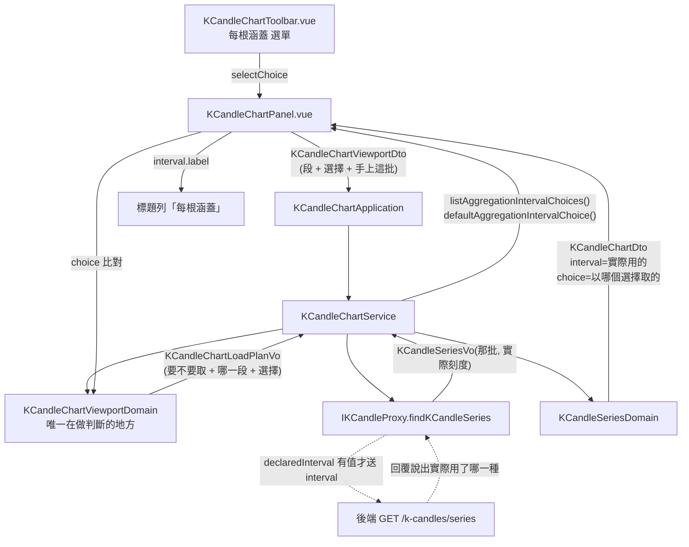

# 使用者自己挑一根 K 線涵蓋多久 — Architecture Design

**Status:** Draft
**Source PRD:** `.sdd/2026-09-10-chart-candle-coarseness-picker/PRD.md`
**Tech context:** Nuxt 4 · Vue 3 · TypeScript · Clean/Onion（`.vue` = Controller → Application → Domain ← Proxy）

---

## 1. Design Goal & Guiding Principle

- **In one sentence:**
  讓「使用者挑的粗細」成為顯示區間旁邊的**第二個輸入**，一路流到取行情的查詢字串上，
  而**「一根實際多粗」仍然只有一個來源：後端的回覆**。

- **Guiding principle:**
  **把「挑的」與「用的」做成兩個型別上分得開的東西，而不是同一個欄位的兩種讀法。**

  上一份切片刻意讓 `KCandleChartLoadPlanVo` **沒有**彙總刻度欄位，
  好讓「畫面決定刻度」這件事在型別上表達不出來。那個保護要留著，
  但要留對地方：現在畫面**說得出**「我要這麼粗」，卻仍然**推導不出**「這一段該多粗」。

  做法是新增一個 `AggregationIntervalChoiceDto`（**選擇**，可能是「沒挑」），
  它與既有的 `AggregationIntervalVo`（**刻度**，六選一）是不同型別：
  - 前者只往**外**走：畫面 → 取回計畫 → 查詢字串。
  - 後者只往**內**走：後端回覆 → `KCandleSeriesVo` → 圖上那句「每根涵蓋」。

  兩條路不交會。於是「拿使用者挑的那個去標題列充數」這件事寫不出來，
  「拿後端回報的那個去比對要不要重取」那個經典無限重取也寫不出來——
  比對的是**選擇**（上次以哪個選擇取的 vs 這次要用哪個），不是刻度。

---

## 2. Change Scope

| Area | Action | What / Why |
| :--- | :--- | :--- |
| `domain/models/dto/aggregation-interval-choice-dto.ts` | **Add** | 「我要多粗」這個選擇本身，含「沒挑（自動）」。它是唯一新的概念 |
| `domain/models/dto/k-candle-chart-viewport-dto.ts` | **Modify** | 多一個欄位：這一次的選擇。它與「我在看哪一段」是同一句話的兩半 |
| `domain/models/vo/k-candle-chart-load-plan-vo.ts` | **Modify** | 多帶著那個選擇。**它仍然沒有「推導出來的刻度」**——帶的是使用者說的話 |
| `domain/models/dto/k-candle-chart-dto.ts` | **Modify** | 多記「這一批是以哪個選擇取回的」。與既有的 `interval`（系統實際用的）**並存且不同** |
| `domain/models/domains/k-candle-chart-viewport-domain.ts` | **Modify** | 重取條件多一條：選擇換了。上限與其餘四條不動 |
| `domain/models/domains/k-candle-series-domain.ts` | **Modify** | 組 `KCandleChartDto` 時把選擇一併寫進去（取自取回計畫） |
| `domain/service/k-candle-chart-service.ts` | **Modify** | 多兩個唯讀用例：列出五個選擇、說出預設是哪一個。比照既有的快捷區間兩式 |
| `application/k-candle-chart-application.ts` | **Modify** | 轉一手上面兩個用例 |
| `infrastructure/proxy/k-candle-proxy.ts` | **Modify** | 選擇說得出刻度時才把 `interval` 放進查詢字串 |
| `components/molecules/KCandleChartToolbar.vue` | **Modify** | 多一組「每根涵蓋」下拉選單 |
| `components/organisms/KCandleChartPanel.vue` | **Modify** | 持有目前的選擇、換了就重取、建 viewport 時帶上它 |
| **後端 `go-trading`** | **Not touched** | 它本來就收 `interval`、認得四種、區間過大會說出兩條出路。這次一行都不必動 |
| `domain/models/vo/aggregation-interval-vo.ts` | **Not touched** | 六種刻度與「認不得就退回最細」照舊。選單只挑其中四種，那是**選單的判斷**，不是刻度清單的 |
| `IndicatorCalculationPanel.vue` 那個刻度選單 | **Not touched** | 它本來就是使用者挑，且挑的是六種、沒有「自動」。兩者刻意不共用清單 |
| 顯示區間五百天上限 | **Not touched** | 它守的是「自動」。挑了固定粗細而超量時由後端回話（PRD R6） |
| 「長度變化兩成半就重取」 | **Not touched** | 挑了固定粗細後它已無必要，但拿掉只省偶爾一次重取，卻多一條分兩種情況讀的規則 |
| 記住使用者挑的那一種 | **Not touched** | 這一版不做。座位已留好，見第 6 節 |

---

## 3. New Classes / Modules

| Name | Kind | Responsibility (purpose) | Collaborators | Satisfies (PRD scenario) |
| :--- | :--- | :--- | :--- | :--- |
| `AggregationIntervalChoiceDto` | DTO | 持有使用者在圖表上挑的那一個粗細，**含「沒挑」這個合法值**；並回答由它衍生的兩個問題：選單上它的值是什麼、取行情時要不要說出一個刻度 | `AggregationIntervalVo` | 選單列出五項、選著自動時不含粗細、挑了五分鐘就說出五分鐘、挑回自動就不再說粗細 |

**形狀：**

```ts
export class AggregationIntervalChoiceDto {
  constructor(
    public readonly label: string,
    /** 沒挑（自動）時是 null——它不是第七種刻度，是「這句話不說」。 */
    public readonly interval: AggregationIntervalVo | null,
  ) {}

  /** 選單上這一項的值，同時也是這個選擇的身分。 */
  get value(): string { ... }

  /** 取行情時要說出去的那一個刻度；沒挑時是 null，代表什麼都不說。 */
  get declaredInterval(): string | null { ... }
}
```

**為什麼只有一個新型別。** 「自動」很容易被做成第二個型別（或一個 `isAutomatic` 布林、
或一個 sentinel 字串）。做成 `interval: AggregationIntervalVo | null` 之後，
「沒挑」在型別上就是 `null`，而**每一個要用它的地方都被逼著處理那個 null**：
proxy 送不送、比對兩次選擇一不一樣、選單上顯示哪個標籤。
布林則允許「`isAutomatic` 為真、卻同時帶著一個刻度」這種說不通的狀態存在。

**Depth check.** 它的介面是兩個 getter，內部藏著「自動 = 不說話」這條規則。
呼叫端不必依序做任何事，也不必知道 `'auto'` 這個字串長什麼樣。通過。

---

## 4. Modified Components

| Component | Current role | Change needed |
| :--- | :--- | :--- |
| `KCandleChartViewportDto` | 畫面交出去的「我在看這一段，手上有這些」 | 加第五個欄位 `aggregationIntervalChoice`。它與 `visibleStartTime/EndTime` 平級：都是使用者說出口的意圖 |
| `KCandleChartLoadPlanVo` | 「要不要取、取哪一段」的結論，兼查詢條件 | 加 `aggregationIntervalChoice`。**檔頭那段「它刻意沒有彙總刻度」的註解要改寫**：它現在帶的是**使用者宣告的**那一個，仍然沒有**推導出來的**那一個——保護的對象沒變，措辭要跟上 |
| `KCandleChartDto` | 圖表要畫的東西（含系統回報的 `interval`） | 加 `aggregationIntervalChoice`＝**這一批是以哪個選擇取回的**。它與 `interval` 並存，且必須並存：前者供下一次比對「選擇換了沒」，後者供標題列說實話。**拿 `interval` 去比對會無限重取**（選自動、回五分鐘，下次選擇仍是自動卻永遠不等於五分鐘） |
| `KCandleChartViewportDomain` | 整個圖表唯一在做判斷的地方；建構時收上限，`toLoadPlan()` 回答三件事 | 建構子多收選擇；`needsReload` 多第六條理由：`loadedChart.aggregationIntervalChoice.value !== 這次的.value`。**公開介面不變**，仍然只有 `toLoadPlan()` |
| `KCandleSeriesDomain` | 把取回的那批 + 系統回報的刻度組成 `KCandleChartDto` | 組裝時把取回計畫上的選擇一併寫進去。分工不變：**要哪一段與挑了什麼由取回計畫說，一根實際多粗由後端回覆說** |
| `KCandleChartService` | 圖表的用例；持有快捷區間清單與預設 | 加 `listAggregationIntervalChoices()` 與 `defaultAggregationIntervalChoice()`，並在模組常數處寫下 `AGGREGATION_INTERVAL_CHOICES` 與 `AUTOMATIC_AGGREGATION_INTERVAL_CHOICE`。**預設要有自己的名字**，比照 `DEFAULT_K_CANDLE_CHART_RANGE_PRESET`：「一進來是自動」是一個判斷，不是「清單的第一個」。三個公開用例互不呼叫 |
| `KCandleChartApplication` | 用例轉一手 | 加對應的兩個方法 |
| `KCandleProxy.findKCandleSeries` | 只送交易標的與起訖時間 | 選擇說得出刻度時才多送 `interval`。**檔內那段「刻意不送彙總刻度」的長註解要改寫**成「刻意不**推導**彙總刻度：使用者說了就轉述，沒說就什麼都不說，一根該多粗仍然由後端照交易時段決定」 |
| `KCandleChartToolbar.vue` | 挑標的、看多長、畫法 | 多一組「每根涵蓋」，用 `AppSelect`（下拉），與指標計算面板挑刻度同一種形式。`presets` / `activePresetLabel` / `@select-preset` 那組維持按鈕軌道不動。**檔頭那句「每根涵蓋⋯不是選項，不混在控制項裡假裝自己可以選」要改寫**——現在它真的可以選，但**標題列那句仍然不是** |
| `KCandleChartPanel.vue` | 有機體：持有狀態、接線、不做業務判斷 | 多一個 `aggregationIntervalChoice` ref（預設問 application 要）；`watch` 到它變就 `reload()`；`reload()` / `selectPreset()` / `showRange()` / `catchUp()` 建 viewport 時一律帶上它 |
| `KCandleChartRangePresetDto.toViewportDto()` | 由快捷區間換算成 viewport | 多收一個選擇參數往下傳。它建的是 viewport，viewport 多一個欄位它就得知道 |

---

## 5. Component Relationships



**兩條路刻意不交會：** 左下（選擇）只往後端走，右下（實際刻度）只往標題列走。

---

## 6. Extensibility & Handoff Notes

- **Most likely next requirement:** **記住使用者挑的那一種**（重新整理後還在）。
  PRD 已明確列為 Out of Scope，但它是最可能的下一題。
- **Where it lands:** 專案已有一模一樣的樣板：`time-zone-preference-proxy.ts`
  （介面 + `localStorage` 實作 + 在 `dependencies.ts` 注入）。
  新增 `IAggregationIntervalChoicePreferenceProxy`，由 `KCandleChartService` 在
  `defaultAggregationIntervalChoice()` 裡去問它。**這一版把預設寫成一個具名判斷
  而不是「清單的第一個」，正是為了讓那一天只要換掉那個判斷的內容。**
- **第二可能：多一種粗細（例如真的加十分鐘，或把四小時放進選單）。**
  路徑是**純新增**：`AGGREGATION_INTERVAL_CHOICES` 多一列即可；
  若那個刻度後端還不認得，先在後端加（後端註解已寫明「加一種＝加一列」），
  再在前端 `AGGREGATION_INTERVALS` 補上同名的一列。**沒有任何地方對刻度做 switch。**
- **Patterns applied & why:**
  - **Null Object 的反面——刻意用 `null` 表達「沒挑」。** 做成 Null Object
    （一個 `AutomaticInterval` 假刻度）會讓 proxy 需要問它「你是真的嗎」，
    那正是 `null` 已經逼所有人處理的事。
  - **同一概念的兩種投影分成兩個型別**（選擇 vs 刻度），而不是同一欄位兩種讀法。
- **Do not hardcode:**
  - 選單上那五項一律從 `listAggregationIntervalChoices()` 來，
    元件內**不得**自己寫死任何一組 `{value,label}`。
  - `'auto'` 這個字串只准出現在 `AggregationIntervalChoiceDto` 內。
  - 標題列那句**永遠**讀 `chart.interval`，**永遠不讀**選擇。
- **Known debt / deferred:**
  - 「長度變化兩成半就重取」在挑了固定粗細時是多餘的。
    **該回頭處理的訊號：** 有人抱怨「我只是微調一下，圖就閃一次」。
  - 挑了細粗細 + 長區間會撞後端上限（PRD R6 的刻意取捨）。
    **該回頭處理的訊號：** 使用者常態性地連撞好幾次才學會。
    屆時的正解是後端在拒絕時**回報它建議的那一種**，畫面照它換——
    而不是在畫面上長出第二份市場作息。

---

## 7. Traceability

| PRD Scenario | Fulfilled by |
| :--- | :--- |
| 選單列出五項，預設是自動 | `KCandleChartService.listAggregationIntervalChoices()` / `.defaultAggregationIntervalChoice()` → `KCandleChartToolbar.vue` |
| 選著自動時取行情的內容與改動前一模一樣 | `AggregationIntervalChoiceDto.declaredInterval` 為 `null` → `KCandleProxy.findKCandleSeries` 不放 `interval` |
| 挑了五分鐘就照五分鐘取 / 挑回自動就不再說粗細 | `AggregationIntervalChoiceDto.declaredInterval` + `KCandleProxy.findKCandleSeries` |
| 同一段時間換粗細，看的那一段不變 | `KCandleChartViewportDomain`——選擇不參與收上限，也不改 visible 兩端 |
| 系統照做時兩者一樣 / 沒照做時標題列說實話 / 自動時說系統挑了哪一種 | `KCandleSeriesDomain.toDto()` 的 `interval` 取自 `KCandleSeriesVo`；`KCandleChartPanel.intervalLabel` 讀 `chart.interval` |
| 系統回報一個畫面認不得的粗細 | 既有的 `aggregationIntervalOf()` 退回最細的那一種（不動） |
| 換了粗細一定重新取 / 挑同一個不重新取 | `KCandleChartViewportDomain.toLoadPlan()` 第六條理由（比對 `choice.value`）+ `KCandleChartDto.aggregationIntervalChoice` |
| 換了粗細，已套用的指標各重算一次 | 既有 `KCandleChartPanel.showViewport()` → `chartIndicators.recalculateForRange(...)`（重取後自然觸發，不新增程式碼） |
| 小幅平移仍然不重新取 | `KCandleChartViewportDomain` 既有五條理由不變 |
| 換交易標的 / 快捷區間 / 拉遠 / 換畫法都不改變挑好的粗細 | 選擇住在 `KCandleChartPanel` 的獨立 ref，四條路徑都只讀它、不寫它；換畫法本來就不進 `showViewport()` |
| 台股看一天一分鐘一根照樣畫得出來 | **無程式碼**——刻意不加任何前端預檢（PRD R6）。以「送出的查詢字串含 `interval=1m` 且未被畫面攔下」驗證 |
| 全天候市場看一年一分鐘一根被系統拒絕 | 既有 `BackendRequestRejectedError` → `KCandleChartPanel.rejectedMessage`（不動） |
| 改用更粗的一種 / 縮短那一段就畫得出來 | 選擇的 `watch` → `reload()`；`showViewport()` 進場即清掉 `rejectedMessage`（既有） |
| 選著自動的人看不到那句話 | `KCandleChartViewportDomain` 既有的五百天上限（不動） |
| 還沒指定交易標的時挑粗細不取行情 | 既有 `KCandleChartPanel.showViewport()` 開頭的空標的早退（不動） |
| 那一段真的沒有行情時說查無 K 線 | 既有空集合呈現（不動） |

---

## 8. Risks & Open Decisions

- **Risks / trade-offs:**
  - **`KCandleChartDto` 上並存兩個彙總刻度的東西**（實際用的 `interval`、
    以哪個選擇取的 `aggregationIntervalChoice`），讀的人可能拿錯。
    緩解：兩者**型別不同**（`AggregationIntervalVo` vs `AggregationIntervalChoiceDto`），
    拿錯不會編譯過；並在檔頭寫明哪一個給誰用。
  - **挑固定粗細 + 長區間會被後端拒絕。** 已在 PRD R6 明確接受，
    出路寫在後端那句話裡。
  - **選擇比對用 `value` 字串而非物件同一性。** 多一層字串比對，
    但換來「選擇從哪裡來都不影響判斷」（未來從 `localStorage` 還原時尤其重要）。

- **Open decisions (for implementation):**
  - `KCandleChartRangePresetDto.toViewportDto()` 的參數順序（選擇擺在
    `symbol` 之後或 `loadedChart` 之前）——實作時擇一，全檔一致即可。
  - 選單在 `loading` 時是否停用：PRD 說停用（與「看多長」一致），實作照辦。
