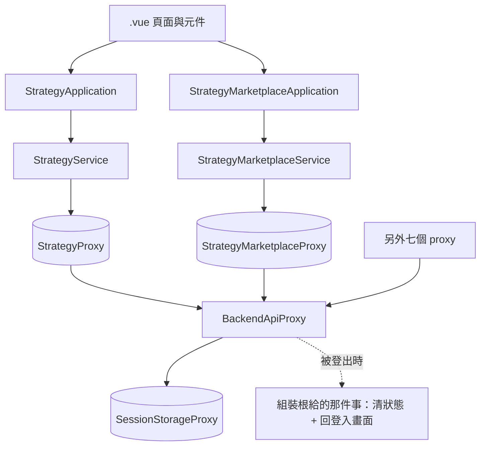

# 策略歸屬與策略市集（畫面這一端）— Architecture Design

**Status:** Draft
**Source PRD:** `.sdd/2026-09-10-strategy-ownership-and-marketplace/PRD.md`
**Tech context:** Nuxt 4 · Vue 3 · TypeScript · Clean/Onion（`app/{components,application,domain,infrastructure}`）

---

## 1. Design Goal & Guiding Principle

- **In one sentence:** 讓每一發請求都帶著身分、讓策略清單分得出「我的」與「我拿來的」，
  並多一個逛市集的去處——而且**這三件事各自只寫在一個地方**。

- **Guiding principle — 一件事只寫一次：**

  1. **身分只寫一次。** 所有 proxy 都經過同一個基底，帶身分與辨認「請重新登入」都寫在那裡。
     九個 proxy 一個都不改。這正是那份基底的註解早就寫下的計畫：
     「等後端把門也裝到那些端點上，這裡就是那件事該落地的地方」。
  2. **「改不改得動」只判斷一次。** 加入來的策略是唯讀的，而唯讀有五個後果
     （載不進編輯器、不能改名、不能刪、不能發佈、不能儲存）。
     這五個後果由**同一個判斷**決定，不由畫面各處自行推論——推論五次就有五次寫錯的機會。
  3. **兩種形狀，不是一種形狀加一個旗標。** 自己的策略帶算式，市集來的沒有。
     它們是兩個型別，所以「不小心把市集來的當成可編輯的」是**型別錯誤**，不是執行期的意外。

---

## 2. Change Scope

| Area | Action | What / Why |
| :--- | :--- | :--- |
| `infrastructure/proxy/backend-api-proxy.ts` | **Modify** | 統一附上身分；把「請重新登入」從一般拒絕裡分出來，並在原地清掉記著的那份登入 |
| `domain/errors/signed-out-error.ts` | **Add** | 「請重新登入」自己的錯誤型別。它與其他失敗要使用者做的事不同，因此不能是同一種 |
| `domain/models/entities/strategy.ts` | **Modify** | 加 `description` |
| `domain/models/entities/published-strategy.ts` | **Add** | 市集上的一支：**沒有 `script` 欄位** |
| `domain/models/domains/published-strategy-domain.ts` | **Add** | 市集那一支的行為：轉成畫面形狀 |
| `domain/models/dto/published-strategy-dto.ts` | **Add** | 市集卡片的形狀。**結構上沒有算式** |
| `domain/models/dto/available-strategies-dto.ts` | **Add** | 日常那一份：`mine` 與 `adopted` 兩段 |
| `domain/models/dto/strategy-dto.ts` | **Modify** | 加 `description` 與 `published`（自己那一支在不在市集上） |
| `domain/interface/i-strategy-proxy.ts` | **Modify** | `listStrategies` → `listAvailableStrategies`；新增發佈與收回 |
| `domain/interface/i-strategy-marketplace-proxy.ts` | **Add** | 逛市集、加入、移除 |
| `infrastructure/proxy/strategy-proxy.ts` | **Modify** | 兩段清單、說明、發佈與收回 |
| `infrastructure/proxy/strategy-marketplace-proxy.ts` | **Add** | 市集那三件事 |
| `domain/service/strategy-service.ts` | **Modify** | 回傳兩段；新增發佈與收回 |
| `domain/service/strategy-marketplace-service.ts` | **Add** | 逛、加入、移除 |
| `application/strategy-application.ts` | **Modify** | 對應上面 |
| `application/strategy-marketplace-application.ts` | **Add** | 對應上面 |
| `composables/use-strategy-library.ts` | **Modify** | 清單分兩段；挑到唯讀的那一支不載入編輯器；發佈／收回與收回前的確認 |
| `pages/marketplace/index.vue` | **Add** | 市集這個去處 |
| `components/organisms/StrategyMarketplacePanel.vue` | **Add** | 市集這一頁的全部：常駐說明、搜尋、卡片、三種空狀態 |
| `components/molecules/MarketplaceStrategyCard.vue` | **Add** | 市集上的一張卡 |
| `domain/models/domains/marketplace-search-domain.ts` | **Add** | 搜尋這條規則的唯一所在地：怎麼切詞、比對哪幾欄、要全部對上 |
| `components/molecules/StrategyLibraryDialog.vue` | **Modify** | 兩段標題；唯讀那一段的動作只有「移除」；自己那一段多發佈／收回 |
| `components/molecules/StrategyNameDialog.vue` | **Modify** | 多一個「說明」 |
| `components/molecules/StrategyPicker.vue` | **Modify** | 兩段分組 |
| `plugins/dependencies.ts` | **Modify** | 把記著登入的那一份與「被登出時該做什麼」交給 proxy 基底；接上市集那一條線 |
| `middleware/signed-in.global.ts` | **Not touched** | 「從未登入就不先發請求」這條規則**它已經做到了**。再寫一次只會多一個會漂移的複本 |
| K 線圖表、觀察清單、助手抽屜 | **Not touched** | 它們的請求會自動帶上身分（走同一份基底），行為不變 |
| 指標計算的執行路徑 | **Not touched** | 系統這一側保留了「帶一段自己寫的算式」，所以那條路一個字都不必改 |

---

## 3. New Classes / Modules

| Name | Kind | Responsibility | Collaborators | Satisfies |
| :--- | :--- | :--- | :--- | :--- |
| `SignedOutError` | Error | 「這一次請求沒有帶著有效的身分」。它是一個**型別**而不是一句訊息，因為畫面要據它改走另一條路 | — | US-01 全部 |
| `PublishedStrategy` | Entity | 市集上的一支，如同系統交出來的樣子。**沒有 `script` 欄位** | `PublishedStrategyDomain` | US-04 的 2 |
| `PublishedStrategyDomain` | Domain Model | 市集那一支的行為：轉成卡片形狀、說得出它是不是自己的 | `PublishedStrategyDto` | US-04 的 8/9 |
| `PublishedStrategyDto` | DTO | 一張市集卡片：名稱、說明、旋鈕、指標值種類、分享者、分享時刻、是不是自己的、加入了沒 | — | US-04 |
| `AvailableStrategiesDto` | DTO | 日常那一份的兩段 | 上兩者 | US-02 |
| `IStrategyMarketplaceProxy` | Interface | 逛市集、加入、移除 | — | US-04 |
| `StrategyMarketplaceProxy` | Proxy | 上者的實作 | `BackendApiProxy` | US-04 |
| `StrategyMarketplaceService` | Domain Service | 市集的編排 | `IStrategyMarketplaceProxy` | US-04 |
| `StrategyMarketplaceApplication` | Application | 市集的用例 | 上者 | US-04 |
| `pages/marketplace/index.vue` | Page | 市集這個去處 | `StrategyMarketplaceApplication` | US-04 |
| `MarketplaceStrategyCard.vue` | Molecule | 一張卡與它唯一那顆動作按鈕 | — | US-04 |
| `MarketplaceSearchDomain` | Domain Model | 一句搜尋的字**是什麼意思**：切成幾個詞、比對名稱／說明／分享者、每一個都要對上 | `MarketplaceListingRowDto` | US-07 全部 |

### 「唯讀」怎麼只判斷一次

不加一個 `readonly` 旗標讓畫面各處去讀，而是**讓兩段本來就是兩種型別**：

```
AvailableStrategiesDto
├── mine:    StrategyDto[]           帶 script → 載得進編輯器、改得動
└── adopted: PublishedStrategyDto[]  沒有 script 這個欄位 → 連想載入都寫不出來
```

畫面拿到 `PublishedStrategyDto` 時**沒有 `content` 可以交給編輯器**，所以「不小心把它載進去」
不是一個要靠審查抓的錯誤，是一段編不過的程式。這與系統那一側用兩種形狀取代一個可空欄位，
是同一個決定的兩端。

### 搜尋為什麼是一個 Domain Model，而不是畫面上一行 `filter`

搜尋看起來只是一行 `filter`，但那一行裡有**五個決定**：切詞的方式、比對哪幾個欄位、
大小寫怎麼算、空白怎麼算、以及好幾個詞是「全部都要對上」還是「對上一個就算」。
每一個決定都是規則，而規則寫在畫面上就會在下一個要搜尋的地方被重新猜一次。

所以那五個決定住在 `MarketplaceSearchDomain` 裡，畫面只交出使用者打的那一句話與手上的清單，
拿回留下來的那幾列。這也是畫面唯一拿得到它的方式——`.vue` 只認識 Application 與 DTO
（見 eslint 的分層邊界），所以它經由 `StrategyMarketplaceApplication.matchingRows` 進來。

**它不發任何請求**：市集本來就一次全部拿回來，在手上的清單上篩，一發請求都不必多。

---

## 4. Modified Components

| Component | Current role | Change needed |
| :--- | :--- | :--- |
| `BackendApiProxy` | 所有後端請求的共同出口與錯誤翻譯 | 建構時多收「記著登入的那一份」與「被登出時該做什麼」；每一發附上身分；401 翻成 `SignedOutError`，並在丟出去之前清掉記著的那一份、通知該做的事 |
| `StrategyProxy` | 策略端點 | `listStrategies` → `listAvailableStrategies`（收兩段）；讀寫多帶說明；新增發佈與收回 |
| `StrategyService` / `StrategyApplication` | 策略編排 | 對應上面 |
| `useStrategyLibrary` | 指標計算畫面上的策略狀態 | `strategies` 換成兩段；`selectStrategy` 對唯讀那一支改成說明而不是載入；新增發佈、收回與收回前的確認 |
| `StrategyLibraryDialog` | 策略清單對話框 | 兩段各一個小標題；每一列的動作由它屬於哪一段決定 |
| `StrategyNameDialog` | 取名對話框 | 多一個「說明」輸入 |
| `StrategyPicker` | 圖表上挑策略 | 兩段分組；唯讀那些照樣挑得到（套用不需要算式） |
| `StrategyMarketplaceApplication` | 市集的用例 | 多一個「這一句話留下哪幾列」——畫面拿不到 Domain Model，只能經由這一層 |
| `StrategyMarketplacePanel` | 市集這一頁 | 多一個搜尋框與第三種空狀態（「沒有符合」，帶一個清掉搜尋的動作） |
| `dependencies.ts` | 組裝根 | 唯一知道「被登出時要清狀態並回登入畫面」的地方——那是編排，不是基礎設施的事 |

### 被登出時誰負責導頁

`BackendApiProxy` **不自己導頁**：導頁是應用程式的編排，不是一個發請求的東西該懂的事。
它收下的是一個「被登出時要做的事」，由組裝根給它——那裡本來就是唯一知道全部具體型別的地方。
proxy 只負責認出這一種失敗、清掉記著的那一份，然後把那件事叫起來。

---

## 5. Component Relationships



---

## 6. Extensibility & Handoff Notes

- **Most likely next requirement:** 市集再長大——分類、排序、或「這一支多少人用」；
  以及搜尋從眼前搬到系統那一側。
- **Where it lands:** `MarketplaceSearchDomain`（比對規則）、`StrategyMarketplacePanel`（那個框）
  與 `StrategyMarketplaceService`（真的要送出去查的那一天）。
  兩者都只服務市集，所以市集長大時，日常挑策略那條路一行都不動。
  這正是把市集做成獨立去處（而不是清單裡多一個頁籤）換來的東西。
- **How to add it:** 加一個查詢條件 = 市集那條線多一個參數；日常那條線不知道有這回事。
- **Patterns applied & why:**
  - **一個共同出口**（`BackendApiProxy`）——身分與「請重新登入」各只寫一次。
  - **兩種型別取代一個旗標**——把「不可編輯」從紀律變成型別。
  - **既有的全域把關留著不動**——「沒登入就不發請求」已經有人做了。
- **Do not hardcode:**
  - 登入畫面的位址：一律用 `LOGIN_PATH`，它已經只寫在一個地方。
  - 「請重新登入」這句話：由系統那一側說，畫面照抄。
- **Known debt / deferred:**
  - 市集與清單都一次列完、不分頁，**搜尋也因此在眼前做**。策略數量還小；
    該回頭處理的訊號是市集超過大約兩百張卡——那一天搜尋要跟著送到系統那一側，
    而落點就是 `MarketplaceSearchDomain` 與市集那條線多一個查詢條件。
  - 加入的那一支在別人那邊被收回時，畫面要到下一次讀清單才知道。沒有推播，也不打算有。

---

## 7. Traceability

| PRD Scenario | Fulfilled by |
| :--- | :--- |
| US-01 登入後清單／計算正常 | `BackendApiProxy`（統一附上身分） |
| US-01 過期時被帶回登入的地方（兩則） | `SignedOutError` + 組裝根給的那件事 |
| US-01 從未登入不先發請求 | `middleware/signed-in.global.ts`（既有，不動） |
| US-02 兩段各就各位／排序 | `AvailableStrategiesDto` + `StrategyService` |
| US-02 挑唯讀那一支不載入編輯器 | `useStrategyLibrary.selectStrategy` + `PublishedStrategyDto` 沒有 `content` |
| US-02 唯讀那一列沒有會改動它的動作 | `StrategyLibraryDialog`（動作由它屬於哪一段決定） |
| US-02 空清單指路市集／連不上不等於空 | `StrategyLibraryDialog` 既有的兩種空狀態 + `listErrorMessage` |
| US-02 唯讀那一支照樣套得到圖上 | `StrategyPicker`（套用不需要算式） |
| US-03 說明的四則 | `StrategyNameDialog` + `StrategyWriteDto` + `StrategyProxy` |
| US-04 市集的十則 | `pages/marketplace/index.vue` + `MarketplaceStrategyCard` + `StrategyMarketplaceService` |
| US-05 發佈與收回的七則 | `useStrategyLibrary` + `StrategyLibraryDialog` + `StrategyProxy` |
| US-06 沒存過的算式照舊算得動（三則） | 不需要任何改動——系統那一側保留了這條路 |
| US-07 搜尋的十五則 | `MarketplaceSearchDomain`（比對規則）+ `StrategyMarketplaceApplication.matchingRows` + `StrategyMarketplacePanel`（那個框與「沒有符合」） |

---

## 8. Risks & Open Decisions

- **Risks / trade-offs:**
  - **兩邊必須一起上線。** 系統那一側的破壞性變更已經完成；畫面單獨留在舊版會整個壞掉。
  - **`BackendApiProxy` 多收兩個東西**，而其中一個是「被登出時要做的事」。
    它不是一份資料也不是一個外部資源，所以不做成介面——做成介面只是替一個回呼取一個名字。
    代價是它在型別上看起來很樸素；緩解是組裝根那一段有註解說清楚為什麼。
  - **市集頁不提供試跑。** 系統那一側其實允許（沒加入也算得動），但那需要一個能畫圖的地方，
    而市集頁沒有。這是刻意的取捨，記在 Out of Scope。

- **Open decisions:** 無。
