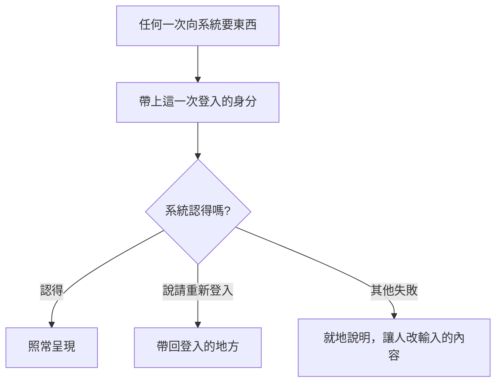
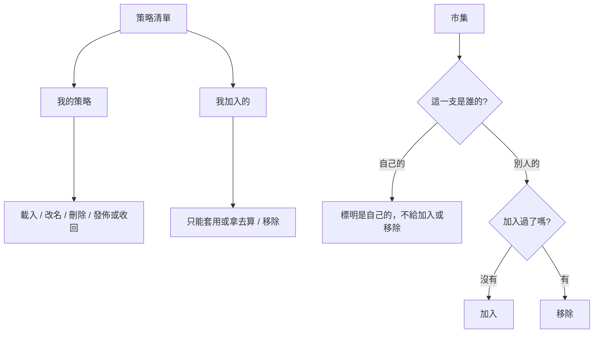

# Product Requirements Document (PRD)

**Status:** Draft
**Version:** v1.0
**Owner:** James Hsueh
**Stakeholders:** Engineering, QA

---

## 1. Background & Goal (Why & Goal)

- **Problem Statement:**
  系統這一側已經改了：每一支策略有了主人，而且**只認得帶著身分的請求**。
  畫面目前只在問「我是誰」時報上身分，其餘一律沒報——所以存策略、讀策略、算指標、跑回測、
  跟助手講話，**從現在起每一發都會被擋下來**。這不是一個可以慢慢做的改善，是畫面壞了。

  同時系統多了兩樣東西畫面上還沒有：策略的**說明**，以及一個所有人共用的**策略市集**。

- **Expected Outcome:**
  1. 每一發都帶著身分，**沒有一條路是例外**；被擋下來時人被帶回登入的地方，
     而不是盯著一段沒有問題的算式看。
  2. 日常挑策略的地方分成「我的」與「我加入的」兩段，**加入來的那些一眼看得出是唯讀的**。
  3. 多一個逛市集的去處，**加入與移除都只影響自己**，而日常那份清單的長度仍然只由自己決定。

- **Out of Scope:**
  - 市集的搜尋、分類、排行、評分與留言。
  - 把別人的策略複製一份成為自己的。
  - 分頁。
  - 別人改了我加入的策略時通知我。
  - 在市集頁上直接試跑。
  - 註冊、忘記密碼等既有的身分畫面。

---

## 2. User Personas

- **Primary Role(s):** 同一個人的三個身分——**寫策略的人**（自己調算式）、
  **分享策略的人**（把調好的放上市集）、**逛市集的人**（拿別人調好的來用）。
  沒有管理員。
- **Usage Context:** 在瀏覽器上、看著 K 線圖表的時候。
  **挑策略是每天做很多次的動作，逛市集是偶爾做一次的動作**——這個頻率差是本切片許多決定的理由。

---

## 3. User Stories & Acceptance Criteria

### US-01 — 每一發都要說我是誰 [priority: P0]

**As a** 使用者，**I want** 畫面替我把身分帶上，**so that** 我不會在一個好好的畫面上到處撞牆。

```gherkin
Scenario: 登入之後策略清單載得出來
  Given 已經登入
  When 打開策略清單
  Then 清單顯示出來

Scenario: 登入之後算得出指標
  Given 已經登入
  When 按計算
  Then 算出指標結果

Scenario: 登入過期時被帶回登入的地方
  Given 這一次登入已經過期
  When 打開策略清單
  Then 畫面切換到登入的地方，並顯示「請重新登入」

Scenario: 登入過期時不把它說成算式的問題
  Given 這一次登入已經過期
  When 按計算
  Then 畫面切換到登入的地方，並顯示「請重新登入」
  And 不顯示任何關於算式的錯誤

Scenario: 從未登入就不先發一次注定被擋的請求
  Given 從來沒有登入過
  When 打開需要身分的畫面
  Then 直接請他先登入
  And 沒有向系統要任何資料
```

### US-02 — 策略清單分成兩段 [priority: P0]

**As a** 使用者，**I want** 一眼分得出哪些是我寫的、哪些是我拿來的，**so that** 我不會對著一支改不動的策略按儲存。

```gherkin
Scenario: 兩段各就各位
  Given 自己有一支「甲」
  And 加入了別人的「乙」
  When 查看策略清單
  Then 「我的策略」那一段有「甲」
  And 「我加入的」那一段有「乙」

Scenario: 挑自己的那一支會載進編輯器
  Given 自己有一支「甲」
  When 挑「甲」
  Then 「甲」的算式出現在編輯器裡
  And 「甲」成為使用中的策略

Scenario: 挑加入來的那一支不會載進編輯器
  Given 加入了別人的「乙」
  When 挑「乙」
  Then 編輯器的內容完全沒有變
  And 畫面說明它只能拿去算或套到圖上

Scenario: 加入來的那一支沒有會改動它的動作
  Given 加入了別人的「乙」
  When 查看「乙」那一列
  Then 沒有「改名」「刪除」「發佈」
  And 有「移除」

Scenario: 一支都沒有時指路到市集
  Given 自己一支策略都沒有
  And 也沒有加入任何一支
  When 查看策略清單
  Then 顯示「還沒有任何策略」
  And 顯示一個到市集的去處

Scenario: 連不上系統不等於一支都沒有
  Given 連不上系統
  When 查看策略清單
  Then 顯示連不上系統
  And 不顯示「還沒有任何策略」

Scenario: 加入來的策略照樣套得到圖上
  Given 加入了別人的「乙」
  When 把「乙」套到 K 線圖上
  Then 圖上畫出它的指標線
```

### US-03 — 替策略寫一段說明 [priority: P1]

**As a** 策略擁有者，**I want** 替策略寫一段說明，**so that** 分享出去之後別人看得懂它在做什麼。

```gherkin
Scenario: 寫下說明並存起來
  Given 說明填「抓短線轉折」
  When 儲存
  Then 儲存成功
  And 再讀回來時說明是「抓短線轉折」

Scenario: 不寫說明也存得起來
  Given 說明整格留空
  When 儲存
  Then 儲存成功
  And 這支策略沒有說明

Scenario: 說明太長時不弄丟其他內容
  Given 說明超過長度上限
  When 儲存
  Then 就地顯示說明太長
  And 編輯器裡的算式一個字都沒變
  And 名稱一個字都沒變

Scenario: 改掉說明
  Given 一支策略的說明是「抓短線轉折」
  When 把說明改成「抓長線趨勢」並儲存
  Then 儲存成功
  And 再讀回來時說明是「抓長線趨勢」
```

### US-04 — 逛市集 [priority: P0]

**As a** 逛市集的人，**I want** 看看別人分享了什麼並挑幾支收下，**so that** 我不必每一支都自己從頭調。

```gherkin
Scenario: 市集上看得到別人分享的策略
  Given 市集上有小明分享的「甲」
  When 打開市集
  Then 看到「甲」，帶著它的說明、旋鈕清單、指標值種類、小明的身分與分享時刻

Scenario: 市集上看不到算式
  Given 市集上有小明分享的「甲」
  When 查看「甲」那一張
  Then 畫面上沒有任何算式

Scenario: 加入一支
  Given 市集上有「甲」，自己還沒加入
  When 按「加入」
  Then 加入成功
  And 日常挑策略的地方出現「甲」

Scenario: 已經加入的那一支顯示的是移除
  Given 已經加入「甲」
  When 查看市集上的「甲」
  Then 那顆按鈕是「移除」

Scenario: 移除只影響自己
  Given 已經加入「甲」
  When 按「移除」
  Then 自己的策略清單裡沒有「甲」
  And 市集上仍然有「甲」

Scenario: 空的市集不是錯誤
  Given 市集上一支策略都沒有
  When 打開市集
  Then 顯示「市集上還沒有任何策略」
  And 不顯示任何錯誤

Scenario: 市集依分享時刻由新到舊
  Given 小明先分享「甲」、後分享「乙」
  When 打開市集
  Then 順序是「乙」、「甲」

Scenario: 自己分享的那一支也在市集上
  Given 自己分享過「丙」
  When 打開市集
  Then 看到「丙」
  And 「丙」標明是自己的

Scenario: 自己分享的那一支沒有加入或移除
  Given 自己分享過「丙」
  When 查看「丙」那一張
  Then 沒有「加入」也沒有「移除」

Scenario: 連不上系統不等於市集是空的
  Given 連不上系統
  When 打開市集
  Then 顯示連不上系統
  And 不顯示「市集上還沒有任何策略」
```

### US-05 — 發佈與收回 [priority: P0]

**As a** 策略擁有者，**I want** 在寫策略的地方就按得到分享，**so that** 剛調對的那一支不必為了分享多繞一趟。

```gherkin
Scenario: 分享的是使用中的那一支
  Given 使用中的那一支沒分享過
  When 按那一排動作裡的「分享」
  Then 發佈成功
  And 同一顆按鈕換成「收回」

Scenario: 分享完不會彈出策略清單
  Given 使用中的那一支沒分享過
  When 按「分享」
  Then 策略清單沒有被打開

Scenario: 沒有使用中的那一支時按不下去
  Given 沒有使用中的那一支
  When 查看那一排動作
  Then 「分享」是禁用的

Scenario: 已分享時那一顆是收回
  Given 使用中的那一支已分享
  When 查看那一排動作
  Then 那顆按鈕是「收回」，且沒有「分享」

Scenario: 清單說得出哪幾支在外面
  Given 一支已分享的策略
  When 打開策略清單
  Then 那一列標示「已分享」
  And 那一列沒有分享或收回的按鈕

Scenario: 收回之前先問一次
  Given 一支已分享的策略
  When 按「收回」
  Then 出現確認
  And 確認上寫明加入過它的人都會失去它

Scenario: 確認之後收回
  Given 收回的確認正開著
  When 確認
  Then 收回成功
  And 那顆按鈕換回「分享」

Scenario: 取消之後什麼都沒發生
  Given 收回的確認正開著
  When 取消
  Then 那顆按鈕仍然是「收回」
  And 市集上仍然有它

Scenario: 加入來的那一支分享不了
  Given 加入了別人的一支策略
  When 挑它
  Then 它不會成為使用中的那一支
  And 「分享」維持禁用

Scenario: 分享過的策略仍然改得動
  Given 一支已分享的策略
  When 改掉它的算式並儲存
  Then 儲存成功
  And 那一列仍然標示已分享
  And 編輯器沒有被鎖住
```

### US-06 — 沒存過的算式照舊算得動 [priority: P0]

**As a** 寫策略的人，**I want** 寫一段就直接算，**so that** 試一個想法不必先替它取名字。

```gherkin
Scenario: 直接算一段還沒存的算式
  Given 編輯器裡寫了一段算式，還沒存成策略
  When 按計算
  Then 算出指標結果

Scenario: 按計算不等於存檔
  Given 剛剛算過一段還沒存的算式
  When 查看策略清單
  Then 策略的數量沒有變

Scenario: 算的是畫面上這一份
  Given 從清單挑了一支自己的策略
  And 在編輯器裡改了幾個字
  When 按計算
  Then 算的是編輯器裡這一份改過的內容
```

---

## 4. Business Flow & Logic

### Flow Diagram





### Core Business Rules

1. **身分是每一發的事，不是某幾發的事。** 需要身分的每一條路都帶著它；沒有例外清單。
2. **「請重新登入」與其他失敗分開處理。** 前者把人帶回登入的地方，後者就地說明。
   兩者要使用者做的事完全不同。
3. **加入來的策略一律唯讀。** 沒有算式可以載，也沒有任何會改動它的動作。
   這不是畫面加的限制，是它本來的樣子。
4. **加入與移除只影響自己。** 移除之後那一支仍然在市集上，別人不受影響。
5. **發佈與收回作用在使用中的那一支，而且只可能是自己的。** 它們擺在寫策略的地方，
   與儲存、另存、改名並列；加入來的那些載不進編輯器，所以永遠不會成為使用中的那一支。
   沒有使用中的那一支時它是禁用的——那兩件事都需要先有一支。
6. **收回要先確認，發佈不用。** 發佈做錯了收回就好，中間沒有人失去東西；
   收回做錯了每一個加入過的人都要重來一次，而且你不會知道有誰。
7. **自己分享的那幾支也留在市集上，但不給加入/移除。** 市集回答的是「外面有什麼」；
   給一顆按不出任何變化的按鈕比不給更糟。
8. **連不上系統與「一支都沒有」永遠分開講。** 後者是答案，前者是故障。
9. **按計算不等於存檔。** 編輯器裡那一份可以直接算，而且算的是畫面上這一份。

### Edge Cases

- **登入正好在操作到一半時過期。** 那一發被擋下來，人被帶回登入的地方；
  **編輯器裡的內容不因此消失**——重新登入回來還在。
- **加入的那一支在別人那邊被收回了。** 下一次讀清單時它就不在了；
  若在那之前拿它去算，系統會說找不到，畫面照一般失敗處理。
- **市集上自己那一支剛被自己收回。** 重新整理後它從市集消失，自己的清單不受影響。
- **同時開著兩個分頁。** 不特別處理；以每次讀回來的為準。

---

## 5. UI/UX Design & Interaction

- **Prototype Link:** 無。
- **Key Interactions:**
  - **策略清單**：兩段各一個小標題。加入來的那一段每一列標明是誰分享的。
  - **加入來的那一列**點下去不載入編輯器，而是說明它能做什麼。
  - **市集**是一個獨立的去處，卡片式列出，每張卡片一顆主要動作按鈕。
  - **分享／收回**是同一個位置的兩個方向，就擺在那一排動作裡（新的、儲存、另存、改名之後）。
    兩顆並排會有一顆永遠按不動，而看的人得自己判斷是哪一顆。
  - **策略清單**上不再有這兩個動作，但已分享的那一列標示「已分享」。
  - **收回**跳一個確認，寫明後果。
  - **說明**是策略表單上的一個多行輸入，可留空。
  - **空狀態**：清單空的說「還沒有任何策略」並指路市集；市集空的說「市集上還沒有任何策略」。
  - **錯誤狀態**：連不上系統就說連不上；「請重新登入」不走這條路，直接帶回登入的地方。

---

## 6. Non-Functional Requirements

- **Security：** 身分只從記著這一次登入的地方取得，**不從畫面上任何輸入來**。
  一個地方負責帶上它，其餘地方不各自處理——否則遲早有一條路忘記帶。
- **Performance：** 市集與策略清單一次列完，不分頁。
- **Compatibility：** 沿用現況。
- **Analytics：** 無。

---

## 7. Dependencies & Risks

- **External Dependencies:** 無新增。
- **Internal Dependencies:** 完全依賴系統這一側已完成的同名切片。**兩邊必須一起上線**——
  單獨上其中一邊，策略功能會壞。
- **Known Risks:**
  - **漏掉一條路。** 只要有一條路忘了帶身分，那條路就壞掉。
    緩解：帶身分這件事只寫一次，寫在所有請求都會經過的地方。
  - **把「請重新登入」顯示成一般失敗。** 人會去改一段沒有問題的算式。
    緩解：這一種失敗在最外層就被認出來並改走另一條路。
  - **對加入來的策略誤用會改動它的動作。** 畫面若還顯示那些按鈕，按下去只會撞牆。
    緩解：那些動作的存在與否由「這一支是不是我的」決定，不由畫面各處自行判斷。

---

## 8. Appendix

- 需求共識：`.sdd/2026-09-10-strategy-ownership-and-marketplace/BRIEF.md`
- 通用語言地圖：`.sdd/UL-MAP.md`
- 系統這一側的同名切片：`~/workspace/SideProjects/go-trading/.sdd/2026-09-10-strategy-ownership-and-marketplace/`
