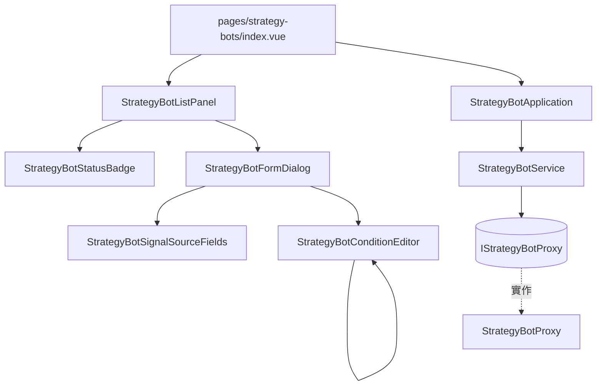

# 策略機器人操作台 — Architecture Design

**Status:** Confirmed
**Source PRD:** `.sdd/2026-09-16-strategy-bot-console/PRD.md`
**Tech context:** Nuxt 3 · Vue 3 · TypeScript (strict) · SCSS tokens · Clean / Onion（前端版）

---

## 1. Design Goal & Guiding Principle

- **In one sentence:**
  讓一棵條件樹在畫面上**編得動、看得懂**，並讓一份清單一眼說出哪一台機器人該管一下——
  而且整條路上，前端一次都不去判斷哪一邊成立。

- **Guiding principle:**
  **把「錯誤打不出來」做成結構，而不是做成驗證。**
  後端會拒絕一個指到沒宣告代號的條件、一個只有一句的群組、一個第 11 個信號來源。
  這一刀不把那些重寫成前端的 `if`——它讓**選單裡沒有那個選項**、**剩兩句時刪除鍵消失**、
  **到了 10 個時新增鍵消失**。真正需要寫成驗證的只剩「打得出來但仍然不對」的那幾種
  （名稱空白、間隔超範圍），而它們全部收在一個 domain model 裡。

  這也決定了整個切片最大的一塊工——**條件編輯器是一個會自己 import 自己的遞迴元件**。
  巢狀在畫面上是縮排，在程式裡就是遞迴；用任何非遞迴的方式表達它，
  都會在「第三層」那一刀崩掉。

---

## 2. Change Scope

| Area | Action | What / Why |
| :--- | :--- | :--- |
| `app/domain/models/entities/` | **Add** | `StrategyBot`、`StrategyBotSignalSource`、`StrategyBotCondition` — Proxy 正規化後的乾淨資料 |
| `app/domain/models/domains/` | **Add** | `StrategyBotWriteDomain`（送出前的驗證）、`StrategyBotConditionDomain`（一棵樹的編輯操作與形狀規則）、`StrategyBotRunStateDomain`（清單上那四種樣子） |
| `app/domain/models/dto/` | **Add** | `StrategyBotDto`、`StrategyBotSignalSourceDto`、`StrategyBotConditionDto`、`StrategyBotWriteDto` |
| `app/domain/models/vo/` | **Add** | `ConditionOperatorVo`、`StrategyBotRunStateVo`、`StrategyBotHaltReasonVo` |
| `app/domain/errors/` | **Add** | `StrategyBotNotFoundError`、`StrategyBotNameConflictError`、`StrategyBotRunningError`、`TelegramDeliveryNotConfiguredError` — 後端用不同狀態碼分開講的那幾種 |
| `app/domain/interface/` | **Add** | `i-strategy-bot-proxy.ts` |
| `app/domain/service/` | **Add** | `strategy-bot-service.ts` |
| `app/infrastructure/proxy/` | **Add** | `strategy-bot-proxy.ts`（繼承既有 `BackendApiProxy`） |
| `app/application/` | **Add** | `strategy-bot-application.ts` |
| `app/components/molecules/` | **Add** | `StrategyBotConditionEditor`（**遞迴**）、`StrategyBotSignalSourceFields`、`StrategyBotStatusBadge` |
| `app/components/organisms/` | **Add** | `StrategyBotListPanel`、`StrategyBotFormDialog` |
| `app/pages/strategy-bots/` | **Add** | `index.vue` |
| `app/plugins/dependencies.ts` | **Modify** | 組裝 Proxy → Service → Application |
| `app/components/atoms/` | **Not touched** | 現有的 `AppSelect`／`AppButton`／`AppBadge`／`AppModal`／`AppAlert` 已經夠用。**不新增任何變體元件**（規則明令禁止） |
| 既有的策略腳本／市集／設定畫面 | **Not touched** | 只**讀**可用策略腳本、只**連到**帳號設定 |
| 條件求值 | **Not built** | 前端一次都不判斷哪一邊成立 |

---

## 3. New Classes / Modules

### Domain

| Name | Kind | Responsibility | Collaborators | Satisfies |
| :--- | :--- | :--- | :--- | :--- |
| `StrategyBot` | Entity | 一台機器人的乾淨資料：名稱、標的、間隔、來源、兩棵樹、執行狀態、上次訊號、停擺原因、打架記號。`toDto()` | — | US-01 全部 |
| `StrategyBotSignalSource` | Entity | 一個來源：代號、策略腳本識別碼、刻度、參數值。**沒有 script 欄位**——不是留空，是放不進去 | — | NFR 算式不外流 |
| `StrategyBotCondition` | Entity | 一個條件節點（遞迴）：運算子 ＋ 子條件，或代號 ＋ 信號 | — | US-04 |
| `StrategyBotConditionDomain` | Domain Model | **一棵樹的所有編輯操作**：加一句比對、加一個群組、刪掉某個節點、換運算子、把一句換成群組；以及形狀規則（群組至少兩句、深度與節點數上限）。**每個操作回傳一棵新樹，不就地改** | — | US-04 全部 |
| `StrategyBotWriteDomain` | Domain Model | 送出前的驗證：名稱、標的、間隔、來源（代號不空不重複、數量上限、參數名稱對得上）、兩棵樹不得為空。**通過才生得出 DTO** | `StrategyBotConditionDomain` | US-05 前四個 |
| `StrategyBotRunStateDomain` | Domain Model | 一台機器人在清單上該長什麼樣：四種狀態哪一種、停擺原因怎麼講、上次訊號沒有時講什麼、**播放還是停止**、**編輯給不給按** | — | US-01、US-02 |
| `IStrategyBotProxy` | Interface | 七個動作的契約 | — | 全部 |
| `StrategyBotService` | Domain Service | Application 的唯一入口：取清單／取一台／存／刪／啟動／停止，並把 entity 轉成 DTO | `IStrategyBotProxy` | 全部 |

> **`StrategyBotConditionDomain` 的每個操作回傳一棵新樹**，因為 Vue 的響應式對
> 「深處某個節點被就地改掉」最容易漏掉更新，而一棵樹最多 32 個節點——
> 重建整棵的成本遠低於追蹤哪一層變了。

### Infrastructure · Application

| Name | Kind | Responsibility | Collaborators | Satisfies |
| :--- | :--- | :--- | :--- | :--- |
| `StrategyBotProxy` | Proxy | 打七條 `/strategy-bots` 路由，把 wire 正規化成 entity，並把 **404／409／400（Telegram 未設定）** 從一般的拒絕裡分出來 | `BackendApiProxy` | US-05、US-02 |
| `StrategyBotApplication` | Application | 編排用例，回 DTO 給畫面 | `StrategyBotService` | 全部 |

### Components

| Name | Layer | Responsibility | Satisfies |
| :--- | :--- | :--- | :--- |
| `StrategyBotStatusBadge` | molecule | 把一台機器人的狀態畫成一個標籤：執行中／已停止／**停擺＋原因**／**規則打架** | US-01 |
| `StrategyBotSignalSourceFields` | molecule | 一個信號來源的那一排欄位：策略腳本、刻度、代號、參數值 | US-03 |
| `StrategyBotConditionEditor` | molecule | **一個條件節點**：一句比對（兩個選單）或一個群組（運算子 ＋ 子條件 ＋ 加／刪）。**子條件用它自己渲染** | US-04 全部 |
| `StrategyBotListPanel` | organism | 清單、四種狀態、三顆按鈕、空清單、錯誤與重試 | US-01、US-02 |
| `StrategyBotFormDialog` | organism | 三段式表單，存或改一台 | US-03、US-05 |
| `pages/strategy-bots/index.vue` | page | 只做接線：從組裝根拿 Application 往下傳 | — |

> **遞迴元件的兩個要點**：
> 1. **終止條件在資料上**——一句比對沒有子條件，所以遞迴自然停住；不靠深度計數。
> 2. **key 要穩**——每個節點帶一個只在畫面存在的識別碼，否則 Vue 會在
>    刪掉中間一句時重用錯的 DOM，使用者看到的是「另一句的內容跳到這一格」。

---

## 4. Component Relationships

---

## 5. Extensibility & Handoff Notes

- **Most likely next requirement:** 條件裡比對信號以外的東西（價格、時間、持倉）。
- **Where it lands:** `StrategyBotCondition` 已經是「群組 或 葉子」的形狀，
  新的葉子種類是**多一種葉子**：`StrategyBotConditionEditor` 多一個分支，樹的其餘部分不動。
- **How to add it:** 第二可能的是「清單上直接看到條件摘要」——那是一個**唯讀**的
  遞迴元件，與編輯器共用同一份資料形狀，不共用同一個元件（唯讀與可編輯的互動不同，
  硬塞成一個元件會長出一堆 `v-if="editable"`）。
- **Do not hardcode:** 上限數字（10／32／5／1440）集中在 domain 常數，
  **不散落在元件的 `v-if` 裡**。
- **Known debt / deferred:**
  - **上限是後端的第二份副本。** 不同步時畫面會擋掉後端其實接受的東西。
    接受這個成本，代價是把它們集中在一處。
  - **刪掉一個還被條件用著的來源**：這一刀選擇**擋住那次刪除**並說出是哪裡在用它。
    比默默把條件一起刪掉誠實得多，但也比較囉唆；真的嫌煩時再改成「刪除時一併清掉
    用到它的那幾句，並先預覽會刪掉什麼」。

---

## 6. Traceability

| PRD Scenario（分組） | Fulfilled by |
| :--- | :--- |
| US-01 清單、四種狀態、空清單、錯誤 | `StrategyBotListPanel` ＋ `StrategyBotStatusBadge` ＋ `StrategyBotRunStateDomain` |
| US-02 播放／停止／刪除／編輯停用 | `StrategyBotListPanel` ＋ `StrategyBotRunStateDomain` ＋ `StrategyBotApplication` |
| US-02 Telegram 未設定的那一句帶連結 | `TelegramDeliveryNotConfiguredError` ＋ `StrategyBotListPanel` |
| US-03 三段式表單、來源上限 | `StrategyBotFormDialog` ＋ `StrategyBotSignalSourceFields` ＋ `StrategyBotWriteDomain` |
| US-04 條件的每一個編輯操作與巢狀顯示 | `StrategyBotConditionDomain` ＋ `StrategyBotConditionEditor` |
| US-05 送出前擋掉的四種 | `StrategyBotWriteDomain` |
| US-05 撞名／找不到由後端說 | `StrategyBotProxy` 的狀態碼分流 ＋ `StrategyBotFormDialog` |

---

## 7. Risks & Open Decisions

- **Risks / trade-offs:**
  - **遞迴元件**是這一刀唯一有結構性風險的地方：key 不穩會讓刪除中間一句時
    DOM 錯位，而那個 bug 看起來像「資料壞了」。設計上用「只在畫面存在的節點識別碼」擋掉。
  - **條件與來源的耦合**：第三段的選單由第二段填出來，所以第二段改動時第三段要跟上。
  - **上限的第二份副本**（見上）。

- **Open decisions (for implementation):**
  - 「把一句比對換成群組」的確切互動（就地換、還是加群組再搬進去）留給實作，
    判準是**不能讓使用者先失去那一句再重打一次**。
