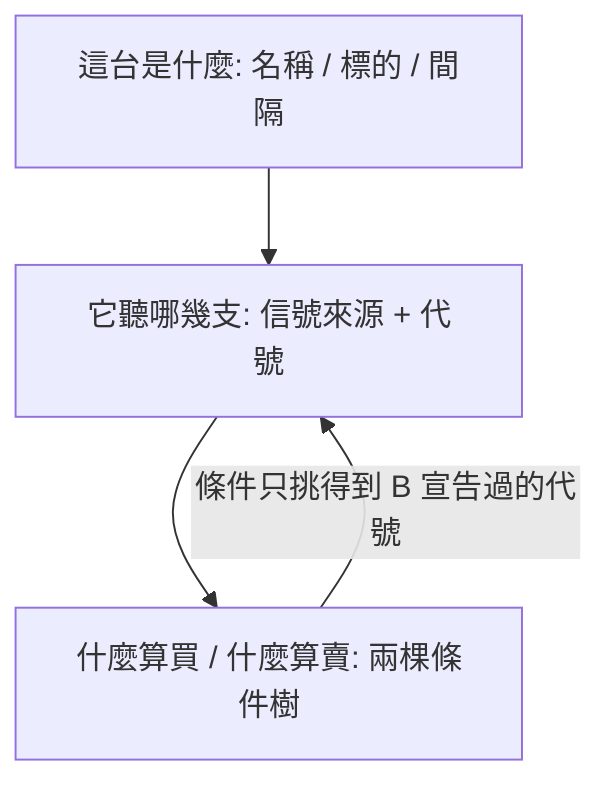

# Product Requirements Document (PRD)

**Feature:** 策略機器人操作台
**Status:** Draft
**Version:** v1.0
**Owner:** James Hsueh
**Stakeholders:** Engineering

---

## 1. Background & Goal (Why & Goal)

- **Problem Statement:**
  後端已經有策略機器人的七條路由，但它們只開給 Postman。
  而這個功能最難的一半**恰好是畫面才做得到的**：一台機器人的核心是兩棵條件樹，
  寫成 JSON 沒有人讀得下去，畫成幾個縮排的框，它就是一句話。

  第二件事同樣只有畫面做得到：**一台機器人停擺時，沒有任何人會來通知他**——
  四種停擺原因裡有兩種正好是「通知他的那條路壞了」。
  所以那份清單是他唯一會發現出事的地方。

- **Expected Outcome:**
  1. 在畫面上**拼得出**一台機器人：幾個信號來源，加上兩棵可以任意巢狀的條件樹。
  2. 巢狀的層次**用縮排看得出來**，不必讀括號。
  3. 一句比對的來源與信號都是**選的**——指到一個沒宣告的代號這種錯誤**打不出來**。
  4. 一份清單上，執行中、已停止、**停擺（連同原因）**、**規則打架**四種狀態一眼分得出來。
  5. 播放與停止是同一個位置的兩種樣子；執行中時編輯**不給按**並說得出為什麼。
  6. 沒設定 Telegram 就按播放時，那句拒絕**帶著去設定的路**。

- **Out of Scope:**
  - **在前端求值條件樹。** 哪一邊成立永遠是後端的答案；前端算一次只會製造第二個答案。
  - 即時更新清單（無輪詢、無推播）。
  - 回測一台機器人、執行紀錄。
  - 在這個畫面裡建立或編輯**策略**（那是另一個地方）。
  - 從這個畫面設定 Telegram（只負責把人帶過去）。
  - 拖曳排序條件、複製一整台機器人、機器人分組。

---

## 2. User Personas

- **Primary Role(s):** **使用者**——這台操作台的主人，同時是寫那幾支策略的人。
  單人使用，本機或內網，已登入。
- **Usage Context:**
  **拼裝是坐下來做的，運行是離開之後發生的。** 他花幾分鐘把條件拼好、按下播放，
  然後關掉分頁。之後他回到這個畫面，多半只為了一件事：**看看有沒有哪一台出事了。**
  所以清單要能不讀字就看懂，編輯器要能不讀 JSON 就看懂。

---

## 3. User Stories & Acceptance Criteria

### US-01 — 一眼看出哪一台該管 [priority: P0]

**As a** 使用者，**I want** 在一份清單上看到我每一台機器人現在是什麼狀態，
**so that** 我不必逐台點開就知道有沒有出事——而出事時沒有別人會通知我。

```gherkin
Scenario: 列出自己的每一台
  Given 這位使用者有三台機器人
  When 他打開機器人清單
  Then 三台都顯示出來
  And 順序與後端交出的順序相同
  And 每一台都看得到名稱、交易標的、每隔幾分鐘、執行狀態

Scenario: 執行中與已停止看得出差別
  Given 一台執行中、一台已停止
  When 他打開清單
  Then 兩台的狀態標示不同

Scenario: 停擺的那一台特別顯眼,並說出原因
  Given 一台因為「某一支策略找不到了」被系統停下來
  When 他打開清單
  Then 那一台的標示與一般的已停止不同
  And 畫面上出現「某一支策略找不到了」這個原因

Scenario: 四種停擺原因各自說得出是哪一種
  Given 一台因為「機器人金鑰不被接受」被停下來
  When 他打開清單
  Then 畫面上出現的是金鑰不被接受,不是另外三種的任何一種

Scenario: 規則打架要標出來,而且它還在跑
  Given 一台執行中的機器人上一輪兩個條件同時成立
  When 他打開清單
  Then 那一台被標示為規則打架
  And 它的執行狀態仍然是執行中

Scenario: 還沒送出過任何信號是一種狀態
  Given 一台機器人從啟動到現在還沒送出過任何信號
  When 他打開清單
  Then 那一欄寫著「還沒送出過」之類的說法
  And 那一欄不是空白

Scenario: 一台都沒有時說得出下一步
  Given 這位使用者還沒有任何機器人
  When 他打開清單
  Then 他看到一句說明可以做什麼
  And 他看不到一張空表

Scenario: 後端讀不到時說得出原因
  Given 後端回覆一個失敗
  When 他打開清單
  Then 畫面顯示後端說的那個原因
  And 畫面上有一個重試的入口
```

---

### US-02 — 用三顆按鈕操控一台 [priority: P0]

**As a** 使用者，**I want** 用播放、停止、刪除三顆按鈕操控一台機器人，
**so that** 我隨時開得動也收得回來。

```gherkin
Scenario: 按播放
  Given 一台已停止的機器人
  And 這位使用者已經完成 Telegram 設定
  When 他按下播放
  Then 那一台變成執行中
  And 清單上立刻看得到新的狀態

Scenario: 按停止
  Given 一台執行中的機器人
  When 他按下停止
  Then 那一台變成已停止

Scenario: 播放與停止不同時出現
  Given 一台執行中的機器人
  When 他看它的按鈕
  Then 他看到停止
  And 他看不到播放

Scenario: 執行中時編輯不給按
  Given 一台執行中的機器人
  When 他看它的編輯入口
  Then 編輯是停用的
  And 畫面說得出要先停止它才改得動

Scenario: 沒設定 Telegram 就啟動不了,並且帶得到設定的地方
  Given 這位使用者還沒有 Telegram 投遞設定
  When 他按下播放
  Then 畫面顯示要先完成 Telegram 設定
  And 畫面上有一個到帳號設定的連結

Scenario: 執行中的機器人達到上限
  Given 這位使用者已經有 10 台執行中的機器人
  When 他按下第 11 台的播放
  Then 畫面顯示同時執行中的上限是 10 台
  And 原本那 10 台的狀態一台都沒變

Scenario: 刪除要先確認
  Given 一台機器人
  When 他按下刪除
  Then 畫面先要求他確認
  And 在確認之前那一台還在清單上

Scenario: 確認之後就刪掉了
  Given 他按下刪除並確認
  When 刪除完成
  Then 那一台不在清單上了

Scenario: 執行中的也刪得掉,不必先按停止
  Given 一台執行中的機器人
  When 他按下刪除並確認
  Then 那一台不在清單上了
  And 畫面沒有要求他先按停止
```

---

### US-03 — 拼出一台機器人 [priority: P0]

**As a** 使用者，**I want** 在畫面上選策略、取代號、拼條件，
**so that** 「甲說買、乙說賣的時候該怎麼辦」這個判斷被我寫下來,而不是每次重想。

```gherkin
Scenario: 填完三段就存得起來
  Given 他的可用策略裡有策略甲
  When 他填上名稱、交易標的與觸發間隔
  And 他加入一個信號來源:策略甲、一小時刻度、代號 A
  And 他把買入條件設為「A 等於買入」
  And 他把賣出條件設為「A 等於賣出」
  And 他按下儲存
  Then 那一台機器人出現在清單上
  And 它的狀態是已停止

Scenario: 信號來源只挑得到自己的可用策略
  Given 他的可用策略裡有策略甲與策略乙
  When 他要為一個信號來源挑策略
  Then 選單裡有策略甲與策略乙
  And 選單裡沒有任何別人未發佈的策略

Scenario: 只挑得到會吐訊號的那幾支
  Given 他的可用策略裡有一支訊號種類的,以及一支吐數字的
  When 他要為一個信號來源挑策略
  Then 選單裡只有那一支訊號種類的
  And 選單裡沒有那一支吐數字的

Scenario: 同一支策略加兩次,只要代號不同
  Given 策略甲宣告了一個參數「回看根數」
  When 他加入代號 A 的來源:策略甲、回看根數 20
  And 他加入代號 B 的來源:策略甲、回看根數 60
  And 他按下儲存
  Then 儲存成功
  And 那一台機器人有兩個信號來源

Scenario: 信號來源數量有上限
  Given 他已經加了 10 個信號來源
  When 他想再加第 11 個
  Then 他加不了
  And 畫面說出上限是 10 個
```

---

### US-04 — 條件是拼出來的,不是打出來的 [priority: P0]

**As a** 使用者，**I want** 用縮排的框把條件拼成任意深度的且／或，
**so that** 我下個月打開它時還讀得懂自己寫了什麼。

```gherkin
Scenario: 一句比對的兩個欄位都是選的
  Given 這台機器人已宣告來源 A 與 B
  When 他在買入條件加入一句比對
  Then 來源的選單裡只有 A 與 B
  And 信號的選單裡只有買入、賣出、持有
  And 兩個欄位都不是讓他打字的

Scenario: 把一句比對包成一個群組
  Given 買入條件是一句「A 等於買入」
  When 他把它換成一個「且」群組,並在裡面加上「B 等於買入」
  Then 畫面顯示一個「且」群組
  And 群組裡有兩句比對
  And 群組裡的兩句比群組本身縮排更深

Scenario: 切換群組的運算子
  Given 一個裝著兩句比對的「且」群組
  When 他把它切成「或」
  Then 同一個群組還在,兩句比對也還在
  And 只有運算子變成「或」

Scenario: 群組裡還能再放群組
  Given 一個裝著兩句比對的群組
  When 他在裡面再加一個群組
  Then 畫面顯示兩層巢狀
  And 第二層的縮排比第一層深

Scenario: 刪掉群組裡的一句
  Given 一個裝著三句比對的群組
  When 他刪掉其中一句
  Then 群組裡剩兩句
  And 群組本身還在

Scenario: 不讓群組掉到只剩一句
  Given 一個只剩兩句比對的群組
  When 他想再刪掉一句
  Then 他刪不了,或畫面說出一個群組至少要兩句
  And 畫面上不會出現一個只裝一句的群組

Scenario: 巢狀的條件原樣讀回來
  Given 一台機器人的買入條件是「( A 等於買入 且 B 等於買入 ) 或 C 等於買入」
  When 他打開它來編輯
  Then 畫面顯示的層次與存進去時相同
  And 外層是「或」,內層是「且」
```

---

### US-05 — 送出之前先擋,送出之後照實講 [priority: P0]

**As a** 使用者，**I want** 畫面在送出前擋掉它看得出來的錯,送出後照後端說的講，
**so that** 我不會為了一個畫面早就知道的錯誤等一次往返。

```gherkin
Scenario: 買入條件為空時擋在畫面上
  Given 他只填了賣出條件
  When 他按下儲存
  Then 畫面顯示買入與賣出條件都不得為空
  And 這次請求沒有送到後端

Scenario: 兩個來源代號重複時擋在畫面上
  Given 他加了兩個信號來源,代號都是 A
  When 他按下儲存
  Then 畫面顯示來源代號不得重複
  And 這次請求沒有送到後端

Scenario: 觸發間隔不合法時擋在畫面上
  Given 他把觸發間隔填成 0
  When 他按下儲存
  Then 畫面顯示觸發間隔必須大於零
  And 這次請求沒有送到後端

Scenario: 名稱空白時擋在畫面上
  Given 他沒有填機器人名稱
  When 他按下儲存
  Then 畫面顯示必須給機器人取一個名稱
  And 這次請求沒有送到後端

Scenario: 名稱與自己另一台重複由後端說,畫面照它說的講
  Given 他已經有一台叫「早盤突破」的機器人
  When 他再建一台也叫「早盤突破」的並按下儲存
  Then 畫面顯示後端說的那一句「已被使用」
  And 他填的內容還在表單上

Scenario: 指名一支已經不在的策略由後端說
  Given 他挑的那支策略在送出前被刪掉了
  When 他按下儲存
  Then 畫面顯示後端說的「找不到」
  And 他填的內容還在表單上

Scenario: 一台已經被刪掉的機器人打不開
  Given 一台機器人在他點開之前已經被刪掉
  When 他想打開它來編輯
  Then 畫面顯示找不到
  And 他回得到清單
```

---

## 4. Business Flow & Logic

### 三段式的順序



**順序不能顛倒**，因為第三段的下拉選單是由第二段填出來的。
這也是「打不出錯誤的代號」的實作方式：**選單裡沒有的東西選不到。**

### Core Business Rules

- **前端不求值。** 條件樹在畫面上只被編輯與顯示。哪一邊成立、有沒有打架、
  該不該送訊息，全部是後端的答案。
- **後端的規則在畫面上以「做不到」的形式出現，而不是以「被拒絕」的形式。**
  代號用選的、信號用選的、群組刪到剩兩句就不給刪、來源到 10 個就不給加。
- **擋得住的擋在畫面，擋不住的照後端說的講。**
  擋得住 ＝ 只看表單內容就知道錯了（空白、重複、範圍）。
  擋不住 ＝ 需要知道伺服器那邊有什麼（撞名、策略還在不在）。
- **只有訊號種類的策略挑得到。** 機器人跑一個信號來源時**一律以訊號種類執行它**，
  所以一支吐數字的策略會在第一輪算式失敗——而算式失敗是會**停擺**的那一類。
  讓它挑得到，等於讓使用者拼出一台按下播放、隔天才發現早就停了的機器人，
  而原因發生在他看不到的地方。**挑不到，就不會發生。**
- **播放與停止是一個位置的兩種樣子**，因為一台機器人只有兩種狀態。
- **執行中時編輯停用，而不是按了才拒絕**——那是一個畫面早就看得出來的事。
- **刪除要確認，播放與停止不用**。刪除不可逆，另外兩個隨時反悔得了。
- **一次操作之後清單要反映新狀態**，不必他自己重新整理。

### Edge Cases

- **打開編輯時那台已經被刪掉**：說找不到，回清單。
- **儲存被後端拒絕**：表單內容留著。要他重打一次，是拿他的時間賠一個伺服器端的規則。
- **一支會吐信號的策略都沒有**：說得出要先寫一支，而不是給一個空的下拉選單。
  注意這與「一支策略都沒有」不同——他可能有五支，只是沒有一支是訊號種類的。
- **條件裡引用的代號被改名或刪掉**：畫面在第二段改動時要讓第三段跟上——
  最保守也最誠實的做法是**擋住刪除一個還被條件用著的來源**，並說出是哪裡在用它。

---

## 5. UI/UX Design & Interaction

### 版面

沿用既有的 `ConsoleLayout`（標題、時區、後端狀態、身分），與其他每一頁一致。

- **一頁兩態**，不是兩頁：清單是主畫面，拼裝在**對話框**裡開。
  理由是拼裝的時候常常要回頭看別台是怎麼設的；兩頁會把那個對照打斷。

### 清單

每一台一列（窄螢幕時一張卡），左到右是**名稱 → 標的 → 間隔 → 狀態 → 上次訊號 → 操作**。

- **狀態**用一個標籤顯示，四種各自不同：執行中／已停止／**停擺（帶原因）**／
  執行中並附一個**規則打架**的標記。
- **停擺**與**規則打架**是這份清單存在的理由，兩者都要比「已停止」更醒目。
- **上次訊號**沒有時寫「還沒送出過」。
- **操作**：播放或停止（二選一）、編輯、刪除。

### 條件編輯器

這是整個切片的核心元件。

```
買入條件
┌─ [或 ▾]                                    [+ 比對] [+ 群組] [✕]
│  ┌─ [且 ▾]                                 [+ 比對] [+ 群組] [✕]
│  │   [A ▾] 等於 [買入 ▾]                              [✕]
│  │   [B ▾] 等於 [買入 ▾]                              [✕]
│  └─
│    [C ▾] 等於 [買入 ▾]                                [✕]
└─
```

- **縮排就是巢狀。** 每深一層縮排一格，並有一條連續的邊線把同一層框起來。
- **一句比對**：兩個下拉選單加一個固定的「等於」。「等於」是文字不是選單——
  沒有第二種比對方式，做成選單只會讓人以為有。
- **每個節點自己帶刪除鍵**；群組另外帶「加一句比對」與「加一個群組」。
- **運算子是群組自己的下拉選單**，就放在它的左上角——它管的是它裡面那幾句。
- **根節點也可以是一句比對**（不必包群組）。把一句換成群組是一個明確的動作。

### 狀態與回饋

- **載入中**：清單與對話框各自有載入態。
- **空清單**：一句說明加一顆「拼一台機器人」。
- **錯誤**：沿用既有的 `AppAlert`；後端說什麼就顯示什麼。
- **啟動被 Telegram 擋下**：那則訊息裡要有一個到**帳號設定**的連結。

---

## 6. Non-Functional Requirements

- **Performance:** 清單是打開或操作後才問一次。無輪詢、無推播。
  條件樹上限 32 個節點，渲染成本可以忽略。
- **Security:** 所有路由都要登入；沿用既有的登入態與 401 處理。
  **畫面永遠拿不到指標算式**——後端的信號來源形狀裡沒有這一欄。
- **Compatibility:** 桌面瀏覽器優先，沿用既有的響應式作法；
  窄螢幕時清單改成卡片、條件編輯器仍然靠縮排表達層次。
- **Analytics / Tracking:** N/A。

---

## 7. Dependencies & Risks

- **External Dependencies:**
  - `go-trading` 的七條 `/strategy-bots` 路由。
  - 既有的**可用策略**清單（挑策略與讀它宣告的參數都靠它）。
  - 既有的 **Telegram 投遞設定**頁（啟動被擋時要連過去）。

- **Known Risks:**
  - **條件編輯器是這一刀最大的一塊前端工**，而且是遞迴元件——
    它會自己 import 自己。這是唯一合理的寫法，但要留意終止條件與 key 的穩定性。
  - **第二段與第三段的耦合**：刪掉一個還被條件用著的來源，會讓條件指向一個不存在的代號。
    PRD 選擇**擋住那次刪除**並說出是哪裡在用它——比默默把條件一起刪掉誠實得多。
  - **後端的上限數字（10 / 32 / 5 / 1440）在前端是第二份副本。**
    兩邊不同步時，畫面會擋掉後端其實接受的東西，或放行後端會拒絕的東西。
    後者不嚴重（後端會說），前者才是問題。這一刀接受這個成本，並把數字集中在一處。

---

## 8. Appendix

- `.sdd/2026-09-16-strategy-bot-console/BRIEF.md` — 本切片的需求共識
- `../go-trading/.sdd/2026-09-16-strategy-bot/PRD.md` — 後端行為的單一真實來源
- `../go-trading/.sdd/2026-09-16-strategy-bot/ARCH.md` — 七條路由與回傳形狀
- `.sdd/UL-MAP.md` · `../go-trading/.sdd/UL-MAP.md` — 通用語言地圖
