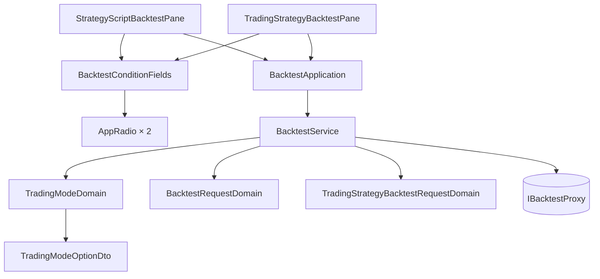

# 回測要照哪一套規矩操作 — Architecture Design

**Status:** Confirmed
**Source PRD:** `.sdd/2026-09-17-backtest-trading-mode/PRD.md`
**Tech context:** Nuxt 4 · Vue 3 `<script setup>` · TypeScript · Clean / Onion · SCSS token

---

## 1. Design Goal & Guiding Principle

**In one sentence：** 在回測表單上多問一件事，而**兩個去處各自都不知道那是一件新的事**。

**Guiding principle：這件事已經有人做過一次了，照抄它。**

「每次開倉押多少」與「交易模式」是同一個形狀的問題：
一組固定取值、每一個都有給人看的名字、都要在兩張表單上出現、
挑錯了要在那一格旁邊講話。專案已經為前者長出一整條路——

```
PositionSizingMode (VO)  →  PositionSizingDomain (行為＋文案)
                         →  PositionSizingModeOptionDto (選單上的一個)
                         →  BacktestService.listPositionSizingModeOptions()
                         →  BacktestApplication  →  .vue
```

交易模式**走同一條路**，不另闢。同類問題用兩種形狀，下一個人不知道該學哪一個。

唯一真正新的東西是**畫法**：押注模式是下拉選單，交易模式必須是**並排看得見的選項**。
所以這個切片新增的 UI 元件只有一個——一顆單選鈕——而它一個字都不認得交易模式。

**文案住在 Domain Model 裡**（比照 `POSITION_SIZING_DESCRIPTIONS`），
這就是 PRD「兩個去處說明一字不差」那一條的落點：兩處都跟同一個來源拿，
而不是兩份各自維護的字串。

---

## 2. Change Scope

| Area | Action | What / Why |
| :--- | :--- | :--- |
| `vo/trading-mode-vo.ts` | **Add** | `TradingMode` 字面量聯合、`TRADING_MODES` 固定順序、`DEFAULT_TRADING_MODE` |
| `domains/trading-mode-domain.ts` | **Add** | 這個模式叫什麼、它做什麼（那一句話），以及它在選項列上長什麼樣 |
| `dto/trading-mode-option-dto.ts` | **Add** | 選項列上的一個：值、名字、那一句話 |
| `atoms/AppRadio.vue` | **Add** | 一顆單選鈕＋它的名字＋可選的一行說明。**不認得交易模式**，與 `AppSelect` 同樣通用 |
| `molecules/BacktestConditionFields.vue` | **Modify** | 多一格交易模式，逐一渲染 `AppRadio`；多一個 `v-model` 與一個錯誤訊息 prop |
| `service/backtest-service.ts` | **Modify** | 多兩個唯讀用例：`defaultTradingMode()`、`listTradingModeOptions()` |
| `application/backtest-application.ts` | **Modify** | 兩個同名的轉交 |
| `dto/backtest-request-dto.ts` | **Modify** | 多一個 `tradingMode` |
| `dto/trading-strategy-backtest-request-dto.ts` | **Modify** | 同上 |
| `domains/backtest-request-domain.ts` | **Modify** | 帶著它。**不驗證**——使用者從兩顆按鈕挑，挑不出非法值，與彙總刻度同一套處理 |
| `domains/trading-strategy-backtest-request-domain.ts` | **Modify** | 同上 |
| `infrastructure/proxy/backtest-proxy.ts` | **Modify** | 兩個 body 各多一個欄位；欄位翻譯表多一列 `tradingMode` |
| `errors/backtest-field-error.ts` | **Modify** | `BacktestField` 多一個 `'tradingMode'` |
| `organisms/StrategyScriptBacktestPane.vue` | **Modify** | 多一個 ref、多接一組 v-model 與錯誤 |
| `organisms/TradingStrategyBacktestPane.vue` | **Modify** | 同上 |
| `PositionSizingDomain` 及其 VO / DTO | **Not touched** | 押多少與照什麼規矩操作是兩件事 |
| 成績單 / 資金曲線 / 交易明細三個元件 | **Not touched** | 回傳形狀一個欄位都沒變 |
| `entities/backtest.ts`、`BacktestDomain` | **Not touched** | 這是送出去的東西，不是回來的東西 |

---

## 3. New Classes / Modules

| Name | Kind | Responsibility (purpose) | Collaborators | Satisfies |
| :--- | :--- | :--- | :--- | :--- |
| `TradingMode`（VO） | VO | 兩個取值本身，加上固定的呈現順序與預設值 | — | AC-01、AC-04 |
| `TradingModeDomain` | Domain Model | 這個模式叫什麼、它做什麼（那一句話），以及它在選項列上長什麼樣 | `TradingModeOptionDto` | AC-01、AC-02、AC-03 |
| `TradingModeOptionDto` | DTO | 選項列上的一個：值、名字、說明 | — | AC-02 |
| `AppRadio.vue` | Atom | 一顆單選鈕：可挑、可停用、帶名字與可選的一行說明 | — | AC-01、AC-02 |

### `TradingModeDomain` 的形狀

```ts
export class TradingModeDomain {
  constructor(private readonly mode: TradingMode) {}

  /** 這個模式在選項列上長什麼樣：名字，加上一句話說它做什麼。 */
  toOptionDto(): TradingModeOptionDto
}
```

> **深度檢查。** 對外只有一個問題：**這個模式在畫面上長什麼樣**。
> 呼叫端不必先問它叫什麼、再問要不要解釋、再自己把兩者湊起來。
> 那一句話與那個名字永遠一起出現，分開問就是給了兩次寫錯的機會。
> 加第三種模式是在描述表多一列，畫面與兩個 pane 一個字都不改。

### 為什麼新增的是 `AppRadio` 而不是 `TradingModeField`

一個叫 `TradingModeField` 的元件會把「交易模式」四個字焊進元件名字裡，
於是下一個需要並排選項的畫面只能再寫一個。
`AppRadio` 與既有的 `AppSelect` 是同一個層級的東西：**一個通用控制項**，
它不知道自己正在讓人挑什麼。分子負責把選項餵給它——
這正是 `BacktestConditionFields` 已經對 `<option v-for>` 做的事。

---

## 4. Modified Components

| Component | Current role | Change needed |
| :--- | :--- | :--- |
| `BacktestConditionFields.vue` | 回測要問的那幾件事，一條規則都不判斷 | 多一格；選項與說明照舊**由外面給**，它仍然一條規則都不判斷 |
| `BacktestService` | 回測的編排＋表單要用的唯讀資料 | 多兩個唯讀用例，形狀與押注模式那兩個一字不差 |
| `BacktestProxy` | 送出、正規化、把後端的欄位名翻成畫面的格 | body 多一欄；翻譯表多一列（`tradingMode` → `tradingMode`，同名直通） |
| 兩個 Pane | 持有表單狀態、接住錯誤 | 各多一個 `ref` 與一組 v-model／錯誤綁定 |

---

## 5. Component Relationships



**兩個 Pane 指向同一個 `listTradingModeOptions()`**，
所以 PRD「兩個去處的選項、預設、說明一字不差」不是靠人記得同步，
而是**根本只有一份**。

---

## 6. Traceability

| PRD Scenario | Component |
| :--- | :--- |
| 打開時兩個選項同時看得見、多空反手被選中 | `AppRadio.vue` ＋ `TRADING_MODES` ＋ `defaultTradingMode()` |
| 每個選項說得出它做什麼 | `TradingModeDomain.toOptionDto()` 的描述表 |
| 兩個去處問的是同一件事 | 兩個 Pane 共用 `BacktestApplication.listTradingModeOptions()` |
| 沒動它就送預設／挑了現貨就送現貨 | `BacktestRequestDomain` → `BacktestProxy` body |
| 重演一份交易策略同樣送得出去，且仍不送刻度與算式 | `TradingStrategyBacktestRequestDomain` → proxy 的第二個 body |
| 換模式不動其他格／不清成績單／不清押注數字 | 兩個 Pane 各自獨立的 `ref`（換它不觸發任何重置） |
| 後端說交易模式不認得 → 落在那一格 | `BACKTEST_FIELD_TRANSLATIONS` 多的那一列 ＋ `BacktestField` 多的那個值 |
| 後端拒絕別的東西 → 交易模式沒有錯誤 | 同上（欄位名逐一對應，不共用） |
| 再按一次先清掉上一則錯誤 | 既有的送出前清除，未改動 |

---

## 7. Extensibility & Handoff Notes

- **Most likely next requirement：第三種交易模式**（後端先加，畫面跟上）。
  **Where it lands：** `TRADING_MODES` 多一個值、描述表多一列。
  `AppRadio`、分子、兩個 Pane、proxy **一個字都不必改**。

- **第二可能：在成績單上標出這次用了哪一種。**
  **Where it lands：** 回傳那一側（`entities/backtest.ts` 與成績單元件），
  與這個切片改的送出那一側完全不重疊。

- **第三可能：記住使用者上次挑的。**
  **Where it lands：** 兩個 Pane 的初始值來源。
  刻意不做——這張表單上其他每一格都不記，只記一格會更難解釋。

- **給下一位的提醒：** `AppRadio` 是通用控制項，**不要**把交易模式的字串寫進去。
  一旦寫進去，下一個需要並排選項的畫面就只能再做一顆。
