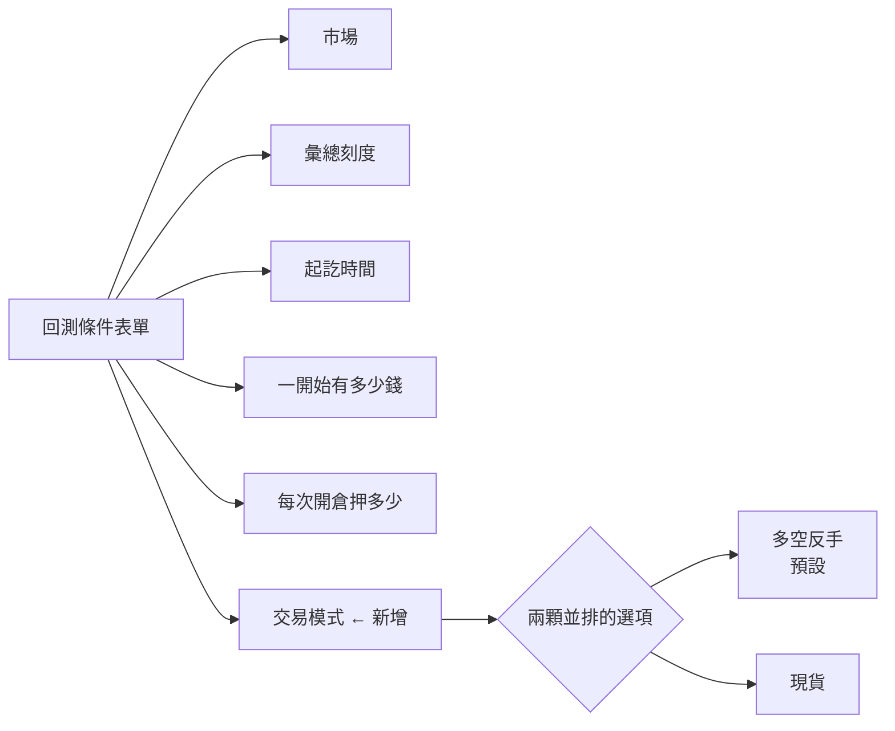

# Product Requirements Document (PRD)

**Status:** Finalized
**Version:** v1.0
**Owner:** James Hsueh
**Stakeholders:** Engineering

---

## 1. Background & Goal (Why & Goal)

### Problem Statement

回測那張表單問使用者五件事：看哪個市場、多粗的 K 線、從哪裡到哪裡、
一開始有多少錢、每次開倉押多少。

**第六件它沒問，而是替他假設了：這個帳戶做得了空。**

在這之前回測只有一套規矩——永遠在市場裡。聽到買入就做多；
聽到賣出就把多倉平掉，並在**同一棒、同一個收盤價反手做空**。

台股現貨、ETF、大多數券商帳戶**都不能放空**。
這些使用者的算式說「賣出」，他們心裡想的是「賣掉，錢收回來，等下一個買點」，
畫面卻交給他一張「賣掉並反手做空」算出來的成績單。
報酬率、最大回撤、勝率**三個數字全部不一樣**。

而且**畫面上沒有任何一個字提過這件事**。他不會發現，也沒有地方可以改。

### Expected Outcome

- 回測條件那一排多一格**交易模式**，兩個選項**同時看得見**。
- 每個選項帶一句話說它做什麼，因為要決定的是行為，不是挑一個名詞。
- **預設停在多空反手**，所有既有的畫面行為一個字都不變。
- **兩個去處都有**：指標計算頁的回測、交易策略工作檯的回測分頁，
  長得一樣、預設一樣、說明一字不差。
- 後端若不認得這個模式，那句話**落在交易模式那一格旁邊**。

### Out of Scope

- **在成績單上標出這次用了哪一種模式**——表單就在同一頁上。
- **同一次送出跑兩種模式並排比較**。
- **記住使用者上次挑的那一個**——每次打開都回到預設。
- **第三種模式**。
- **依帳戶自動挑一種**——前端不知道他的帳戶是什麼。

---

## 2. User Personas

**Primary Role:** 已登入的使用者，正在調一支算式或一份交易策略。
其中相當一部分**手上的帳戶不能放空**，而且**不知道現在的回測正在幫他放空**——
這個「不知道」正是要用並排選項而不是下拉選單的理由。

**Usage Context:** 桌面瀏覽器，坐下來慢慢調。同一段歷史會被重跑很多次，
每次換一點條件。交易模式是其中一個會被換來換去的旋鈕，所以換它不該弄丟任何東西。

---

## 3. User Stories & Acceptance Criteria

### US-01 — 在表單上看得見有兩種規矩可選 [priority: P0]

**As a** 使用者，**I want** 一眼看到回測可以照兩種規矩操作，
**so that** 我不必先知道有另一種，才找得到它。

```gherkin
Scenario: 打開回測時兩個選項同時看得見
  Given 我打開回測那一格
  When 我看交易模式
  Then 多空反手與現貨兩個選項同時出現在畫面上,不必點開任何東西
  And 多空反手是被選中的那一個

Scenario: 每個選項說得出它做什麼
  Given 我打開回測那一格
  When 我讀那兩個選項
  Then 多空反手那一個說得出它永遠在市場裡、賣出會反手做空
  And 現貨那一個說得出它只做多、賣出就平倉把錢收回來

Scenario: 兩個去處問的是同一件事
  Given 我在指標計算那一頁的回測去處看過交易模式
  When 我到交易策略工作檯的回測分頁再看一次
  Then 兩個選項、預設值與那兩句說明一字不差
```

### US-02 — 挑了什麼就送什麼 [priority: P0]

**As a** 使用者，**I want** 我挑的那一套規矩真的被用在這次重演上，
**so that** 成績單對得上我的帳戶做得到的操作。

```gherkin
Scenario: 沒有動它就送預設的那一個
  Given 我沒有動過交易模式
  When 我按下執行回測
  Then 這次送出去的交易模式是多空反手

Scenario: 挑了現貨就送現貨
  Given 我把交易模式改挑現貨
  When 我按下執行回測
  Then 這次送出去的交易模式是現貨

Scenario: 重演一份交易策略時同樣送得出去
  Given 我在交易策略工作檯的回測分頁,把交易模式改挑現貨
  When 我按下執行回測
  Then 這次送出去的交易模式是現貨
  And 這次仍然不送彙總刻度、也不送算式
```

### US-03 — 換模式不弄丟任何東西 [priority: P0]

**As a** 使用者，**I want** 換一個模式只是換那一格，
**so that** 我可以拿同一組條件跑兩次來對照。

```gherkin
Scenario: 換模式不動表單上其他任何一格
  Given 我已經填好市場、起訖時間、一開始有多少錢與每次開倉押多少
  When 我把交易模式從多空反手改成現貨
  Then 那四格的內容一個字都沒有變

Scenario: 換模式不清掉上一張成績單
  Given 畫面上還留著上一次重演的成績單
  When 我改交易模式
  Then 那張成績單還在,因為我還沒有按下執行

Scenario: 換模式不清掉押注那一格填的數字
  Given 每次開倉押多少是百分比,旁邊那格填了 50
  When 我把交易模式改成現貨再改回多空反手
  Then 那格仍然是 50
```

### US-04 — 被拒絕時說在對的那一格旁邊 [priority: P0]

**As a** 使用者，**I want** 拒絕的理由出現在我要改的那一格旁邊，
**so that** 我不必自己猜是哪一格不對。

```gherkin
Scenario: 後端說交易模式它不認得
  Given 我按下執行回測
  When 後端回覆說交易模式不對
  Then 那句話出現在交易模式那一格旁邊
  And 它不出現在頁面頂端

Scenario: 後端拒絕的是別的東西
  Given 我按下執行回測
  When 後端回覆說一開始有多少錢不對
  Then 那句話照舊出現在那一格旁邊
  And 交易模式那一格沒有任何錯誤

Scenario: 再按一次會先清掉上一則錯誤
  Given 上一次因為交易模式被拒,那句話還留在那一格旁邊
  When 我改好之後再按一次執行回測
  Then 那句話先消失,與這張表單上其他每一格的做法相同
```

---

## 4. Business Flow & Logic

### 交易模式在這張表單上的位置



### Core Business Rules

1. **交易模式二選一：多空反手、現貨。** 畫面只認得後端現在給的這兩種。
2. **預設停在多空反手。** 預設值的職責是讓舊的東西繼續成立。
3. **兩個選項同時看得見**，不用下拉選單。這件事的價值就在於使用者原本不知道
   有另一種——藏起來等於沒加。
4. **每個選項帶一句話說它做什麼。** 使用者要決定的是行為
   （賣出時你要幫我放空，還是把錢還我），不是挑一個名詞。
5. **換模式不清掉任何東西**：表單其他每一格、押注那格填的數字、
   上一次的成績單，全部留著。比照既有的「換去處不清空」。
6. **不記住上次挑的那一個。** 每次打開回到預設，與這張表單其他每一格一致。
7. **兩個去處共用同一組選項、同一個預設、同一份說明。**
   它們問的是同一件事，寫兩份遲早會漂移。
8. **後端說交易模式不認得時，那句話落在交易模式那一格旁邊。**
9. **送出前不就地擋交易模式。** 使用者是從兩顆按鈕挑的，挑不出非法值——
   與彙總刻度同一套處理。

### Edge Cases

| 情況 | 行為 |
| :--- | :--- |
| 使用者按執行前完全沒碰交易模式 | 送出多空反手，與這個切片之前完全相同 |
| 後端回了一個畫面認不得的欄位名 | 沿用既有做法：變成一則籠統的拒絕，不硬標在錯的一格旁邊 |
| 重演進行中 | 交易模式停用，比照執行鍵 |
| 後端連不上，或這一份交易策略還沒存過 | 執行按鈕停用，**交易模式仍然挑得動**——挑它不會打出去，而那時其他每一格也都還編輯得了 |

---

## 5. UI/UX Design & Interaction

- **位置**：回測條件那一排的最後一格，在「每次開倉押多少」之後。
  它描述的是「怎麼操作」，與押多少同一類，所以放在一起。
- **樣子**：兩顆並排、同時可見的選項，被選中的那一顆看得出來被選中。
  每顆底下（或旁邊）一行小字說明它做什麼。
- **窄螢幕**：與這一排其他欄位一樣自己折行，不固定欄數。
- **停用**：只在**重演進行中**停用。後端連不上或這一份還沒存過時它仍然挑得動——
  挑它不會打出去，而那時表單上其他每一格也都還編輯得了；停用它會讓它成為
  這張表單上唯一會變灰的輸入格。停用的是執行鍵，不是這一格。
- **錯誤**：那句話出現在這一格旁邊，樣式與其他每一格的錯誤一致。

---

## 6. Non-Functional Requirements

- **相容**：沒有動過交易模式的使用者，畫面行為與送出的內容
  與這個切片之前**完全相同**。
- **一致**：兩個去處的選項、預設、說明來自**同一處**，不是兩份各自維護的字串。
- **無障礙**：兩顆選項是真的可挑選控制項，鍵盤操作得了。

---

## 7. Dependencies & Risks

- **依賴**：後端已經認得這個模式，並且在拒絕時會指名 `tradingMode` 這一格。
- **風險**：兩個去處各寫一份選項與說明，之後只改一邊。
  緩解——選項與說明由同一個來源產出，兩處都跟它拿。
- **風險**：加了一格會把既有那一排擠成兩行。
  緩解——那一排本來就是自動折行的，不固定欄數。

---

## 8. Appendix

- `.sdd/2026-09-17-backtest-trading-mode/BRIEF.md`
- `.sdd/2026-09-05-strategy-script-backtest/PRD.md`——回測表單的出處
- `.sdd/2026-09-17-trading-strategy-backtest-console/PRD.md`——回測分頁的出處
- `.sdd/UL-MAP.md`——交易模式、多空反手、現貨的詞彙定義
