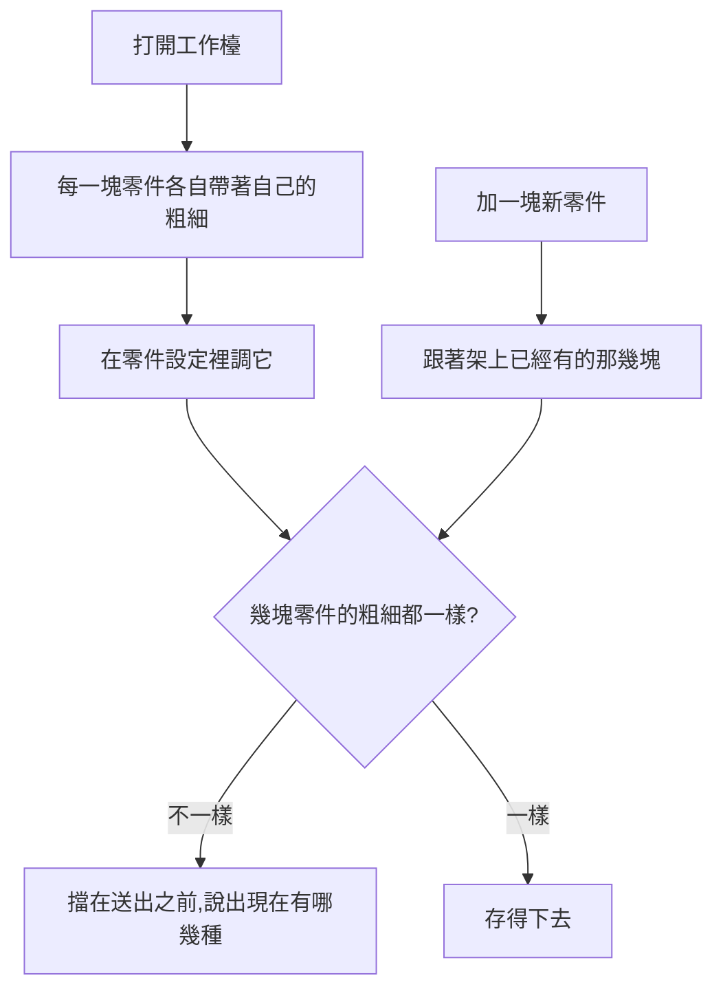

# Product Requirements Document (PRD)

**Status:** Finalized
**Version:** v1.0
**Owner:** James Hsueh
**Stakeholders:** Engineering

---

## 1. Background & Goal (Why & Goal)

### Problem Statement

零件架上每一塊零件各自挑「看多粗的 K 線」，
所以使用者拼得出一份刻度混著的交易策略——而那一份什麼都做不成。

### Expected Outcome

- 每一塊零件**仍然調得動**自己的粗細。
- 幾塊零件不一致時**擋在送出之前**，並說出現在有哪幾種。
- 新加的零件**跟著架上已經有的那幾塊**，所以一般情況下永遠不會撞到那句提醒。

### Out of Scope

- 不同刻度的對齊。
- 回測分頁與策略機器人表單的任何改動。

---

## 2. User Personas

**Primary Role:** 已登入的使用者，自己每一支策略腳本與每一份交易策略的擁有者。

**Usage Context:** 桌面瀏覽器。拼一份交易策略是坐下來做上半小時的事，
反覆調整、反覆存檔。

---

## 3. User Stories & Acceptance Criteria

### US-01 — 每一塊零件的粗細仍然調得動 [priority: P0]

**As a** 使用者，**I want** 在每一塊零件自己的設定裡調它看多粗的 K 線，
**so that** 我換一塊零件的粗細時不必去別的地方找那一格。

```gherkin
Scenario: 零件設定裡有那一格
  Given 架上有一塊零件
  When 我打開它的設定
  Then 裡面有「看多粗的 K 線」,而且調得動

Scenario: 調完就存得下去
  Given 架上只有一塊零件
  When 我把它調成四小時並儲存
  Then 送出去的那一個信號來源是四小時

Scenario: 架上看得出每一塊現在是哪一種
  Given 一塊看一小時、一塊看五分鐘
  When 我看零件架
  Then 每一塊旁邊各自寫著它現在的粗細
```

### US-02 — 不一致就送不出去，而且知道差在哪 [priority: P0]

**As a** 使用者，**I want** 幾塊零件粗細不一樣時被擋在送出之前，
**so that** 我不會存下一份什麼都做不成的交易策略。

```gherkin
Scenario: 每一塊都一樣時什麼都不必提
  Given 兩塊零件都看一小時
  When 我看畫面
  Then 沒有任何關於粗細的提醒

Scenario: 不一樣時擋下來,並說出現在有哪幾種
  Given 一塊看一小時、一塊看五分鐘
  When 我看畫面
  Then 那句話裡看得到「1h」與「5m」
  And 儲存鍵按不下去

Scenario: 調回來就送得出去
  Given 同上
  When 我把看五分鐘那一塊調成一小時
  Then 那句話消失
  And 送出去的兩個信號來源都是一小時
```

### US-03 — 新加的零件不會無故撞到那句提醒 [priority: P0]

**As a** 使用者，**I want** 新加的零件跟著架上已經有的那幾塊，
**so that** 我不必每加一塊就去修一件我沒做過的事。

```gherkin
Scenario: 跟著架上已經有的
  Given 架上兩塊零件都看一天
  When 我加一塊新的
  Then 沒有任何提醒
  And 送出去的三個信號來源都是一天

Scenario: 架上一塊都沒有時用預設值
  Given 架上一塊零件都沒有
  When 我加第一塊
  Then 它用預設的五分鐘
```

---

## 4. Business Flow & Logic



### Core Business Rules

1. **每一塊零件各自帶著自己的粗細**，在它自己的設定裡調。
2. 幾塊零件的粗細**必須全部相同**，否則送不出去。
3. 那句拒絕**列出目前出現過的每一種**，依出現順序。
4. 新加的零件用**架上第一塊**的粗細；架上沒有東西時用預設值（`5m`）。
5. 讀一份舊的進來時**原樣呈現**，包含它原本混著的那幾種——
   擋下來的那一句會說出差在哪。

### Edge Cases

| 情況 | 行為 |
| :--- | :--- |
| 讀進來的舊資料本來就混著 | 原樣顯示，並被那句話擋著直到他調一致 |
| 一個零件都還沒有 | 既有規則先擋（至少要有一個信號來源） |
| 後端仍然拒絕刻度不一致 | 那句話照舊會被顯示出來——規則的所在地在後端，畫面只是提早說一次 |

---

## 5. UI/UX Design & Interaction

- 「看多粗的 K 線」留在**每一塊零件自己的設定彈窗**裡。
- 零件架上每塊零件旁邊寫著它現在的粗細——它們真的可能不一樣，
  所以那一行是資訊，也是他不必打開任何設定就找得出落單那一塊的方式。
- 不一致的那句話與其他送不出去的理由走**同一個位置**（表單底下那一則），
  因為對使用者而言它們是同一件事：現在送不出去，以及為什麼。

---

## 6. Non-Functional Requirements

- **相容**：回測分頁、機器人表單與清單一行行為都不改。

---

## 7. Dependencies & Risks

- **依賴**：後端 `.sdd/2026-09-17-shared-aggregation-coarseness/`。
- **風險**：一份舊的混合資料打開來就是送不出去的狀態，
  而使用者可能只是想改個名字。
  緩解——那句話說出現在有哪幾種，而每一塊的設定就在零件架上，一次點擊的距離。

---

## 8. Appendix

- `.sdd/2026-09-17-shared-aggregation-coarseness/BRIEF.md`
- `.sdd/2026-09-17-trading-strategy-backtest-console/PRD.md`——回測那一格早就在講同一句話
