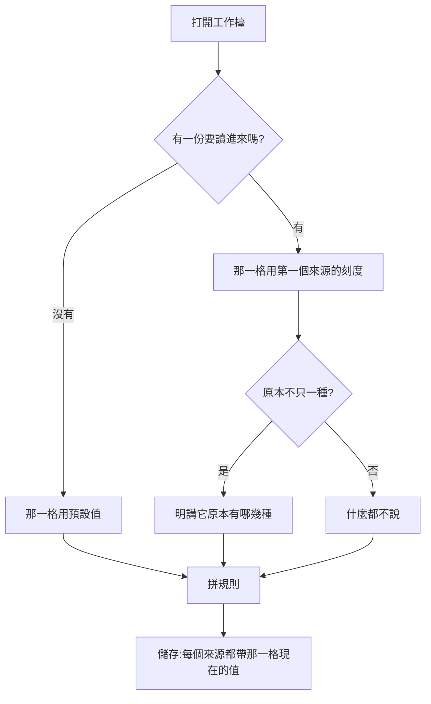

# Product Requirements Document (PRD)

**Status:** Finalized
**Version:** v1.0
**Owner:** James Hsueh
**Stakeholders:** Engineering

---

## 1. Background & Goal (Why & Goal)

### Problem Statement

零件架上每一塊零件各自挑「看多粗的 K 線」，
所以使用者拼得出一份刻度混著的交易策略——而那一份什麼都做不成。

### Expected Outcome

- 刻度成為**整份交易策略的一格**，使用者因此**拼不出**不一致的東西。
- 打開一份原本混著的舊資料時**明講**會發生什麼，而不是悄悄改掉它。

### Out of Scope

- 不同刻度的對齊。
- 回測分頁與策略機器人表單的任何改動。

---

## 2. User Personas

**Primary Role:** 已登入的使用者，自己每一支策略腳本與每一份交易策略的擁有者。

**Usage Context:** 桌面瀏覽器。拼一份交易策略是坐下來做上半小時的事，
反覆調整、反覆存檔。

---

## 3. User Stories & Acceptance Criteria

### US-01 — 刻度挑一次，整份跟著走 [priority: P0]

**As a** 使用者，**I want** 在工作檯上挑一次粗細，
**so that** 我不必替每一塊零件各挑一次，也不會挑出彼此打架的組合。

```gherkin
Scenario: 刻度在工作檯頂端
  Given 我打開交易策略工作檯
  When 我看畫面
  Then 名稱旁邊有一格「看多粗的 K 線」

Scenario: 零件設定裡沒有刻度了
  Given 架上有一塊零件
  When 我打開它的設定
  Then 裡面只有代號、用哪一支策略腳本與它的參數,沒有刻度

Scenario: 換掉那一格,每個零件一起換
  Given 架上有兩塊零件
  When 我把那一格改成一天並儲存
  Then 送出去的兩個信號來源都是一天

Scenario: 新加的零件也跟著那一格
  Given 那一格現在是一天
  When 我加一塊新的零件並儲存
  Then 送出去的那一個信號來源也是一天
```

### US-02 — 打開一份舊的不會被悄悄改掉 [priority: P0]

**As a** 使用者，**I want** 打開一份原本混著刻度的舊交易策略時被告知，
**so that** 我按下儲存時知道自己正在改掉什麼。

```gherkin
Scenario: 本來就一致的那一份安安靜靜
  Given 一份交易策略的兩個來源都是一小時
  When 我打開它
  Then 那一格顯示一小時
  And 畫面上沒有任何關於刻度的提醒

Scenario: 混著的那一份明講
  Given 一份舊的交易策略,一個來源是一小時、一個是五分鐘
  When 我打開它
  Then 那一格顯示一小時
  And 畫面上說得出它原本有「1h」與「5m」兩種,存下去會全部變成現在選的那一個

Scenario: 直接儲存就把它調一致了
  Given 同上那一份,那一格顯示一小時
  When 我直接按儲存
  Then 送出去的兩個信號來源都是一小時
```

---

## 4. Business Flow & Logic



### Core Business Rules

1. **一份交易策略只有一個刻度**，由工作檯上那一格說了算。
2. 讀進來時取**第一個來源**的刻度；一個來源都沒有就用預設值。
3. 原本混著時**明講有哪幾種**，且說清楚存下去的後果。
4. 送出去時**每個來源都帶同一個值**。
5. 畫面上**沒有刻度不一致的驗證訊息**——那種狀態拼不出來。

### Edge Cases

| 情況 | 行為 |
| :--- | :--- |
| 一個零件都還沒有 | 那一格照樣可以先挑，之後加的零件跟著它 |
| 後端仍然拒絕刻度不一致 | 那句話照舊會被顯示出來——規則的所在地在後端，畫面只是讓它不容易發生 |

---

## 5. UI/UX Design & Interaction

- 工作檯頂端那一塊從「一格名稱」變成「名稱 + 看多粗的 K 線」兩格。
- 零件架上每塊零件旁邊原本寫著自己的刻度，**拿掉**：
  每一塊都寫著同一個值，那不是資訊，只是佔著寬度。
- 混著的提醒用提示色調，跟著那一格旁邊。

---

## 6. Non-Functional Requirements

- **相容**：回測分頁、機器人表單與清單一行行為都不改。

---

## 7. Dependencies & Risks

- **依賴**：後端 `.sdd/2026-09-17-shared-aggregation-coarseness/`。
- **風險**：使用者打開一份舊的混合資料、看到提醒卻直接儲存，
  等於接受了系統挑的那一個刻度。
  緩解——那句話明說「會全部變成現在選的那一個」，而那一格就在旁邊，改得動。

---

## 8. Appendix

- `.sdd/2026-09-17-shared-aggregation-coarseness/BRIEF.md`
- `.sdd/2026-09-17-trading-strategy-backtest-console/PRD.md`——回測那一格早就在講同一句話
