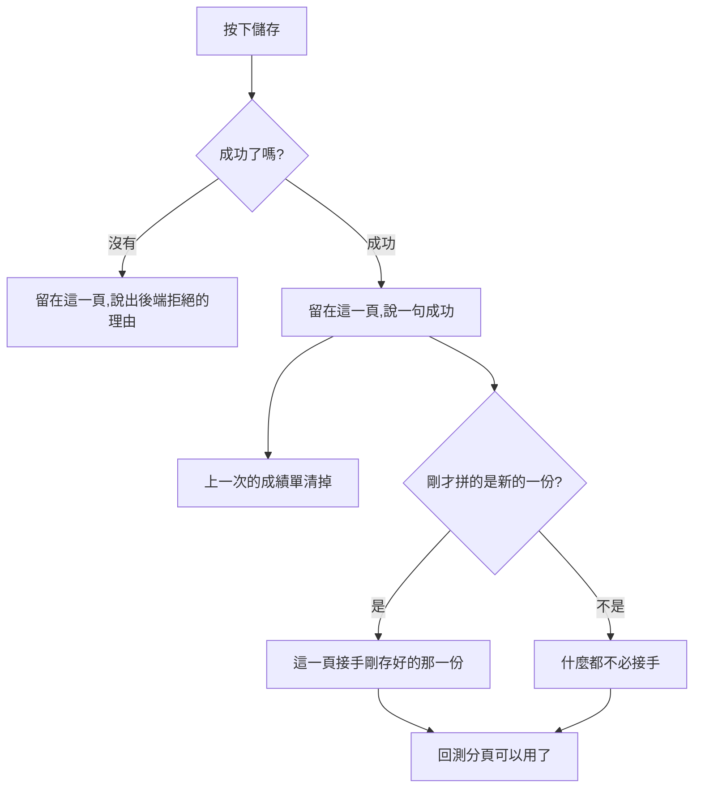

# Product Requirements Document (PRD)

**Status:** Finalized
**Version:** v1.0
**Owner:** James Hsueh
**Stakeholders:** Engineering

---

## 1. Background & Goal (Why & Goal)

### Problem Statement

存好一份交易策略之後，畫面立刻把使用者送回清單。
但**存好之後最常做的下一件事是回測它**，而那個分頁就在這一頁上。

拼一份新的更糟：回測那一分頁在還沒存之前是停用的，
存好又被送走——所以他永遠碰不到「剛拼好、馬上問它行不行」這條路。

### Expected Outcome

- 存好之後**留在這一頁**，剛存好的那一份**立刻回測得動**。
- 拼一份新的存好之後，這一頁從此改的是**那一份**。
- 這一頁上有一顆回清單的按鈕，兩個分頁都看得到。

### Out of Scope

- 清單那一頁與策略機器人工作台的任何改動。

---

## 2. User Personas

**Primary Role:** 已登入的使用者，自己每一份交易策略的擁有者。

**Usage Context:** 桌面瀏覽器。拼規則與回測是**同一段工作**的兩半：
調一點條件、重演一次、再調一點——而這正是把他送走的代價最貴的地方。

---

## 3. User Stories & Acceptance Criteria

### US-01 — 存好了留在原地，馬上回測得動 [priority: P0]

**As a** 使用者，**I want** 按下儲存之後留在這一頁，
**so that** 我可以立刻拿它重演一次，而不是再走一次來回。

```gherkin
Scenario: 存好一份既有的就留在原地
  Given 我在改一份既有的交易策略
  When 我按下儲存並且成功了
  Then 我還在這一頁
  And 我看得到「更改成功」

Scenario: 存好之後上一次的成績單清掉
  Given 我剛剛在回測分頁重演過一次,畫面上有成績單
  When 我回去改條件並再存一次
  Then 那張成績單不在畫面上——它說的是上一版的規則

Scenario: 存好之後離開不會再被攔一次
  Given 我改過東西並且已經存好了
  When 我按下回清單
  Then 我直接離開,沒有被問「還沒存」
```

### US-02 — 拼好一份新的之後，這一頁就是在改那一份 [priority: P0]

**As a** 使用者，**I want** 存好一份新的之後這一頁接著改它，
**so that** 我可以馬上回測它，而且不會不小心存出第二份。

```gherkin
Scenario: 存好一份新的就留在原地,並接手那一份
  Given 我在拼一份全新的交易策略
  When 我按下儲存並且成功了
  Then 我還在這一頁
  And 這一頁現在改的是剛存好的那一份

Scenario: 剛拼好的那一份馬上回測得動
  Given 我剛存好一份全新的交易策略
  When 我切到回測分頁
  Then 執行鍵按得下去——它在存之前是停用的

Scenario: 再按一次儲存不會多出一份
  Given 我剛存好一份全新的交易策略
  When 我再按一次儲存
  Then 改到的還是那一份,系統裡沒有第二份
```

### US-03 — 回清單的出口一直都在 [priority: P0]

**As a** 使用者，**I want** 隨時看得到一顆回清單的按鈕，
**so that** 我做完事就走得掉。

```gherkin
Scenario: 拼規則那一側看得到
  Given 我在拼規則分頁
  When 我看畫面
  Then 有一顆回交易策略列表的按鈕

Scenario: 回測那一側也看得到
  Given 我在回測分頁
  When 我看畫面
  Then 同一顆按鈕還在

Scenario: 有沒存的改動時先問過
  Given 我改了東西還沒存
  When 我按下回清單
  Then 系統先問我確不確定
```

---

## 4. Business Flow & Logic



### Core Business Rules

1. **儲存成功不離開這一頁**，該說的話在這裡說。
2. 每一次成功儲存都**讓上一次的重演結果作廢**——規則換了。
3. 存好一份**新的**之後，這一頁接手那一份；再存一次改的是同一份。
4. 儲存成功後**不再算「有沒存的改動」**，離開時不攔人。
5. 回清單的按鈕**與分頁無關**，兩邊都在。
6. 儲存**失敗**時一切照舊：留在這一頁，內容留著，說出理由。

### Edge Cases

| 情況 | 行為 |
| :--- | :--- |
| 存好新的一份之後重新整理 | 還在那一份上——網址已經是它的了 |
| 要改的那一份不見了 | 照舊回清單：那一頁沒有東西可以留 |
| 存好之後又改了一點東西 | 又算有沒存的改動，離開時照樣先問過 |

---

## 5. UI/UX Design & Interaction

- 回清單那顆按鈕擺在**分頁切換之上**，所以它與「現在在哪一個分頁」無關。
- 成功那一句用既有的提示條，四秒後自己收掉。
- 表單底部原本的「取消」拿掉：它與回清單按鈕去的是同一個地方，
  而儲存不再離開之後，「取消」旁邊放著一顆不會離開的「儲存」，讀起來像在問取消什麼。

---

## 6. Non-Functional Requirements

- **相容**：儲存失敗、找不到那一份、未存變更提醒，三條路的行為都不改。

---

## 7. Dependencies & Risks

- **依賴**：`.sdd/2026-09-17-trading-strategy-backtest-console/`（回測分頁與 `savedGeneration`）。
- **風險**：使用者可能以為「留在原地」代表沒存成功。
  緩解——成功那一句就在畫面上，而且改一份與拼一份新的說的不是同一句。

---

## 8. Appendix

- `.sdd/2026-09-17-stay-after-saving-a-trading-strategy/BRIEF.md`
