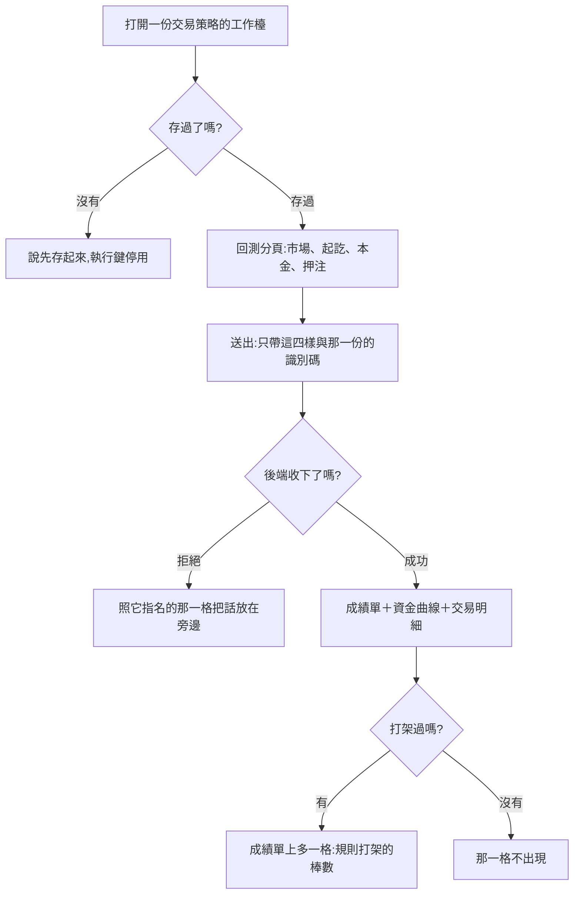

# Product Requirements Document (PRD)

**Status:** Finalized
**Version:** v1.0
**Owner:** James Hsueh
**Stakeholders:** Engineering

---

## 1. Background & Goal (Why & Goal)

### Problem Statement

這台終端機重演得了一支策略腳本，卻重演不了使用者真正會派出去的那一整套。
他拼好一份交易策略之後，唯一能知道它值不值得信的辦法，是按下播放然後等好幾個月。

### Expected Outcome

- 交易策略工作檯多一個**回測分頁**，受測對象是眼前這一份。
- 成績單、資金曲線、交易明細**一個字都不變**，多的只有一個**打架棒數**。
- 出錯時的說法與重演一支腳本**一字不差**。

### Out of Scope

- 回測結果的留存。
- 重演一台機器人。
- 不同彙總刻度的對齊（這一版要求一致，由後端擋下）。
- 手續費、滑點、槓桿、停損停利。

---

## 2. User Personas

**Primary Role:** 已登入的使用者，同時是自己每一支策略腳本、每一份交易策略的擁有者。

**Usage Context:** 桌面瀏覽器。他在**確認一份交易策略之前**會重跑很多次，
每次調一點條件再看一次——這正是結果不留存的理由，也是「改存過就清掉上一張」的理由。

---

## 3. User Stories & Acceptance Criteria

### US-01 — 在工作檯上重演眼前這一份 [priority: P0]

**As a** 使用者，**I want** 在拼規則的同一個地方重演這一份，
**so that** 我不必為了看一次成績而換一個地方。

```gherkin
Scenario: 回測分頁上要填的比重演一支腳本少兩格
  Given 我打開一份存過的交易策略
  When 我切到回測分頁
  Then 我看得到市場、起訖時間、本金與押注方式
  And 看不到算式那一格

Scenario: 彙總刻度是一句話,不是挑得動的選單
  Given 我打開一份存過的交易策略的回測分頁
  When 我找彙總刻度
  Then 我看到一句話說它由這份交易策略的信號來源決定
  And 沒有一個可以挑的選單

Scenario: 重演的是眼前這一份
  Given 我打開的是識別碼為 7 的那一份交易策略
  When 我填好條件並送出重演
  Then 這次重演的受測對象是第 7 份交易策略,而不是任何一支策略腳本

Scenario: 成績單、資金曲線與交易明細同時在畫面上
  Given 一次重演成功回來了
  When 我看畫面
  Then 成績單、資金曲線與交易明細三塊同時在上面

Scenario: 算的時候說一聲,而且不讓他按第二次
  Given 我送出了一次重演
  When 它還在算
  Then 畫面說重演中
  And 執行鍵是停用的
```

### US-02 — 還沒存過的那一份重演不了，而且立刻知道 [priority: P0]

**As a** 使用者，**I want** 在填任何一格之前就知道這一份還不能重演，
**so that** 我不會填完四格才被擋下來。

```gherkin
Scenario: 還沒存過時說清楚下一步是先存
  Given 我在拼一份全新的、還沒存過的交易策略
  When 我切到回測分頁
  Then 畫面說先存起來再回來這裡
  And 執行鍵是停用的

Scenario: 存過之後那句話就不見了
  Given 我打開的是一份已經存過的交易策略
  When 我切到回測分頁
  Then 那句話不在畫面上
```

### US-03 — 看得出這份交易策略有多常在打架 [priority: P0]

**As a** 使用者，**I want** 成績單上看得到打架了幾棒，
**so that** 我不會把一張「幾乎沒有交易」的漂亮成績單讀成一份很穩的策略。

```gherkin
Scenario: 打架過才多出那一格
  Given 一次重演裡有 180 棒兩邊條件同時成立
  When 我看成績單
  Then 我看到規則打架的棒數是 180

Scenario: 一棒都沒打架過時那一格不出現
  Given 一次重演裡一棒都沒有兩邊同時成立
  When 我看成績單
  Then 成績單上沒有打架棒數那一格

Scenario: 重演一支策略腳本時那一格永遠不出現
  Given 我重演的是一支策略腳本,不是一份交易策略
  When 我看成績單
  Then 成績單上沒有打架棒數那一格
```

### US-04 — 規則改存過之後不看到上一版的成績 [priority: P0]

**As a** 使用者，**I want** 改存規則之後上一張成績單消失，
**so that** 我不會把上一版的成績讀成這一版的。

```gherkin
Scenario: 改存過就清掉上一張成績單
  Given 我重演過一次,畫面上有成績單
  When 我回去改條件並再存一次
  Then 那張成績單不在畫面上
```

### US-05 — 出錯時講的話與我熟悉的那一套相同 [priority: P0]

**As a** 使用者，**I want** 出錯的說法與重演一支腳本相同，
**so that** 我不必為了第二種受測對象再學一次。

```gherkin
Scenario: 來源的腳本跑不起來時說成算式的問題
  Given 某個信號來源指名的策略腳本跑不起來
  When 我送出重演
  Then 畫面說成算式的問題,措辭與重演一支腳本相同

Scenario: 刻度不一致時那句話落在市場那一格旁邊
  Given 這一份的信號來源用了 1h 與 5m 兩種彙總刻度
  When 我送出重演
  Then 那句拒絕出現在市場那一格旁邊,而不是頁面頂端

Scenario: 送出去的東西裡沒有刻度也沒有算式
  Given 我在回測分頁填好了條件
  When 我送出重演
  Then 送出去的內容裡沒有彙總刻度,也沒有算式

Scenario: 連不上後端時執行鍵停用
  Given 後端連不上
  When 我送出重演
  Then 畫面說連不上
  And 執行鍵是停用的
```

---

## 4. Business Flow & Logic



### Core Business Rules

1. **受測對象是眼前這一份交易策略**，識別碼由頁面給，不由使用者填。
2. **彙總刻度與算式一格都不送**——那是這份交易策略自己說的。
3. **打架棒數大於零才出現**；沒有回報那一項時當作零。
4. **規則改存過就清掉上一次的結果。**
5. **出錯的措辭與重演一支腳本完全相同。**
6. **結果不留存**，每次重新算。

### Edge Cases

| 情況 | 行為 |
| :--- | :--- |
| 後端沒有回報打架棒數 | 當作零，那一格不出現 |
| 後端指名一個畫面認不得的欄位 | 退回一般的拒絕，放在頁面頂端——標在錯的一格旁邊比放頂端更糟 |
| 還沒存過就送出 | 當場擋下，一次都不打出去 |

---

## 5. UI/UX Design & Interaction

- 工作檯頂端兩個分頁：**拼規則**、**回測**。預設停在拼規則。
- 回測分頁的版面與重演一支腳本那一塊**逐格對齊**，只少兩格。
- 打架棒數那一格用警示色調——它要被看見。

---

## 6. Non-Functional Requirements

- **效能**：一次重演可能要數十秒，畫面在等的時候要說話。
- **相容**：重演一支策略腳本那條路**一行行為都不改**。

---

## 7. Dependencies & Risks

- **依賴**：後端 `.sdd/2026-09-17-trading-strategy-backtest/`，以及本站的交易策略工作檯切片。
- **風險**：「兩種受測對象講同一套話」很容易在日後被打破。
  緩解——把它寫成驗收情境，而不是一句註解。

---

## 8. Appendix

- `.sdd/2026-09-17-trading-strategy-backtest-console/BRIEF.md`
- `.sdd/2026-09-05-strategy-script-backtest/PRD.md`——成績單與模擬規則的出處
- `.sdd/2026-09-17-trading-strategy-workbench/PRD.md`——工作檯的出處
