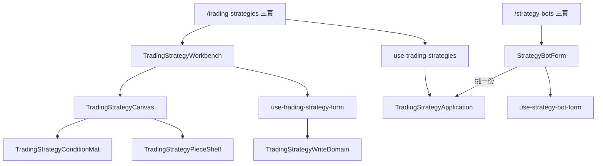

# 交易策略工作檯 — Architecture Design

**Status:** Confirmed
**Source PRD:** `.sdd/2026-09-17-trading-strategy-workbench/PRD.md`
**Tech context:** Nuxt 3 · Vue 3 · TypeScript · Clean / Onion Architecture · Atomic Design

---

## 1. Design Goal & Guiding Principle

**In one sentence：** 把工作檯那一整塊從機器人表單裡整塊搬去交易策略自己的頁面，
機器人表單瘦成四格，而**工作檯內部一行都不改**。

**Guiding principle：** 搬家，不改寫。工作檯（`Canvas` ＋ `ConditionMat` ＋ `PieceShelf`
＋ `PieceSettingsDialog`）與它底下那套拖放規則是這個產品最貴的一塊；
這次動它的只有**名字**與**誰把它掛起來**。
一個「順便重畫一下」的搬家，會讓「行為沒變」這件事再也證明不了。

---

## 2. Change Scope

| Area | Action | What / Why |
| :--- | :--- | :--- |
| `TradingStrategy*` 四個工作檯元件 | **Rename** | 由 `StrategyBot*` 改名搬家，內容一行不改 |
| `TradingStrategyWorkbench.vue` | **Add** | 由 `StrategyBotWorkbench.vue` 改造而來：拿掉交易標的與觸發間隔那一列 |
| `TradingStrategyListPanel.vue` ＋ 三個頁面 | **Add** | 清單、新增、編輯，比照機器人那三頁 |
| `use-trading-strategy-form` / `-workbench` / `use-trading-strategies` | **Add** | 由機器人的三個 composable 改造而來 |
| domain / dto / proxy / service / application | **Add** | 交易策略這一條路的整串，比照機器人既有的那一串 |
| `StrategyBotForm.vue` | **Modify**（原 `StrategyBotWorkbench.vue`） | 剩四格：名稱、交易策略選單、交易標的、觸發間隔 |
| `use-strategy-bot-form` | **Modify** | 剩四格的狀態與驗證 |
| `strategy-bot-dto` / `-write-dto` / `-write-domain` / `-proxy` | **Modify** | 換成 `tradingStrategyId`，讀回來多一個 `tradingStrategyName` |
| `StrategyBotListPanel.vue` | **Modify** | 每一列多一個連得過去的交易策略名字 |
| 指標計算、K 線圖表、市集、助手、帳號設定 | **Not touched** | 這個切片只搬工作檯 |
| 工作檯內部的拖放、巢狀、上限、提示 | **Not touched** | 一行都不改，這是本設計的重點 |

---

## 3. New Classes / Modules

| Name | Kind | Responsibility (purpose) | Collaborators | Satisfies |
| :--- | :--- | :--- | :--- | :--- |
| `TradingStrategy`（entity） | Entity | 一份規則的欄位：名稱、信號來源、兩棵條件樹 | — | US-01 |
| `TradingStrategyDomain` | Domain Model | 讀回來那一份的行為：說得出它用了幾支腳本、有沒有東西 | — | US-02 |
| `TradingStrategyWriteDomain` | Domain Model | 要送出去那一份的成形與驗證：名稱不得空白、必須有來源與兩邊條件 | `TradingStrategyConditionDomain` | US-01、US-05 |
| `TradingStrategyConditionDomain` | Domain Model | 一棵條件樹在畫面上的樣子與它的規則（由 `StrategyBotConditionDomain` 改名） | — | US-01 |
| `ITradingStrategyProxy` ＋ `TradingStrategyProxy` | Interface ＋ Proxy | 五條路由的呼叫與 wire 正規化；把後端的拒絕翻成具名錯誤 | — | 全部 |
| `TradingStrategyService` | Domain Service | 交易策略的用例編排 | `ITradingStrategyProxy` | 全部 |
| `TradingStrategyApplication` | Application | 畫面唯一的入口 | `TradingStrategyService` | 全部 |
| `use-trading-strategies` | Composable | 清單那一頁的狀態：讀、刪、確認、後端拒絕 | `TradingStrategyApplication` | US-02、US-05 |
| `use-trading-strategy-workbench` | Composable | 工作檯那一頁的狀態：讀一份、存、找不到、改過沒 | `TradingStrategyApplication`、`StrategyScriptApplication` | US-01 |
| `use-trading-strategy-form` | Composable | 工作檯表單本身（由 `use-strategy-bot-form` 拿掉標的與間隔而來） | `TradingStrategyWriteDomain` | US-01 |
| `TradingStrategyWorkbench.vue` | Organism | 名稱一格 ＋ 工作檯 ＋ 動作列 | `TradingStrategyCanvas` | US-01 |
| `TradingStrategyListPanel.vue` | Organism | 清單、空狀態、讀不到、刪除確認 | — | US-02、US-05 |
| 四個具名錯誤 | Error | 找不到／名稱重複／還有機器人在用／有機器人在跑 | — | US-05 |

---

## 4. Modified Components

| Component | Current role | Change needed |
| :--- | :--- | :--- |
| `StrategyBotWorkbench.vue` | 名稱＋標的＋間隔 ＋ 整塊工作檯 | 改名 `StrategyBotForm.vue`；工作檯整塊移除，換成一個交易策略選單 |
| `use-strategy-bot-form.ts` | 四格 ＋ 來源 ＋ 兩棵樹的全部狀態 | 只留四格；來源與樹的那一整段搬去 `use-trading-strategy-form` |
| `use-strategy-bot-workbench.ts` | 讀機器人＋讀策略腳本清單 | 改讀機器人＋讀**交易策略**清單 |
| `StrategyBotListPanel.vue` | 每一列：名稱、標的、狀態、動作 | 多一欄：它用的那份交易策略的名字，連得過去 |
| `strategy-bot-proxy.ts` | wire 含 `signalSources`／兩棵樹 | 換成 `tradingStrategyId`；讀回來多收 `tradingStrategyName` |

---

## 5. Component Relationships

---

## 6. Extensibility & Handoff Notes

- **Most likely next requirement：** 回測一份交易策略（下一個切片）。
- **Where it lands：** 交易策略那一頁多一個「去處」，比照指標計算那一頁
  「指標預覽／回測」的既有做法——工作區在上、去處切換在下，切換不清空任何東西。
- **How to add it：** 新增一個 `TradingStrategyBacktestPane.vue`，
  重用既有的成績單／資金曲線／交易明細三個元件；**不必碰**工作檯。
- **Do not hardcode：** 上限（來源 10、深度 5、節點 32）沿用 `strategy-bot-limits-vo`
  既有的那一份，不生第二份。
- **Known debt：** 工作檯元件改名之後，`strategy-bot-limits-vo` 這個名字與它描述的東西
  不再對齊。留著不動，是因為改它會把這次「一行都沒改」的範圍撐開；
  下一個碰到上限的人順手改。

---

## 7. Traceability

| PRD Scenario | Fulfilled by |
| :--- | :--- |
| 工作檯上只有規則 | `TradingStrategyWorkbench.vue` |
| 拼好一份就回清單 / 改到一半想離開要先問過 | `use-trading-strategy-workbench` ＋ `TradingStrategyWorkbenchPage.vue` |
| 讀一份不在了的 | `use-trading-strategy-workbench.missing` |
| 清單列出自己的每一份 / 空清單 / 讀不到 | `TradingStrategyListPanel.vue` ＋ `use-trading-strategies` |
| 刪一份要先確認 / 取消 / 確認 | `use-trading-strategies.remove` |
| 表單只剩四格 / 選單列出每一份 | `StrategyBotForm.vue` ＋ `use-strategy-bot-workbench` |
| 一份都沒有時換成一句話與入口 | `StrategyBotForm.vue` |
| 沒挑就送出會被就地擋下 | `use-strategy-bot-form.rejection` |
| 清單那一列說得出它用的是哪一份 / 點得進去 | `StrategyBotListPanel.vue` |
| 有機器人在跑時改不動 / 還有機器人在用時刪不掉 / 名稱重複 | `TradingStrategyProxy` 具名錯誤 ＋ 兩個 composable 照它說的講 |

---

## 8. Risks & Open Decisions

| 風險 | 判斷 |
| :--- | :--- |
| 工作檯搬家時被順手改動 | 以「元件內容 diff 只有改名」為驗收；既有的工作檯測試整份跟著改名搬過去，斷言一條都不改 |
| 前後端必須一起上 | 機器人的請求形狀變了。兩邊各自的切片一起交付 |
| 機器人表單少掉工作檯後，既有測試大量失效 | 預期之內：那些測試問的是工作檯，跟著工作檯搬去新的測試檔 |

### Open decisions（交給實作）

- 交易策略清單那一列要不要顯示「幾台機器人在用」。**建議不要**——
  那需要為每一份各問一次機器人清單，而它救不了任何一次操作：
  真的要刪的時候後端會擋下並說出數字。
