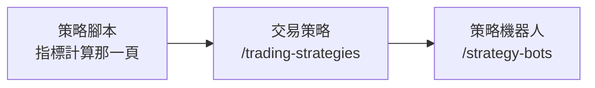

# Product Requirements Document (PRD)

**Status:** Finalized
**Version:** v1.0
**Owner:** James Hsueh
**Stakeholders:** Engineering

---

## 1. Background & Goal (Why & Goal)

### Problem Statement

拼條件的那一整塊畫面長在「拼一台機器人」那一頁裡，與「盯哪個市場、多久醒一次」
擠在同一張表單上。兩件事在使用者腦袋裡不是同一件：拼規則是坐下來慢慢調的事，
開一台機器是填三格就走的事。

代價是使用者付的：**同一套規則想盯第二個市場，只能從頭再拼一次**，
兩份從此各自漂移，而他不會發現。

後端已經把那一層拿出來並給了它名字。畫面還沒跟上，所以現在送出的內容
後端已經不接受了。

### Expected Outcome

- 工作檯搬去交易策略自己的頁面，拼的是一份規則。
- 機器人的表單剩四格：名稱、挑一份交易策略、交易標的、觸發間隔。
- 機器人清單看得出每一台用的是哪一份。
- **工作檯本身的行為一格都沒有變。**

### Out of Scope

- 交易策略的**市集與分享**。
- 交易策略的**回測**（下一個切片）。
- 一台機器人挑**多份**交易策略。
- 工作檯的拖放、巢狀、上限、提示——一律照舊。

---

## 2. User Personas

**Primary Role:** 已登入的使用者，同時是自己每一支策略腳本、每一份交易策略、
每一台機器人的擁有者。

**Usage Context:** 桌面瀏覽器。拼規則與開機器是兩個不同的時刻，這正是分開兩頁的理由。

---

## 3. User Stories & Acceptance Criteria

### US-01 — 在自己的頁面上拼一份交易策略 [priority: P0]

**As a** 使用者，**I want** 在一個只談規則的頁面上拼條件，
**so that** 我拼的東西不必依附任何一台機器人。

```gherkin
Scenario: 工作檯上只有規則
  Given 我打開拼一份交易策略的頁面
  When 畫面讀完
  Then 我看得到名稱欄、零件架、買入墊子與賣出墊子
  And 畫面上沒有交易標的那一格,也沒有觸發間隔那一格

Scenario: 拼好一份就回清單
  Given 我在拼一份交易策略,已經放好一個信號來源與兩邊條件
  When 我按下儲存,而後端收下了
  Then 畫面回到交易策略清單

Scenario: 改到一半想離開要先問過
  Given 我改過工作檯上的東西但還沒儲存
  When 我要離開這一頁
  Then 畫面先問我確定不確定

Scenario: 什麼都沒改就不攔人
  Given 我打開一份交易策略但一個字都沒改
  When 我要離開這一頁
  Then 畫面直接讓我走

Scenario: 讀一份不在了的
  Given 我打開一份已經被刪掉的交易策略
  When 畫面讀完
  Then 畫面說找不到這一份,它可能已經被刪掉了
```

### US-02 — 管理自己的那幾份交易策略 [priority: P0]

**As a** 使用者，**I want** 看見、改動與刪掉自己的交易策略，
**so that** 調整一套規則不必動到任何一台機器人。

```gherkin
Scenario: 清單列出自己的每一份
  Given 我有兩份交易策略,名為「黃金交叉」與「死亡交叉」
  When 我打開交易策略清單
  Then 兩份都在上面,依名稱由小到大,每一份看得出它用了幾支策略腳本

Scenario: 一份都沒有時給一句話與一個入口
  Given 我還沒有任何交易策略
  When 我打開交易策略清單
  Then 畫面說我還沒有任何交易策略,並給我一個去拼一份的入口

Scenario: 讀不到時說得出原因
  Given 後端讀不到交易策略清單
  When 我打開交易策略清單
  Then 畫面顯示後端說的那句原因,並給得出重試的路

Scenario: 刪一份要先確認
  Given 我有一份沒有任何機器人在用的交易策略
  When 我按下刪除
  Then 畫面先跳確認

Scenario: 在確認框按取消就什麼都沒發生
  Given 我按下刪除並看到確認
  When 我按取消
  Then 那一份還在清單上

Scenario: 確認之後就刪掉了
  Given 我按下刪除並看到確認
  When 我按確定,而後端收下了
  Then 那一份從清單上消失
```

### US-03 — 拼一台機器人只要填四格 [priority: P0]

**As a** 使用者，**I want** 開一台機器人時只挑一份規則、一個市場與一個間隔，
**so that** 開機器不再是一次重新拼規則。

```gherkin
Scenario: 表單只剩四格
  Given 我有一份交易策略
  When 我打開拼一台機器人的頁面
  Then 我看得到機器人名稱、交易策略選單、交易標的與觸發間隔
  And 畫面上沒有零件架,也沒有兩張條件墊子

Scenario: 選單列出自己的每一份
  Given 我有兩份交易策略,名為「黃金交叉」與「死亡交叉」
  When 我打開拼一台機器人的頁面
  Then 選單裡有那兩份,依名稱由小到大

Scenario: 一份都沒有時選單換成一句話與一個入口
  Given 我一份交易策略都還沒有
  When 我打開拼一台機器人的頁面
  Then 選單的位置是一句說明與一個去拼一份交易策略的連結

Scenario: 沒挑就送出會被就地擋下
  Given 我一份交易策略都還沒挑
  When 我按下儲存
  Then 畫面就地說必須先挑一份交易策略,而且沒有送出任何東西

Scenario: 四格填齊就存得起來
  Given 我挑了「黃金交叉」,填了 BTCUSDT 與 5 分鐘,取名「早盤突破」
  When 我按下儲存,而後端收下了
  Then 畫面回到機器人清單
```

### US-04 — 從清單看得出每一台在用哪一份 [priority: P0]

**As a** 使用者，**I want** 在機器人清單上看見每一台用的是哪一份規則，
**so that** 我不必一台一台打開才知道哪些共用了同一份。

```gherkin
Scenario: 清單那一列說得出它用的是哪一份
  Given 一台機器人用著名為「黃金交叉」的交易策略
  When 我打開機器人清單
  Then 那一列上看得到「黃金交叉」

Scenario: 共用同一份的兩台都寫著同一個名字
  Given 兩台機器人共用名為「黃金交叉」的交易策略
  When 我打開機器人清單
  Then 兩列都寫著「黃金交叉」

Scenario: 點得進那一份
  Given 一台機器人用著名為「黃金交叉」的交易策略
  When 我點那一列上的「黃金交叉」
  Then 畫面打開那一份交易策略
```

### US-05 — 被擋下來時知道該去做什麼 [priority: P0]

**As a** 使用者，**I want** 後端擋下我的改動時看見它說的那句話，
**so that** 我知道要去停哪一台機器人，而不是自己一台一台找。

```gherkin
Scenario: 有機器人在跑時改不動
  Given 交易策略「黃金交叉」被一台執行中的機器人「幣安盯盤」用著
  When 我改它並按下儲存
  Then 畫面就地顯示後端那句拒絕,裡面看得到「幣安盯盤」
  And 我填的內容一個字都沒有被清掉

Scenario: 還有機器人在用時刪不掉
  Given 交易策略「黃金交叉」被一台已停止的機器人用著
  When 我按下刪除並確認
  Then 畫面顯示後端那句拒絕,說有 1 台機器人正在用它
  And 那一份還在清單上

Scenario: 名稱與自己既有的重複
  Given 我已經有一份名為「黃金交叉」的交易策略
  When 我再拼一份同樣叫「黃金交叉」的並儲存
  Then 畫面就地說名稱已經有人用了,而且我填的內容留著
```

---

## 4. Business Flow & Logic

### 三個去處



一支策略腳本被信號來源指名；一份交易策略被機器人引用。每一層都有自己的清單頁。

### Core Business Rules

1. **工作檯整塊搬去交易策略那一頁**，內容一格都不改，只少掉交易標的與觸發間隔。
2. **機器人表單四格**：名稱、交易策略、交易標的、觸發間隔。
3. **挑交易策略是必填**，畫面在送出前就地擋下。
4. **一份都沒有時，選單的位置換成一句話與一個入口**，不是一個空選單。
5. **後端擋下來的話照它說的講**，並且**表單內容留著**——
   被擋下的人要做的是去停一台機器人，不是把剛填的東西再填一次。
6. **刪除要先確認**；確認之後仍可能被後端擋下，那句話照樣如實顯示。

### Edge Cases

| 情況 | 行為 |
| :--- | :--- |
| 打開一份已被刪掉的交易策略 | 說找不到，它可能已經被刪掉了（比照機器人那一頁既有的處理） |
| 交易策略清單讀不到 | 顯示後端說的原因並給得出重試的路，**不呈現空清單**——那會讓人以為自己什麼都沒有 |
| 機器人表單讀不到交易策略清單 | 同上；選單停用並說明讀不到，而不是給一個空選單 |
| 機器人清單上那一台引用的交易策略名字是空的 | 顯示為未知，不顯示一個空欄位 |

---

## 5. UI/UX Design & Interaction

- **交易策略清單**（`/trading-strategies`）：每一列是名稱、幾支策略腳本、最後修改時間，
  加上改與刪兩個動作。比照機器人清單的既有樣子。
- **工作檯頁**（`/trading-strategies/new`、`/trading-strategies/[id]`）：
  沿用既有的工作檯整塊，標題改成「拼一份交易策略」／「改一改這份交易策略」。
- **機器人表單**：交易策略選單擺在名稱底下、交易標的上面——
  那是使用者心裡的順序：這台叫什麼、照哪一套規則、盯哪裡、多久看一次。
- **機器人清單**：交易策略名字做成連結，點得進那一份。
- **入口**：機器人清單那一頁放一個到交易策略清單的入口，反之亦然。

---

## 6. Non-Functional Requirements

- **效能**：打開機器人表單時只讀一次交易策略清單，不為了顯示一個名字而每列各問一次。
- **安全**：所有讀寫都帶目前登入者的身分；別人的一律由後端回「找不到」，畫面照講。
- **相容**：桌面瀏覽器，比照既有頁面。

---

## 7. Dependencies & Risks

- **依賴**：後端 `.sdd/2026-09-17-trading-strategy/` 的五條路由與新的機器人請求形狀。
- **風險**：兩邊必須一起上，否則拼機器人那一頁會送出後端不再接受的內容。
  緩解——兩邊各自的切片一起交付。

---

## 8. Appendix

- `.sdd/2026-09-17-trading-strategy-workbench/BRIEF.md`
- `.sdd/2026-09-16-strategy-bot-block-builder/PRD.md`——工作檯的出處
- `.sdd/2026-09-16-strategy-bot-console/PRD.md`——機器人清單的出處
