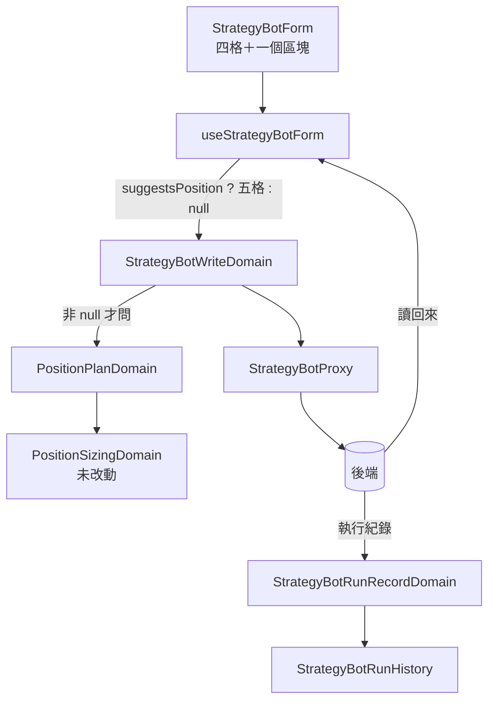

# 策略機器人的部位規劃 — Architecture Design

**Status:** Confirmed
**Source PRD:** `.sdd/2026-09-18-strategy-bot-position-plan/PRD.md`
**Tech context:** Nuxt 3 / Vue 3 · TypeScript（strict）· Clean / Onion Architecture · Atomic Design

---

## 1. Design Goal & Guiding Principle

**In one sentence：** 讓那五個數字走完整條路（entity → DTO → 表單 → 送出 → 讀回來 → 歷史），
而**「開一台機器人是填四格就走的事」一個字都不變**。

**Guiding principle：** 這一組的「有沒有」是**一個問題**，不是五個欄位。

表單的註解寫著：「只有四格，而那正是這一版做的事……開一台機器是填四格就走的事；
拼規則是坐下來調半小時的事。」那句話是上一版刻意拿掉三塊東西換來的。
五個常駐欄位會把它變成「填九格才走」，而多數人在開機器人的那一刻還沒決定要押多少。

所以**一個可以收起來的區塊**，標題就是那個問題。而「收著」不是一種顯示狀態，
它是**送不送那一組**的答案：

```
區塊收著 → positionPlan 為 null → 送出去的那一台不建議部位
區塊展開 → 五格的值組成 positionPlan
```

那是最誠實的讀法：**使用者看得到的就是他要送的**。
留一份看不到的值，他會在某天打開那台機器人時發現它在建議一組他不記得填過的數字。

**押多少那一格完全沿用既有模型。** `PositionSizingDomain`（回測那一列在用的）
已經握著「只有全押不用填」與那兩條驗證。這一刀**多一個讀它的人**，不寫第二份。

---

## 2. Change Scope

| Area | Action | What / Why |
| :--- | :--- | :--- |
| `dto/position-plan-dto.ts` | **Add** | 那五樣的形狀（`Decimal` ＋ 倉位大小模式）。entity／read／write 三處共用 |
| `domains/position-plan-domain.ts` | **Add** | 那三條新驗證（槓桿、兩個距離），並把押多少那兩條**委派**給 `PositionSizingDomain` |
| `entities/strategy-bot.ts` | **Modify** | 多一個 `positionPlan: PositionPlanDto \| null` |
| `dto/strategy-bot-dto.ts` | **Modify** | 同上——表單才填得出現值、區塊才知道要不要展開 |
| `dto/strategy-bot-write-dto.ts` | **Modify** | 同上；`null` 就是不送那一組 |
| `domains/strategy-bot-write-domain.ts` | **Modify** | `rejection` 多問一次部位規劃。**`null` 時一句都不問** |
| `domains/strategy-bot-domain.ts` | **Not touched** | 清單上那一台長什麼樣與部位規劃無關 |
| `composables/use-strategy-bot-form.ts` | **Modify** | 多五個 ref、一個「區塊開著嗎」的 ref；`reset()` 依有沒有值決定開合；`buildWriteDto()` 依開合決定送不送 |
| `organisms/StrategyBotForm.vue` | **Modify** | 四格底下多一個可收起來的區塊。**四格一行不動** |
| `proxy/strategy-bot-proxy.ts` | **Modify** | wire 型別多一組；寫入時 `null` 就不放那個鍵；讀回來時資金非正即讀作 `null` |
| `dto/strategy-bot-run-record-dto.ts` | **Modify** | 多三個可為空的數字（已經算成畫面直接畫得出來的字串） |
| `domains/strategy-bot-run-record-domain.ts` | **Modify** | 把後端那三個數字算成要不要顯示、顯示什麼 |
| `entities/strategy-bot-run-record.ts` | **Modify** | 多三個 `Decimal \| null` |
| `molecules/StrategyBotRunHistory.vue` | **Modify** | 每一輪多三個小字，**只在有的時候** |
| `domains/position-sizing-domain.ts` | **Not touched** | 它已經答得出這一刀要的兩條 |
| 交易策略那一頁、回測那幾塊 | **Not touched** | 部位規劃不是規則，也不是一次回測的條件 |

---

## 3. New Classes / Modules

| Name | Kind | Responsibility (purpose) | Collaborators | Satisfies |
| :--- | :--- | :--- | :--- | :--- |
| `PositionPlanDto` | DTO | 那五樣的形狀，entity／read／write 三處共用 | — | US-01、US-02 |
| `PositionPlanDomain` | Domain Model | 那三條新驗證，並把押多少委派出去 | `PositionSizingDomain` | US-03 |

### `PositionPlanDomain` 的形狀

```ts
export class PositionPlanDomain {
  constructor(private readonly positionPlan: PositionPlanDto) {}

  /** 送不出去時說出第一個擋住它的理由；送得出去時 null。 */
  get rejection(): string | null
}
```

**它不判斷「有沒有部位規劃」**——那是 `null` 與否，而 `null` 根本不會走到這裡。
`StrategyBotWriteDomain` 拿到 `null` 就一句都不問，而那一行就是 PRD 的
「收著的時候一格都不驗證」。

**押多少那兩條是委派而不是重寫。** `PositionSizingDomain.validate()` 已經在那裡，
而它的措辭與後端一字相同。重寫一份就是讓同一件事在這個專案裡有兩個說法。

---

## 4. Modified Components

| Component | Current role | Change needed |
| :--- | :--- | :--- |
| `useStrategyBotForm` | 表單的四格與每一個改得動它的動作 | 多五個 ref ＋ **一個 `suggestsPosition` ref**。`reset()` 從 `editing?.positionPlan !== null` 決定它；`buildWriteDto()` 依它決定送 `null` 還是那一組 |
| `StrategyBotForm` | 拼一台機器人的那張表單 | 四格底下多一個區塊。**四格的 markup 一行不動**——那是 US-05 的落點 |
| `StrategyBotWriteDomain` | 送出前必須成立的每一條規則 | `rejection` 末尾多問一次。位置在最後：四格的理由先講完，因為那四格是必填的 |
| `StrategyBotRunRecordDomain` | 一輪在歷史上長什麼樣 | 多算三個「要不要顯示、顯示什麼」。**它已經在做這件事**（結果的詞、語氣、要不要處理），這是第四類同樣的東西 |
| `StrategyBotRunHistory` | 一排輪次 | 每一輪多三個小字，只在有的時候 |

### 「區塊開著嗎」為什麼是表單的狀態，不是 DTO 的欄位

`positionPlan` 為 `null` 已經表達了「沒有部位規劃」。
再往 DTO 塞一個「區塊開著嗎」，就是讓兩個欄位可以互相矛盾
（開著、但 plan 是 null；或收著、但 plan 有值）。

所以 **DTO 只有 `null` 與有值兩種**，而「開著嗎」活在 composable 裡——
它是**這一刻畫面的樣子**，而不是那一台機器人的性質。
`buildWriteDto()` 把它翻成 `null`，那一行就是「收起來就是不要」。

---

## 5. Component Relationships



**押多少只有一份規則。** 回測那一列與這張表單讀的是同一個 `PositionSizingDomain`，
所以「百分比要在 0 到 100 之間」這句話在這個專案裡只寫了一次。

---

## 6. Traceability

| PRD Scenario | Component |
| :--- | :--- |
| 新的一台預設收著 | `useStrategyBotForm.reset()`（`editing` 為 null → `suggestsPosition` 為 false） |
| 填過的那一台打開就是展開 | 同上（`editing.positionPlan !== null`） |
| 沒填過的那一台仍然收著 | 同上（`positionPlan` 為 null） |
| 按一下就展開 | `StrategyBotForm` 綁著 `form.suggestsPosition` 的那個切換 |
| 收起來就是不要 | `buildWriteDto()` 依 `suggestsPosition` 回 `null` |
| 整組填完／只填資金 | `buildWriteDto()` 組出 `PositionPlanDto` |
| 資金留空就整組不算 | `buildWriteDto()`（資金非正 → `null`），與後端「資金是開關」一致 |
| 只改停損距離也算改過 | 表單既有的 dirty 比較（比整份 write DTO 的 JSON，新欄位自動被涵蓋） |
| 押多少的百分比超過一百 | `PositionSizingDomain.validate()`（**未改動**） |
| 槓桿小於一倍／兩個距離不合法 | `PositionPlanDomain.rejection` |
| 收著的時候一格都不看 | `StrategyBotWriteDomain`（`null` 就不問那一段） |
| 建議過部位的那一輪／沒有建議的那一輪 | `StrategyBotRunRecordDomain` 算出的三個可為空的字串 |
| 只建議過停損的那一輪 | 同上（三個各自獨立） |
| 原本那四格一字不差 | `StrategyBotForm` 那四格的 markup 未改動 |

---

## 7. Extensibility & Handoff Notes

- **Most likely next requirement：讓回測也模擬止損止盈（後端的下一刀）。**
  **Where it lands：** 回測那幾塊，不是這裡。這一頁與那一刀的唯一交集是
  **訊息裡那一行警告會被拿掉**，而那一行是後端寫的。

- **第二可能：停損距離由策略腳本算（ATR）。**
  **Where it lands：** 那一格從「填一個百分比」變成「挑一個來源」。
  `PositionPlanDomain` 的那條驗證會換掉，而 `buildWriteDto()` 與那個區塊的開合不必動。

- **第三可能：在清單上顯示哪幾台會建議部位。**
  **Where it lands：** `StrategyBotListPanel` ＋ `StrategyBotDomain`。
  DTO 已經帶著它了，所以那是純畫面的一刀。

- **給下一位的提醒：** 那個區塊的開合**不在 DTO 裡**，它活在 composable。
  想把它搬進 DTO 之前先想清楚：那樣就有兩個欄位可以互相矛盾
  （開著但 plan 是 null、收著但 plan 有值），而矛盾的那一種沒有人說得出該聽誰的。

---

## 8. Appendix

- `.sdd/2026-09-18-strategy-bot-position-plan/PRD.md`
- 後端的 `.sdd/2026-09-18-strategy-bot-position-plan/ARCH.md`——另一端的落點
- `.sdd/2026-09-17-backtest-trading-mode/ARCH.md`——`PositionSizingDomain` 的出處
- `.claude/rules/architecture.md`——「Domain Model 不是介面抽象」、「元件只看得到 DTO」
