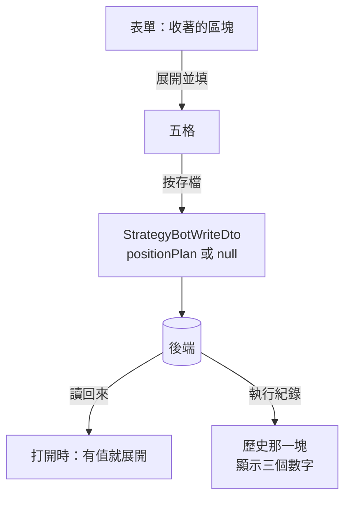

# Product Requirements Document (PRD)

**Status:** Finalized
**Version:** v1.0
**Owner:** James Hsueh
**Stakeholders:** Engineering

---

## 1. Background & Goal (Why & Goal)

### Problem Statement

後端讓一台機器人記得一組**部位規劃**，填了之後它每一輪的訊息自己算完
**開倉押多少、止損在哪、止盈在哪**，並把那三個數字存進執行紀錄。

畫面兩處跟不上：

**表單上填不了那五個數字。** 使用者組完一台機器人只填得出四格，
那台於是永遠只報方向、不報數字——他要那三個數字，只能去打 API。

**執行紀錄看不到那三個數字。** 後端已經存著了。三天後他想確認
「當時那則為什麼叫我停在那裡」，畫面答不出來——而他那期間可能已經改過停損距離了。

### Expected Outcome

- 機器人表單多一段「建議部位」，**收在一個預設收起來的區塊裡**。
  填過的那一台打開時是**展開**的。
- 區塊裡五格，**押多少那一格沿用回測既有的選單與「只有全押不用填」的規則**。
- 那幾格的規則**在這一側先擋**，說明落在出問題的那一格旁邊。
  **收著的時候一格都不看。**
- 執行紀錄的每一輪，若當時建議過部位，顯示**開倉金額、止損價、止盈價**；
  沒有建議的那幾輪**一個字都不加**。
- 四格照舊——「開一台機器是填四格就走的事」這件事不因這一刀改變。

### Out of Scope

- **常駐展開的區塊**——會把填四格變成填九格。
- **在畫面上算那三個數字**——訊息裡的是後端算的，這裡只顯示歷史存下來的。
- **在畫面上警告「回測沒把止損止盈算進去」**——那句話屬於訊息，不屬於這一頁。
- **交易策略那一頁**——部位規劃不是規則。

---

## 2. User Personas

**Primary Role:** 專案作者本人。他有兩種帳戶（做得了空的、不能放空的），
兩邊的錢與能忍的幅度都不同。

**Usage Context:** **開一台機器人是「決定好了，讓它跑」的動作**——
通常在拼完規則、看完回測之後，而那時他還不一定決定要押多少。
**讀執行紀錄則是事後回想**：他手機上收到一則訊息、照著做了，三天後想確認當時是什麼數字。

---

## 3. User Stories & Acceptance Criteria

### US-01 — 那五格收在一個問句底下 [priority: P0]

**As a** 使用者，**I want** 不想算部位的時候看不到那五格，
**so that** 開一台機器人仍然是填四格就走的事。

```gherkin
Scenario: 新的一台預設收著
  Given 我要開一台新的機器人
  When 表單打開
  Then 建議部位那個區塊是收著的
  And 原本那四格照舊看得到

Scenario: 填過的那一台打開就是展開
  Given 一台填過部位規劃的機器人
  When 我打開它
  Then 那個區塊是展開的
  And 五格帶著它存著的值

Scenario: 沒填過的那一台打開仍然收著
  Given 一台沒有填部位規劃的機器人
  When 我打開它
  Then 那個區塊是收著的

Scenario: 按一下就展開
  Given 區塊收著
  When 我按那個標題
  Then 五格出現

Scenario: 收起來就是不要
  Given 區塊展開、五格填了值
  When 我再按一次把它收起來並按存檔
  Then 交出去的那一台沒有部位規劃
```

### US-02 — 填了什麼就送什麼 [priority: P0]

**As a** 使用者，**I want** 送出去的就是我看得到的那幾個數字，
**so that** 我不會在某天打開那台機器人時,發現它在建議一組我不記得填過的數字。

```gherkin
Scenario: 整組填完
  Given 區塊展開,資金 50000、押百分比 10、槓桿 3、停損 3、停利 5
  When 我按存檔
  Then 送出去的那一台帶著那五個數字

Scenario: 只填資金
  Given 區塊展開,只填資金 50000,押多少留在全押
  When 我按存檔
  Then 送得出去,押多少是全押

Scenario: 區塊收著
  Given 區塊收著
  When 我按存檔
  Then 送出去的那一台不帶部位規劃

Scenario: 資金留空就整組不算
  Given 區塊展開,資金留空,其餘四格都填了
  When 我按存檔
  Then 送出去的那一台不帶部位規劃——沒有錢就沒有東西要押

Scenario: 只改停損距離也算改過
  Given 一台填過部位規劃的機器人,我什麼都沒動
  When 我只把停損距離改掉
  Then 離開這一頁前會被問「還沒存,確定要離開嗎」
```

### US-03 — 填不對的那幾種在這一側就擋下來 [priority: P0]

**As a** 使用者，**I want** 填錯的時候當場知道，
**so that** 我不必按了存檔才被後端退回來。

```gherkin
Scenario: 押多少的百分比超過一百
  Given 區塊展開
  When 我把押百分比填成 150
  Then 送不出去,說明落在那一格旁邊

Scenario: 槓桿小於一倍
  Given 區塊展開
  When 我把槓桿填成 0.5
  Then 送不出去,說明講出槓桿倍數不得小於 1 倍

Scenario: 停損距離是負的
  Given 區塊展開
  When 我把停損距離填成 -3
  Then 送不出去

Scenario: 停損距離超過一百
  Given 區塊展開
  When 我把停損距離填成 120
  Then 送不出去

Scenario: 收著的時候一格都不看
  Given 我把押百分比填成 150,然後把區塊收起來
  When 我按存檔
  Then 送得出去——那一台不建議部位,那一格填什麼都不影響
```

### US-04 — 執行紀錄看得到那一輪建議了什麼 [priority: P1]

**As a** 三天後回想的人，**I want** 那一輪存著當時的數字，
**so that** 我看得懂當時那則訊息為什麼叫我停在那個價位——即使我後來改過設定。

```gherkin
Scenario: 建議過部位的那一輪
  Given 一輪建議過保證金 5000、止損 66105.915、止盈 60971.475
  When 我看那一輪
  Then 三個數字都看得到

Scenario: 沒有建議部位的那一輪
  Given 一輪沒有建議部位
  When 我看那一輪
  Then 那一列一個字都沒加,與這個切片之前一樣

Scenario: 只建議過停損的那一輪
  Given 一輪建議過金額與止損,沒有止盈
  When 我看那一輪
  Then 看得到金額與止損
  And 看不到止盈那一格
```

### US-05 — 原本那四格一個字都沒變 [priority: P0]

**As a** 已經在用這張表單的使用者，**I want** 四格照舊，
**so that** 開一台機器人仍然是我原本熟悉的那件事。

```gherkin
Scenario: 四格都還在,規則也沒變
  Given 表單打開
  When 我看那四格
  Then 名稱、交易策略、交易標的、觸發間隔都在
  And 它們的驗證與這個切片之前一字不差
```

---

## 4. Business Flow & Logic

### 那一組數字在畫面上經過哪裡



### Core Business Rules

1. **那五格收在一個可以收起來的區塊裡，預設收著。**
   打開一台**填過**的機器人時展開。
2. **收起來就是不要**：交出去的那一台沒有部位規劃。
   最誠實的讀法——使用者看得到的就是他要送的。
3. **資金留空就整組不算**，其餘四格填了也不送。
   那是後端的規則（資金是開關），這一側照它講。
4. **押多少沿用回測既有的選單與 `PositionSizingDomain`**，包含「只有全押不用填」
   與它那兩條驗證，一條都不重寫。
5. **槓桿不得小於 1 倍**；**兩個距離不得為負、不得超過 100**。
   這一側先擋，說明落在那一格旁邊。
6. **收著的時候一格都不驗證。**
7. **執行紀錄只在那一輪真的建議過時才多出那三格**；沒有的那幾輪一個字都不加。
8. **原本那四格與它們的規則一字不差。**

### 沿用的既有規則（不生第二套說法）

| 規則 | 與誰相同 |
| :--- | :--- |
| 押多少的選單、「只有全押不用填」、它那兩條驗證 | 回測的每次開倉押多少（`PositionSizingDomain`） |
| 不合法就不送出、說明留在那一格旁邊 | 回測與交易策略表單既有的做法 |
| 改過就要問 | 機器人表單既有的離開提示 |
| 金額一律 `decimal.js` | 全專案 |

### Edge Cases

| 情況 | 行為 |
| :--- | :--- |
| 區塊展開、五格全空 | 資金為空 ⇒ 不帶部位規劃；不擋、不報錯 |
| 押百分比填 150 但區塊收著 | 送得出去——收著的時候一格都不看 |
| 槓桿填 1 | 送得出去（等於不上槓桿），與後端讀法一致 |
| 停損距離填 100 | 送得出去——荒謬但合法，與後端一字不差 |
| 一台填過的機器人，把區塊收起來再存 | 那一台從此不建議部位 |
| 後端回來的那一台沒有 `positionPlan`（舊版後端） | 讀作沒有部位規劃，區塊收著 |

---

## 5. UI/UX Design & Interaction

### 表單

四格照舊，底下多**一個可以收起來的區塊**，標題就是那個問題：
**「要不要順便算部位？」**

- **預設收著。** 開一台機器人是填四格就走的事，而多數人在那個時刻還沒決定押多少。
- **有值就展開。** 收著等於藏起來，而藏起來的值會在某天變成一個他不記得填過的數字。
- 區塊裡的五格用既有的 `AppInput` 與回測那個押多少選單，**不新增任何一種欄位樣式**。

### 執行紀錄

每一輪那一列，若當時建議過部位，多出三個小字：金額、止損、止盈。
**沒有建議的那幾輪一個字都不加**——它們是常態，
而一排寫著「—」的欄位會讓那張表讀起來像壞掉的。

---

## 6. Non-Functional Requirements

- **相容**：原本那四格與它們的每一條規則**一字不差**。
- **相容**：沒有部位規劃的機器人與沒有建議的那幾輪，畫面**與這個切片之前一樣**。
- **一致**：押多少的選單與驗證**不在這個專案裡出現第二份**。
- **精確**：金額一律 `decimal.js`，不用 `number`。
- **可測**：區塊的展開狀態、五格與歷史那三格各有自己的 `data-testid`。

---

## 7. Dependencies & Risks

- **依賴**：後端的 `POST/PUT /strategy-bots` 收 `positionPlan`、`GET` 回它，
  而執行紀錄回 `suggestedStake`／`suggestedStopLossPrice`／`suggestedTakeProfitPrice`
  （見後端的 `.sdd/2026-09-18-strategy-bot-position-plan/`）。
- **風險**：那五格的驗證在兩端各寫一次，可能漂移。
  緩解——押多少那兩條完全沿用既有模型；剩下三條（槓桿、兩個距離）
  的**措辭與後端一字相同**，並列為驗收項（US-03）。
- **風險**：區塊收起來時仍然把值送出去，使用者會在某天看到一組他不記得填過的數字。
  緩解——「收起來就是不要」列為獨立驗收項（US-01）。
- **風險**：這一刀動的是每一次開機器人都會走到的那張表單。
  緩解——「原本那四格一字不差」列為獨立驗收項（US-05）。

---

## 8. Appendix

- `.sdd/2026-09-18-strategy-bot-position-plan/BRIEF.md`
- 後端的 `.sdd/2026-09-18-strategy-bot-position-plan/PRD.md`——那五個數字與六條規則的出處
- `.sdd/2026-09-17-backtest-trading-mode/PRD.md`——押多少那個選單的出處
- `.sdd/2026-09-10-strategy-bot-ownership-and-marketplace/`——機器人表單「只剩四格」的出處
