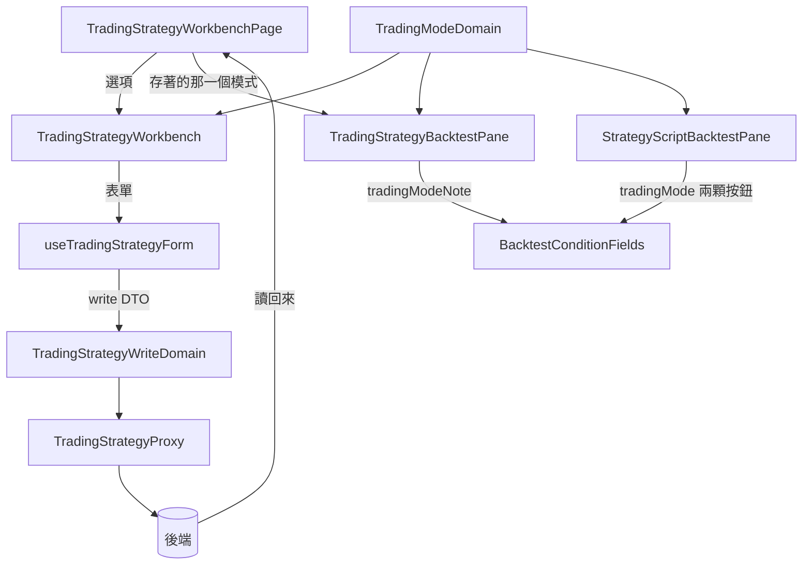

# 交易策略的交易模式 — Architecture Design

**Status:** Confirmed
**Source PRD:** `.sdd/2026-09-18-trading-strategy-trading-mode/PRD.md`
**Tech context:** Nuxt 3 / Vue 3 · TypeScript（strict）· Clean / Onion Architecture · Atomic Design

---

## 1. Design Goal & Guiding Principle

**In one sentence：** 讓交易模式跟著那一份交易策略走完整條路
（entity → DTO → 表單 → 送出 → 讀回來），而那兩顆單選鈕**搬家**而不是複製。

**Guiding principle：** 這一格「不由填表的人決定」時的畫法，**畫面上已經有了**。

重演一份交易策略的**彙總刻度**就是同一件事：它是那幾個信號來源自己說的，
所以那一格早就不是選單，而是一句唯讀的話。`BacktestConditionFields` 為它開了一個入口：
給 `aggregationIntervalNote` 就不畫選單、改畫一句話。

**交易模式照抄那個形狀**：多一個 `tradingModeNote`。給了就不畫那兩顆按鈕。

**為什麼不拆那個共用元件。** 拆成兩個元件，就是把「回測要問哪幾件事」抄成兩份——
而兩份之後一定會漂移，使用者在兩塊上會讀到對同一件事的兩種說法。
那個元件的註解本來就寫著它一條規則都不判斷：哪一格出問題、哪一格要不要出現，
**都由外面告訴它**。多一個 note 是在用它既有的設計，不是繞過它。

**為什麼不停用那兩顆按鈕。** 一顆灰掉的按鈕還在說「這裡有兩個選項，
只是你現在不能動」，而真相是**這裡已經沒有選項了**，答案在別的地方。
一句話說得出答案是什麼；一顆灰掉的按鈕說不出。

---

## 2. Change Scope

| Area | Action | What / Why |
| :--- | :--- | :--- |
| `entities/trading-strategy.ts` | **Modify** | `TradingStrategy` 多一個 `tradingMode: TradingMode` |
| `dto/trading-strategy-dto.ts` | **Modify** | 多一個 `tradingMode`，畫面才填得出現值 |
| `dto/trading-strategy-write-dto.ts` | **Modify** | 多一個 `tradingMode`，跟著整份送出去 |
| `domains/trading-strategy-write-domain.ts` | **Modify** | `sendable` 多帶一行。**不多一條驗證**——從兩顆按鈕挑的，挑不出非法值 |
| `proxy/trading-strategy-proxy.ts` | **Modify** | wire 型別多一欄；寫入帶上去；讀回來映射，**wire 沒有時讀作預設值**（與後端自己對一份沒填的讀法一致） |
| `composables/use-trading-strategy-form.ts` | **Modify** | 多一個 `tradingMode` ref；`reset()` 從存著的那一份讀（沒有就預設值）；`buildWriteDto()` 帶上去。**改它會讓 `dirty` 亮起來**，因為 dirty 比的是 write DTO 的 JSON |
| `service/trading-strategy-service.ts` | **Modify** | 多一個 `listTradingModeOptions()`／`defaultTradingMode()`——交易模式現在是交易策略的事 |
| `application/trading-strategy-application.ts` | **Modify** | 兩個轉交方法 |
| `organisms/TradingStrategyWorkbench.vue` | **Modify** | 名稱那一列多一組單選鈕，用既有的 `AppRadio` |
| `templates/TradingStrategyWorkbenchPage.vue` | **Modify** | 把選項餵給工作檯；把**存著的那一份的模式**餵給重演那一塊 |
| `molecules/BacktestConditionFields.vue` | **Modify** | 多一個 `tradingModeNote`。給了就把那兩顆按鈕換成一句話——與 `aggregationIntervalNote` 同一個形狀 |
| `organisms/TradingStrategyBacktestPane.vue` | **Modify** | 不再持有 `tradingMode` ref；改傳 `tradingModeNote`；請求少一個欄位 |
| `dto/trading-strategy-backtest-request-dto.ts` | **Modify** | **刪掉** `tradingMode` |
| `domains/trading-strategy-backtest-request-domain.ts` | **Modify** | 同上 |
| `proxy/backtest-proxy.ts` | **Modify** | 交易策略回測的 body **不再帶** `tradingMode`；腳本回測那一支不動 |
| `organisms/StrategyScriptBacktestPane.vue` | **Not touched** | 那條路沒有交易策略可問 |
| `vo/trading-mode-vo.ts`／`domains/trading-mode-domain.ts`／`dto/trading-mode-option-dto.ts` | **Not touched** | 取值、名字、那兩句說明**一個字都不動**。它已經是單一來源，這一刀只是多一個讀它的人 |
| `service/backtest-service.ts` | **Not touched** | 腳本回測仍然要它的 `listTradingModeOptions()` |
| 交易策略清單那一頁、機器人那幾頁 | **Not touched** | 清單讀同一個 DTO；機器人引用哪一份沒變 |

---

## 3. New Classes / Modules

**沒有新型別。** 交易模式這個概念在這個專案裡早就有一個家
（`TradingMode`＋`TradingModeDomain`＋`TradingModeOptionDto`），
而這一刀只是讓交易策略也讀它。

新增第二份取值或第二句說明，就是讓使用者在兩塊畫面上讀到對同一件事的兩種說法——
那正是 `TradingModeDomain` 當初被建立的理由（它的註解寫著：
「說明若寫在畫面上，兩個去處就是兩份字串」）。

---

## 4. Modified Components

| Component | Current role | Change needed |
| :--- | :--- | :--- |
| `BacktestConditionFields` | 回測要問使用者的那幾件事，一條規則都不判斷 | 多一個 `tradingModeNote`。**位置、標籤、那一格的樣式全部沿用 `aggregationIntervalNote`** ——同一件事在同一個元件裡有兩種畫法，下一個人會不知道該學哪一個 |
| `TradingStrategyBacktestPane` | 重演這一份 | 多收一個「存著的那一份是哪一種模式」；把它轉成一句話往下傳；請求少一欄 |
| `TradingStrategyWorkbench` | 拼一份的整個工作台 | 名稱那一列多一組單選鈕。與名稱同一列，因為**兩者都是「這份規則是什麼」**，而底下那張墊子是「它由什麼組成」 |
| `useTradingStrategyForm` | 表單狀態與每一個改得動它的動作 | 多一個 ref、`reset()` 多一行、`buildWriteDto()` 多一行 |
| `TradingStrategyWriteDomain` | 送出前必須成立的每一條規則 | `sendable` 多帶一行，**不多驗證** |

### 那一句唯讀的話從哪裡來

```
TradingStrategyWorkbenchPage
  workbench.editing.value?.tradingMode   ← 存起來的那一份
    → TradingStrategyBacktestPane
      → TradingModeDomain(...).toOptionDto()   ← 名字＋那一句說明，單一來源
        → tradingModeNote
```

**讀的是 `editing`，不是表單。** `editing` 是伺服器回來的那一份，
而且存成功之後會被換成新存的那一份（`use-trading-strategy-workbench.ts` 那一行）。
重演打的是 `/trading-strategies/{id}/backtests`——跑的是伺服器上那一份。
顯示表單上未存的值，會讓使用者拿著一張「現貨」標籤底下的多空反手成績單，
而這一刀存在的理由就是要消滅那件事。

`editing` 為 `null`（還沒存過）時用**預設值**，與後端自己對一份沒填的讀法一致。

---

## 5. Component Relationships



**三塊畫面、一個 `TradingModeDomain`。** 工作檯挑它、重演那一份讀它、
重演一支腳本挑它——三處讀到的名字與說明**是同一份字串**。

---

## 6. Traceability

| PRD Scenario | Component |
| :--- | :--- |
| 新的一份預設多空反手 | `useTradingStrategyForm.reset()`（`editing` 為 null → 預設值） |
| 打開一份存著現貨的 | 同上（`editing.tradingMode`） |
| 挑了現貨再存／改掉一份既有的模式 | `buildWriteDto()` → `TradingStrategyWriteDomain.sendable` → proxy |
| 兩顆按鈕各自說得出它做什麼，且與回測那一列逐字相同 | `TradingModeDomain.toOptionDto()`（未改動） |
| 只改交易模式也算改過 | 工作檯既有的 dirty 比較（比 write DTO 的 JSON，新欄位自動被涵蓋） |
| 那一格是一句話而不是按鈕 | `BacktestConditionFields` 的 `tradingModeNote` 分支 |
| 多空反手那一份講的是多空反手 | `TradingStrategyBacktestPane` 讀 `editing` 的模式 |
| 送出的請求不帶交易模式 | `TradingStrategyBacktestRequestDto` 已無該欄位；`backtest-proxy.ts` 的 body 少一行 |
| 還沒存的改動不會改掉那一句話 | 讀 `editing` 而不是讀表單 |
| 存好之後那一句話跟著走 | `use-trading-strategy-workbench.ts` 存成功時換掉 `editing` |
| 還沒存過的那一份講預設值 | `editing` 為 null → `defaultTradingMode()` |
| 重演一支策略腳本仍然是兩顆單選鈕 | `StrategyScriptBacktestPane` 不傳 `tradingModeNote` |
| 挑了現貨就照現貨送 | `backtest-proxy.ts` 的腳本回測那一支（未改動） |

---

## 7. Extensibility & Handoff Notes

- **Most likely next requirement：交易策略清單上顯示每一份的模式。**
  **Where it lands：** `TradingStrategyListPanel.vue` 多一欄。
  DTO 已經帶著它了，所以那是純畫面的一刀。

- **第二可能：後端多一種交易模式。**
  **Where it lands：** `vo/trading-mode-vo.ts` 的聯合型別多一個字面量、
  `TRADING_MODE_DESCRIPTIONS` 多一列。三塊畫面**一個字都不必動**——
  它們讀的都是同一份選項清單。

- **第三可能：合約的開倉金額與止盈止損（後端的下一刀）。**
  **Where it lands：** 看後端把那幾個原料放在哪一個 endpoint 上。
  **不要先在工作檯開欄位**——那幾個數字不是規則的性質，而交易策略是規則。

- **給下一位的提醒：** `BacktestConditionFields` 現在有**兩個** note
  （彙總刻度、交易模式），而它們的意思一模一樣：「這一格不是填表的人決定的」。
  第三個出現時值得想一想要不要把它們收成一個概念；
  在那之前，**照著既有那一個的形狀寫**，不要發明第三種畫法。

---

## 8. Appendix

- `.sdd/2026-09-18-trading-strategy-trading-mode/PRD.md`
- `.sdd/2026-09-17-backtest-trading-mode/ARCH.md`——那兩顆單選鈕與 `TradingModeDomain` 的出處
- `.sdd/2026-09-17-trading-strategy-backtest-console/ARCH.md`——`aggregationIntervalNote` 那個入口的出處
- `.sdd/2026-09-17-trading-strategy-workbench/ARCH.md`——工作檯與名稱那一列的出處
- 後端的 `.sdd/2026-09-18-trading-strategy-trading-mode/ARCH.md`——另一端的落點
